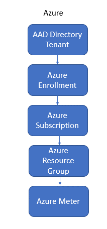

# Security within Azure Dev/Test Subscription

Keeping your resources safe is a joint effort between your cloud provider, Azure, and you. Azure Dev/Test Subscriptions and the [Azure Security Center](../../security-center/security-center-introduction.md) provide you with the tools needed to harden your network, secure your services, and make sure you're on top of your security posture.  

There are a few tools that are very important within Azure Dev/Test Subscriptions that help you create secure access to your resources:  

- Azure Management Groups  
- Azure Lighthouse  
- Credits Monitoring  
- Azure Active Directory  

## Azure Management Groups  

When enabling and setting up your Azure Dev/Test Subscriptions, Azure deploys a default resource hierarchy to manage identities and access to resources within a single Azure Active Directory domain. This allows your organization to set up strong security perimeters for your resources and users.  

  

Your resources, resource groups, subscriptions, management groups, and tenant collectively make up your resource hierarchy. Updating and changing these settings in Azure custom roles or Azure policy assignments can impact every resource in your resource hierarchy. It's important to protect the resource hierarchy from changes that could negatively impact all resources. 

An important aspect in governing access and protecting your resources within a single tenant are [Azure Management Groups](../governance/management-groups/overview.md) Azure Management Groups allows you to set quotas, Azure policies, and security to different types of subscriptions. These groups are a vital component of developing security for your organization's dev/test subscriptions.  

As you can see above, using management groups changes the default hierarchy and adds an additional level for the management groups. This can potentially create unforeseen circumstances and holes in security if you don’t follow the [appropriate process to protect your resource hierarchy](../governance/management-groups/how-to/protect-resource-hierarchy.md)  

## Why is this useful?  

When developing security policies for your organization's dev/test subscriptions, you may choose to have multiple dev/test subscriptions for different business lines or organizational units within your company. You can see a visual of that management grouping below.  

  

You may also choose to have one dev/test subscription for all of your different units.  

Your Azure Management Groups and dev/test subscriptions act as a security barrier within your organizational structure.  

This security barrier has two components:  

- Identity and access: You may need to segment access to specific resources  
- Data: Different subscriptions for resources that access PII data  

## Using Azure Active Directory Tenants  

[A tenant](../../active-directory/develop/quickstart-create-new-tenant.md)is a dedicated instance of Azure AD that an organization or app developer receives when the organization or app developer creates a relationship with Microsoft-- like signing up for Azure, Microsoft Intune, or Microsoft 365.  

Each Azure AD tenant is distinct and separate from other Azure AD tenants and has its own representation of work and school identities, consumer identities (if it's an Azure AD B2C tenant), and app registrations. An app registration inside of your tenant can allow authentications from accounts only within your tenant or all tenants.  

If you need to further separate your organization’s identity infrastructure beyond management groups within a single tenant, you can also create additional tenants with it’s own resource hierarchy.  

An easy way to do separate resources and users is creating a new Azure AD tenant.  

### Create a new Azure AD tenant  

If you don't already have an Azure AD tenant or want to create a new one for development, see the [quick start guide](../../active-directory/fundamentals/active-directory-access-create-new-tenant.md) or simply follow the [directory creation experience](https://portal.azure.com/#create/Microsoft.AzureActiveDirectory). You will have to provide the following info to create your new tenant:  

- **Organization name**  
- **Initial domain** - this will be part of /*.onmicrosoft.com. You can customize the domain later.  
- **Country or region**  

 [Learn more about creating and setting up Azure AD tenants](../../active-directory/develop/quickstart-create-new-tenant.md) 

Follow our process guide: (link – Creating a Developer tenant)  

### Using Azure Lighthouse to manage multiple tenants  

Azure Lighthouse enables cross- and multi-tenant management, allowing for higher automation, scalability, and enhanced governance across resources and tenants. Service providers can deliver managed services using comprehensive and robust management tooling built into the Azure platform. Customers maintain control over who can access their tenant, which resources they can access, and what actions can be taken.  

A common scenario for Azure Lighthouse is managing resources in its customers’ Azure Active Directoy tenants. However, the capabilities of Azure Lighthouse can also be used to simplify cross-tenant management within an enterprise that uses multiple Azure AD tenants.  

For most organizations, management is easier with a single Azure AD tenant. Having all resources within one tenant allows centralization of management tasks by designated users, user groups, or service principals within that tenant.  

But that’s not always the case for some organizations. In cases where a multi-tenant architecture is required, Azure Lighthouse can help centralize and streamline management operations. By using Azure delegated resource management, users in one managing tenant can perform cross-tenant management functions in a centralized, scalable manner.  

[Additional Security Resources](../../security-center/)