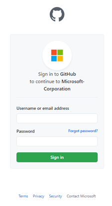
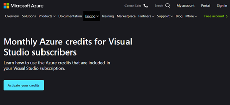

# Sign into your Monthly Azure Credit Subscription and Visual Studio using your GitHub credentials

Across all of Microsoft, we're focused on empowering developers to build better apps, faster. One way we accomplish that is by providing a range of products and services, covering all stages of the software development lifecycle. Products and services included:  

- IDEs and DevOps tools
- Application and data platforms on the cloud
- Operating systems
- Artificial Intelligence
- IoT solutions
- And more  

We center our efforts around developers whether you work as an individual, in teams, or developer communities like GitHub.  

Developers around the world use their GitHub identity as a critical aspect of their digital life. We’re excited to announce improvements that help GitHub users get started easily with our developer services, including Monthly Azure Credits for Visual Studio Subscribers.  

## Your GitHub credentials can now log you in to Microsoft services  

Now, developers can sign in with their existing GitHub account to Microsoft online services, on any Microsoft sign-in page. Using your GitHub credentials, you can sign in via OAuth anywhere a personal Microsoft account does, including Azure Credit Subscriptions and Visual Studio.  

After signing into GitHub and authorizing the Microsoft application, you'll get a new Microsoft account that's linked to your GitHub identity. During this process, you can also link to an existing Microsoft account if you already have one.  

## Sign in to Azure Credit Subscription  

[Azure Credit Subscription for Visual Studio Subscribers](https://azure.microsoft.com/pricing/member-offers/credit-for-visual-studio-subscribers) offers you a suite of services. Use them to create, deploy, and manage applications on your preferred platforms and devices. Use your credits in Azure for learning, development, and test services. You can also access collaboration tools and Azure DevOps Services.  

GitHub authentication makes it easy to start experimenting with Azure services. Choose from Virtual Machines, Websites, SQL Databases, and Mobile Services. Use Windows Virtual Desktop to quickly deploy and manage hundreds of VMs for development and testing.  

To get started with the Azure Monthly Credit Subscription using your GitHub account, select “Sign in using GitHub” on any [Microsoft sign in page](https://login.microsoftonline.com)  

  

  

If you haven’t activated your credits yet, go to the [Monthly Azure Credits for Visual Studio Subscribers](https://azure.microsoft.com/pricing/member-offers/credit-for-visual-studio-subscribers) page, select “Activate Your Credits” then “Sign in with GitHub” to get started.  

  

  

Once you complete the sign-in process, you'll be taken to the last Azure Visual Studio organization you visited. If you’re new to Azure Visual Studio and Credits Subscription, you’ll land within a new organization created for you.  

## Access all of Microsoft online services  

Your GitHub account lets you access developer services like Azure Dev/Test, Monthly Credits, and Visual Studio. Your GitHub credentials can also access all Microsoft online services, from Excel Online to Xbox.  

When authenticating with those services, you can find your GitHub account after clicking on “Sign in options”.  

## Our commitment to your privacy  

When you first use your GitHub account to sign in with Microsoft, GitHub will ask for permission to release your profile information.  

If you consent, GitHub will share the email addresses on your GitHub account (both public and private) and select profile information, like your name. We’ll use this data to check if you already have an account with us. If you don't, we'll create a new account for you. Connecting your GitHub identity to a Microsoft identity doesn't give Microsoft access to your repositories in GitHub. Apps like Visual Studio will request access to your repositories separately if they need to work with your code.  

While your GitHub account is used to log into your Microsoft account, they are still separate entities. One uses the other as a sign-in method. Changes you make to your GitHub account (like changing the password or enabling two-factor authentication) won’t change your Microsoft account, and the other way around. You can manage the connection between your GitHub and Microsoft identities. Go to your [account management page](https://account.live.com/proofs/manage/) under the Security tab.  

## Start exploring Azure Visual Studio and Monthly Credit Subscription now  

Go to the [Monthly Azure Credits for Visual Studio Subscribers](https://azure.microsoft.com/pricing/member-offers/credit-for-visual-studio-subscribers/) page to learn more to get started.  

If you have questions, check out [this support page](https://support.microsoft.com/help/4501231/microsoft-account-link-your-github-account). Let us know what you think in the comments below. As always, we’d love to hear any feedback or suggestions you have.
