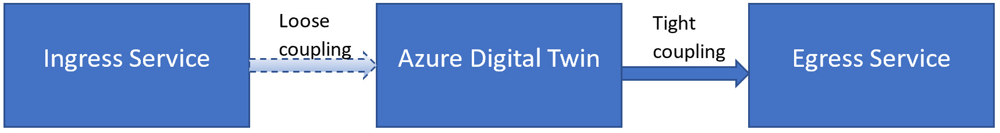

---
# Mandatory fields.
title: Deploy Azure Digital Twins
titleSuffix: Azure Digital Twins
description: Understand the ingress and egress requirements when deploying Azure Digital Twins.
author: baanders
ms.author: baanders # Microsoft employees only
ms.date: 3/16/2020
ms.topic: conceptual
ms.service: digital-twins

# Optional fields. Don't forget to remove # if you need a field.
# ms.custom: can-be-multiple-comma-separated
# ms.reviewer: MSFT-alias-of-reviewer
# manager: MSFT-alias-of-manager-or-PM-counterpart
---

# Deploy Azure Digital Twins alongside other services

The Azure Digital Twins service is not designed to be used alone. It is always deployed alongside an **ingress service** and an **egress service** to make a complete end-to-end data flow. The ingress service collects data and routes it into Azure Digital Twins. The egress service enables Azure Digital Twins to route data to a final endpoint, such as a storage service.

The following images shows the relationships between these three services.

## Ingress services

The ingress service currently supported and validated with Azure Digital Twins is [IoT Hub](../iot-hub/about-iot-hub.md), which enables you to collect telemetry from physical devices in your environment and process this data in the cloud. 

During preview, IoT Hub is loosely coupled with Azure Digital Twins. You may use an IoT Hub you currently have in production, or deploy a new one. You must use an [Azure Function](../azure-functions/functions-overview.md) to redirect data from IoT Hub into Azure Digital Twins. Learn more about using this pattern in a [tutorial](https://github.com/Azure/azure-digital-twins/tree/private-preview/Tutorials).

## Egress services

A variety of egress services are supported with Azure Digital Twins, and may connect to it directly or indirectly. The three services that can be configured as Azure Digital Twins endpoints are:
* [Event Hub](../event-hubs/event-hubs-about.md)
* [Event Grid](../event-grid/overview.md)
* [Service Bus](../service-bus-messaging/service-bus-messaging-overview.md)

Learn more about how to configure one of these services to be an Azure Digital Twins endpoint in the [Azure Digital Twins CLI documentation](https://github.com/Azure/azure-digital-twins/tree/private-preview/CLI).

There are many other services where you may wish to ultimately direct your data, such as [Azure Storage](../storage/common/storage-introduction.md) or [Time Series Insights](../time-series-insights/time-series-insights-update-overview.md). To send your data to services like these, attach the destination service to one of the endpoint services above, using the endpoint service as a middleman to pass your data along.

For example, if you are also using [Azure Maps](../azure-maps/about-azure-maps.md) and want to correlate location with your Azure Digital Twins twin graph, you will utilize an Azure Function alongside an Event Grid to establish communication between all the services in your deployment.

## Next steps

Learn more about endpoints and routing events to external services:
* [Route events to external services](concepts-route-events.md)
