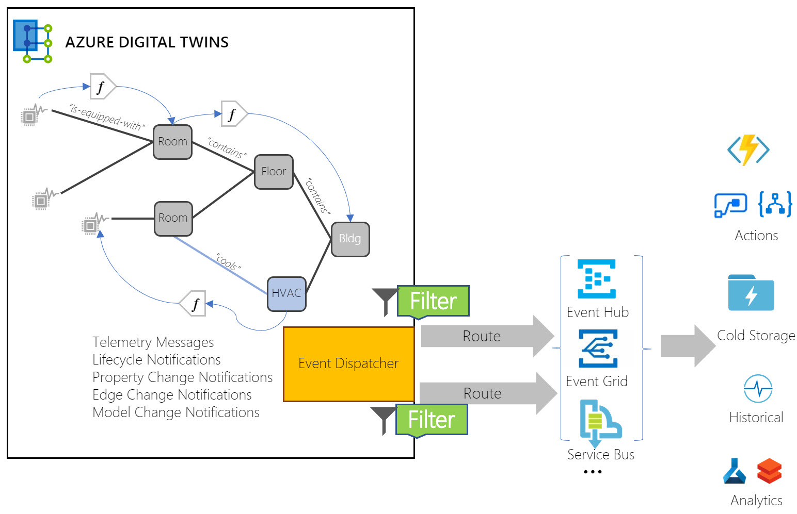

---
# Mandatory fields.
title: Route Azure Digital Twins events to external services
titleSuffix: Azure Digital Twins
description: Understand how to route events from Azure Digital Twins to other Azure Services.
author: baanders
ms.author: baanders # Microsoft employees only
ms.date: 3/12/2020
ms.topic: conceptual
ms.service: digital-twins

# Optional fields. Don't forget to remove # if you need a field.
# ms.custom: can-be-multiple-comma-separated
# ms.reviewer: MSFT-alias-of-reviewer
# manager: MSFT-alias-of-manager-or-PM-counterpart
---

# Event routes (preview)

It is often useful for data from Azure Digital Twins to be sent to downstream data services for additional storage or processing. 

For example...
* A hospital may want to send Azure Digital Twins event data to [Time Series Insights (TSI)](../time-series-insights/time-series-insights-update-overview.md), to record time series data of handwashing-related events for bulk analytics.
* A business that is already using [Azure Maps](../azure-maps/about-azure-maps.md) may want to use Azure Digital Twins to enhance their solution. They can quickly enable an Azure Map after setting up Azure Digital Twins, bring Azure Map entities into Azure Digital Twins as digital twins in the twin graph, or run powerful queries leveraging their Azure Maps and Azure Digital Twins data together.

Data egress for scenarios like these is handled using **event routes**. 

## About event routes

An event route lets you send event data from digital twins in Azure Digital Twins to custom-defined endpoints in your subscriptions. Three Azure services are currently supported for endpoints: [Event Hub](../event-hubs/event-hubs-about.md), [Event Grid](../event-grid/overview.md), and [Service Bus](../service-bus-messaging/service-bus-messaging-overview.md). Each of these Azure services can be connected to other services and acts as the middleman, sending data along to final destinations such as TSI or Azure Maps for whatever processing you need.

The following diagram illustrates the flow of event data through a larger IoT solution with an Azure Digital Twins aspect:


## Uses for event routes

Event routes are designed for sending data to external resources. They excel at sending bulk event data from Azure Digital Twins to downstream resources such as TSI, Azure Maps, storage, and analytics solutions.

During the current preview release, they are also used to handle events within the twin graph and send data from digital twin to digital twin. This is done by connecting event routes to compute resources, such as [Azure Functions](../azure-functions/functions-overview.md), which define how twins should receive and respond to events. 

Events sent via routes come without context. As a result, a compute resource that wants to modify the Azure Digital Twins graph based on an event it received through an event route must either:
* know in advance the digital twin target it wants to modify, or
* use a query/navigation through the twin graph to find the right target. 

The compute resource also needs to establish security and access permissions independently.

## Create a route endpoint

To define an event route, developers first must define endpoints. An **endpoint** is a destination outside of Azure Digital Twins that supports a route connection. Supported destinations in the current preview release are:
* Event Grid custom topics
* Event Hub
* Service Bus

Endpoints are set up using control plane APIs (supported by the [Azure Digital Twins CLI](https://github.com/Azure/azure-digital-twins/tree/private-preview/CLI)), or via the Azure portal. An endpoint definition gives:
* The endpoint's ID (or friendly name)
* The endpoint type (Event Grid, Event Hub, or Service Bus)
* The primary connection string and secondary connection string to authenticate 
* The topic path of the endpoint, such as *your-topic.westus.eventgrid.azure.net*

The endpoint APIs that are available in control plane are:
* Create endpoint
* Get list of endpoints
* Get endpoint by ID (pass in endpoint ID)
* Delete endpoint by ID (pass in endpoint ID)

## Create a route
 
Event routes are created in a client application with the following [Azure Digital Twins API](how-to-use-apis.md) call: 

```csharp
await client.EventRoutes.AddAsync("<name-for-the-new-route>", 
                                   new EventRoute("<endpoint-ID>"));
```

* The `endpoint-ID` identifies an endpoint, such as an Event Hub, Event Grid, or Service Bus. These endpoints must be created in your subscription and attached to Azure Digital Twins using control plane APIs before making this registration call.

The event route object passed to `EventRoutes.Add` also takes a **filter** parameter. However, during the preview release, this filter parameter does nothing. We recommend using Event Grid as the endpoint, and the Event Grid subscription filter during preview. 

Routes can be also created using [Azure Digital Twins CLI for Routes](https://github.com/Azure/azure-digital-twins/tree/private-preview/CLI#adt-routes).

### Types of event messages

Different types of events in IoT Hub and Azure Digital Twins produce different types of notification messages, as described below.

[!INCLUDE [digital-twins-notifications.md](../../includes/digital-twins-notifications.md)]

## Next steps

See how to design and set up an event route:
* [Set up endpoints and routes](how-to-create-endpoints-routes.md)

Or, see how to use an Azure Function with Azure Digital Twins:
* [Set up an Azure Function](how-to-create-azure-function.md)