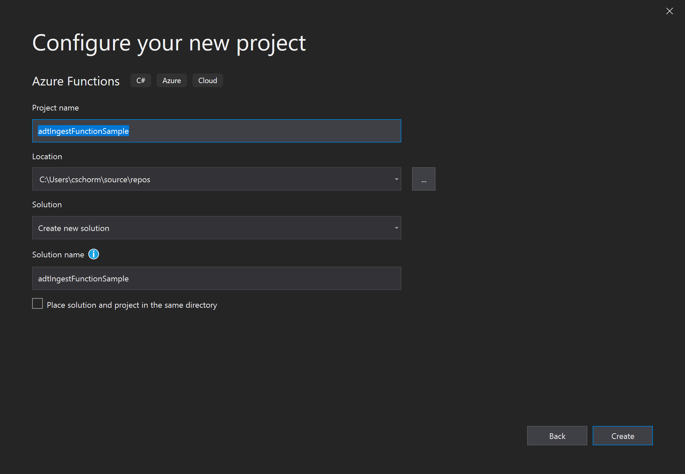
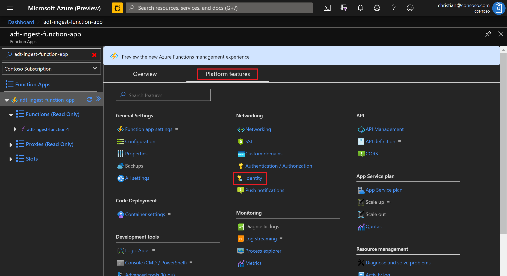
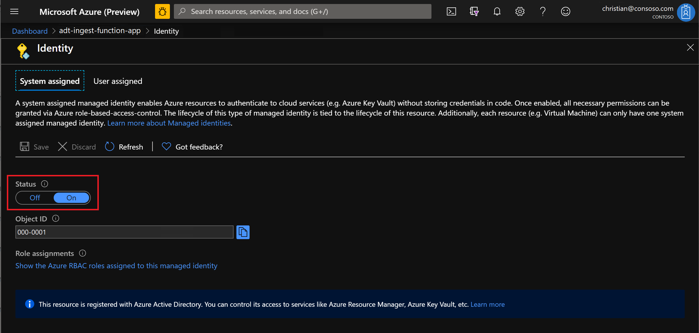

---
# Mandatory fields.
title: Set up an Azure Function
titleSuffix: Azure Digital Twins
description: See how to create an Azure function that can access and be triggered by digital twins.
author: cschormann
ms.author: cschorm # Microsoft employees only
ms.date: 3/17/2020
ms.topic: how-to
ms.service: digital-twins

# Optional fields. Don't forget to remove # if you need a field.
# ms.custom: can-be-multiple-comma-separated
# ms.reviewer: MSFT-alias-of-reviewer
# manager: MSFT-alias-of-manager-or-PM-counterpart
---

# Create Azure Functions apps for Azure Digital Twins

This article walks you through creating an [Azure Function](../azure-functions/functions-overview.md) for use with Azure Digital Twins. Here is a quick look at the steps it contains:

1. Create an Azure Functions app in Visual Studio
2. Write an Azure function with an Event Grid trigger
3. Add authentication code to the function (to be able to access Azure Digital Twins)
4. Publish the function app to Azure
5. Set up security access. In order for the Azure function to receive an access token at runtime to access the service, you need to configure Managed Service Identity for the function app.

Once these steps are complete, you can subscribe your Azure function to Event Grid, to listen on an endpoint. This endpoint could be:
* An Event Grid endpoint attached to Azure Digital Twins to process messages coming from Azure Digital Twins itself (such as property change messages, telemetry messages generated by twins in the twin graph, or life-cycle messages)
* The IoT system topics used by IoT Hub to send telemetry and other device events
* An Event Grid endpoint receiving messages from other services

The remainder of this article walks through the Azure function setup steps, one at a time.

## Create an Azure Functions app in Visual Studio

In Visual Studio 2019, select *File > New Project*. Search for the *Azure Functions* template, select it, and press "Next".


Specify a name for the function app and press "Create".



Select the *Event Grid trigger* and press "Create".


## Write an Azure function with an Event Grid trigger

The following code creates a short Azure function that you can use to log events: 

```csharp
// Default URL for triggering Event Grid function in the local environment
// http://localhost:7071/runtime/webhooks/EventGrid?functionName={functionname}
using System;
using Microsoft.Azure.WebJobs;
using Microsoft.Azure.WebJobs.Host;
using Microsoft.Azure.EventGrid.Models;
using Microsoft.Azure.WebJobs.Extensions.EventGrid;
using Microsoft.Extensions.Logging;

namespace adtIngestFunctionSample
{
    public static class Function1
    {
        [FunctionName("Function1")]
        public static void Run([EventGridTrigger]EventGridEvent eventGridEvent, ILogger log)
        {
            log.LogInformation(eventGridEvent.Data.ToString());
        }
    }
}
```

This is your basic Azure function.

### Run and debug the function app

You can now compile and run the function. While Azure functions are ultimately intended to run in the cloud, you can also run and debug Azure functions locally.

For more information about this, see [Debug Event Grid trigger locally](../azure-functions/functions-debug-event-grid-trigger-local.md).

### Add the Azure Digital Twins SDK to your function app

Visit [Use the Azure Digital Twins APIs](how-to-use-apis.md) to see how to generate the Azure Digital Twins SDK using AutoRest, and compile it as a reusable project.

To access Azure Digital Twins from your Azure function, add the Azure Digital Twins SDK project to the function app. You can do that by right-selecting *Dependencies* in the Solution Explorer and choosing *Add Reference...*.

Alternatively, you can also add the generated code from AutoRest directly to the function app project.

Once you have added a reference to the project or added the classes, add the following line to your project to enable you to access the Azure Digital Twins API.

```csharp
using Azure Digital TwinsApi;
```

## Add authentication code to the function

Next, add authentication code that will allow the function to access Azure Digital Twins.

Add variables into your function for these values: 
* The Azure Digital Twins app ID
* The URL of your Azure Digital Twins instance 
* A variable to hold your Azure Digital Twins client instance to the function project

Also, change the function signature to be asynchronous.

After these changes, your function code should be similar to the following:

```csharp
namespace adtIngestFunctionSample
{
    public static class Function1
    {
        const string AdtAppId = "https://digitaltwins.azure.net";
        const string AdtInstanceUrl = "<your-Azure-Digital-Twins-instance-URL>";
        static AzureDigitalTwinsAPIClient client;

        [FunctionName("Function1")]
        public static async Task Run([EventGridTrigger]EventGridEvent eventGridEvent, ILogger log)
        {
            log.LogInformation(eventGridEvent.Data.ToString());
        }
    }
}
```

Next, add an authentication method. Use the following sample as a guide:

```csharp
public async static Task Authenticate(ILogger log)
{
    var azureServiceTokenProvider = new AzureServiceTokenProvider();
    string accessToken = await azureServiceTokenProvider.GetAccessTokenAsync(AdtAppId);

    var wc = new System.Net.Http.HttpClient();
    wc.DefaultRequestHeaders.Authorization = new AuthenticationHeaderValue("Bearer", accessToken);

    try
    {
        TokenCredentials tk = new TokenCredentials(accessToken);
        client = new AzureDigitalTwinsAPIClient(tk)
        {
            BaseUri = new Uri(AdtInstanceUrl)
        };
        log.LogInformation($"Azure Digital Twins client connection created.");
    }
    catch (Exception e)
    {
        log.LogError($"Azure Digital Twins client connection failed.");
    }
}
```

Here is the complete function, with the authentication code integrated into the earlier code samples:

```csharp
// Default URL for triggering Event Grid function in the local environment
// http://localhost:7071/runtime/webhooks/EventGrid?functionName={functionname}
using System;
using Microsoft.Azure.WebJobs;
using Microsoft.Azure.WebJobs.Host;
using Microsoft.Azure.EventGrid.Models;
using Microsoft.Azure.WebJobs.Extensions.EventGrid;
using Microsoft.Extensions.Logging;
using Azure Digital TwinsApi;
using System.Threading.Tasks;
using Microsoft.Azure.Services.AppAuthentication;
using System.Net.Http.Headers;
using Microsoft.Rest;

namespace adtIngestFunctionSample
{
    public static class Function1
    {
        const string AdtAppId = "https://digitaltwins.azure.net";
        const string AdtInstanceUrl = "<your-Azure-Digital-Twins-instance-URL>";
        static AzureDigitalTwinsAPIClient client;

        [FunctionName("Function1")]
        static async Task Run([EventGridTrigger]EventGridEvent eventGridEvent, ILogger log)
        {
            await Authenticate(log);
            log.LogInformation(eventGridEvent.Data.ToString());
            if (client!=null)
            {
                // Add your code here
            }
        }

        public async static Task Authenticate(ILogger log)
        {
            var azureServiceTokenProvider = new AzureServiceTokenProvider();
            string accessToken = await azureServiceTokenProvider.GetAccessTokenAsync(AdtAppId);

            var wc = new System.Net.Http.HttpClient();
            wc.DefaultRequestHeaders.Authorization = new AuthenticationHeaderValue("Bearer", accessToken);

            try
            {
                TokenCredentials tk = new TokenCredentials(accessToken);
                client = new AzureDigitalTwinsAPIClient(tk)
                {
                    BaseUri = new Uri(AdtInstanceUrl)
                };
                log.LogInformation($"Azure Digital Twins client connection created.");
            }
            catch (Exception e)
            {
                log.LogError($"Azure Digital Twins client connection failed.");
            }
        }
    }
}
```

Now your Azure function is complete and ready to publish.

## Publish the function app to Azure

To publish the function app to Azure, right-select the function project (not the solution) in Solution Explorer, and choose *Publish()*.

The following tab will appear:


Select or create an App Service plan to use with Azure Functions. If unsure, start out using the default consumption plan.

> [!IMPORTANT] 
> Publishing an Azure function will incur additional charges on your subscription, independent of Azure Digital Twins.


On the following page, enter the desired name for the new function app, a resource group, and other details.

## Set up security access

The Azure function skeleton from earlier examples requires that a bearer token be passed to it, in order to be able to authenticate with Azure Digital Twins. To make sure that this bearer token is passed, you need to set up [Managed Service Identity (MSI)](../active-directory/managed-identities-azure-resources/overview.md) for the function app. This only needs to be done once for each function app.

To set this up, go to the [Azure portal](https://portal.azure.com/) and navigate to your function app.

In the *Platform features* tab, select *Identity*:



On the identity page, set the *Status* toggle to *On*. 



Also note the **object ID** shown on this page, as it will be used in the next section.

### Access roles

Because Azure Digital Twins uses role-based access control to manage access (see [Secure Azure Digital Twins solutions](concepts-security.md) for more information on this), you also need to add a role for each function app that you want to allow to access Azure Digital Twins.

[!INCLUDE [digital-twins-resource-id.md](../../includes/digital-twins-resource-id.md)]

Use the resource ID along with the Azure function's object ID from earlier in the command below:

```Azure CLI
az role assignment create --role "Azure Digital Twins Owner (Preview)" --assignee <object-ID> --scope <resource-ID>
```

## Next steps

Read more about roles and security in Azure Digital Twins:
* [Secure Azure Digital Twins solutions](concepts-security.md)

See how to use an Azure function to ingest IoT Hub data into Azure Digital Twins:
* [Ingest telemetry from IoT Hub](how-to-ingest-iot-hub-data.md)
