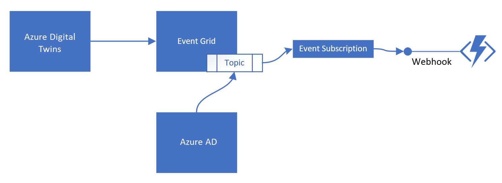

---
# Mandatory fields.
title: Use ADT Event Handling
description: See how to handle events within the Azure Digital Twins graph using built-in event handlers.
author: philmea
ms.author: philmea # Microsoft employees only
ms.date: 2/12/2020
ms.topic: how-to
ms.service: digital-twins

# Optional fields. Don't forget to remove # if you need a field.
# ms.custom: can-be-multiple-comma-separated
# ms.reviewer: MSFT-alias-of-reviewer
# manager: MSFT-alias-of-manager-or-PM-counterpart
---

# Using twin-to-twin event handlers (Public Preview)

*Note: Not all event handler and event routing functionality will be available in initial previews*
*For Private Preview, please use event routes instead of Twin-2-Twin event handlers*

To process data with ADT, you will wire-up event handlers to twins. In this example, we will use two event handlers – one to be triggered when an event is fired on the devices attached to a patient room (indicating that either a motion sensor or soap dispensing event occurred), the other is used to update higher level entities in the graph (such as wards and hospital) with aggregated hand wash percentages.
There are two parts to event handling with ADT:
* You need to wire-up event handlers to twins in your graph
* You need to define a function to be executed when the event occurs. 
* ADT has a small set of built-in functions that you can use for simple event propagation and transformation. 
* For more complex computation, you can provide your own event handler functions using webhooks, or Azure Functions. Whatever compute resource you choose for custom processing will run in your own subscription. 
Add picture illustrating the workflow



## Create twin-to-twin event handlers

To wire-up event handlers, we add a few lines to the code that was used above to create topologies:
   
```csharp
var client = new DigitalTwinsClient("...Authentication Info...");
    // Create a twin for the hospital
    client.CreateTwin("HospitalId", "dtmi:com:example:Hospital;1");
    // Create some wards
    client.CreateTwin("PediatricWard", "dtmi:com:example:Ward;1");
    client.CreateTwin("OphthalmologyWard", "dtmi:com:example:Ward;1");
    client.CreateTwin("OncologyWard", "dtmi:com:example:Ward;1");
    // Create relationships
    client.CreateRelationship("Hospital", "contains", "PediatricWard");
    client.RegisterEventHandler("PediatricWard", "Hospital", “Egrid1.UpdateHandWashAverage");
    // ... and so on
    client.CreateTwin("RoomPed01", "dtmi:com:example:PatientRoom");
    client.Relationship("PediatricWard", "contains", "RoomPed01");
    client.RegisterEventHandler("RoomPed01", "PediatricWard", "Egrid1.UpdateHandWashAverage");
    // Create proxies for devices... these will automatically connect to devices
    // once discovered via an attached IoTHub
    client.CreateProxyTwin("MotionSensorP01", "dtmi:com:example:devices:MotionSensor");
    client.CreateProxyTwin("SoapDispenserP01", "dtmi:com:example:devices:SoapDispenser");
    // And connect...
    client.Relationship("RoomPed01", "hasDevice", "MotionSensorP01");
    client.Relationship("RoomPed01", "hasDevice", "SoapDispenserP01");
    client.RegisterEventHandler("MotionSensorP01", "RoomPed01", "Egrid1.MotionOrSoapEvent");
    client.RegisterEventHandler("SoapDispenserP01", "RoomPed01", "Egrid1.MotionOrSoapEvent");
```

The new lines are marked with red arrows. Basically, an event handler registration lets you specify a source twin (the twin that fires event), and a twin that you want to modify with the event handler (the target twin). Exactly which event handler function is targeted is specified with the 3rd argument in the registration call (i.e. “Egrid1.UpdateHandWashAverage” in this example). This will be explained in detail below Add reference to details section
As you can see in the example, the same event handler function can be used in multiple places.
Please see the detailed sections on event handling for more details on the wire up of compute resources.

## Registering event handlers

Event handlers are registered with the following API:

```csharp
Response RegisterEventHandler(string srcTwinId, string targetTwinId, 
                              string handlerId,
                              string functionId, 
                              string prmData, string securityContext);
```

This typically happens in the same code that creates twins and relationships, as this is generally the time and place when the necessary context is available already. 
The following code snippet shows how event handlers are wired up programmatically:
    
```csharp
var client = new DigitalTwinsClient("...Authentication Info...");
    // Create a twin for the hospital
    client.CreateTwin("HospitalId", "dtmi:com:example:Hospital;1");
    // Create some wards
    client.CreateTwin("PediatricWard", "dtmi:com:example:Ward;1");
    client.CreateTwin("OphthalmologyWard", "dtmi:com:example:Ward;1");
    client.CreateTwin("OncologyWard", "dtmi:com:example:Ward;1");
    // Create relationships
    client.CreateRelationship("Hospital", "contains", "PediatricWard");
    client.RegisterEventHandler("PediatricWard", "Hospital", “Egrid1.UpdateHandWashAverage");
    // ... and so on
    client.CreateTwin("RoomPed01", "dtmi:com:example:PatientRoom");
    client.Relationship("PediatricWard", "contains", "RoomPed01");
    client.RegisterEventHandler("RoomPed01", "PediatricWard", "Egrid1.UpdateHandWashAverage");
    // Create proxies for devices... these will automatically connect to devices
    // once discovered via an attached IoTHub
    client.CreateProxyTwin("MotionSensorP01", "dtmi:com:example:devices:MotionSensor");
    client.CreateProxyTwin("SoapDispenserP01", "dtmi:com:example:devices:SoapDispenser");
    // And connect...
    client.Relationship("RoomPed01", "hasDevice", "MotionSensorP01");
    client.Relationship("RoomPed01", "hasDevice", "SoapDispenserP01");
    client.RegisterEventHandler("MotionSensorP01", "RoomPed01", "Egrid1.MotionOrSoapEvent");
    client.RegisterEventHandler("SoapDispenserP01", "RoomPed01", "Egrid1.MotionOrSoapEvent");
```

## Compute Setup and Preparation
Add more detail to the setup workflow of compute 
To run compute from ADT event handlers, you need to prepare an event grid as the broker between ADT and your compute resource. You can then use subscriptions to this EventGrid to handle events from ADT, for example using Azure functions. 
The steps to do so are: 
* Attach an event grid in your subscription to ADT. This is typically done as part of deployment. As a result, you now have a named endpoint in ADT (e.g. “MyEventGrid1”). 
* Create an Event Grid Topic for each function you want to call. This is also typically done as part of deployment operations. We recommend using Event Domains, as this allows for greater numbers of topics, and provides additional security via Event Grid RBAC.
* Set up an Azure Functions app with your desired functions
* Register the Azure Function App with Azure Active Directory
* Enable Event Grid to access the AAD App
For more information:
* https://docs.microsoft.com/en-us/azure/azure-functions/functions-bindings-event-grid
* https://docs.microsoft.com/en-us/azure/event-grid/secure-webhook-delivery
Creating Function / Webhook Subscription
Once you have an event grid with appropriate topics for each function you want to connect, you need to create subscriptions for each compute resource. This is done using the Azure management APIs for Event Grid. 
If your compute resource is an Azure Function, wire-up is a little easier, as you do not need to perform validation explicitly (this is handled by the EventGridTrigger for Azure Functions automatically).

## Writing the Function Body
The following code snippet shows an example for an Azure Function set up as an event handler:

```csharp
[FunctionName("HandlePercentageUpdate")]
public static void HandlePercentageUpdate([EventGridTrigger]EventGridEvent eventGridEvent, 
                                          ILogger log);
{
       DigitalTwinsEventData msg = eventGridEvent.Data;
       DigitalTwinsClient client = new DigitalTwinsClient(msg.SecurityContext);
       Response<JsonDocument> rrels = client.GetRelationships(msg.TargetId);
       JsonDocument rels = rrels.Value;
       double valueSum = 0;
       foreach (JElement rel in rels.GetArrayEnumerator())
       {
           JProperty relTargetProp = rel.Property("Target");
           string relTarget = rel.GetProperty(“Target”).GetString(); 
           double val = client.GetDoubleProperty(relTarget, "HandWashPercentage");
           valueSum += val;
       }
       double avg = valueSum / relArray.Count;
       client.SetDoubleProperty(msg.TargetId, "HandWashPercentage", avg);
}
```

Note that the function receives a DigitalTwinsEventData object as parameters, delivered via the EventGridEvent.Data field. 

```csharp
class DigitalTwinsEventData
    {
        public string SourceId { get; set; }
        public string TargetId { get; set; }
        public string Payload { get; set; }
        public string PrmData { get; set; }
        public string Token { get; set; }
    }
```

This object provides context to your function:
* The source twin id
* The target twin id of the event handler registration
* The original event payload that caused the event to fire (for example, telemetry data)
* The parameter data that was specified in the event handler registration. This data can be used to customize execution of an event handler function that is re-used throughout a graph for a particular instantiation
* A security context that allows the event handler access to the graph
In this particular example, the function only uses the security context to connect to ADT, and the target twin id. This is used to find all connected patient rooms, and then calculate the average handwash ratio, extracting data from all the rooms.

### Compute Example

The following example snippet shows the event handler function associated with updating the handwash averages of the ward and the hospital:
ToDo: Need to update the below with the final signature for the function, and a few other details

```csharp
[FunctionName("HandlePercentageUpdate")]
public static void HandlePercentageUpdate([EventGridTrigger]EventGridEvent eventGridEvent, 
                                          ILogger log);
{
       DigitalTwinsEventData msg = eventGridEvent.Data;
       DigitalTwinsClient client = new DigitalTwinsClient(msg.SecurityContext);
       Response<JsonDocument> rrels = client.GetRelationships(msg.TargetId);
       JsonDocument rels = rrels.Value;
       double valueSum = 0;
       foreach (JElement rel in rels.GetArrayEnumerator())
       {
           JProperty relTargetProp = rel.Property("Target");
           string relTarget = rel.GetProperty(“Target”).GetString(); 
           double val = client.GetDoubleProperty(relTarget, "HandWashPercentage");
           valueSum += val;
       }
       double avg = valueSum / relArray.Count;
       client.SetDoubleProperty(msg.TargetId, "HandWashPercentage", avg);
}
```

This function receives a DigitalTwinsEventData object wrapped into the EventGridEvent that contains:
* The event payload
* The context information that was specified in the RegisterEventHandler() call, in particular the twin id of the event source and the twin id of the target twin
* A security context that provides access to the ADT service. 
The code first connects to the ADT service, using the security context passed in as part of the event message. It then retrieves the relationships from the target twin, and averages the HandWashPercentage property of the source twins (error handling omitted for brevity).
Finally, it sets the averages HandWashPercentage property on the twin identified by the target Id.


## React to live cycle events to handle device creation

Document APIs for life cycle event creation
You can also register event handlers for life cycle events as well.
Life cycle events are sent for the following reasons:
* A new twin has been created or deleted
* A new relationship has been created or deleted
* A new event handler subscription has been created or deleted
* A new event route has been created or deleted
* A new device has been connected to IoT Hub
* A model has changed, either in the ADT instance or a connected IoT Hub
Need to update the exact list of event types with exact names
The signature is:

```csharp
Response RegisterLifeCycleEventHandler(string eventHandlerId
                                       string functionId,
                                       string prmData,
                                       string securityContext);
```

All parameters have the same meaning as for other event handler registrations.
