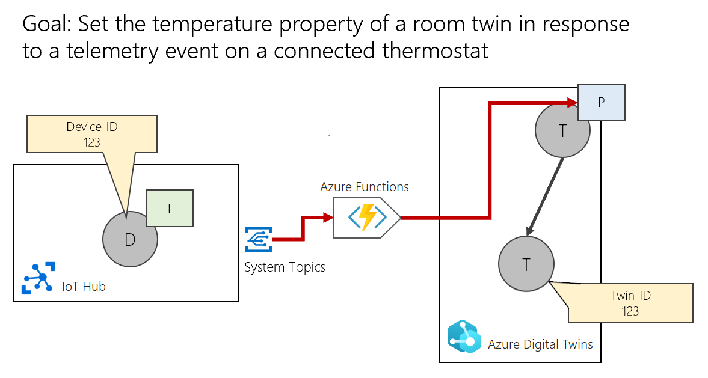
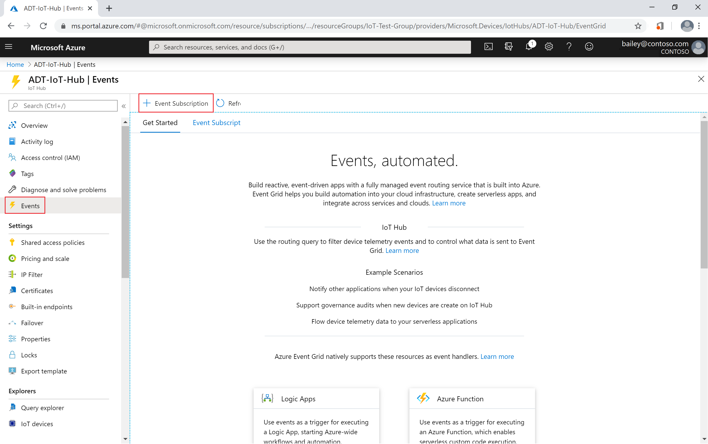

---
# Mandatory fields.
title: Ingest telemetry from IoT Hub
titleSuffix: Azure Digital Twins
description: See how to ingest messages from IoT Hub.
author: cschormann
ms.author: cschorm # Microsoft employees only
ms.date: 3/17/2020
ms.topic: how-to
ms.service: digital-twins

# Optional fields. Don't forget to remove # if you need a field.
# ms.custom: can-be-multiple-comma-separated
# ms.reviewer: MSFT-alias-of-reviewer
# manager: MSFT-alias-of-manager-or-PM-counterpart
---

# Ingest telemetry from IoT Hub

Azure Digital Twins is driven with data from IoT devices and other sources, by calling the [DigitalTwins APIs](how-to-use-apis.md) to set properties or fire telemetry events on digital twins. Once a property change or telemetry event arrives inside of Azure Digital Twins, all further event propagation and processing happens inside of Azure Digital Twins.

This how-to document walks through an example of ingesting telemetry from [IoT Hub](../iot-hub/about-iot-hub.md).

## The example scenario

This how-to outlines how to send messages from IoT Hub to Azure Digital Twins, using an Azure Function. There are many possible configurations and matching strategies you can use for this, but the example for this article contains the following parts:
* A thermometer device in IoT Hub, with a known device ID.
* A digital twin to represent the device, with a matching ID
* A digital twin representing a room

> [!NOTE]
> This example uses a straightforward ID match between the device ID and a corresponding digital twin's ID, but it is possible to provide more sophisticated mappings from the device to its twin (such as with a mapping table).

Whenever a temperature telemetry event is sent by the thermometer device, the *temperature* property of the Room twin should update. To make this happen, you will map from a telemetry event on a device to a property setter on the digital twin. You will use topology information from the graph to find the Room twin, and then you can set the twin's property. 

This scenario is outlined in a diagram below:



## Prerequisites

Before continuing with this example, you'll need to complete the following prerequisites.
1. Create an IoT hub. See the *Create an IoT Hub* section of [this IoT Hub quickstart](../iot-hub/quickstart-send-telemetry-cli.md) for instructions.
2. Create at least one Azure Function to process events from IoT Hub. See [Set up an Azure Function](how-to-create-azure-function.md) to build a basic Azure function that can connect to Azure Digital Twins and call Azure Digital Twins API functions. The rest of this how-to will build on this function.
3. Set up an event destination for hub data. In the [Azure portal](https://portal.azure.com/), navigate to your IoT Hub instance. Under *Events*, create a subscription for your Azure function. 

    

4. In the *Create Event Subscription* page, fill the fields as follows:
  * Under *EVENT SUBSCRIPTION DETAILS*, name the subscription what you would like
  * Under *EVENT TYPES*, choose *Device Telemetry* as the event type to filter on
      - Add filters to other event types if you would like
  * Under *ENDPOINT DETAILS*, select your Azure function as an endpoint

## Create an Azure function in Visual Studio

This section uses the same Visual Studio startup steps and Azure function skeleton from [Set up an Azure Function](how-to-create-azure-function.md). The skeleton handles authentication and creates a service client, ready for you to process data and call Azure Digital Twins APIs in response. 

The heart of the skeleton function is this:

```csharp
[FunctionName("Function1")]
static async Task Run([EventGridTrigger]EventGridEvent eventGridEvent, ILogger log)
{
    await Authenticate(log);
    log.LogInformation(eventGridEvent.Data.ToString());
    if (client != null)
    {
        // Add your code here
    }
}
```

In the steps that follow, you'll add specific code to it for processing IoT telemetry events from IoT Hub.  

## Add telemetry processing

Telemetry events come in the form of messages from the device. The first step in adding telemetry-processing code is extracting the relevant part of this device message from the Event Grid event. 

Different devices may structure their messages differently, so the code for this step depends on the connected device. 

The following code shows an example for a simple device that sends telemetry as JSON. The sample extracts the device ID of the device that sent the message, as well as the temperature value.

```csharp
JObject job = eventGridEvent.Data as JObject;
string devid = (string)job["systemProperties"].ToObject<JObject>().Property("IoT-hub-connection-device-ID").Value;
double temp = (double)job["body"].ToObject<JObject>().Property("temperature").Value;
```

Recall that the purpose of this exercise is to update the temperature of a Room within the twin graph. This means that our target for the message is not the digital twin that is associated with this device, but the Room twin that is its parent. You can find the parent twin using the device ID value that you extracted from the telemetry message using the code above.

To do this, use the Azure Digital Twins APIs to access the incoming relationships to the device-representing twin (which in this case has the same ID as the device). From the incoming relationship, you can find the ID of the parent with the code snippet below.

For simplicity, assume in the sample that there is only a single incoming relationship (in reality, there could more).

```csharp
IPage<IncomingEdge> relPage = await client.DigitalTwins.ListIncomingEdgesAsync(devid);
// Just using the first page for this sample
if (relPage != null) {
    IncomingEdge ie = relPage.FirstOrDefault();
    if (ie!=null) {
        // ie.sourceId now is the ID of the parent
    }
}
```

Now that you have the ID of the parent twin representing the Room, you can "patch" (make select updates to) that twin. To do this, use the following code:

```csharp
// See the utility class defined further down in this file
JsonPatch jp = new JsonPatch();
jp.AppendReplaceOp("/Temperature", 85);
await client.DigitalTwins.UpdateAsync(id, jp.Document);
```

The example above uses a helper class to create a JSON Patch document. The `JsonPatch` helper class is defined below.

```csharp
public class JsonPatch
    {
        private List<Dictionary<string,object>> ops = new List<Dictionary<string, object>>();
        public JsonPatch()
        {
            ops = new List<Dictionary<string, object>>();
        }

        public void AppendReplaceOp(string path, object value)
        {
            Dictionary<string, object> op = new Dictionary<string, object>();
            op.Add("op", "replace");
            op.Add("path", path);
            op.Add("value", value);
            ops.Add(op);
        }

        public void AppendAddOp(string path, object value)
        {
            Dictionary<string, object> op = new Dictionary<string, object>();
            op.Add("op", "add");
            op.Add("path", path);
            op.Add("value", value);
            ops.Add(op);
        }

        public void AppendRemoveOp(string path)
        {
            Dictionary<string, object> op = new Dictionary<string, object>();
            op.Add("op", "remove");
            op.Add("path", path);
            ops.Add(op);
        }

        public string Serialize() 
        {
            string jpatch = JsonConvert.SerializeObject(ops);
            return jpatch;
        }

        public object Document
        {
            get { return ops; }
        }
    }
```

### The final function result

Using the code from the earlier samples, here is the entire Azure function in context:

```csharp
// Default URL for triggering Event Grid function in the local environment
// http://localhost:7071/runtime/webhooks/EventGrid?functionName={functionname}
using System;
using Microsoft.Azure.WebJobs;
using Microsoft.Azure.EventGrid.Models;
using Microsoft.Azure.WebJobs.Extensions.EventGrid;
using Microsoft.Extensions.Logging;
using System.Threading.Tasks;
using System.Net.Http.Headers;
using Microsoft.Rest;
using Newtonsoft.Json.Linq;
using Azure Digital TwinsApi;
using Azure Digital TwinsApi.Models;
using Microsoft.Azure.Services.AppAuthentication;
using System.Linq;
using System.Collections.Generic;
using Newtonsoft.Json;

namespace adtIngestFunctionSample
{
    public static class Function1
    {
        const string AdtAppId = "https://digitaltwins.azure.net";
        const string AdtInstanceUrl = "<your-Azure-Digital-Twins-instance-URL>";
        static AzureDigitalTwinsAPIClient client;

        [FunctionName("Function1")]
        public static async Task Run([EventGridTrigger]EventGridEvent eventGridEvent, ILogger log)
        {
            await Authenticate(log);
            log.LogInformation(eventGridEvent.Data.ToString());
            if (client!=null)
            {
                try
                {
                    JObject job = eventGridEvent.Data as JObject;
                    string devid = (string)job["systemProperties"].ToObject<JObject>().Property("<IoT-Hub-connection-device-ID>").Value;
                    double temp = (double)job["body"].ToObject<JObject>().Property("temperature").Value;

                    var relPage = await client.DigitalTwins.ListIncomingEdgesAsync(devid);
                    // Just using the first page for this sample
                    if (relPage != null)
                    {
                        IncomingEdge ie = relPage.FirstOrDefault();
                        if (ie != null)
                        {
                            // See the utility class defined further down in this file
                            JsonPatch jp = new JsonPatch();
                            jp.AppendReplaceOp("/Temperature", 85);
                            await client.DigitalTwins.UpdateAsync(ie.SourceId, jp.Document);
                        }
                    }

                } catch (Exception e)
                {
                    log.LogError($"Error in ingest function: {e.Message}");
                }
            }
        }

        public async static Task Authenticate(ILogger log)
        {
            var azureServiceTokenProvider = new AzureServiceTokenProvider();
            string accessToken = await azureServiceTokenProvider.GetAccessTokenAsync(AdtAppId);

            var wc = new System.Net.Http.HttpClient();
            wc.DefaultRequestHeaders.Authorization = new AuthenticationHeaderValue("Bearer", accessToken);

            try
            {
                TokenCredentials tk = new TokenCredentials(accessToken);
                client = new AzureDigitalTwinsAPIClient(tk)
                {
                    BaseUri = new Uri(AdtInstanceUrl)
                };
                log.LogInformation($"Azure Digital Twins client connection created.");
            }
            catch (Exception e)
            {
                log.LogError($"Azure Digital Twins client connection failed.");
            }
        }
    }

    public class JsonPatch
    {
        private List<Dictionary<string, object>> ops = new List<Dictionary<string, object>>();
        public JsonPatch()
        {
            ops = new List<Dictionary<string, object>>();
        }

        public void AppendReplaceOp(string path, object value)
        {
            Dictionary<string, object> op = new Dictionary<string, object>();
            op.Add("op", "replace");
            op.Add("path", path);
            op.Add("value", value);
            ops.Add(op);
        }

        public void AppendAddOp(string path, object value)
        {
            Dictionary<string, object> op = new Dictionary<string, object>();
            op.Add("op", "add");
            op.Add("path", path);
            op.Add("value", value);
            ops.Add(op);
        }

        public void AppendRemoveOp(string path)
        {
            Dictionary<string, object> op = new Dictionary<string, object>();
            op.Add("op", "remove");
            op.Add("path", path);
            ops.Add(op);
        }

        public string Serialize()
        {
            string jpatch = JsonConvert.SerializeObject(ops);
            return jpatch;
        }

        public object Document
        {
            get { return ops; }
        }
    }
}
```

Now you have an Azure function that is equipped to read and interpret the scenario data coming from IoT Hub.

## Debug Azure function apps locally

It is possible to debug Azure Functions with an Event Grid trigger locally. For more information about this, see [Debug Event Grid trigger locally](../azure-functions/functions-debug-event-grid-trigger-local.md).

## Next steps

Read about data ingress and egress with Azure Digital Twins:
* [Integration with other services](concepts-integration.md)