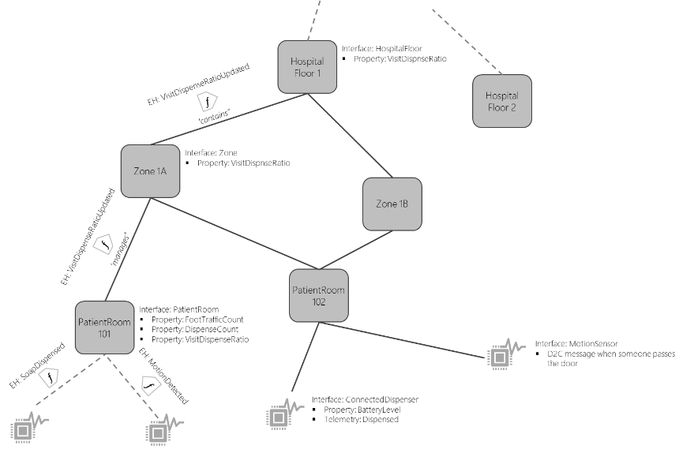

---
# Mandatory fields.
title: Manage an Azure Digital Twins graph
titleSuffix: Azure Digital Twins
description: See how to combine Azure Digital Twins concepts to build out a full graph representation, as well as modify and delete when necessary.
author: baanders
ms.author: baanders # Microsoft employees only
ms.date: 2/21/2020
ms.topic: how-to
ms.service: digital-twins

# Optional fields. Don't forget to remove # if you need a field.
# ms.custom: can-be-multiple-comma-separated
# ms.reviewer: MSFT-alias-of-reviewer
# manager: MSFT-alias-of-manager-or-PM-counterpart
---

# Manage the components of your digital twin graph

Azure Digital Twins **Twin APIs** let developers create, modify, and delete twins and their relationships in an Azure Digital Twins instance.

## Create a graph (preview)
Once we have a set of types, we can create a graph representing a complete hospital. For a small hospital, this graph might look like this:

[](./media/how-to-manage-graph/hospital-graph.png#lightbox)

For illustration purposes, here is an example code snippet, using the Azure Digital Twins C# SDK, that might be used to create the graph programmatically. In reality, code like this would most likely be driven by information from another pre-existing data system, such as a building information management system:

```csharp
var client = new DigitalTwinsClient("...Authentication Info...");
        // Create a twin for the hospital
        client.CreateTwin("HospitalId", "dtmi:com:example:Hospital;1");
        // Create some wards
        client.CreateTwin("PediatricWard", "dtmi:com:example:Ward;1");
        client.CreateTwin("OphthalmologyWard", "dtmi:com:example:Ward;1");
        client.CreateTwin("OncologyWard", "dtmi:com:example:Ward;1");
        // Create relationships
        client.CreateRelationship("Hospital", "contains", "PediatricWard");
        // ... and so on
        client.CreateTwin("RoomPed01", "dtmi:com:example:PatientRoom;1");
        client.Relationship("PediatricWard", "contains", "RoomPed01");
        // Create proxies for devices... these will automatically connect to devices
        // once discovered via an attached IoTHub
        client.CreateProxyTwin("MotionSensorP01", "dtmi:com:example:devices:MotionSensor");
        client.CreateProxyTwin("SoapDispenserP01", "dtmi:com:example::SoapDispenser");
        // And connect...
        client.Relationship("RoomPed01", "hasDevice", "MotionSensorP01");
        client.Relationship("RoomPed01", "hasDevice", "SoapDispenserP01");
```

## Create twins and graphs of twin instances 

Once models are uploaded to the server, you can begin constructing a twin instance graph. In many cases, the data that determines the topology of the instance graph will come from an existing data source, such as a CAD file, a BIM database, or an Excel spreadsheet.

The following code shows a minimal example for instance graph creation:

```csharp
DigitalTwinsClient client = new DigitalTwinsClient("...");  
Response rPlanet = client.CreateTwin("dtmi:example:Planet;1", "idMyPlanet01", planetData);
Response rMoon = client.CreateTwin("dtmi:example:Moon;1", "idMyMoon01", moonData);
Response rR = client.CreateRelationship("idMyPlanet01", "IsCircledBy", "idMyMoon01", 
                                        “idRel01”);
```

This code creates two instances of twins, one using model type *Planet*, the other using model type *Moon*. In addition to the model type ID (`dtmi:Planet` and `dtmi:Moon`), you need to pass in a unique ID, and data to initialize the twin instance during creation. The sample also creates a relationship between the two instances, connecting them to each other.

## Initialize properties

All non-optional properties and components of twins must be initialized at creation time. Relationships may be initialized, but do not need to be. 
The Twin creation API accepts a JSON string to initialize the twin instance. You will typically create this JSON string by serializing an object that holds the initialization data into JSON; for example, using the JSON functionality in `System.Text.Json` (built-in for .NET Core 3.0, and available as a NuGet package for many other versions of the .NET framework).

The following code shows an example for the creation of the JSON string:

```csharp
Dictionary<string, object> moonData = new Dictionary<string, object>()
{
    { "name", "MyMoon" },
    { "mass", 100 }
};
string s = JsonSerializer.Serialize(moonData);
```

The example above uses a Dictionary with an initializer to hold the data for the twin. If you have the data in custom classes, you can use the more advanced capabilities of `System.Text.Json` to shape the JSON string as needed. For example:

```csharp
class MoonData
{
    [JsonPropertyName("temperature")]
    public double Temperature { get; set; }
    [JsonPropertyName("mass")]
    public double Mass { get; set; }
}
...
MoonData moonData = new MoonData();
// Set values ...
string s = JsonSerializer.Serialize(moonData);
```

## Create twins: a more complete example

A slightly more complete example is outlined below, to read topology from a spreadsheet. The example assumes that there are a number of rows in the Excel file that list floors or rooms (and the parent floor for each room):

| Type	| ID | Parent | RelName | OtherData | OtherData |
| --- | --- | --- | --- | --- | --- |
| floor	| Floor01 | | | … | … |
| room	| Room10 | Floor01 | contains | … | … |
| room	| Room11 | Floor01 | contains | … | … |
| room	| Room12 | Floor01 | contains | … | … |
| floor	| Floor02 | | | … | … |
| room	| Room21 | Floor02 | contains | … | … |
| room	| Room22 | Floor02 | contains | … | … |

The following code uses the [Microsoft Graph API](https://docs.microsoft.com/graph/overview) to read a spreadsheet and construct an Azure Digital Twins graph from the results:

```csharp
DigitalTwinsClient client = new DigitalTwinsClient("...");
// Connect to MSFT graph and open spreadsheet from OnDrive
// ...
// Read excel spreadsheet using MSFT graph APIs
var range = msftGraphClient.Me.Drive.Items["BuildingsWorkbook"]
                           .Workbook.Worksheets["Building"].usedRange;
JsonDocument data = JsonDocument.Parse(range.values);
List<RelationshipRecord> RelationshipRecordList = new List<RelationshipRecord>();
foreach (JsonElement row in data.RootElement.EnumerateArray())
{
    string type = row[0].GetString();
    string id = row[1].GetString();
    string relSource = row[2].GetString();
    string relName = row[3].GetString();
    // Parse spreadsheet extra data into a JSON string to initialize the twin
    string initData = "{...}";

    if (relSource != null)
        RelationshipRecordList.Add(new RelationshipRecord(relSource, id, relName));

    switch (type)
    {
         case "room": client.CreateTwin("dtmi:Room", id, initData);
                      break;
         case "floor": client.CreateTwin("urn:Floor", id, initData);
                       break;
    }
    foreach (RelationshipRecord rec in RelationshipRecordList)
    {
         client.CreateRelationship(rec.src, rec.relName, rec.target, 
                                   Guid.NewGuid().ToString());
    }
}
With RelationshipRecord defined as:
        public class RelationshipRecord
        {
            public RelationshipRecord (string src, string target, string name)
            {
                this.src = src; this.target = target; relName = name;
            }

            public string target;
            public string src;
            public string relName;
        }
```

## Next steps

Learn about querying an Azure Digital Twins graph:
* [Query the Azure Digital Twins Graph](concepts-query-graph.md)