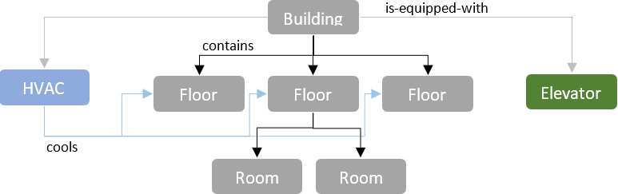
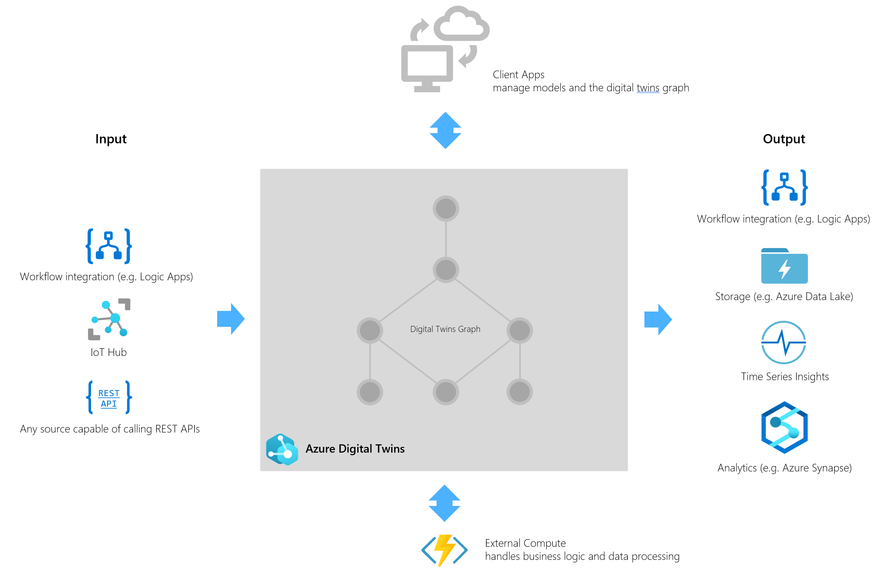

---
# Mandatory fields.
title: What is Azure Digital Twins?
description: Overview of what can be done with Azure Digital Twins.
author: baanders
ms.author: baanders # Microsoft employees only
ms.date: 2/21/2020
ms.topic: overview
ms.service: digital-twins

# Optional fields. Don't forget to remove # if you need a field.
# ms.custom: can-be-multiple-comma-separated
# ms.reviewer: MSFT-alias-of-reviewer
# manager: MSFT-alias-of-manager-or-PM-counterpart
---

# What is Azure Digital Twins?

Azure Digital Twins is a developer platform for next-generation IoT solutions. With Azure Digital Twins, you can quickly and cost-effectively create digital models of your business environment and drive these models with real-time data from IoT and other data sources.

Using Azure Digital Twins's flexible modeling system, you can use digital twins to represent factory floors, bulk manufacturing processes in chemistry, buildings, construction scenarios, energy grids, and more. Digital twin-based IoT solutions can support remote monitoring, maintenance, prediction, forecasting, simulation, and optimization of operations. 

 
Azure Digital Twins does numerous the hard work of translating a device-centric view of the world into always-up-to-date, business-focused insights, allowing you to focus on your business problems instead of complex distributed systems infrastructure. Azure Digital Twins delivers a live operational state model of your environment, driven and kept current by data from IoT and other data sources.

## Azure Digital Twins key capabilities

The Azure Digital Twins service is a Platform-as-a-Service (PaaS) offering that lets you create, run, and manage your digital twins securely and efficiently in the cloud. Azure Digital Twins allows you to: 

### Model your real-world business environment

With Azure Digital Twins, you can define twin types that represent the people, places, and things in your physical environment, and the relationships between them. You can think of these types as a custom vocabulary to describe your business. Twin types are expressed in terms of persistent state properties, telemetry events, commands, relationships, and components.
For a building management solution, for instance, you might define types such as "building", "floor", "room", "elevator" and "HVAC system".

Once you have defined the vocabulary for your business, you can model your concrete environment by creating a graph of twins from the types you previously defined.  
For example, using the simple vocabulary from the previous paragraph, you can create a model that represents the office building you are in. 

The arrows in the illustration below show different semantic relationships between the twins in the model. For example, the Building "contains" three floors, and each floor contains several rooms. The building also "is-equipped-with" an HVAC system and an elevator. The HVAC system "cools" specific floors. You can think of the twin types as nouns in a description of your world, and the relationships as verbs.

The following diagram represents this model scenario.

### Process incoming data and propagate state through the Azure Digital Twins graph

Azure Digital Twins models are meant to be live, up-to-date representations of the state of the real world. To keep twins updated, Azure Digital Twins provides a comprehensive event processing system. You can, for example, process events to manage incoming telemetry from devices, state changes within your Azure Digital Twins graph, or life-cycle events generated when twins are created or modified. Azure Digital Twins provides a convenient data processing framework for you to apply custom code to incoming data streams of IoT and business data. 

You might use event data routing to:
* Compute properties on a twin from sensor input (such as aggregating data from temperature, CO2, humidity, and noise sensors into a comfort property on a "room" twin)
* Propagate state through the Azure Digital Twins graph (such as calculating an average comfort for a floor in a building when the comfort property of any of the rooms on the floor changes)
* Apply complex external simulation or machine learning processors (such as calculating the energy efficiency of a wind turbine based on current operational parameters)
* Route data to downstream destination (such as storing it for long-term bulk analytics, or to trigger workflow integrations)

### Query the model of your environment to answer business questions

Once you have created a graph of twins, you can run queries against the twins, their states, and their relationships. Depending on the state information you modeled and the sensors you have connected to drive your model, queries might be used to answer a broad range of questions about your model, such as:
* Which zones or floors in building 7 are warmer than 75 degrees F? 
* Which campus is meeting room 47 in?
* Which power station has surplus capacity that is accessible to a particular customer?   

### Manage access

Using fine-grained, twin-level access control, you can define the policies for data access in Azure Digital Twins.

### Integrate with IoT Hub for device-centric scenarios

Azure Digital Twins will automatically mirror devices connected to an attached IoT hub into your Azure Digital Twins graph. For [IoT Plug and Play (PnP)](../iot-pnp/overview-iot-plug-and-play.md) devices, it will also automatically replicate their state and proxy their commands, so that you can program against devices in virtually the same way you program against all other twins.

## Azure Digital Twins in a solution context

Azure Digital Twins is not often used on its own. Commonly, a complete Azure Digital Twins solution contains the following components:
* The Azure Digital Twins service instance itself. It stores your models and your twins graph with all its state, and orchestrates event processing.
* One or more client apps that drive the Azure Digital Twins instance by configuring models, creating topology, and extracting insights from the graph.
* One or more external compute resources to process events generated by Azure Digital Twins, or connected data sources such as devices. One common way to provide compute resources is via Azure Functions.
* An IoT hub to provide device management and IoT data stream capabilities.
* Downstream services to handle tasks such as workflow integration (like [MS Flow](https://flow.microsoft.com/)), cold storage, time series integration, or analytics. 

The following diagram shows where Azure Digital Twins lies in the context of a larger Azure IoT solution.

## Differences from Preview 1

The previous preview version of Azure Digital Twins was released in October 2018. The new version of Azure Digital Twins (currently in preview) marks a significant departure from the previous architecture. While all the core concepts are still the same, the developer interfaces and APIs are different, and the service provides improved capabilities and flexibility. The changes were motivated by customer feedback. 

The main changes are:
* Free modeling of twin types and topology. Azure Digital Twins Preview 1 (Azure Digital Twins P1) evolved from a solution designed for building management, and came with a built-in vocabulary for buildings. Twins could be connected using hierarchical relationships, effectively creating a tree topology. Customers expressed great interest in applying the Azure Digital Twins design pattern to a much broader set of business solutions. In response, the new Azure Digital Twins preview provides a modeling environment that lets you define your own custom vocabulary and custom twin types for your solution – out of the box, Azure Digital Twins is now completely domain agnostic. In addition, the individual digital twins you define can be connected into arbitrary graph topologies, giving you much more flexibility to express the complex relationships that exist in real world environments.
* Flexible compute and event processing model. Azure Digital Twins PP1 had a compute model that relied on JavaScript user-defined functions. Based on customer feedback, this model has been replaced with a new compute model that relies on external, customer-provided processing such as Azure Functions. The enables developers to...
    - use a programming language of their choice.
    - access custom code libraries without restriction.
    - have access to a robust development and debugging story with supported serverless compute platforms such as Azure Functions.
    - take advantage of a flexible event processing and routing model throughout the platform. 
* Full access to IoT Hub. In Azure Digital Twins PP1, IoT Hub was integrated into Azure Digital Twins, and not fully accessible to developers. In the new version of Azure Digital Twins, you bring your own IoT hub and attach it to Azure Digital Twins. This change puts you in full control of all device management, and gives you full access to IoT Hub's capabilities. Azure Digital Twins automatically reflects PnP devices connected to IoT Hub into the Azure Digital Twins graph.
* Greater Scale. The new version of Azure Digital Twins is designed to run at greater scale.

## Next steps

To start learning more about the key components of Azure Digital Twins, visit:
* [Model an object](concepts-models.md)
* [Create twins and the Azure Digital Twins graph](concepts-twins-graph.md)
* [Query the Azure Digital Twins graph](concepts-query-graph.md)
