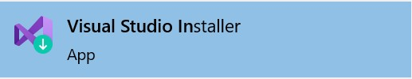
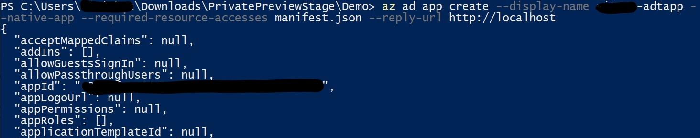
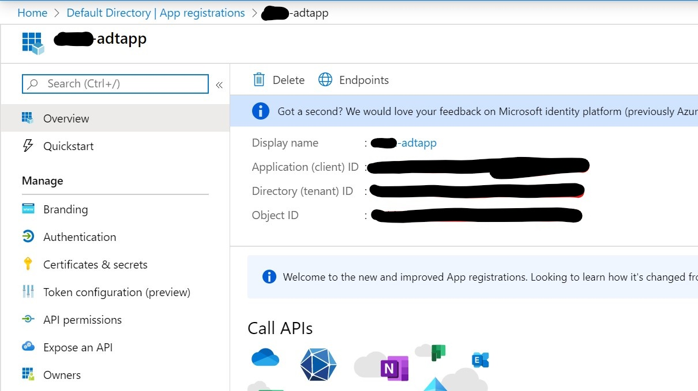
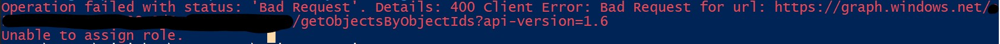

---
# Mandatory fields.
title: Create and configure Azure Digital Twins
titleSuffix: Azure Digital Twins
description: Walk through an introductory Azure Digital Twins setup.
author: baanders
ms.author: baanders # Microsoft employees only
ms.date: 4/7/2020
ms.topic: quickstart
ms.service: digital-twins

# Optional fields. Don't forget to remove # if you need a field.
# ms.custom: can-be-multiple-comma-separated
# ms.reviewer: MSFT-alias-of-reviewer
# manager: MSFT-alias-of-manager-or-PM-counterpart
---

# Getting started with the Azure Digital Twins Sample App

In this tutorial, you will set up to use Azure Digital Twins, create an instance and configure your application, and perform some sample actions on the solution.

## Prerequisites

Before you can create and start working with your Azure Digital Twins instance, complete the following:

1. Install [Visual Studio 2019](https://visualstudio.microsoft.com/downloads/) version 16.5.1XXX or later on your machine.
    * If you have an older version, open the Visual Studio Installer on your machine and follow the prompts to update your installation.
    

2. Choose whether to complete this tutorial with [Azure Cloud Shell](../cloud-shell/overview.md) or the local Azure CLI. If the local CLI, install the Azure CLI package on your computer
    * If you have it installed already, run `az --version` to make sure `azure-cli` is at least **version 2.0.8** -- if it isn't, use the link below to install the latest version
    * Use this link to install if you haven't: [Azure CLI Installation Documentation](https://docs.microsoft.com/en-us/cli/azure/install-azure-cli?view=azure-cli-latest])

3. Download the sample project
    * If you haven't already, download this entire repository. We recommend **downloading as a ZIP file** for an easier experience

4. Install Azure IoT CLI Extension.
    * Open PowerShell
    * Add the new extension with `az extension add --name azure-iot`
    * See the top-level Azure Digital Twins commands with `az dt -h`

5. Configure AAD app registration and save important strings
    * [Optional] If you don't have an app registration for ADT, follow guidance in [How to authenticate - create an app registration](https://github.com/Azure/azure-digital-twins/blob/private-preview/Documentation/how-to-authenticate.md) (screenshot from the process below)
                
    * [Required] Once created, use [Azure portal - AAD app registrations](https://portal.azure.com/#blade/Microsoft_AAD_IAM/ActiveDirectoryMenuBlade/RegisteredApps) to navigate to the app registration overview page and make note of the *Application ID* and *Directory ID*
        

    Save the *Application ID* and *Directory ID* (tenant ID). You will use these values along with your *Subscription ID* later.

6. [Optional] Check out the Azure Digital Twins Swagger to learn about our APIs
    * Download and install the [Swagger Viewer VS Code extension](https://marketplace.visualstudio.com/items?itemName=Arjun.swagger-viewer)
    * Navigate back a directory in the repo and to *OpenApiSpec > * **digitaltwins.json**, right-click it and open with Visual Studio Code
    * Press *F1* and enter the command "Preview Swagger"
    * The compiled swagger should appear adjacent to the *.json* file

## Create an instance and configure your solution

### 1. Create an Azure Digital Twins instance
These instructions use the recommended Azure Digital Twins CLI commands (`az dt`) to _set the context to your subscription_, _create a resource group_ and _create an Azure Digital Twins instance_. Complete these steps using PowerShell on your machine. Anything <in-brackets> is your own resources that you need to replace.

> [!NOTE] 
> This document encourages PowerShell due to its parsing of quotations. Alternative bashes will work for most commands, but may fail on commands with *single-quote* and/or *double-quote* characters.

> [!IMPORTANT]
> Make sure to sign in with the AAD account associated with your subscription.

Log in and set the context to your allow-listed subscription

```bash
az login
az account set --subscription <your-subscription-ID>
```

Register with the Azure Digital Twins namespace, create a resource group and create your Azure Digital Twins instance

```bash
az provider register --namespace 'Microsoft.DigitalTwins'
```

> [!NOTE]
> If using cmd or bash, you may have to remove the quotes or use double-quotes for `Microsoft.DigitalTwins`

```bash
az group create --location "westcentralus" --name <your-resource-group>
az dt create --dt-name <your-Azure-Digital-Twins-instance> -g <your-resource-group>
az dt show --dt-name <your-Azure-Digital-Twins-instance>
```

Save your *resource group*, *Azure Digital Twins instance*, and *HostName* from the output of the `create` operation above. You will use them later.

### 2. Assign an AAD role

Azure Digital Twins uses AAD for RBAC, so you must create a role assignment for your tenant to be able to make data plane calls to your instance.

Create the role assignment using the AAD email associated with your tenant (*\<your-AAD-email>*)

```bash
az dt rbac assign-role --dt-name <your-Azure-Digital-Twins-instance> --assignee "<your-AAD-email>" --role owner
```

> [!TIP]
> If you get a *400: BadRequest* error, navigate to your user in the [AAD Users page](https://portal.azure.com/#blade/Microsoft_AAD_IAM/UsersManagementMenuBlade/AllUsers) and use the **Object ID** instead of *\<your-AAD-email>*
> 
> 

### 3. Open the sample app

Azure Digital Twins has put together a sample app to make it easier for people to start testing the service. This app implements…
* Device authentication 
* Already-generated AutoRest SDK
* Sample usage of the SDK (in *CommandLoop.cs*)
* Console interface to call the Azure Digital Twins API
* _BuildingScenario_ - a sample Azure Digital Twins solution
* _HubtToDT_ - a Functions App to update your Azure Digital Twins graph as a result of telemetry from IoT Hub
* _DTRoutedData_ - a Functions App to update your Azure Digital Twins graph as a result of ADT-routed data 

To get started with this app on your local machine…
  
Launch *DigitalTwinsMetadata > DigitalTwinsSample >* **DigitalTwinsSample.sln** and edit the following values

In *DigitalTwinsMetadata > DigitalTwinsSample > **Program.cs**, change `adtInstanceUrl` to your Azure Digital Twins instance hostname, `ClientId` to *\<your-application-ID>* and  `TenantId` to *\<your-directory-ID>*

```bash
private const string ClientId = "<your-application-ID>";
private const string TenantId = "<your-directory-ID>";
const string AdtInstanceUrl = "https://<your-Azure-Digital-Twins-instance-hostname>"
```

### 4. Start testing

Sample code is in *CommandLoop.cs* and *BuildingScenario.cs*. When you feel comfortable with this code, go try building your own solution! There are infinite physical environments to model with Digital Twins, try a couple yourself.

For guided testing, move on to the next section.