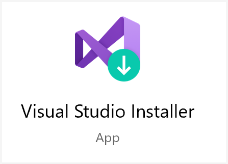

---
# Mandatory fields.
title: Create and configure Azure Digital Twins
titleSuffix: Azure Digital Twins
description: Walk through an introductory Azure Digital Twins setup.
author: baanders
ms.author: baanders # Microsoft employees only
ms.date: 4/7/2020
ms.topic: quickstart
ms.service: digital-twins

# Optional fields. Don't forget to remove # if you need a field.
# ms.custom: can-be-multiple-comma-separated
# ms.reviewer: MSFT-alias-of-reviewer
# manager: MSFT-alias-of-manager-or-PM-counterpart
---

# Getting started with the Azure Digital Twins sample app

In this section, you will set up to use Azure Digital Twins, create an instance and configure your application, and perform some sample actions on the solution.

## Prerequisites

Before you can start working with an Azure Digital Twins instance, complete the following steps:

1. Install [Visual Studio 2019](https://visualstudio.microsoft.com/downloads/) version 16.5.1XXX or later on your machine.
    * If you have an older version, open the Visual Studio Installer on your machine and follow the prompts to update your installation. The application looks like this:
      

2. Choose whether to complete this tutorial with [Azure Cloud Shell](https://docs.microsoft.com/azure/cloud-shell/overview) or the Azure CLI locally. To use the local CLI, install the Azure CLI package on your computer with these steps:
    1. If you have it installed already, run `az --version` and verify that `azure-cli` is at least **version 2.0.8**. If it isn't, use the link below to install the latest version.
    2. Use the instructions at this link to [Install the Azure CLI](https://docs.microsoft.com/cli/azure/install-azure-cli?view=azure-cli-latest]).
    3. For Windows, installing the Azure CLI gives you CLI access through the Windows Command Prompt (CMD) and PowerShell. You can now use the CLI by typing Azure CLI commands in a CMD or PowerShell window.

3. Download the sample project.
    * Download this entire repository to your machine. We recommend downloading as a ZIP file.

4. Install the Azure IoT CLI extension.
    1. Open PowerShell or another command window on your machine (or an Azure Cloud Shell instance if you will be using that instead of the local CLI).
    2. Add the new Azure IoT CLI extension with `az extension add --name azure-iot`.
    3. You can run `az dt -h` to see the top-level Azure Digital Twins commands.
> [!NOTE]
> This article uses the newest version of the Azure IoT extension, called `azure-iot`. The legacy version is called `azure-iot-cli-ext`.You should only have one version installed at a time. You can use the command `az extension list` to validate the currently installed extensions.
> Use `az extension remove --name azure-cli-iot-ext` to remove the legacy version of the extension.
> Use `az extension add --name azure-iot` to add the new version of the extension. 
> To see what extensions you have installed, use `az extension list`.

5. Configure app registration and save important strings.
    1. Complete the "Create an app registration" section of [How to authenticate](https://review.docs.microsoft.com/azure/digital-twins-v2/how-to-authenticate?branch=pr-en-us-110066) to set up an Azure Active Directory (AAD) app registration to use for authentication with Azure Digital Twins.
      After doing this, your command window should look something like this:
              
    2. After creating the app registration, follow [this link](https://portal.azure.com/#blade/Microsoft_AAD_IAM/ActiveDirectoryMenuBlade/RegisteredApps) to navigate to the AAD app registration overview page in the Azure portal.
      From this overview, select the app registration you just created from the list. This will open up its details in a page like this one:
      

        Take note of the *Application (client) ID* and *Directory (tenant) ID* shown on **your** page. You will use these values later.

6. [Optional] To learn more about the available Azure Digital Twins APIs, view the Azure Digital Twins Swagger.

## Create an instance and configure your solution

This section walks through the basic steps to set up an Azure Digital Twins solution. The last steps get you ready to work with the sample project for this tutorial.

Complete these steps using PowerShell or another command window on your machine. You can also use the [Azure Cloud Shell](https://docs.microsoft.com/azure/cloud-shell/overview).
> [!NOTE]
> This document encourages PowerShell due to its parsing of quotations. Other bashes will work for most commands, but may fail on commands with *single-quote* and/or *double-quote* characters.

Any placeholders shown *<in-brackets>* should be replaced with the appropriate values from your own resources.

### 1. Create an Azure Digital Twins instance

These instructions use the Azure Digital Twins CLI commands (`az dt`) to set the context to your subscription, create a resource group, and create an Azure Digital Twins instance. For more about the CLI commands, see [How to use Azure Digital Twins CLI](https://review.docs.microsoft.com/azure/digital-twins-v2/how-to-use-digital-twins-cli?branch=pr-en-us-110066).

Begin by logging in and setting the shell context to your subscription.

```Azure CLI
az login
az account set --subscription <your-subscription-ID>
```

Run the following commands to register with the Azure Digital Twins namespace, create a new resource group to use in this tutorial, and create your Azure Digital Twins instance.

> [!NOTE]
> If using CMD or bash, you may have to remove the quotes or use double-quotes for `Microsoft.DigitalTwins`.

```Azure CLI
az provider register --namespace 'Microsoft.DigitalTwins'

az group create --location "westcentralus" --name <name-for-your-resource-group>
az dt create --dt-name <name-for-your-Azure-Digital-Twins-instance> -g <your-resource-group>
```

The result of these commands looks something like this, outputting information about the resources you've created:


Save the Azure Digital Twins instance's *hostName*, *name*, and *resourceGroup*  from the output. You will use them later.

> [!TIP]
> You can see the properties of your instance at any time by running `az dt show --dt-name <your-Azure-Digital-Twins-instance>`.

### 2. Assign an Azure Active Directory role

Azure Digital Twins uses [Azure Active Directory (AAD)](https://docs.microsoft.com/azure/active-directory/fundamentals/active-directory-whatis) for role-based access control (RBAC). This means that before you can make data plane calls to your Azure Digital Twins instance, you must first assign yourself a role with these permissions.

Create the role assignment using your email associated with the AAD tenant on your Azure subscription:

```Azure CLI
az dt rbac assign-role --dt-name <your-Azure-Digital-Twins-instance> --assignee "<your-AAD-email>" --role owner
```

The result of this command is outputted information about the role assignment you've created.

> [!TIP]
> If you get a *400: BadRequest* error instead, navigate to your user in the [AAD Users page](https://portal.azure.com/#blade/Microsoft_AAD_IAM/UsersManagementMenuBlade/AllUsers) for your tenant. Repeat the command using your user's *Object ID* instead of your email.
> 

### 3. Configure the sample project

In this tutorial, you will work with pre-written sample app to work with Azure Digital Twins. This app implements…
* Device authentication 
* Pre-generated AutoRest SDK
* SDK usage examples (in *CommandLoop.cs*)
* Console interface to call the Azure Digital Twins API
* *BuildingScenario* - A sample Azure Digital Twins solution
* *HubtToDT* - An Azure Functions app to update your Azure Digital Twins graph as a result of telemetry from IoT Hub
* *DTRoutedData* - An Azure Functions app to update your Azure Digital Twins graph according to Azure Digital Twins data 

To get started with this app on your local machine, navigate to the sample project folder you downloaded from this repository.

Open _DigitalTwinsMetadata > DigitalTwinsSample > **Program.cs**_, and change `AdtInstanceUrl` to your Azure Digital Twins instance hostName, `ClientId` to your *Application ID*, and `TenantId` to your *Directory ID*.

```csharp
private const string ClientId = "<your-application-ID>";
private const string TenantId = "<your-directory-ID>";
//...
const string AdtInstanceUrl = "https://<your-Azure-Digital-Twins-instance-hostName>"
```

### 4. [Optional] Explore the sample project

Launch _DigitalTwinsMetadata > **DigitalTwinsSample.sln**_ in Visual Studio.

You can explore the sample code in this project to familiarize yourself with the example and get an idea of how Azure Digital Twins works.
You can also can edit or copy it to try out creating your own solution.

The bulk of the project code resides in *CommandLoop.cs* and *BuildingScenario.cs*. 

For additional guided solution development, continue with the steps below.