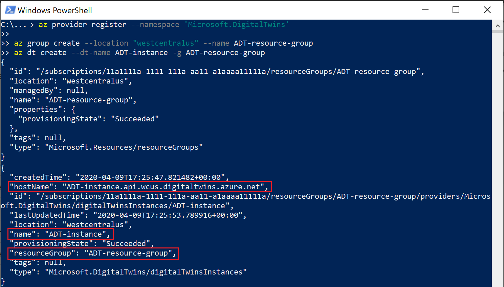
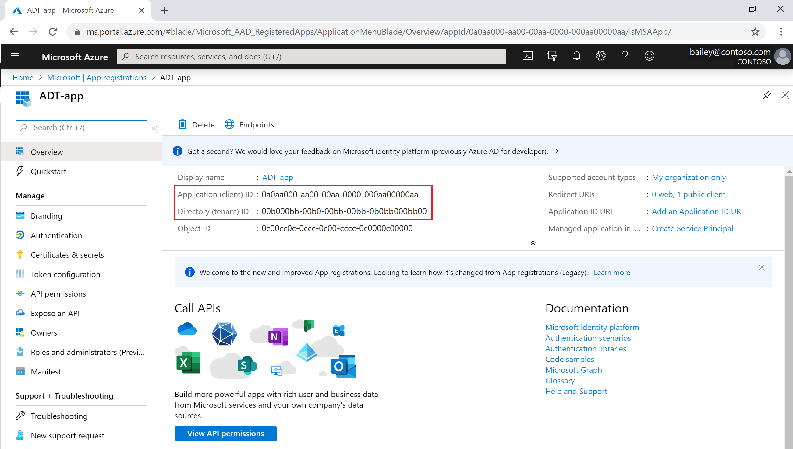
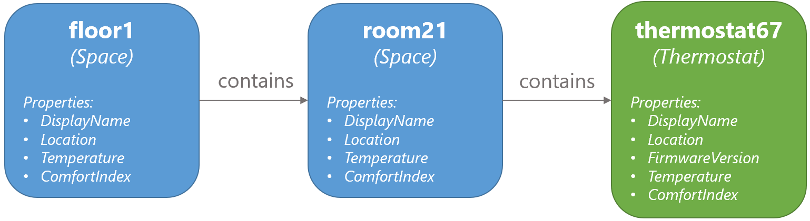
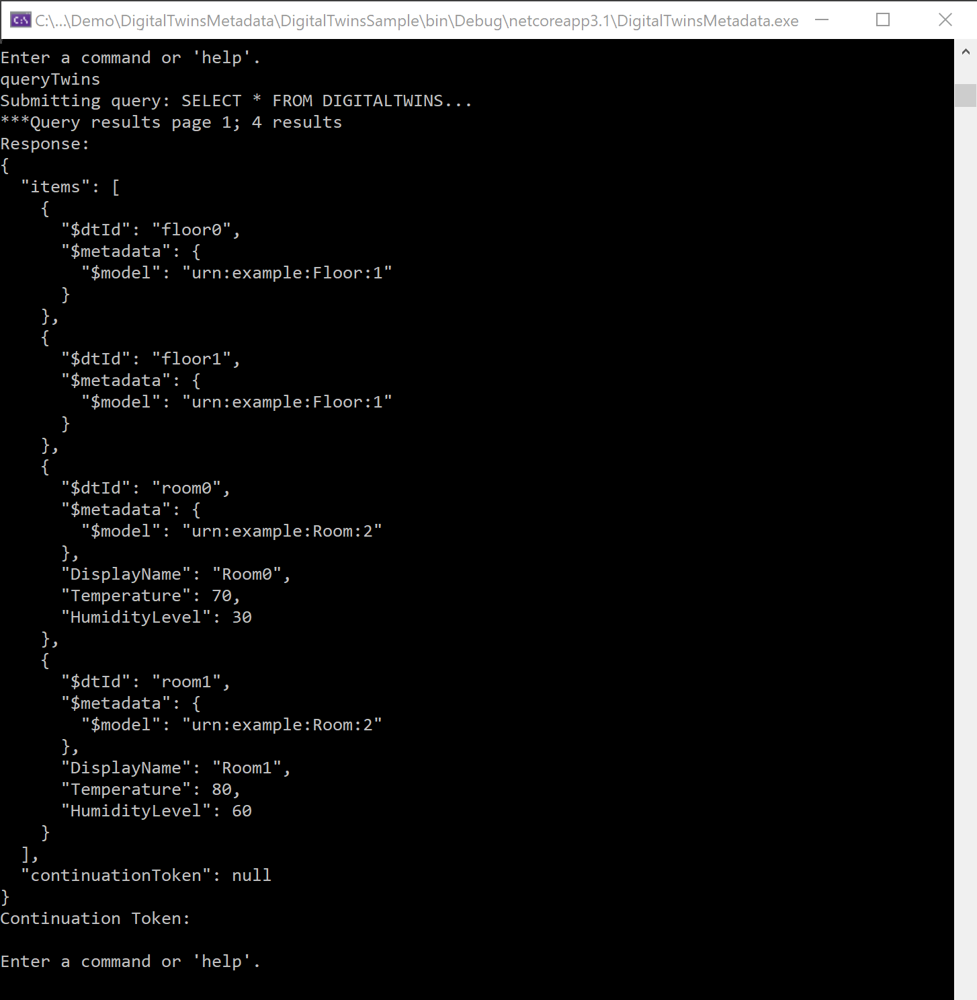
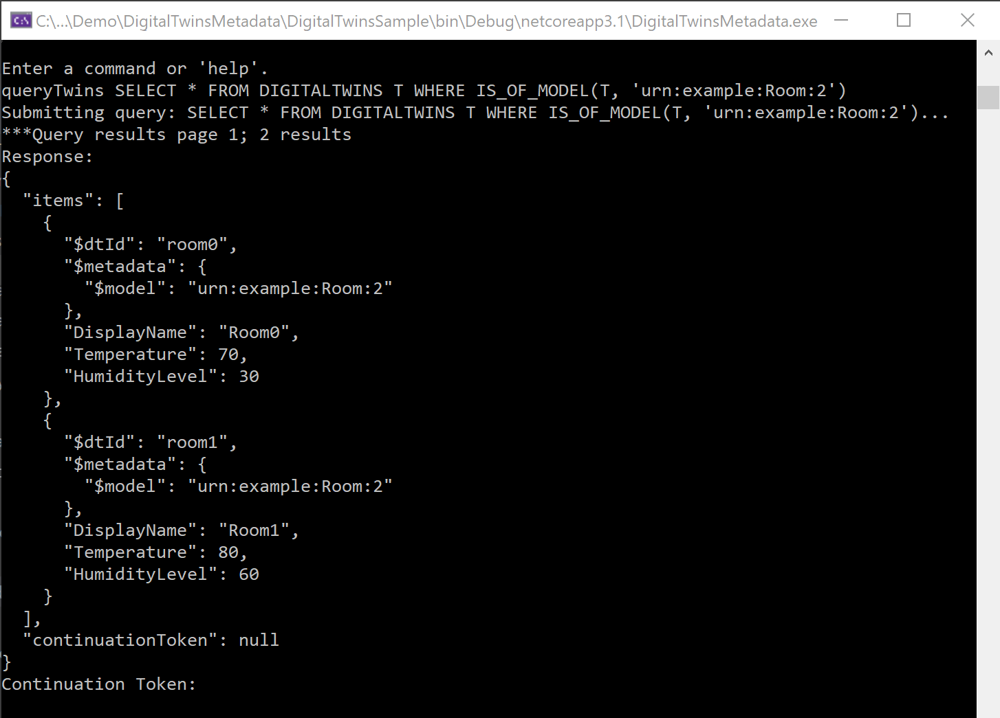
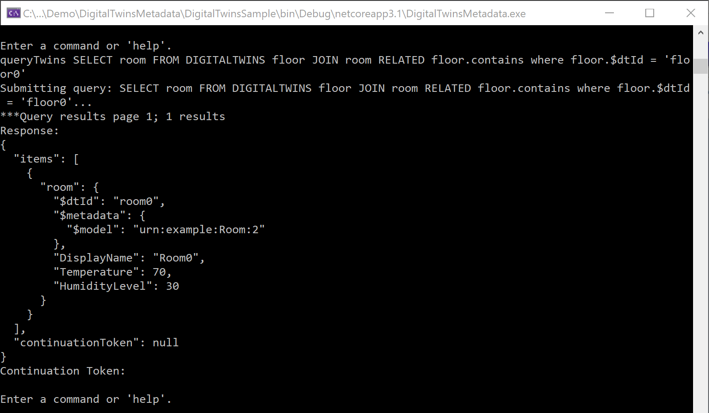
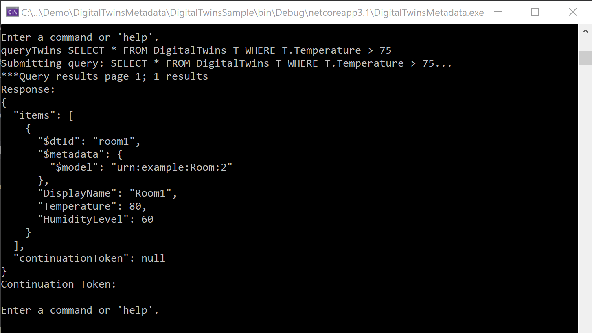
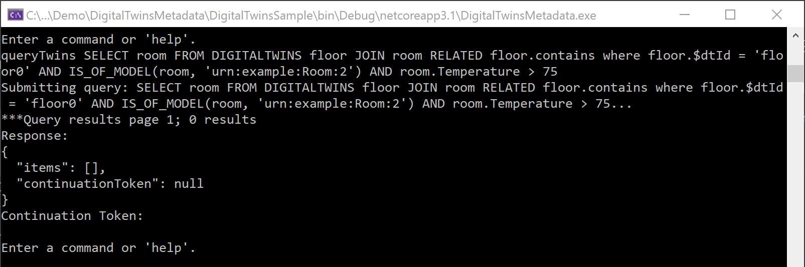

---
# Mandatory fields.
title: Create and configure Azure Digital Twins
titleSuffix: Azure Digital Twins
description: Walk through an introductory Azure Digital Twins setup.
author: baanders
ms.author: baanders # Microsoft employees only
ms.date: 4/13/2020
ms.topic: quickstart
ms.service: digital-twins

# Optional fields. Don't forget to remove # if you need a field.
# ms.custom: can-be-multiple-comma-separated
# ms.reviewer: MSFT-alias-of-reviewer
# manager: MSFT-alias-of-manager-or-PM-counterpart
---

# Getting started with the Azure Digital Twins sample app

In this section, you will set up to use Azure Digital Twins, create an instance and configure your application, and perform some sample actions on the solution.

[!INCLUDE [cloud-shell-try-it.md](../../includes/cloud-shell-try-it.md)]

> [!NOTE]
> The PowerShell version of Azure Cloud Shell is recommended for its parsing of quotations. The other bash version will work for most commands, but may fail on commands with *single-quote* and/or *double-quote* characters.

## Prerequisites

If you don't have an Azure subscription, create a [free account](https://azure.microsoft.com/free/?WT.mc_id=A261C142F) before you begin.

Also before you start, complete the following setup:
* Download this entire repository to your machine. We recommend downloading as a ZIP file.
* Install [Visual Studio 2019](https://visualstudio.microsoft.com/downloads/) version 16.5.1XXX or later on your development machine. If you have an older version installed already, open the *Visual Studio Installer* app on your machine and follow the prompts to update your installation.
* Run the following command in your Azure Cloud Shell instance to add the Microsoft Azure IoT Extension for Azure CLI.
    ```azurecli-interactive
    az extension add --name azure-iot
    ```

> [!NOTE]
> This article uses the newest version of the Azure IoT extension, called `azure-iot`. The legacy version is called `azure-iot-cli-ext`.You should only have one version installed at a time. You can use the command `az extension list` to validate the currently installed extensions.
> Use `az extension remove --name azure-cli-iot-ext` to remove the legacy version of the extension.
> Use `az extension add --name azure-iot` to add the new version of the extension. 
> To see what extensions you have installed, use `az extension list`.

> [!TIP]
> You can run `az dt -h` to see the top-level Azure Digital Twins commands.

## Create an Azure Digital Twins instance

Begin by logging in and setting the shell context to your subscription.

```Azure CLI
az login
az account set --subscription <your-subscription-ID>
```

Run the following commands to register with the Azure Digital Twins namespace, create a new resource group to use in this tutorial, and create your Azure Digital Twins instance.

```Azure CLI
az provider register --namespace 'Microsoft.DigitalTwins'

az group create --location "westcentralus" --name <name-for-your-resource-group>
az dt create --dt-name <name-for-your-Azure-Digital-Twins-instance> -g <your-resource-group>
```

The result of these commands looks something like this, outputting information about the resources you've created:


Save the Azure Digital Twins instance's *hostName*, *name*, and *resourceGroup*  from the output. You will use them later.

> [!TIP]
> You can see the properties of your instance at any time by running `az dt show --dt-name <your-Azure-Digital-Twins-instance>`.

## Assign Azure Active Directory permissions

Azure Digital Twins uses [Azure Active Directory (AAD)](../active-directory/fundamentals/active-directory-whatis.md) for role-based access control (RBAC). This means that before you can make data plane calls to your Azure Digital Twins instance, you must first assign yourself a role with these permissions.

You also need to make sure your client app can authenticate against Azure Digital Twins, which you'll do by setting up an Azure Active Directory (AAD) app registration.

### Assign yourself a role

Create a role assignment for yourself using your email associated with the AAD tenant on your Azure subscription. The following command assigns your user to an owner role:

```Azure CLI
az dt rbac assign-role --dt-name <your-Azure-Digital-Twins-instance> --assignee "<your-AAD-email>" --role owner
```

The result of this command is outputted information about the role assignment you've created.

> [!TIP]
> If you get a *400: BadRequest* error instead, navigate to your user in the [AAD Users page](https://portal.azure.com/#blade/Microsoft_AAD_IAM/UsersManagementMenuBlade/AllUsers) for your tenant. Repeat the command using your user's *Object ID* instead of your email.
> 

### Register your application

To configure an app registration, complete the "Create an app registration" section of [How to authenticate](how-to-authenticate.md). After doing this, your command window should look something like this:

        

After creating the app registration, follow [this link](https://portal.azure.com/#blade/Microsoft_AAD_IAM/ActiveDirectoryMenuBlade/RegisteredApps) to navigate to the AAD app registration overview page in the Azure portal.

From this overview, select the app registration you just created from the list. This will open up its details in a page like this one:



Take note of the *Application (client) ID* and *Directory (tenant) ID* shown on **your** page. You will use these values later.

## Configure the sample project

To get started with this app on your local machine, navigate to the sample project folder you downloaded from this repository.

Open _DigitalTwinsMetadata/DigitalTwinsSample/**Program.cs**_, and change `AdtInstanceUrl` to your Azure Digital Twins instance hostName, `ClientId` to your *Application ID*, and `TenantId` to your *Directory ID*.

```csharp
private const string ClientId = "<your-application-ID>";
private const string TenantId = "<your-directory-ID>";
//...
const string AdtInstanceUrl = "https://<your-Azure-Digital-Twins-instance-hostName>"
```

## Use the sample project to answer environment questions

Open _DigitalTwinsMetadata/**DigitalTwinsSample.sln**_ in Visual Studio. Run the project with this button in the toolbar:


A console window will open, carry out authentication, and wait for a command. In this console, run the following command to create a sample Azure Digital Twins solution:

```cmd/sh
buildingScenario
```

The output of this command is a series of confirmation messages as three twins are created and connected in your Azure Digital Twins instance: a floor named *floor1*, a room named *room21*, and a temperature sensor named *thermostat67*. They are connected into the following graph:



### Query the twin graph

A main feature of Azure Digital Twins is the ability to query your twin graph easily and efficiently to answer questions about your environment. Run the following commands to get an idea of what this is like.

* **What are all the entities in my environment represented in Azure Digital Twins?** (query all)

    `queryTwins`

    This allows you to take stock of your environment at a glance, and make sure everything is represented as you'd like it to be within Azure Digital Twins. The result of this is an output containing each digital twin with its details.

    

    >[!NOTE]
    >Observe how `queryTwins` without any additional arguments is the equivalent of `queryTwins SELECT * FROM DIGITALTWINS`.

* **What are all the thermostats in my environment?** (query by model)

    `queryTwins SELECT * FROM DIGITALTWINS T WHERE IS_OF_MODEL(T, 'urn:contosocom:DigitalTwins:Thermostat:1')`

    You can restrict your query to twins of a certain type, to get more specific information about what's represented. The result of this shows *thermostat67*, but does **not** show *floor1* and *room21* (since they are spaces, not thermostats).
    

* **What are all the rooms on *floor1*?** (query by relationship)

    `queryTwins SELECT room FROM DIGITALTWINS floor JOIN room RELATED floor.contains where floor.$dtId = 'floor1'`

    You can query based on relationships in your graph, to get information about how twins are connected or to restrict your query to a certain area.

    

* **What are all the twins in my environment with a temperature of 0?** (query by property)

    `queryTwins SELECT * FROM DigitalTwins T WHERE T.Temperature = 0.0`

    This sample initializes temperatures at 0, so this query could help you see which digital twins haven't been updated yet with data from a real device. You could also change the 0 to any other number and use comparison operators (such as *<*,*>*, *=*, or *!=*) to answer more temperature questions.

    

* **What are all the spaces in my environment with a temperature of 0?** (compound query)

    `queryTwins SELECT * FROM DIGITALTWINS T WHERE IS_OF_MODEL(T, 'urn:contosocom:DigitalTwins:Space:1') AND T.Temperature = 0.0`

    You can also combine the earlier queries like you would in SQL, using combination operators such as `AND`, `OR`, `NOT`. This query uses `AND` to make the previous query about twin temperatures more specific. The result only includes spaces (not thermostats).

    