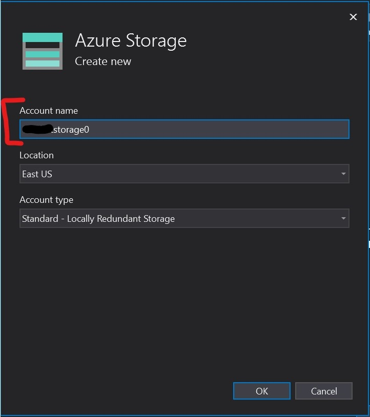
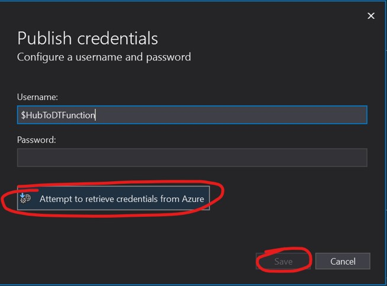

---
# Mandatory fields.
title: Send telemetry from IoT Hub
titleSuffix: Azure Digital Twins
description: Tutorial to send simulated telemetry to Azure Digital Twins from IoT Hub
author: baanders
ms.author: baanders # Microsoft employees only
ms.date: 4/7/2020
ms.topic: tutorial
ms.service: digital-twins

# Optional fields. Don't forget to remove # if you need a field.
# ms.custom: can-be-multiple-comma-separated
# ms.reviewer: MSFT-alias-of-reviewer
# manager: MSFT-alias-of-manager-or-PM-counterpart
---

### 2. Send simulated telemetry from IoT Hub

The next step, to bring your Digital Twins instance alive, is to simulate device telemetry from IoT Hub trigger an update to the Azure Digital Twins graph. You'll be completing this section of the pipeline


This step takes some time because you have to set up Azure resources and create connections. You will:
* Deploy a pre-made Functions App
* Assign an AAD Identity to the Function App
* Create an IoT Hub
* Create an event subscription from IoT Hub to the Functions App
* Create a device in IoT Hub
* Simulate the device telemetry using the *DeviceSimulator* project
* See the LIVE results in the *DigitalTwinsSample* project

#### Go to the *DigitalTwinsSample* project in Visual Studio

Navigate to *DigitalTwinsMetadata > DigitalTwinsSample > HubToDT >* **ProcessHubToDTEvents.cs**,  change `AdtInstanceUrl` to your Azure Digital Twins instance hostname
```
const string AdtInstanceUrl = "https://<your-Azure-Digital-Twins-instance-hostname>"
```
In the Solution Explorer, right click the **HubToDT project file** and click **Publish**


Select **Create Profile**


* Change the **Name** to a new value, *\<your-HubToDT-function>*
* Change the **Subscription** to *DigitalTwins-Dev-Test-26*
* Change the **Resource group** to *\<your-resource-group>*
* Create a new storage resource using the **New...** link
    
* Create a storage account with a new name (*\<your-storage-account>*) in the window that pops up and select **OK**
    
    - Save your function *Name* and your storage *Account name* from above. You will use them later.
* Select **Create** in the "App Service Create new" window
* Select **Publish** on the tab the opens in VS
    

You may see a popup like this, just select **Attempt to retrieve credentials from Azure** and **Save**

 
 
> [!TIP]
> If your Functions App doesn't deploy correctly, check out the **Publishing the Functions App isn't working** topic in **Troubleshooting** (at the end of this file)

#### Assign system-managed AAD identity to your function app on PowerShell. 

Enable the system-managed identity and get the *principalId* field.

```
az functionapp identity assign -g <your-resource-group> -n <your-HubToDT-function>
```

Use the *principalId* value from the response above to create the AAD role:

```
az dt rbac assign-role --assignee <principalId-value> --dt-name <your-Azure-Digital-Twins-instance> --role owner
```

#### Create your IoT Hub instance

```
az login
az account set --subscription <your-subscription-id>
az iot hub create --name <your-iothub> -g <your-resource-group> --sku S1
```

Save your IoT Hub's name. You will use it later.

#### Create an Event Subscription on your IoT Hub with the Functions App as an endpoint in Azure portal

In the [Azure portal](https://ms.portal.azure.com/#home), navigate to your recently created IoT Hub, select the *Events* blade and select *+ Event Subscription*


* ***Name**: <your-event-subscription>
* **Filter Event Types**: Device Telemetry
    
* Select the **Select an endpoint** link
* Fill out form based on your **Subscription**, **Resource group**, **Function app** and **Function** (it should auto-populate after selecting the subscription)
* Select **Confirm Selection**
    

#### Create a device in IoT Hub with the ID *thermostat67* in PowerShell

```bash
az iot hub device-identity create --device-id thermostat67 --hub-name <your-iothub> -g <your-resource-group>
```

> [!NOTE]
> IoT Hub device creation can be done in your solution, too. Refer to the sample in *DeviceSimulator > Program*, **CreateDeviceIdentity()**

#### Set up the device simulator to send data to your IoT Hub instance

Get the *hub connection-string* 

```bash
az iot hub show-connection-string -n <your-iothub>
```

 Get the *device connection-string* 
```bash
az iot hub device-identity show-connection-string --device-id thermostat67 --hub-name <your-iothub>
```

Launch Device Simulator > **DeviceSimulator.sln** in Visual Studio and change the following values in *DeviceSimulator > DeviceSimulator >* **AzureIoTHub.cs** with the value you got above

```bash
connectionString = <hub connection-string>
deviceConnectionString = <device connection-string>
```

#### Start the simulation and see the results

Start () the **DeviceSimulator** project in Visual Studio.

The following console should pop up with messages being sent. You won't need to do anything with this console.


Start () the **DigitalTwinsSample** project in Visual Studio

Run the following command in the new console that pops up.

```bash
cycleGetTwinById thermostat67
```

You should see the live updated temperatures *from your Azure Digital Twins instance* being logged to the console every 10 seconds.


