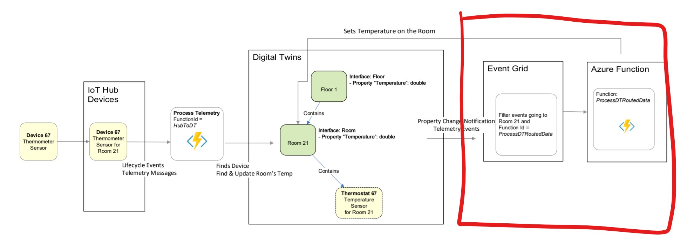
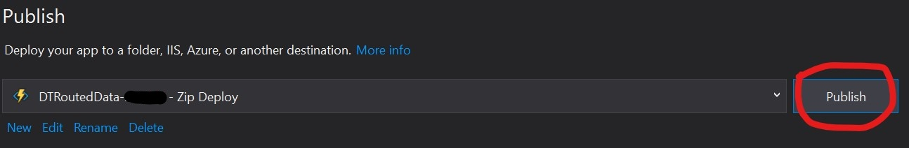

---
# Mandatory fields.
title: Handle events with an Azure Function app
titleSuffix: Azure Digital Twins
description: Tutorial to create an Azure Function app that handles Azure Digital Twins events
author: baanders
ms.author: baanders # Microsoft employees only
ms.date: 4/7/2020
ms.topic: tutorial
ms.service: digital-twins

# Optional fields. Don't forget to remove # if you need a field.
# ms.custom: can-be-multiple-comma-separated
# ms.reviewer: MSFT-alias-of-reviewer
# manager: MSFT-alias-of-manager-or-PM-counterpart
---


### 3. Handle events with an Azure Function app

Welcome to the final step of our Building Scenario! You'll be completing this section of the pipeline:

This step involves 
> - Creating an Azure Digital Twins endpoint to Event Grid
> - Setting up a route within Azure Digital Twins to send property change events to the Azure Digital Twins endpoint
> - Deploying a Functions App

#### Create an event grid topic, Azure Digital Twins endpoint and Azure Digital Twins route

Submit the following command in ::Windows Powershell:: to create the event grid topic
```
az eventgrid topic create -g <your-resource-group> --name <your-event-grid-topic> -l westcentralus
```
Create your Azure Digital Twins endpoint (`<your-adt-endpoint>`) pointing to your Event Grid topic, filling in the fields for your resource names and resource group
```
az dt endpoints add eventgrid --dt-name <your-adt-instance> --eventgrid-resource-group <your-resource-group> --eventgrid-topic <your-event-grid-topic> --endpoint-name <your-adt-endpoint>
```
Verify the "privisioningState" is "Succeeded"
```
az dt endpoints show --dt-name <your-adt-instance> --endpoint-name <your-adt-endpoint> 
```
<div style='background: #82CFFD; padding: 10px 15px; color:black;'>
  Save <b> &lt;your-event-grid-topic&gt; </b> and <b> &lt;your-adt-endpoint&gt; </b> from above in <i>SavedStrings.txt</i> at the root of the repo. You will use them later
</div>

Create an Azure Digital Twins route (`<your-adt-route>`) pointing to your Azure Digital Twins endpoint (`<your-adt-endpoint>`), filling in the fields for your resource names and resource group
```
az dt routes add --dt-name <your-adt-instance> --endpoint-name <your-adt-endpoint> --route-name <your-adt-route>
```

#### Deploy DTRoutedData function app

This Functions App is fired when events are emitted in Azure Digital Twins - it  updates the _Temperature_ field on the _Room_ twin.

Open the **DigitalTwinsSample** solution in ::Visual Studio::. 

Navigate to *DTRoutedData >* **ProcessDTRoutedData.cs**, change `adtInstanceUrl` to your Azure Digital Twins instance hostname
```
const string AdtInstanceUrl = "https://<your-adt-instance-hostname>"
```

Right-click the *ProcessDTRoutedData* project file in the **Solution Exporer** and select **Publish**


Select **Create profile**


* Fill in a new **Name** for the Functions App (*\<your-DTRoutedData-function>*) 
* **Subscription**: *DigitalTwins-Dev-Test-26*
* **Resource Group**: *\<your-resource-group>*
* **Azure Storage**: *\<your-azure-storage>


Select **Publish**


> If your Functions App doesn't deploy correctly, check out the **Publishing the Functions App isn't working** topic in **Troubleshooting** (at the end of this file)

#### Create an Event Grid subscription from your Event Grid topic to your *ProcessDTRoutedData* Azure function

In ::[Azure Portal - event grid topics](https://portal.azure.com/#blade/HubsExtension/BrowseResource/resourceType/Microsoft.EventGrid%2Ftopics)::, navigate to your event grid topic (*\<your-event-grid-topic>*) and select **+ Event Subscription**


Choose a new name for your Event grid subscription (*\<your-event-grid-subscription>*), select *Azure Function* for the **Event type** and select **Select an endpoint**


In the pane that appears, the fields should auto-populate. If not, fill in the field based on the function you just deployed
- **Subscription**: *\<your-subscription-id>*
- **Resource group** *\<your-resource-group>*
- **Function app** (*\<your-DTRoutedData-function>*
- **Function**: *ProcessDTRoutedData* 


Finally, select **Create** on the "Create Event Subscription" page.

#### Start the simulation and see the results

Start () the **DeviceSimulator** project in ::Visual Studio::.

The following console should pop up with messages being sent. You won't need to do anything with this console.


Start () the **DigitalTwinsSample** project in ::Visual Studio::

Run the following command in the new console that pops up.
```
cycleGetTwinById thermostat67 room21
```
You should see the 🌴 LIVE 🌲 updated temperatures 🌡 *from your Azure Digital Twins instance*. You'll notice you have both **thermostat67** and **room21** temperatures being updated.


You've completed this sample.