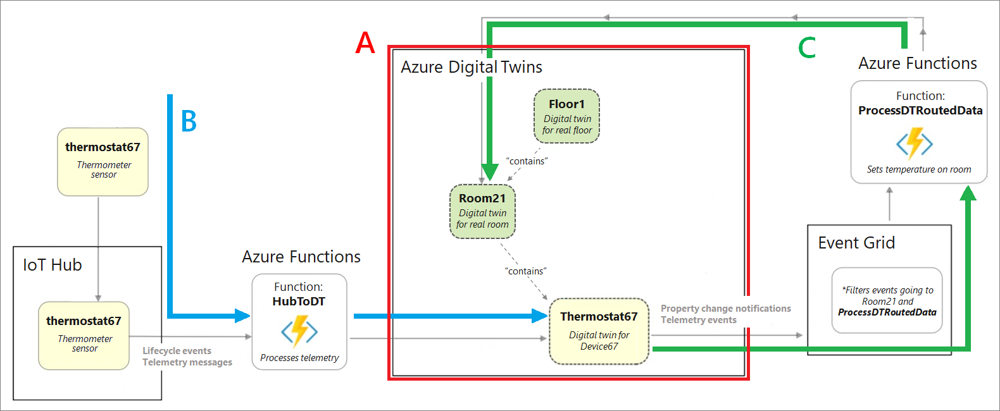
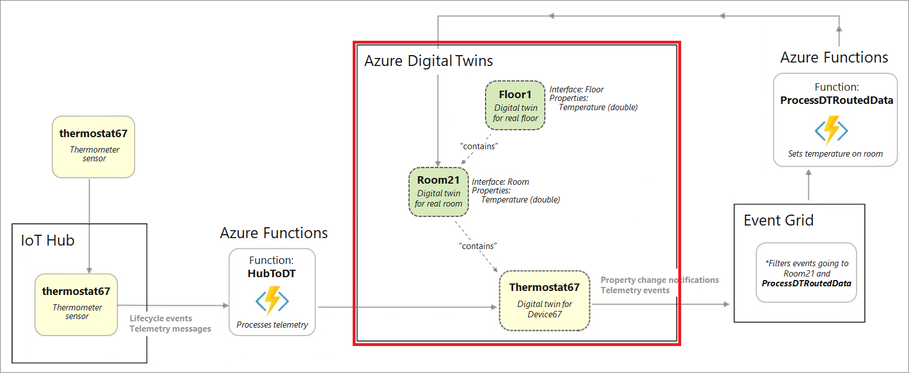
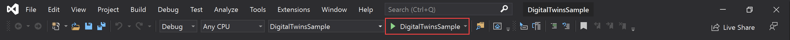
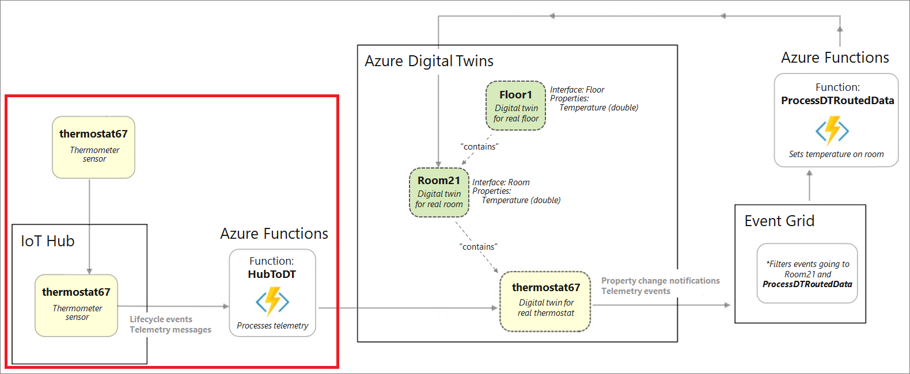
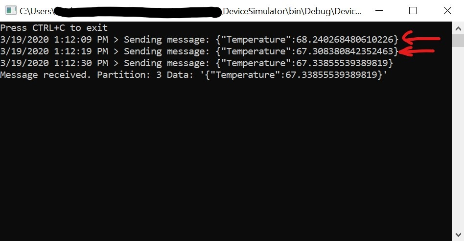
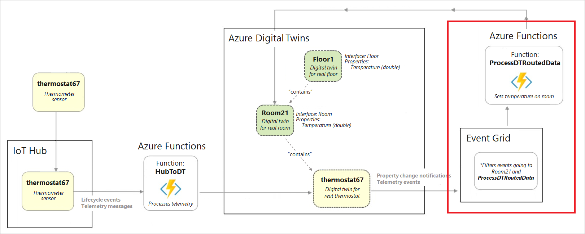
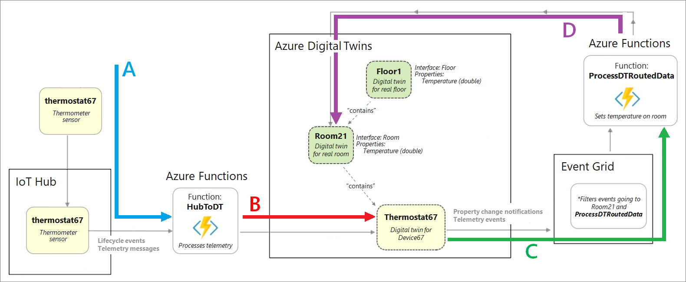

---
# Mandatory fields.
title: Connect your solution to other Azure services
titleSuffix: Azure Digital Twins
description: Tutorial to build out a sample Azure Digital Twins solution to update based on device data.
author: baanders
ms.author: baanders # Microsoft employees only
ms.date: 4/13/2020
ms.topic: tutorial
ms.service: digital-twins

# Optional fields. Don't forget to remove # if you need a field.
# ms.custom: can-be-multiple-comma-separated
# ms.reviewer: MSFT-alias-of-reviewer
# manager: MSFT-alias-of-manager-or-PM-counterpart
---

# Build out the end-to-end sample solution

This tutorial shows you how to set up an end-to-end solution by connecting your Azure Digital Twins instance to other Azure services.

The project uses a **building scenario** to build an Azure Digital Twins solution, representing a real-world building with a floor, a room and a thermostat device. You'll automate the sensors in the building, and create the following workflow to represent the entire scenario:



In this tutorial, you will...
* Instantiate Azure Digital Twins components for the building scenario (create models, create your graph with twins representing devices, rooms and floors)
* Route simulated device telemetry from IoT Hub through a Azure Functions app to update properties in your Azure Digital Twins instance |
* Process notifications from Azure Digital Twins using endpoints and routes, and aggregate all data for a floor |

[!INCLUDE [cloud-shell-try-it.md](../../includes/cloud-shell-try-it.md)]

## Prerequisites

This tutorial uses the Azure Digital Twins instance and configured sample project from the Azure Digital Twins [quickstart](quickstart.md). 

You should complete the quickstart through the "Configure the sample project" step, in order to set up an Azure Digital Twins workspace before continuing with this tutorial. (The final step in the quickstart, "Use the sample project to answer environment questions", is not required for this).

## Instantiate the building scenario

The remaining steps in this tutorial build out the details of the building scenario. This step focuses on this section:



In this tutorial, you will work with pre-written sample app to work with Azure Digital Twins. This app implements…
* Device authentication 
* Pre-generated AutoRest SDK
* SDK usage examples (in *CommandLoop.cs*)
* Console interface to call the Azure Digital Twins API
* *BuildingScenario* - A sample Azure Digital Twins solution
* *HubtToDT* - An Azure Functions app to update your Azure Digital Twins graph as a result of telemetry from IoT Hub
* *DTRoutedData* - An Azure Functions app to update your Azure Digital Twins graph according to Azure Digital Twins data 

Start () the *DigitalTwinsSample* project in Visual Studio. In the console that opens, run the following command to create a sample Azure Digital Twins solution.

`buildingScenario`

You can run the following command to see the new twins.

`queryTwins`

The sample project contains an interactive authorization piece. All you need to do for this is to **choose your account when prompted in the browser**.

## Send simulated telemetry from IoT Hub

The next step is to simulate device telemetry from IoT Hub, and trigger a corresponding update to the Azure Digital Twins graph. This step focuses on this section of the building scenario:



This step involves setting up Azure resources and creating connections to the Azure Digital Twins instance. Here are the steps involved:
* Deploy a pre-made Azure Functions app
* Assign an AAD Identity to the Function App
* Create an IoT Hub
* Create an event subscription from IoT Hub to the Azure Functions app
* Create a device in IoT Hub
* Simulate the device telemetry using the *DeviceSimulator* project
* See the live results in the *DigitalTwinsSample* project

### Publish the sample function app

This section creates the first component of the larger solution, an Azure Functions app to process IoT Hub data.
Open the *DigitalTwinsSample* project in Visual Studio.
Navigate to _DigitalTwinsMetadata > DigitalTwinsSample > HubToDT > **ProcessHubToDTEvents.cs**_, and change `AdtInstanceUrl` to your Azure Digital Twins instance hostname:

```csharp
const string AdtInstanceUrl = "https://<your-Azure-Digital-Twins-instance-hostname>"
```

In the Solution Explorer, right-select the **HubToDT project file** and hit **Publish**.


Select **Create Profile**, and fill the following fields.


* Change the **Name** to a new value, *<your-HubToDT-function>*
* Change the **Subscription** to *DigitalTwins-Dev-Test-26*
* Change the **Resource group** to *<your-resource-group>*
* Create a new storage resource using the **New...** link
  
* Create a storage account with a new name (*<your-storage-account>*) in the window that pops up and select **OK**
  
    - Save your function *Name* and your storage *Account name* from above. You will use them later.
* Select **Create** in the *App Service Create New* window
* Select **Publish** on the following page.
  

You may see a popup like this one. If so, select **Attempt to retrieve credentials from Azure** and **Save**.


 
> [!TIP]
> If your Azure Functions app doesn't deploy correctly, check out the **Publishing the Azure Functions app isn't working** topic in **Troubleshooting** (at the end of this file).

### Assign an AAD identity to the app

This step assigns a system-managed AAD identity to your function app. 

Open PowerShell or another command window. Use this command to enable the system-managed identity and get the *principalId* field:

```Azure CLI
az functionapp identity assign -g <your-resource-group> -n <your-HubToDT-function>
```

Use the *principalId* value in the following command to create the AAD role:
```Azure CLI
az dt rbac assign-role --assignee <principalId-value> --dt-name <your-Azure-Digital-Twins-instance> --role owner
```

### Create an IoT Hub instance

This section sets up an IoT Hub to organize devices and their data.

In your command window, log into Azure with the following commands:

```Azure CLI
az login
az account set --subscription <your-subscription-ID>
```

Next, use this command to create a new IoT hub:
```Azure CLI
az iot hub create --name <name-for-your-IoT-hub> -g <your-resource-group> --sku S1
```

Save your IoT Hub's name. You will use it later.

### Connect the IoT hub and the function app

This section creates an Event Subscription on your IoT Hub in Azure portal, using the Azure Functions app as an endpoint. This will enable data from IoT Hub to flow through the function app.

In the [Azure portal](https://ms.portal.azure.com/#home), navigate to your recently-created IoT Hub. Select the *Events* blade and select *+ Event Subscription*.


Fill the fields as follows:

* **Name**: *<your-event-subscription>*
* **Filter Event Types**: Device Telemetry
  
* Select the **Select an endpoint** link
* Fill in your **Subscription**, **Resource group**, **Function app** and **Function** (some of these should auto-populate after selecting the subscription)
* Select **Confirm Selection**
  

### Create a device in IoT Hub 

This section creates a device in IoT Hub with the ID *thermostat67*. This will be used in the remainder of this tutorial to simulate device data that drives the scenario.

Create a device with the following command:

```Azure CLI
az iot hub device-identity create --device-ID thermostat67 --hub-name <your-IoT-hub-name> -g <your-resource-group>
```

> [!NOTE]: 
> IoT Hub device creation can also be done from within your client app. For an example of this in your local project, see *DeviceSimulator > Program*, **CreateDeviceIdentity()**.

### Set up simulated data

Next, set up the device simulator to send data to your IoT Hub instance.

Begin by getting the connection string of your IoT Hub with this command:

```Azure CLI
az iot hub show-connection-string -n <your-IoT-hub-name>
```

Then, get the device's connection string with this command:

```Azure CLI
az iot hub device-identity show-connection-string --device-ID thermostat67 --hub-name <your-IoT-hub-name>
```

Next, edit the device simulator code in your local project to connect to this device and IoT Hub.
Launch _Device Simulator > **DeviceSimulator.sln**_ in Visual Studio. Change the following values in _DeviceSimulator > DeviceSimulator > **AzureIoTHub.cs**_ to the values you gathered above.

```csharp
connectionString = <hub connection-string>
deviceConnectionString = <device connection-string>
```

### Start the simulation

To see the results of the data simulation that you've set up, start () the **DeviceSimulator** project in Visual Studio. This will run the simulated device.

A console window will open and display the following messages that the device is sending to IoT Hub.


You don't need to do anything else in this console, but leave it running while you complete the next steps.

The Azure function published earlier listens to the IoT Hub data and sends it on to Azure Digital Twins.

To see the data from the Azure Digital Twins side, start () the **DigitalTwinsSample** project in Visual Studio. This will open a console for interacting with your Azure Digital Twins instance.

Run the following command in the new console:

```cmd
cycleGetTwinById thermostat67
```

You should see the live updated temperatures *from your Azure Digital Twins instance* being logged to the console every 10 seconds.


## Handle events with an Azure Functions app

The final step of the building scenario tutorial is to deploy an Azure Functions app that updates a *Room* twin when the connected *Thermostat* twin is updated. To do this, this section focuses on this part of the building scenario:



This step involves :
* Creating an Azure Digital Twins endpoint that connects to Event Grid
* Setting up a route within Azure Digital Twins to send property change events to the Azure Digital Twins endpoint
* Deploying an Azure Functions app to listen on the endpoint (through Event Grid) and update twins accordingly

### Create endpoints and routes

In this section, you create an event grid topic, Azure Digital Twins endpoint, and Azure Digital Twins route.

Run the following command in PowerShell or another command window to create an event grid topic:

```Azure CLI
az eventgrid topic create -g <your-resource-group> --name <name-for-your-event-grid-topic> -l westcentralus
```

Create an Azure Digital Twins endpoint (`<your-Azure-Digital-Twins-endpoint>`) pointing to your event grid topic, filling in the fields for your resource names and resource group

```Azure CLI
az dt endpoints add eventgrid --dt-name <your-Azure-Digital-Twins-instance> --eventgrid-resource-group <your-resource-group> --eventgrid-topic <your-event-grid-topic> --endpoint-name <name-for-your-Azure-Digital-Twins-endpoint>
```

Verify that the endpoint creation succeeded by running the following command. The value of `provisioningState` should be "Succeeded".

```Azure CLI
az dt endpoints show --dt-name <your-Azure-Digital-Twins-instance> --endpoint-name <your-Azure-Digital-Twins-endpoint> 
```

Take note of your endpoint name and your event grid topic name from this step. You will use them later.

Next, create an Azure Digital Twins route that points to your Azure Digital Twins endpoint from the previous step.

```Azure CLI
az dt routes add --dt-name <your-Azure-Digital-Twins-instance> --endpoint-name <your-Azure-Digital-Twins-endpoint> --route-name <name-for-your-Azure-Digital-Twins-route>
```

### Deploy Azure Functions app

This section publishes a pre-written Azure Functions app called **DTRoutedData**. The function app is fired when events are emitted in Azure Digital Twins, and it updates the *Temperature* field on the *Room* twin.

Open the **DigitalTwinsSample** solution in Visual Studio. 

Open _*DTRoutedData > **ProcessDTRoutedData.cs**_. Change `adtInstanceUrl` to your Azure Digital Twins instance hostname.

```csharp
const string AdtInstanceUrl = "https://<your-Azure-Digital-Twins-instance-hostname>"
```

Right-select the *ProcessDTRoutedData* project file in the **Solution Explorer**, and hit **Publish**.


In the publish dialog, select **Create profile**.


Fill the following details:
* A **Name** for the Azure Functions app (*<your-DTRoutedData-function>*) 
* **Subscription**: *DigitalTwins-Dev-Test-26*
* **Resource Group**: *<your-resource-group>*
* **Azure Storage**: *<your-azure-storage>*


Select **Publish**.


> [!TIP]
> If your Azure Functions app doesn't deploy correctly, check out the **Publishing the Azure Functions app isn't working** topic in **Troubleshooting** (at the end of this file).

### Connect the function to Event Grid

This step creates an Event Grid subscription, from your event grid topic to your *ProcessDTRoutedData* Azure function.

In [Azure portal - Event Grid Topics](https://portal.azure.com/#blade/HubsExtension/BrowseResource/resourceType/Microsoft.EventGrid%2Ftopics), navigate to your event grid topic and select **+ Event Subscription**.


Choose a new name for your Event grid subscription, select *Azure Function* for the **Event type**, and hit **Select an endpoint**.


In the pane that appears, the fields should auto-populate. If not, fill the fields based on the function you just deployed:
* **Subscription**: *<your-subscription-ID>*
* **Resource group** *<your-resource-group>*
* **Function app** (*<your-DTRoutedData-function>*
* **Function**: *ProcessDTRoutedData* 


Select **Create** on the *Create Event Subscription* page.

### Start the simulation

To see the results of the data simulation that you've set up, start () the **DeviceSimulator** project in Visual Studio.

A console window will open and display the following messages that the device is sending to IoT Hub.


You don't need to do anything else in this console, but leave it running while you complete the next steps.

The Azure function published earlier listens to the device data and uses it to update the temperature property on a *Room*.

To see the data from the Azure Digital Twins side, start () the **DigitalTwinsSample** project in Visual Studio

Run the following command in the new console.

```cmd
cycleGetTwinById thermostat67 room21
```

You should see the live updated temperatures *from your Azure Digital Twins instance* being logged to the console. You'll notice you have both **thermostat67** and **room21** temperatures being updated.


This completes the end-to-end scenario walkthrough.

## Review

Here is a review of what you completed in this scenario tutorial.

1. Simulated device telemetry events enter IoT Hub, are routed through Event Grid, and trigger the *HubToDT* Azure function (represented with **arrow A** on the diagram below)
2. The *HubToDT* Azure function calls the Azure Digital Twins API that sets a property on *thermostat67* (represented in red with **arrow B** on the diagram)
3. A "Property Change event" is routed to the event grid topic endpoint, and the Event Grid subscription triggers the *ProcessDTRoutedData* Azure Function (represented with **arrow C** on the diagram)
4. The *ProcessDTRoutedData* Azure function calls an Azure Digital Twins API that sets a property on *room21* (represented with **arrow D** on the diagram)




# Troubleshooting

This section contains some common issues you may run into while completing the above tutorial.

## Unable to publish the Azure Functions app

This issue occurs when users publish the *HubToDT* or *DTRoutedData* Azure Functions app; the function app appears to publish; and then in the Azure portal, the function isn't available.


Steps to resolve:
1. Make sure you've correctly updated the `AdtInstanceUrl` value (depending on the project, either in *DigitalTwinsMetadata > DigitalTwinsSample > HubToDT > ProcessHubToDTEvents* or *DigitalTwinsMetadata > DigitalTwinsSample > DTRoutedData > ProcessDTRoutedData*) before publishing
2. Delete your publish profiles for the Azure Functions app and re-publish, like this:

  

## Visual Studio error when running the project

Wehn running one of the projects in Visual Studio, you may see this error:


This usually means that your Visual Studio version is outdated.

Steps to resolve:
1. Update VS2019 to the latest version
2. Visit [this developer forum topic](https://social.msdn.microsoft.com/Forums/sqlserver/b5e60c0b-dcd1-49ae-b86a-9fd9dfe65b5a/the-target-process-exited-warning-popup-in-vs-2019) for more details about this error.

## Swagger is out of date

The latest Swagger can be found in this [GitHub repo](https://github.com/Azure/azure-digital-twins/tree/private-preview/OpenApiSpec).
The sample apps used in this tutorial should continue to be updated by the Azure Digital Twins team as the Swagger is updated.

If you encounter this issue, however, you can update the Swagger yourself using these steps:

1. In Powershell or another command window, install AutoRest:
  ```cmd/sh
  npm install -g autorest@2.0.4413 
  ```
2. Navigate to *DigitalTwinsMetadata > ADTApi >*, and replace the *digitaltwins.json* file with the updated Swagger from the repo above.
3. Run this command:
  ```cmd/sh
  autorest --input-file=digitaltwins.json --csharp --output-folder=ADTApi --add-credentials –azure-arm --namespace=ADTApi 
  ```
4. Delete the C# files and */Models* folder in *DigitalTwinsMetadata > ADTApi*. Copy in the output of your `autorest` command above (contents of *DigitalTwinsMetadata > ADTApi > ADTApi*).