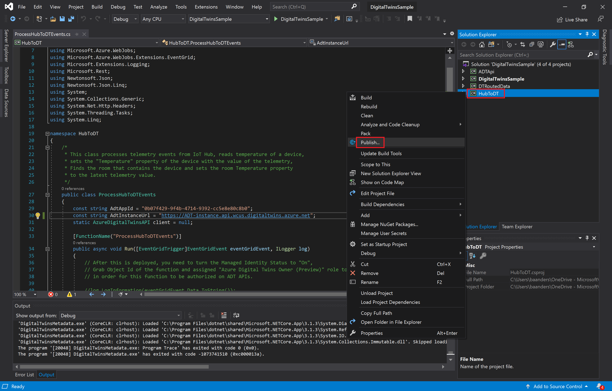
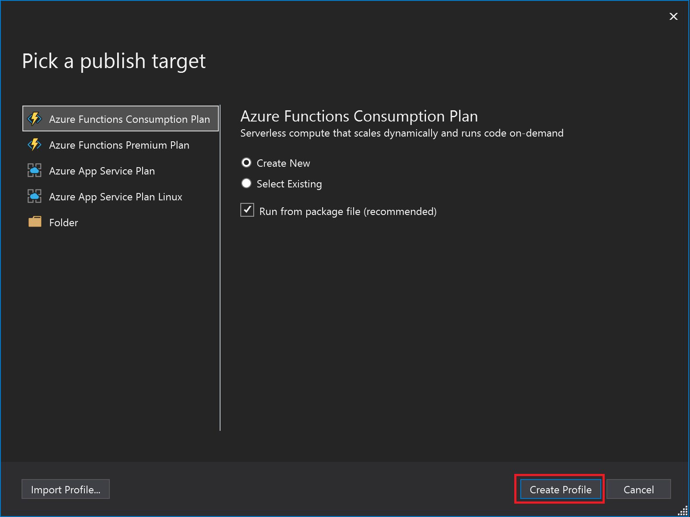
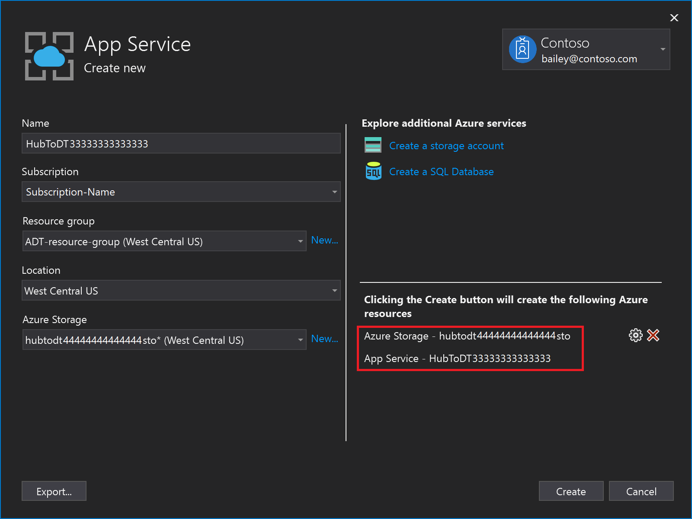
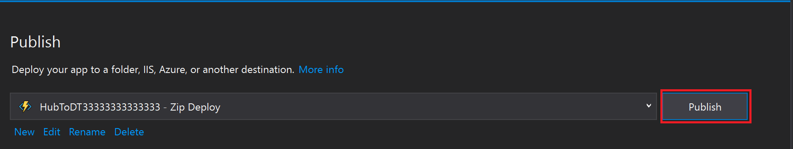
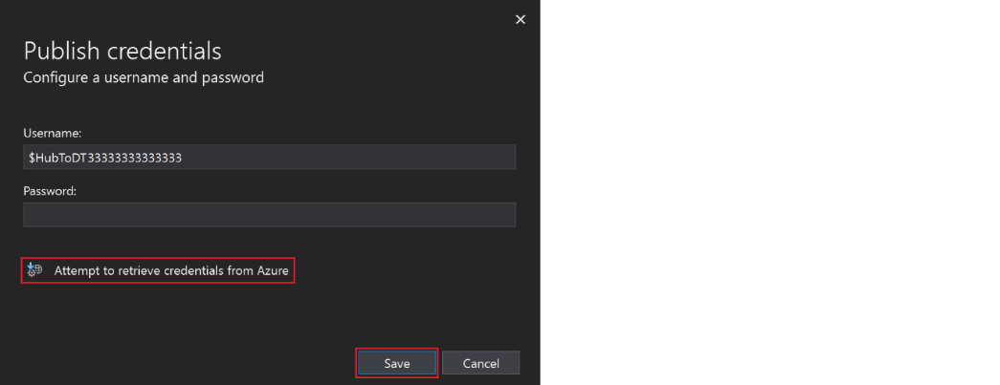
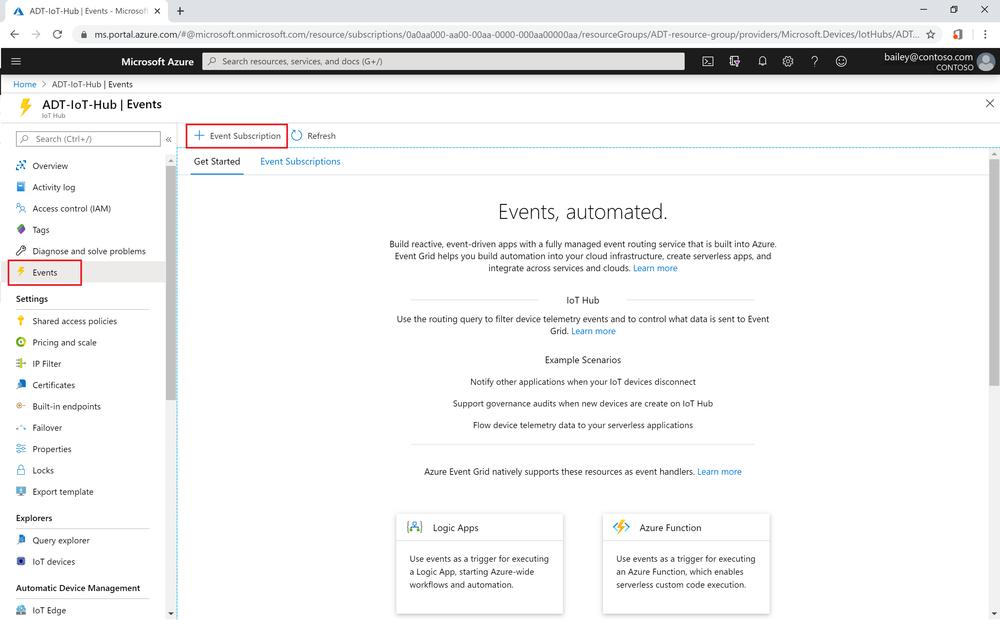
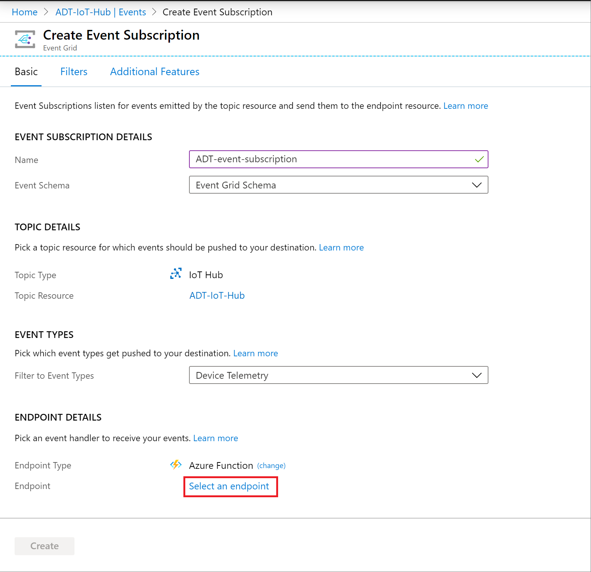
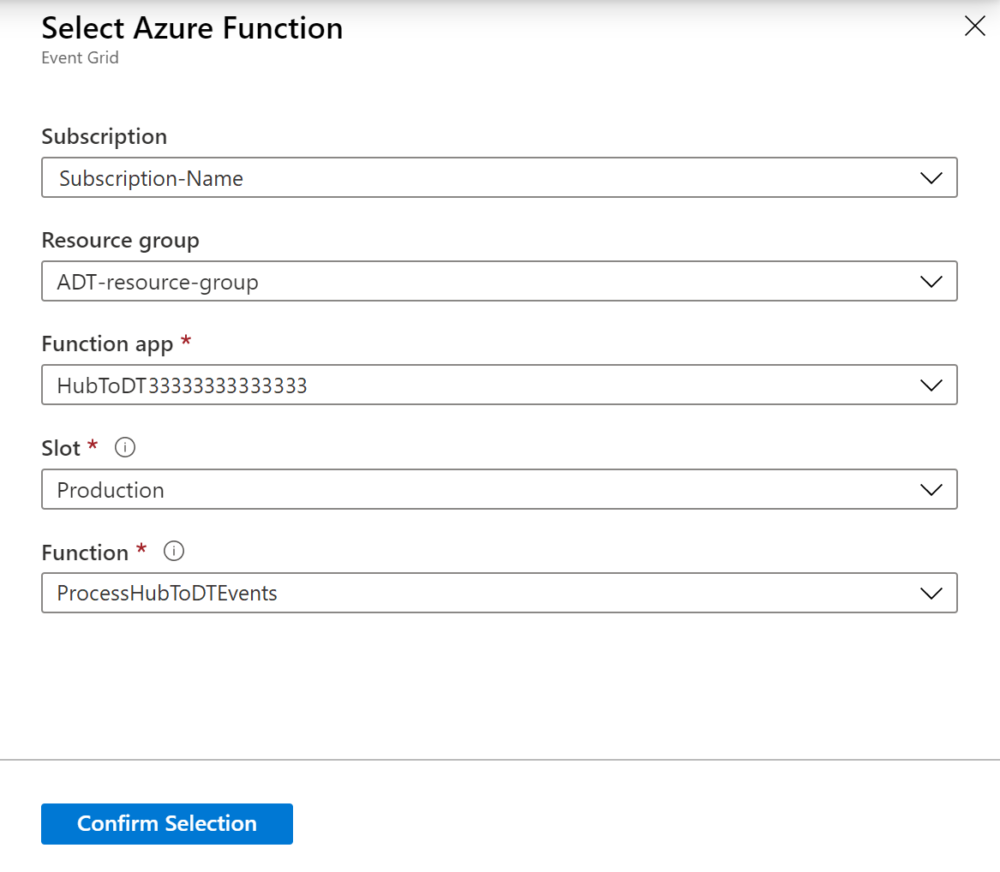
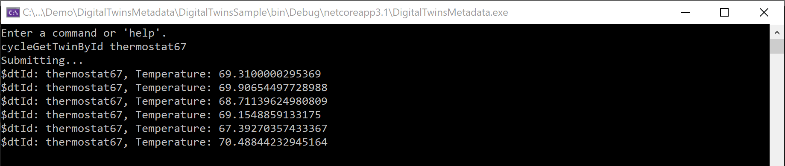

---
# Mandatory fields.
title: Connect your solution to other Azure services
titleSuffix: Azure Digital Twins
description: Tutorial to build out a sample Azure Digital Twins solution to update based on device data.
author: baanders
ms.author: baanders # Microsoft employees only
ms.date: 4/13/2020
ms.topic: tutorial
ms.service: digital-twins

# Optional fields. Don't forget to remove # if you need a field.
# ms.custom: can-be-multiple-comma-separated
# ms.reviewer: MSFT-alias-of-reviewer
# manager: MSFT-alias-of-manager-or-PM-counterpart
---

# Build out an end-to-end solution

To set up a full end-to-end solution driven by live data from your environment, you can connect your Azure Digital Twins instance to other Azure services for management of devices and data.

In this tutorial, you will...
* Learn about the sample building scenario and instantiate the pre-written components
* Use an Azure Functions app to route simulated telemetry from an IoT Hub device into digital twin properties
* Propagate changes through the twin graph, by processing digital twin notifications with endpoints and routes

[!INCLUDE [cloud-shell-try-it.md](../../includes/cloud-shell-try-it.md)]

## Prerequisites

This tutorial uses the Azure Digital Twins instance and configured sample project from the Azure Digital Twins [quickstart](quickstart.md). 

You should complete the quickstart through the "Configure the sample project" step, in order to set up an Azure Digital Twins workspace before continuing with this tutorial. (The final step in the quickstart, "Use the sample project to answer environment questions", is not required for this).

## Get started with the building scenario

The sample project used in this tutorial represents a real-world **building scenario**, containing a floor, a room, and a thermostat device. These components will be digitally represented in an Azure Digital Twins instance, which will then be connected to IoT Hub, Event Grid and two Azure Functions to facilitate movement of and responses to data.

Here is an overview of data flow through the entire scenario:


To work through the scenario, you will interact with components of a pre-written sample app. You downloaded and configured the app in the Azure Digital Twins [quickstart](quickstart.md); this tutorial goes more in-depth with the full code of the sample.

Here are the components implemented by the sample app:
* Device authentication 
* Pre-generated AutoRest SDK
* SDK usage examples (found in *CommandLoop.cs*)
* Console interface to call the Azure Digital Twins API
* *BuildingScenario* - A sample Azure Digital Twins solution
* *HubtToDT* - An Azure Functions app to update your Azure Digital Twins graph as a result of telemetry from IoT Hub
* *DTRoutedData* - An Azure Functions app to update your Azure Digital Twins graph according to Azure Digital Twins data 

The sample project also contains an interactive authorization component. Every time you start up the project, a browser window will open, prompting you to log in with your Azure account.

### Instantiate the pre-created twin graph

First, you'll use the *BuildingScenario* solution from the sample project to build the Azure Digital Twins piece of the end-to-end scenario:


Open _DigitalTwinsMetadata/**DigitalTwinsSample.sln**_ in Visual Studio. Run the project with this button in the toolbar:


A console window will open, carry out authentication, and wait for a command. In this console, run the following command to instantiate the sample Azure Digital Twins solution:

`buildingScenario`

The output of this command is a series of confirmation messages as three twins are created and connected in your Azure Digital Twins instance: a floor named *floor1*, a room named *room21*, and a temperature sensor named *thermostat67*. They are connected into the following graph:


You can verify the twins that were created by running the following command, which queries the connected Azure Digital Twins instance for all the digital twins it contains:

`queryTwins`

## Process simulated telemetry from an IoT Hub device

An Azure Digital Twins graph is meant to be driven by telemetry from real devices. 

In this step, you will connect a simulated thermostat device registered in IoT Hub to the digital twin that represents it in Azure Digital Twins. As the simulated device emits telemetry, the data will be directed through an Azure Functions app that triggers a corresponding update in the digital twin. In this way, the digital twin stays up to date with the real device's data.

This activity happens within this piece of the end-to-end scenario:


Here are the actions you will complete to set up this device connection:
1. Deploy the pre-written Azure Functions app that will update Azure Digital Twins with incoming data
2. Ensure the function app can access Azure Digital Twins by assigning it an Azure Active Directory (AAD) identity
3. Create an IoT hub that will manage the simulated device
4. Connect the IoT hub to the Azure Functions app by setting up an event subscription
5. Register the simulated device in IoT hub
6. Run the simulated device and generate telemetry
7. Query Azure Digital Twins to see the live results

### Publish the sample function app

The first part of this step is setting up an Azure Functions app that will be used to process IoT Hub data and update Azure Digital Twins accordingly. This tutorial uses the pre-written *HubtToDT* solution from the sample project.

To configure the sample app, you will need the *resourceGroup* and *hostName* of your Azure Digital Twins instance. You may have saved these values during the quickstart, or you can run this command in Azure Cloud Shell to see them outputted along with other properties of the instance: `az dt show --dt-name <your-Azure-Digital-Twins-instance>`.

From the downloaded solution folder, open _DigitalTwinsMetadata/**DigitalTwinsSample.sln**_ in Visual Studio. 
Open _HubToDT/**ProcessHubToDTEvents.cs**_ in the editing window, and change the value of `AdtInstanceUrl` to your Azure Digital Twins instance's *hostName*. 

```csharp
const string AdtInstanceUrl = "https://<your-Azure-Digital-Twins-instance-hostname>"
```

In the Solution Explorer menu, right-select the **HubToDT project file** and hit **Publish**.



In the *Pick a publish target* page that follows, leave the default selections and hit **Create Profile**.



On the *App Service - Create New* page, fill in the fields as follows:
* **Name** is the name of the behind-the-scenes consumption plan that Azure will use to host your Azure Functions app. You can choose your own unique value or leave the default suggestion.
* Make sure the **Subscription** matches the subscription you want to use 
* Change the **Resource group** to your instance's *resourceGroup*
* Select the **Location** that matches the location of your resource group
* Create a new **Azure Storage** resource using the *New...* link. Use the default values and hit "Ok".



Before you move on from this screen, take note of your *Azure Storage* account name and your *App Service* name. You will use these later.

Then, select **Create**.

On the *Publish* page that follows, check that all the information looks correct and select **Publish**.



> [!NOTE]
> You may see a popup like this: 
> 
> If so, select **Attempt to retrieve credentials from Azure** and **Save**.

### Assign permissions to the function app

To enable the function app to access Azure Digital Twins, the next step is to assign the app a system-managed AAD identity, and give this identity *owner* permissions in the Azure Digital Twins instance.

In Azure Cloud Shell, use the following command to create the system-managed identity. Take note of the *principalId* field in the output.

```azurecli-interactive
az functionapp identity assign -g <your-resource-group> -n <your-HubToDT-function>
```

Use the *principalId* value in the following command to assign the function app's identity to an AAD *owner* role:

```Azure CLI
az dt rbac assign-role --assignee <principal-ID> --dt-name <your-Azure-Digital-Twins-instance> --role owner
```

The result of this command is outputted information about the role assignment you've created. The funcions app now has permissions to access your Azure Digital Twins instance.

### Create an IoT Hub instance

Azure Digital Twins is designed to work alongside IoT Hub, an Azure service for managing devices and their data. In this step, you will set up an IoT hub that will manage the sample device in this tutorial.

In Azure Cloud Shell, use this command to create a new IoT hub:

```azurecli-interactive
az iot hub create --name <name-for-your-IoT-hub> -g <your-resource-group> --sku S1
```

The output of this command is information about the IoT hub that was created.

Save the name that you gave to your IoT hub. You will use it later.

### Connect the IoT hub to the function app

Next, connect your IoT hub to the function app you made earlier, so that data can flow from the device in IoT Hub through the function app, which updates Azure Digital Twins.

To do this, you'll create an **Event Subscription** on your IoT Hub, with the Azure Functions app as an endpoint. This "subscribes" the function app to events happening in IoT Hub.

In the [Azure portal](https://ms.portal.azure.com/), navigate to your newly-created IoT hub by searching for its name in the top search bar. Select *Events* from the hub menu, and select *+ Event Subscription*.



This will bring up the *Create Event Subscription* page.


Fill in the fields as follows:
* *EVENT SUBSCRIPTION DETAILS* > **Name**: Give a name to your event subscription.
* *EVENT TYPES* > **Filter to Event Types**: Select *Device Telemetry* from the menu options.
* *ENDPOINT DETAILS* > **Endpoint Type**: Select *Azure Function* from the menu options.
* *ENDPOINT DETAILS* > **Endpoint**: Hit the *Select an endpoint* link. This will open a *Select Azure Function* window:
    
    - Fill in your **Subscription**, **Resource group**, **Function app** and **Function**. Some of these may auto-populate after selecting the subscription.
    - Hit **Confirm Selection**

Back on the *Create Event Subscription* page, hit **Create**.

### Register the simulated device with IoT Hub 

This section creates a device representation in IoT Hub with the ID *thermostat67*. The simulated device will connect into this, and this is how telemetry events will go from the device into IoT Hub, where the subscribed Azure Functions app from the previous step is listening, ready to pick up the events and continue processing.

In Azure Cloud Shell, create a device in IoT Hub with the following command:

```azurecli-interactive
az iot hub device-identity create --device-id thermostat67 --hub-name <your-IoT-hub-name> -g <your-resource-group>
```

The output is information about the device that was created.

### Configure and run the simulation

Next, configure the device simulator to send data to your IoT Hub instance.

Begin by getting the *IoT hub connection string* with this command:

```Azure CLI
az iot hub show-connection-string -n <your-IoT-hub-name>
```

Then, get the *device connection string* with this command:

```Azure CLI
az iot hub device-identity show-connection-string --device-id thermostat67 --hub-name <your-IoT-hub-name>
```

You'll plug these values into the device simulator code in your local project to connect the simulator into this IoT hub and IoT hub device.

Open _Device Simulator > **DeviceSimulator.sln**_ in Visual Studio. Open _DeviceSimulator/**AzureIoTHub.cs**_ in the editing window, and change the following connection string values to the values you gathered above:

```csharp
connectionString = <Iot-hub-connection-string>
deviceConnectionString = <device-connection-string>
```

To see the results of the data simulation that you've set up, run the **DeviceSimulator** project with this button in the toolbar:


A console window will open and display simulated temperature telemetry messages. These are being sent to IoT Hub, where they are then picked up and processed by the Azure function.


You don't need to do anything else in this console, but leave it running while you complete the next steps.

### See the results in Azure Digital Twins

The Azure function published earlier listens to the IoT Hub data and sends it on to Azure Digital Twins.

To see the data from the Azure Digital Twins side, open _DigitalTwinsMetadata/**DigitalTwinsSample.sln**_ in a new Visual Studio window. Run the project with this button in the toolbar:


In the project console window that opens, run the following command to get the temperatures being reported by the digital twin *thermostat67*:

```cmd
cycleGetTwinById thermostat67
```

You should see the live updated temperatures *from your Azure Digital Twins instance* being logged to the console every 10 seconds.



## Propagate Azure Digital Twins events through the graph

In the previous section, you saw how Azure Digital Twins can be updated based on external device data. In this section, you see how changes to one digital twin can propagate through the Azure Digital Twins graph (updating twins based on service-internal data).

To do this, you will deploy an Azure Functions app that updates a *Room* twin when the connected *Thermostat* twin is updated. This happens within this piece of the end-to-end scenario:


Here are the actions you will complete to set up this data flow:
1. Create an Azure Digital Twins endpoint that connects to Event Grid
2. Set up a route within Azure Digital Twins to send property change events to the endpoint
3. Deploy an Azure Functions app that listens (through Event Grid) on the endpoint, and updates other twins accordingly
4. Run the simulated device and query Azure Digital Twins to see the live results

### Set up endpoint

In this section, you create an event grid topic, Azure Digital Twins endpoint, and Azure Digital Twins route.

Run the following command in PowerShell or another command window to create an event grid topic:

```Azure CLI
az eventgrid topic create -g <your-resource-group> --name <name-for-your-event-grid-topic> -l westcentralus
```

Create an Azure Digital Twins endpoint (`<your-Azure-Digital-Twins-endpoint>`) pointing to your event grid topic, filling in the fields for your resource names and resource group

```Azure CLI
az dt endpoints add eventgrid --dt-name <your-Azure-Digital-Twins-instance> --eventgrid-resource-group <your-resource-group> --eventgrid-topic <your-event-grid-topic> --endpoint-name <name-for-your-Azure-Digital-Twins-endpoint>
```

Verify that the endpoint creation succeeded by running the following command. The value of `provisioningState` should be "Succeeded".

```Azure CLI
az dt endpoints show --dt-name <your-Azure-Digital-Twins-instance> --endpoint-name <your-Azure-Digital-Twins-endpoint> 
```

Take note of your endpoint name and your event grid topic name from this step. You will use them later.

### Set up route

Next, create an Azure Digital Twins route that points to your Azure Digital Twins endpoint from the previous step.

```Azure CLI
az dt routes add --dt-name <your-Azure-Digital-Twins-instance> --endpoint-name <your-Azure-Digital-Twins-endpoint> --route-name <name-for-your-Azure-Digital-Twins-route>
```

### Deploy the Azure Functions app

This section publishes a pre-written Azure Functions app called **DTRoutedData**. The function app is fired when events are emitted in Azure Digital Twins, and it updates the *Temperature* field on the *Room* twin.

Open the **DigitalTwinsSample** solution in Visual Studio. 

Open _*DTRoutedData > **ProcessDTRoutedData.cs**_. Change `adtInstanceUrl` to your Azure Digital Twins instance hostname.

```csharp
const string AdtInstanceUrl = "https://<your-Azure-Digital-Twins-instance-hostname>"
```

Right-select the *ProcessDTRoutedData* project file in the **Solution Explorer**, and hit **Publish**.


In the publish dialog, select **Create profile**.


Fill the following details:
* A **Name** for the Azure Functions app (*<your-DTRoutedData-function>*) 
* **Subscription**: *DigitalTwins-Dev-Test-26*
* **Resource Group**: *<your-resource-group>*
* **Azure Storage**: *<your-azure-storage>*


Select **Publish**.


> [!TIP]
> If your Azure Functions app doesn't deploy correctly, check out the **Publishing the Azure Functions app isn't working** topic in **Troubleshooting** (at the end of this file).

#### Connect the function to Event Grid

This step creates an Event Grid subscription, from your event grid topic to your *ProcessDTRoutedData* Azure function.

In [Azure portal - Event Grid Topics](https://portal.azure.com/#blade/HubsExtension/BrowseResource/resourceType/Microsoft.EventGrid%2Ftopics), navigate to your event grid topic and select **+ Event Subscription**.


Choose a new name for your Event grid subscription, select *Azure Function* for the **Event type**, and hit **Select an endpoint**.


In the pane that appears, the fields should auto-populate. If not, fill the fields based on the function you just deployed:
* **Subscription**: *<your-subscription-ID>*
* **Resource group** *<your-resource-group>*
* **Function app** (*<your-DTRoutedData-function>*
* **Function**: *ProcessDTRoutedData* 


Select **Create** on the *Create Event Subscription* page.

### Run the simulation and see the results

To see the results of the data simulation that you've set up, start () the **DeviceSimulator** project in Visual Studio.

A console window will open and display the following messages that the device is sending to IoT Hub.


You don't need to do anything else in this console, but leave it running while you complete the next steps.

The Azure function published earlier listens to the device data and uses it to update the temperature property on a *Room*.

To see the data from the Azure Digital Twins side, start () the **DigitalTwinsSample** project in Visual Studio

Run the following command in the new console.

```cmd
cycleGetTwinById thermostat67 room21
```

You should see the live updated temperatures *from your Azure Digital Twins instance* being logged to the console. You'll notice you have both **thermostat67** and **room21** temperatures being updated.


This completes the end-to-end scenario walkthrough.

## Review

Here is a review of what you completed in this scenario tutorial.

1. Simulated device telemetry events enter IoT Hub, are routed through Event Grid, and trigger the *HubToDT* Azure function (represented with **arrow A** on the diagram below)
2. The *HubToDT* Azure function calls the Azure Digital Twins API that sets a property on *thermostat67* (represented in red with **arrow B** on the diagram)
3. A "Property Change event" is routed to the event grid topic endpoint, and the Event Grid subscription triggers the *ProcessDTRoutedData* Azure Function (represented with **arrow C** on the diagram)
4. The *ProcessDTRoutedData* Azure function calls an Azure Digital Twins API that sets a property on *room21* (represented with **arrow D** on the diagram)

