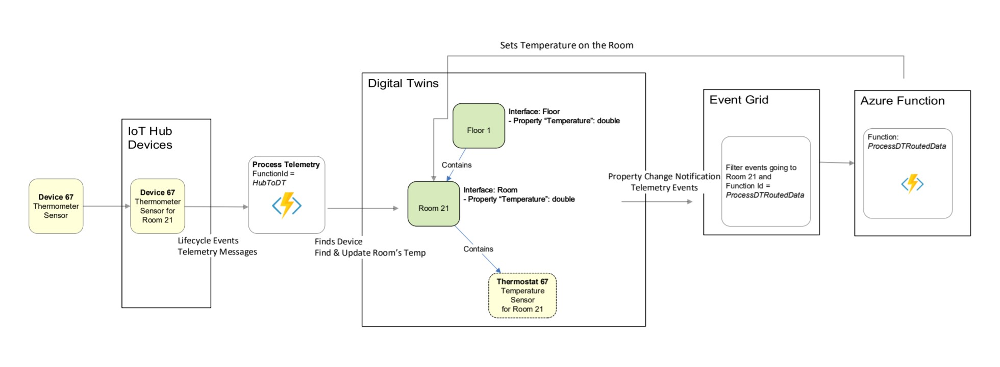
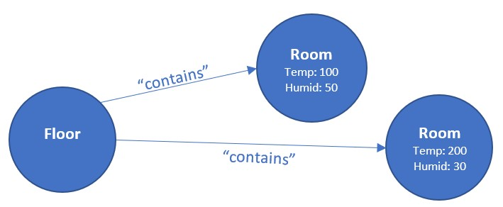

---
# Mandatory fields.
title: Build an end-to-end solution
titleSuffix: Azure Digital Twins
description: Tutorial to develop a full sample Azure Digital Twins solution.
author: baanders
ms.author: baanders # Microsoft employees only
ms.date: 4/10/2020
ms.topic: tutorial
ms.service: digital-twins

# Optional fields. Don't forget to remove # if you need a field.
# ms.custom: can-be-multiple-comma-separated
# ms.reviewer: MSFT-alias-of-reviewer
# manager: MSFT-alias-of-manager-or-PM-counterpart
---

## Develop your solution

This section introduces Azure Digital Twins commands and steps to develop a Digital Twins solution. 
**E2E building scenario** is a walk-through of a real-world building application using ADT. You'll create the following workflow that automates sensors in the building like this:



| E2E building scenario | Details |
|--- | --- |
| 0. Azure Digital Twins Basics | *(optional)* Familiarize yourself with how to create models/relationships/query - *not required for the following steps* |
| 1. Instantiate building scenario | Instantiate metadata for the building scenario (create models, create your graph with twins as devices, rooms and floors) |
| 2. Send simulated telemetry from IoT Hub | Route simulated device telemetry from IoT Hub to a Functions App to update properties in an Azure Digital Twins instance |
| 3. Set up an event handling Functions App | Process notifications from DT via endpoints and routes and aggregate data on floor level (again, reformulate to sound good) |

When you run the sample project, there will be interactive Authorization that runs. It's mainly automated, all you need to do is **choose your account when it prompts you in the browser**.

> [!IMPORTANT]
> Make sure to sign in with the AAD account associated with your subscription.

> [!TIP]
> If Visual Studio throws a .NET error, check out the **Visual Studio error when the project is run** topic in **Troubleshooting** (at the end of this file)

### 0. (a) Model a physical environment with DTDL

Models are the bread and butter of Digital Twins. They're very similar to classes in C# -- they're the skeleton of Twins (nodes in the graph). They're written in DTDL and have a structure like this Hospital.

```json
{
  "@id": "urn:example:Hospital:1",
  "@type": "Interface",
  "name": "Hospital",
  "contents": [
    {
      "@type": "Property",
      "name": "VisitorCount",
      "schema": "double"
    },
    {
      "@type": "Property",
      "name": "HandWashPercentage",
      "schema": "double"
    },
    {
      "@type": "Relationship",
      "name": "managedWards",
      "target": "*"
    }
  ],
  "@context": "http://azure.com/v3/contexts/Model.json"
}

```

You can find more sample models in */DigitalTwinsMetadata/DigitalTwinsSample/Models*.

#### How to test

1. Once you've checked out the sample models (and maybe even created your own!), start () the **DigitalTwinsSample** project. A console will pop up, device authentication will happen and some options are presented. 
2. Upload the models for Floor and Room.

 ```csharp
 addModels Floor Room
 ```

> [!NOTE]
> Notice that *Floor.json* and *Room.json* are in the */DigitalTwinsMetadata/DigitalTwinsSample/Models* folder

You can verify they were created with the `listModels` command. 

#### Variations

You'll notice that `addModels` is actually just calling _CommandLoop.SubmitAddModels_. Read the [DTDL technical deep dive](https://github.com/Azure/azure-digital-twins/blob/private-preview/Documentation/Digital%20Twins%20Definition%20Language%2C%20Version%202%2C%20Draft%202%2C%20NDA.pdf), twin types [concepts documentation](https://github.com/Azure/azure-digital-twins/blob/private-preview/Documentation/concepts-twin-types.md) and [how-to documentation](https://github.com/Azure/azure-digital-twins/blob/private-preview/Documentation/how-to-manage-twin-type.md), then try these variations.
* Create your own models
  - In the */DigitalTwinsMetadata/DigitalTwinsSample/Models* folder and upload them
* Update models
  - Edit *Floor.json* or *Room.json*, change the *@id* to `urn:example:<model-name>:2`
     * The "2" is the updated version number. Any number greater than the current version number will also work.
  - Edit by adding Properties or Relationships
* Try adding inheritance to your models

### 0. (b)  Create your graph with twins and relationships

Now that you have some models uploaded, you can create instances of those models which we've named "twins." Twins constitute the digital graph of your business environment, whether it's sensors on a farm, rooms in a building or lights in your car.

To create a twin, you must reference the model urn that the twin should relate to and define values for any properties in the model.  

#### How to test

1. Create twins using the *Floor* and *Room* models

Notice that *Room* has two properties and thus must accept initial values as arguments

```csharp
addTwin urn:example:Floor:1 floor0
addTwin urn:example:Room:1 room0 Temperature double 100 Humidity double 60
addTwin urn:example:Room:1 room1 Temperature double 200 Humidity double 30
```

1. Query your graph to verify the twins were created, using `queryTwins`
   - Notice that `queryTwins` allows you to input SQL-like queries as an argument, but leaving it blank executes a _SELECT * FROM DIGITALTWINS_ query.

2. Add a "contains" edge from the *Floor* twin to each of the *Room* twins
    ```csharp
    addEdge floor0 contains room0 edge0
    addEdge floor0 contains room1 edge1
    ```

3. Verify the edges were created, either of the following ways.
    ```csharp
    listEdges floor0
    ```
    or
    ```csharp
    getEdgeById floor0 contains edge0
    getEdgeById floor0 contains edge1
    ```

You've created the following graph.



#### Variations

Read the [twin graph concept documentation](https://github.com/Azure/azure-digital-twins/blob/private-preview/Documentation/concepts-twins-graph.md), [twin management how-to documentation](https://github.com/Azure/azure-digital-twins/blob/private-preview/Documentation/how-to-manage-twin.md) and [twin graph management how-to documentation](https://github.com/Azure/azure-digital-twins/blob/private-preview/Documentation/how-to-manage-graph.md), then try out these variations.

* Try deleting edges and twins 
   - To delete a twin using `deleteTwin`, you have to first delete the edges using `deleteEdge`
* Model any physical space (your apartment, a car, a hospital… anything!) 
   - Create your own models in */DigitalTwinsMetadata/DigitalTwinsSample/Models*, then use `uploadModel`, `createTwin`, and `addEdge` to create your graph

### 0. (c)  Query the twin graph

A large value prop for Azure Digital Twins is being able to query your graph easily and efficiently. With this querying, you can answer questions such as…
* Which twins have a Temperature property with a value of 200?
* Which twins are created from the Floor model?
* Which twins are contained in the Floor twin?

#### How to test

1. Query based on the Temperature property

`queryTwins SELECT * FROM DigitalTwins T WHERE T.Temperature = 200 `

2. Query based on the model urn

`queryTwins SELECT * FROM DIGITALTWINS T WHERE IS_OF_MODEL(T, 'urn:example:Floor:1')`

3. Query based on relationships (replace floor-twin-id with the $dtId for the Floor twin)

`queryTwins SELECT room FROM DIGITALTWINS floor JOIN room RELATED floor.contains where floor.$dtId = 'floor1'`

#### Variations

Read the [query language documentation](https://github.com/Azure/azure-digital-twins/blob/private-preview/Documentation/concepts-query-language.md) and [graph query how-to documentation](https://github.com/Azure/azure-digital-twins/blob/private-preview/Documentation/how-to-query-graph.md), then try these variations.

* Combine the above queries as you would with SQL, using combination operators such as `AND`, `OR`, `NOT`
* Test conditionals for properties 
   - Use `IN`, `NOT IN`, `STARTSWITH`, `ENDSWITH`, `=`, `!=`, `<`, `>`, `<=`, `>=`

#### Scenario introduction

Now that you've done all the Azure Digital Twins basics, let's dive into a real scenario. We're going to
* Create a graph in your Azure Digital Twins instance that models a building with a Floor, a Room and a Thermostat
* Simulate telemetry through IoT Hub to update the graph
* Deploy a Functions App that updates the Room model when the Thermostat model is updated

The image below indicates the entire pipeline that you're about to build.


### 1.  Instantiate the building scenario

In this step, you'll be creating this section of the pipeline


Start () the *DigitalTwinsSample* project in Visual Studio. In the console that pops up, run the following command.

> [!NOTE]
> This command will delete the twins in your instance and create a sample Azure Digital Twins solution.

`buildingScenario`

Twins have been deleted and new twins have been created. You can run the following command to see the new twins.

`queryTwins`
