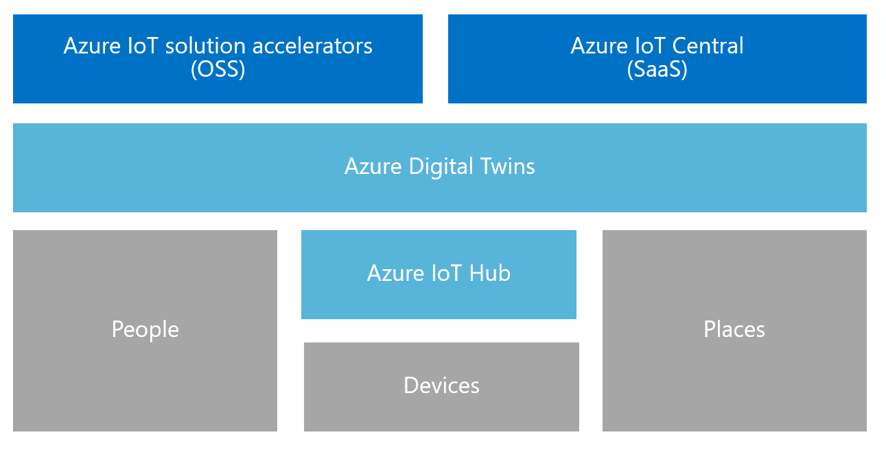

# Overview: What is Azure Digital Twins?

Azure Digital Twins is an Azure IoT service that powers creating comprehensive models of the physical environment. Among its many features, is the ability to create spatial intelligence graphs to model the relationships and interactions between people, spaces, and devices.

Azure Digital Twins allows querying data from a space rather than from many disparate sensors. Build reusable, highly scalable, spatially aware, experiences that link streaming data across the digital and physical world. Whether you are predicting maintenance needs for a factory, analyzing real-time energy requirements for an electrical grid, or optimizing the use of available space for an office, your apps are enhanced by these uniquely relevant contextual features.

Azure Digital Twins applies to environments of all kinds. For example: warehouses, offices, schools, hospitals, banks, stadiums, factories, parking lots, parks, smart grids, and cities. Use cases include tracking daily temperature across several states, monitoring busy drone paths, identifying autonomous vehicles, analyzing occupancy levels for a building, or finding the busiest cash register in your store. Whatever your real-world business scenario is, a corresponding digital instance can be provisioned through Azure Digital Twins.

The following video takes a deeper dive into Digital Twins:

> [!VIDEO https://www.microsoft.com/videoplayer/embed/RE2EU76]

## Key Capabilities

Key capabilities of Azure Digital Twins include:

### Spatial intelligence graph

The [spatial intelligence graph](./concepts-objectmodel-spatialgraph.md) is a virtual representation of the physical environment that enables you to model the relationships between people, places, and devices.

Consider a smart utility app that might involve several electricity usage meters connected across a neighborhood. To accurately monitor and predict electricity usage and billing, the smart utility company must model each device and sensor with context about the location and the customer that will be billed. The spatial intelligence graph enables you to model these kinds of complex relationships.

### Digital twin object models

[Digital twin object models](./concepts-objectmodel-spatialgraph.md) are pre-defined device protocols and data schema that are aligned your solution’s domain-specific needs to accelerate and simplify development.

For example, a room occupancy application could use pre-defined space types such as campus, building, floor, room, etc.

### Multi- and nested- tenancy

You can build solutions that scale securely and which can be reused for multiple tenants. You can also create multiple subtenants that can be accessed and used in an isolated and secure manner.

Think how a space utilization app could be configured to isolate a tenant's data from other tenant data within a single building, or to combine data for a single tenant with multiple buildings.

### Advanced compute capabilities

Advanced compute capabilities called [user-defined functions](./concepts-user-defined-functions.md) let you define and run custom functions against incoming [telemetry messages](./concepts-device-ingress.md) to send signals to pre-defined endpoints. This capability improves customization and automation of device tasks.

For example, a smart agriculture application could include a user-defined function that runs logic based on soil moisture sensor readings and the weather forecast, then sends signals.

### Built-in access control

Access and identity management features such as [role-based access control](./security-role-based-access-control.md) and [Azure Active Directory](./security-authenticating-apis.md) enable you to securely control individuals’ and devices’ access.

For example, a facilities management app could be configured to allow occupants of a room to set the temperature within a specified range, and facilities managers to set the temperature in any room to any value.

### Ecosystem

You can connect an Azure Digital Twins instance to many powerful Azure services including: Azure Stream Analytics, AI, and Storage services, as well as Azure Maps, Microsoft Mixed Reality, Dynamics 365, or Office 365.

For example, a smart office building application could use Azure Digital Twins to represent teams and devices located on many floors. As devices stream live data into the provisioned Digital Twin instance, Azure Stream Analytics can process that data to provide actionable key insights. Then, the data can be stored in Azure Storage and converted into a shareable file format to be distributed across the whole organization in Office 365.

## Solutions that benefit from Azure Digital Twins

Azure Digital Twins is useful for representing the physical world and its many relationships since it simplifies IoT modeling, data processing, event handling, and device tracking. Consider just a few of the following scenarios, across several industries, that benefit from its use:

* Showing a property management company the occupancy levels of a space over time to glean insights about the best ways to configure its office building.
* Triggering work order tickets for a mobile app that drives security guard dispatch, janitorial services scheduling, and any other services in a retail space or sports venue.
* Showing a building occupant which rooms are occupied in a building in real-time. Then, helping the occupant reserve workspaces that fit their needs.
* Tracking where assets are located within a space.
* Optimizing electric vehicle charging my modeling user preferences and energy-grid constraints.

## Azure Digital Twins in the context of other IoT Services

Azure Digital Twins uses Azure IoT Hub to connect the IoT devices and sensors that keep everything up-to-date with the physical world. The following diagram shows how Azure Digital Twins relates to other Azure IoT services:

For a more detailed description about the rest of the IoT ecosystem, see [Azure IoT technologies and solutions](https://docs.microsoft.com/azure/iot-fundamentals/iot-services-and-technologies).

## Next steps

Learn about core Azure Digital Twins concepts:

> [!div class="nextstepaction"]
> [Understanding the Digital Twins Object Model and Spatial Intelligence Graph](./concepts-objectmodel-spatialgraph.md)
  
> [!div class="nextstepaction"]
> [Digital Twins Security Best Practices](./security-best-practices.md)
