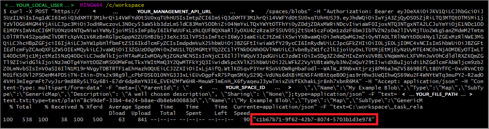

# Add blobs to objects in Azure Digital Twins

Blobs are unstructured representations of common file types, like pictures and logs. Blobs track what kind of data they represent by using a MIME type (for example: "image/jpeg") and metadata (name, description, type, and so on).

Azure Digital Twins supports attaching blobs to devices, spaces, and users. Blobs can represent a profile picture for a user, a device photo, a video, a map, a firmware zip, JSON data, a log, etc.

[!INCLUDE [Digital Twins Management API familiarity](../../includes/digital-twins-familiarity.md)]

## Uploading blobs overview

You can use multipart requests to upload blobs to specific endpoints and their respective functionalities.

[!INCLUDE [Digital Twins multipart requests](../../includes/digital-twins-multipart.md)]

### Blob metadata

In addition to **Content-Type** and **Content-Disposition**, Azure Digital Twins blob multipart requests must specify the correct JSON body. Which JSON body to submit depends on the kind of HTTP request operation that's being performed.

The four main JSON schemas are:

[](media/how-to-add-blobs/blob-models-img.png#lightbox)

JSON blob metadata conforms to the following model:

```JSON
{
    "parentId": "00000000-0000-0000-0000-000000000000",
    "name": "My First Blob",
    "type": "Map",
    "subtype": "GenericMap",
    "description": "A well chosen description",
    "sharing": "None"
  }
```

| Attribute | Type | Description |
| --- | --- | --- |
| **parentId** | String | The parent entity to associate the blob with (spaces, devices, or users) |
| **name** |String | A human-friendly name for the blob |
| **type** | String | The type of blob - cannot use *type* and *typeId*  |
| **typeId** | Integer | The blob type ID - cannot use *type* and *typeId* |
| **subtype** | String | The blob subtype - cannot use *subtype* and *subtypeId* |
| **subtypeId** | Integer | The subtype ID for the blob - cannot use *subtype* and *subtypeId* |
| **description** | String | Customized description of the blob |
| **sharing** | String | Whether the blob can be shared - enum [`None`, `Tree`, `Global`] |

Blob metadata is always supplied as the first chunk with **Content-Type** `application/json` or as a `.json` file. File data is supplied in the second chunk and can be of any supported MIME type.

The Swagger documentation describes these model schemas in full detail.

[!INCLUDE [Digital Twins Swagger](../../includes/digital-twins-swagger.md)]

Learn about using the reference documentation by reading [How to use Swagger](./how-to-use-swagger.md).

<div id="blobModel"></div>

### Blobs response data

Individually returned blobs conform to the following JSON schema:

```JSON
{
  "id": "00000000-0000-0000-0000-000000000000",
  "name": "string",
  "parentId": "00000000-0000-0000-0000-000000000000",
  "type": "string",
  "subtype": "string",
  "typeId": 0,
  "subtypeId": 0,
  "sharing": "None",
  "description": "string",
  "contentInfos": [
    {
      "type": "string",
      "sizeBytes": 0,
      "mD5": "string",
      "version": "string",
      "lastModifiedUtc": "2019-01-12T00:58:08.689Z",
      "metadata": {
        "additionalProp1": "string",
        "additionalProp2": "string",
        "additionalProp3": "string"
      }
    }
  ],
  "fullName": "string",
  "spacePaths": [
    "string"
  ]
}
```

| Attribute | Type | Description |
| --- | --- | --- |
| **id** | String | The unique identifier for the blob |
| **name** |String | A human-friendly name for the blob |
| **parentId** | String | The parent entity to associate the blob with (spaces, devices, or users) |
| **type** | String | The type of blob - cannot use *type* and *typeId*  |
| **typeId** | Integer | The blob type ID - cannot use *type* and *typeId* |
| **subtype** | String | The blob subtype - cannot use *subtype* and *subtypeId* |
| **subtypeId** | Integer | The subtype ID for the blob - cannot use *subtype* and *subtypeId* |
| **sharing** | String | Whether the blob can be shared - enum [`None`, `Tree`, `Global`] |
| **description** | String | Customized description of the blob |
| **contentInfos** | Array | Specifies unstructured metadata information including version |
| **fullName** | String | The full name of the blob |
| **spacePaths** | String | The space path |

Blob metadata is always supplied as the first chunk with **Content-Type** `application/json` or as a `.json` file. File data is supplied in the second chunk and can be of any supported MIME type.

### Blob multipart request examples

[!INCLUDE [Digital Twins Management API](../../includes/digital-twins-management-api.md)]

To upload a text file as a blob and associate it with a space, make an authenticated HTTP POST request to:

```plaintext
YOUR_MANAGEMENT_API_URL/spaces/blobs
```

With the following body:

```plaintext
--USER_DEFINED_BOUNDARY
Content-Type: application/json; charset=utf-8
Content-Disposition: form-data; name="metadata"

{
  "ParentId": "54213cf5-285f-e611-80c3-000d3a320e1e",
  "Name": "My First Blob",
  "Type": "Map",
  "SubType": "GenericMap",
  "Description": "A well chosen description",
  "Sharing": "None"
}
--USER_DEFINED_BOUNDARY
Content-Disposition: form-data; name="contents"; filename="myblob.txt"
Content-Type: text/plain

This is my blob content. In this case, some text, but I could also be uploading a picture, an JSON file, a firmware zip, etc.

--USER_DEFINED_BOUNDARY--
```

| Value | Replace with |
| --- | --- |
| USER_DEFINED_BOUNDARY | A multipart content boundary name |

The following code is a .NET implementation of the same blob upload, using the class [MultipartFormDataContent](https://docs.microsoft.com/dotnet/api/system.net.http.multipartformdatacontent):

```csharp
//Supply your metadata in a suitable format
var multipartContent = new MultipartFormDataContent("USER_DEFINED_BOUNDARY");

var metadataContent = new StringContent(JsonConvert.SerializeObject(metaData), Encoding.UTF8, "application/json");
metadataContent.Headers.ContentType = MediaTypeHeaderValue.Parse("application/json; charset=utf-8");
multipartContent.Add(metadataContent, "metadata");

//MY_BLOB.txt is the String representation of your text file
var fileContents = new StringContent("MY_BLOB.txt");
fileContents.Headers.ContentType = MediaTypeHeaderValue.Parse("text/plain");
multipartContent.Add(fileContents, "contents");

var response = await httpClient.PostAsync("spaces/blobs", multipartContent);
```

Lastly, [cURL](https://curl.haxx.se/) users can make multipart form requests in the same manner:

[](media/how-to-add-blobs/curl-img.png#lightbox)

```bash
curl
 -X POST "YOUR_MANAGEMENT_API_URL/spaces/blobs"
 -H "Authorization: Bearer YOUR_TOKEN"
 -H "Accept: application/json"
 -H "Content-Type: multipart/form-data"
 -F "meta={\"ParentId\": \"YOUR_SPACE_ID\",\"Name\":\"My CURL Blob",\"Type\":\"Map\",\"SubType\":\"GenericMap\",\"Description\": \"A well chosen description\", \"Sharing\": \"None\"};type=application/json"
 -F "text=PATH_TO_FILE;type=text/plain"
```

| Value | Replace with |
| --- | --- |
| YOUR_TOKEN | Your valid OAuth 2.0 token |
| YOUR_SPACE_ID | The ID of the space to associate the blob with |
| PATH_TO_FILE | The path to your text file |

A successful POST returns the ID of the new the blob (highlighted in red earlier).

## API endpoints

The following sections describe the core blob-related API endpoints and their functionalities.

### Devices

You can attach blobs to devices. The following image shows the Swagger reference documentation for your Management APIs. It specifies device-related API endpoints for blob consumption and any required path parameters to pass into them.

[](media/how-to-add-blobs/blobs-device-api-img.png#lightbox)

For example, to update or create a blob and attach the blob to a device, make an authenticated HTTP PATCH request to:

```plaintext
YOUR_MANAGEMENT_API_URL/devices/blobs/YOUR_BLOB_ID
```

| Parameter | Replace with |
| --- | --- |
| *YOUR_BLOB_ID* | The desired blob ID |

Successful requests return a JSON object as [described earlier](#blobModel).

### Spaces

You can also attach blobs to spaces. The following image lists all space API endpoints responsible for handling blobs. It also lists any path parameters to pass into those endpoints.

[](media/how-to-add-blobs/blobs-space-api-img.png#lightbox)

For example, to return a blob attached to a space, make an authenticated HTTP GET request to:

```plaintext
YOUR_MANAGEMENT_API_URL/spaces/blobs/YOUR_BLOB_ID
```

| Parameter | Replace with |
| --- | --- |
| *YOUR_BLOB_ID* | The desired blob ID |

Successful requests return a JSON object as [described earlier](#blobModel).

A PATCH request to the same endpoint updates metadata descriptions and creates versions of the blob. The HTTP request is made through the PATCH method, along with any necessary meta, and multipart form data.

### Users

You can attach blobs to user models (for example, to associate a profile picture). The following image shows relevant user API endpoints and any required path parameters, like `id`:

[](media/how-to-add-blobs/blobs-users-api-img.png#lightbox)

For example, to fetch a blob attached to a user, make an authenticated HTTP GET request with any required form data to:

```plaintext
YOUR_MANAGEMENT_API_URL/users/blobs/YOUR_BLOB_ID
```

| Parameter | Replace with |
| --- | --- |
| *YOUR_BLOB_ID* | The desired blob ID |

Successful requests return a JSON object as [described earlier](#blobModel).

## Common errors

A common error involves not supplying the correct header information:

```JSON
{
    "error": {
        "code": "400.600.000.000",
        "message": "Invalid media type in first section."
    }
}
```

To resolve this error, verify that the overall request has an appropriate **Content-Type** header:

* `multipart/mixed`
* `multipart/form-data`

Also, verify that each multipart chunk has a corresponding **Content-Type** as needed.

## Next steps

- To learn more about Swagger reference documentation for Azure Digital Twins, read [Use Azure Digital Twins Swagger](how-to-use-swagger.md).

- To upload blobs through Postman, read [How to configure Postman](./how-to-configure-postman.md).