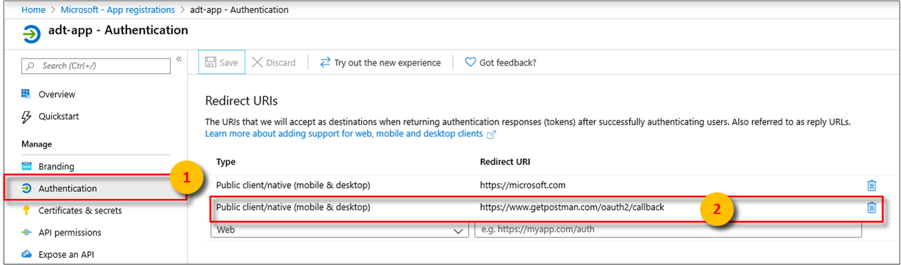
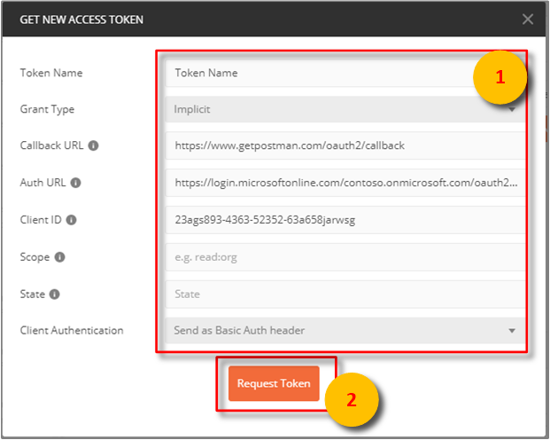
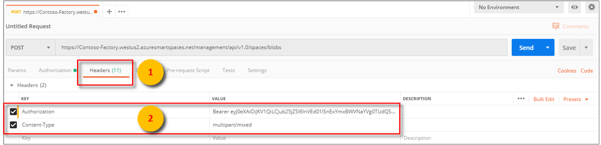

# How to configure Postman for Azure Digital Twins

This article describes how to configure the Postman REST client to interact with and test the Azure Digital Twins Management APIs. Specifically, it describes:

* How to configure an Azure Active Directory application to use the OAuth 2.0 implicit grant flow.
* How to use the Postman REST client to make token-bearing HTTP requests to your Management APIs.
* How to use Postman to make multipart POST requests to your Management APIs.

## Postman summary

Get started on Azure Digital Twins by using a REST client tool such as [Postman](https://www.getpostman.com/) to prepare your local testing environment. The Postman client helps to quickly create complex HTTP requests. Download the desktop version of the Postman client by going to [www.getpostman.com/apps](https://www.getpostman.com/apps).

[Postman](https://www.getpostman.com/) is a REST testing tool that locates key HTTP request functionalities into a useful desktop and plugin-based GUI.

Through the Postman client, solutions developers can specify the kind of HTTP request (*POST*, *GET*, *UPDATE*, *PATCH*, and *DELETE*), API endpoint to call, and use of TLS. Postman also supports adding HTTP request headers, parameters, form-data, and bodies.

## Configure Azure Active Directory to use the OAuth 2.0 implicit grant flow

1. Follow the steps in [the Quickstart](quickstart-view-occupancy-dotnet.md#set-permissions-for-your-app) to create and configure an Azure Active Directory application. Alternatively, you can reuse an existing app registration.

    [](media/how-to-configure-postman/authentication-redirect-uri.png#lightbox)

1. Now, add a **Redirect URI** to `https://www.getpostman.com/oauth2/callback`.

1. Select the **Implicit grant** > **Access tokens** check box to allow the OAuth 2.0 implicit grant flow to be used. Select **Configure**, then **Save**.

1. Copy the **Client ID** of your Azure Active Directory app.

## Obtain an OAuth 2.0 token

[!INCLUDE [digital-twins-management-api](../../includes/digital-twins-management-api.md)]

Set up and configure Postman to obtain an Azure Active Directory token. Afterwards, make an authenticated HTTP request to Azure Digital Twins using the acquired token:

1. Verify that your **Authorization URL** is correct. It should take the format:

    ```plaintext
    https://login.microsoftonline.com/YOUR_AZURE_TENANT.onmicrosoft.com/oauth2/authorize?resource=0b07f429-9f4b-4714-9392-cc5e8e80c8b0
    ```

    | Name  | Replace with | Example |
    |---------|---------|---------|
    | YOUR_AZURE_TENANT | The name of your tenant or organization. Use the human-friendly name instead of the alphanumeric **Tenant ID** of your Azure Active Directory app registration. | `microsoft` |

1. Go to [www.getpostman.com](https://www.getpostman.com/) to download the app.

1. We want to make GET request. Select the **Authorization** tab, select OAuth 2.0, and then select **Get New Access Token**.

    | Field  | Value |
    |---------|---------|
    | Grant Type | `Implicit` |
    | Callback URL | `https://www.getpostman.com/oauth2/callback` |
    | Auth URL | Use the **Authorization URL** from **step 1** |
    | Client ID | Use the **Application ID** for the Azure Active Directory app that was created or reused from the previous section |
    | Scope | Leave blank |
    | State | Leave blank |
    | Client Authentication | `Send as Basic Auth header` |

1. The client should now appear as:

    [](media/how-to-configure-postman/configure-postman-oauth-token.png#lightbox)

1. Select **Request Token**.
  
1. Scroll down, and select **Use Token**.

## Make a multipart POST request

After completing the previous steps, configure Postman to make an authenticated HTTP multipart POST request:

1. Under the **Headers** tab, add an HTTP request header key **Content-Type** with value `multipart/mixed`.

   [](media/how-to-configure-postman/configure-postman-content-type.png#lightbox)

1. Serialize non-text data into files. JSON data would be saved as a JSON file.
1. Under the **Body** tab, select `form-data`. 
1. Add each file by assigning a **key** name, selecting `File`.
1. Then, select each file through the **Choose File** button.

   [](media/how-to-configure-postman/configure-postman-form-body.png#lightbox)

   >[!NOTE]
   > * The Postman client does not require that multipart chunks have a manually assigned **Content-Type** or **Content-Disposition**.
   > * You do not need to specify those headers for each part.
   > * You must select `multipart/mixed` or another appropriate  **Content-Type** for the entire request.

1. Lastly, select **Send** to submit your multipart HTTP POST request. A status code of `200` or `201` indicates a successful request. The appropriate response message will appear in the client interface.

1. Validate your HTTP POST request data by calling the API endpoint: 

   ```URL
   YOUR_MANAGEMENT_API_URL/spaces/blobs?includes=description
   ```

## Next steps

- To learn about the Digital Twins management APIs, and how to use them, read [How to use Azure Digital Twins management APIs](how-to-navigate-apis.md).

- Use multipart requests to [add blobs to Azure Digital Twins' entities](./how-to-add-blobs.md).

- To learn about authenticating with the Management APIs, read [Authenticate with APIs](./security-authenticating-apis.md).
