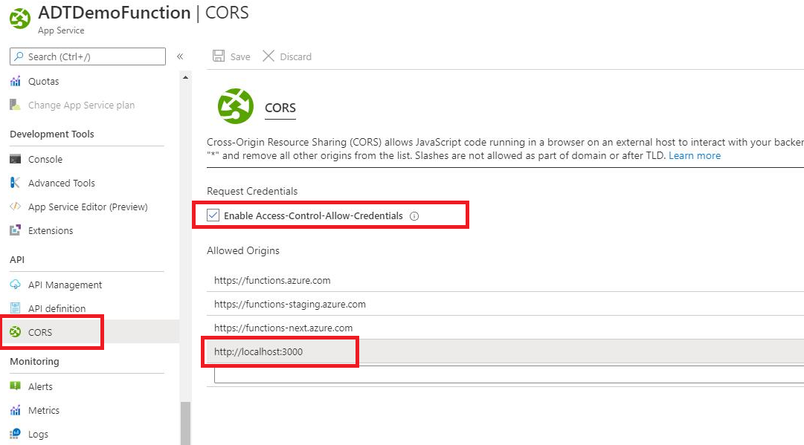

---
# Mandatory fields.
title: Integrate with Azure SignalR Service
titleSuffix: Azure Digital Twins
description: See how to stream Azure Digital Twins telemetry to clients using Azure SignalR
author: ayodejimarquis-msft
ms.author: aymarqui # Microsoft employees only
ms.date: 08/08/2020
ms.topic: how-to
ms.service: digital-twins

# Optional fields. Don't forget to remove # if you need a field.
# ms.custom: can-be-multiple-comma-separated
# ms.reviewer: MSFT-alias-of-reviewer
# manager: MSFT-alias-of-manager-or-PM-counterpart
---

# Integrate Azure Digital Twins with Azure SignalR Service

In this article, you'll learn how to integrate Azure Digital Twins (ADT) with [Azure SignalR Service](../azure-signalr/signalr-overview.md).

The solution described in this article will allow you push digital twins telemetry data to connected clients such as, a single page web or a mobile application. As a result, clients are updated with real time metrics and status from IoT devices without the need to poll the server, or submit new HTTP requests for updates.

## Prerequisites

1. Before you can integrate with Azure SignalR service, you need to have completed the Azure Digital Twins [*Tutorial: Connect an end-to-end solution*](./tutorial-end-to-end.md) because this tutorial will builds on top of it. The connect an end-to-end solution tutorial walks you through setting up an Azure Digital Twins instance that works with a virtual IoT device to trigger digital twin updates.

1. Have [Node.js](https://nodejs.org/en/) installed on your machine

## Solution architecture

You will be attaching Azure SignalR Service to Azure Digital Twins through the path below.

:::row:::
    :::column:::
        :::image type="content" source="media/how-to-integrate-azure-signalr/signalr-integration-topology.png" alt-text="A view of Azure services in an end-to-end scenario, highlighting Azure-SignalR" lightbox="media/how-to-integrate-azure-signalr/signalr-integration-topology.png":::
    :::column-end:::
    :::column:::
    :::column-end:::
:::row-end:::

## Log in to Azure

Sign in to the Azure portal at <https://portal.azure.com/> with your Azure account.

[!INCLUDE [Create instance](../azure-signalr/includes/signalr-quickstart-create-instance.md)]

## Clone the sample application

While the service is deploying, let's switch to working with code. Clone the [sample app from GitHub](https://github.com/Azure-Samples/digital-twins-samples), if you haven't.

1. Open a git terminal window. Change to a folder where you want to clone the sample project.

1. Run the following command to clone the sample repository. This command creates a copy of the sample app on your computer.

    ```bash
    git clone https://github.com/Azure-Samples/digital-twins-samples
    ```

## Configure and run the Azure Function app

1. Start Visual Studio (or another code editor) and open the solution in the cloned repository.

1. In the browser where the Azure portal is opened, confirm the SignalR Service instance you deployed earlier was successfully created by searching for its name in the search box at the top of the portal. Select the instance to open it.

1. Select **Keys** to view the connection strings for the SignalR Service instance.

1. Select and copy the primary connection string.

1. Back in Visual Studio, in Solution Explorer, rename *local.settings.sample.json* to *local.settings.json*.

1. In **local.settings.json**, paste the connection string into the value of the **AzureSignalRConnectionString** setting. Save the file.

1. Open **SignalRFunctions.cs**. There are two HTTP triggered functions in this function app:

    - **negotiate** - A HTTP trigger function. It uses the *SignalRConnectionInfo* input binding to generate and return valid connection information.
    - **broadcast** - An event grid trigger function. It receives an ADT telemetry data through the event grid and uses the *SignalR* output binding to broadcast the message to all connected client applications.


1. Publish your functions to Azure using the steps similar to that of the [connect an end to end solution](https://docs.microsoft.com/en-us/azure/digital-twins/tutorial-end-to-end#publish-the-app)

1. Finally, add your Azure Signal connection string to the function's appsettings
 
    ```bash
    az functionapp config appsettings set -g <your-resource-group> -n <your-App-Service-(function-app)-name> --settings "AzureSignalRConnectionString=<your-Azure-SignalR-ConnectionString>"
    ```

#### Connect the function to Event Grid
Next, subscribe the *SendMessage* Azure function to the event grid topic you created earlier in [*Tutorial: Connect an end-to-end solution*](./tutorial-end-to-end.md), so that telemetry data can flow from the *thermostat67* twin through the event grid topic to the function, which can then be broadcasted to all the clients.

To do this, you'll create an **Event Grid subscription** from your event grid topic to your *broadcast* Azure function as an endpoint.

In the [Azure portal](https://portal.azure.com/), navigate to your event grid topic by searching for its name in the top search bar. Select *+ Event Subscription*.

:::image type="content" source="media/tutorial-end-to-end/event-subscription-1b.png" alt-text="Azure portal: Event Grid event subscription":::

The steps to create this event subscription are similar to when you subscribed the first Azure function to IoT Hub earlier in this tutorial. This time, you don't need to specify *Device Telemetry* as the event type to listen for, and you'll connect to a different Azure function.

On the *Create Event Subscription* page, fill in the fields as follows (fields filled by default are not mentioned):
* *EVENT SUBSCRIPTION DETAILS* > **Name**: Give a name to your event subscription.
* *ENDPOINT DETAILS* > **Endpoint Type**: Select *Azure Function* from the menu options.
* *ENDPOINT DETAILS* > **Endpoint**: Hit the *Select an endpoint* link. This will open a *Select Azure Function* window:
    - Fill in your **Subscription**, **Resource group**, **Function app** and **Function** (*SendMessage*). Some of these may auto-populate after selecting the subscription.
    - Hit **Confirm Selection**.

Back on the *Create Event Subscription* page, hit **Create**.

## Configure and run the web app
1. Go to the folder where you cloned the repository, open the WebApp folder using Visual Studio Code or any editor of your choice

1. In the src/App.js, replace the URL in the **HubConnectionBuilder** with the HTTP endpoint of the **negotiate** function

    ```bash
        const hubConnection = new HubConnectionBuilder()
            .withUrl('<URL>')
            .build();
    ```

1. Add http://localhost:3000 as an allowed origin in the CORS setting of the function app

    

1. Run the following command to install the dependent node packages

    ```bash
    npm install
    ```

1. Start the web app using

    ```bash
    npm start
    ```
1. Once running, you should start seeing ADT telemetry being received in realtime
   
## Next steps

Learn about Azure SignalR Service Authentication with Azure Functions
* [*Azure SignalR Service authentication*](https://docs.microsoft.com/en-us/azure/azure-signalr/signalr-tutorial-authenticate-azure-functions)

Or, start looking at the concept documentation to learn more about elements you worked with in the tutorial:
* [*Concepts: Custom models*](concepts-models.md)

Or, go more in-depth on the processes in this tutorial by starting the how-to articles:
* [*How-to: Use the Azure Digital Twins CLI*](how-to-use-cli.md)