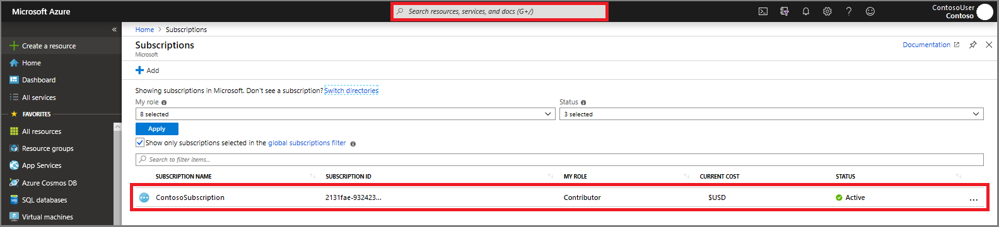
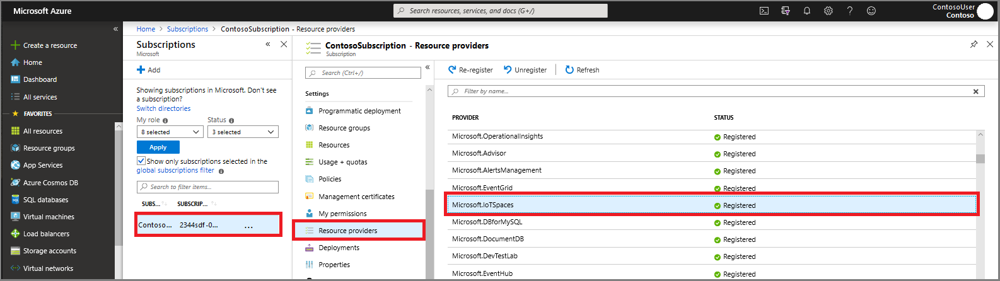

# Enable multitenant applications with Azure Digital Twins

Solutions developers who build on Azure Digital Twins may find that they want to support multiple customers with a single service or solution. In fact, *multitenant* applications are among the most common Azure Digital Twins configurations.

This document describes how to configure an Azure Digital Twins app to support several Azure Active Directory tenants and customers.

## Multitenancy

A *multitenant* resource is a single provisioned instance that supports multiple customers. Each customer has their own independent data and privileges. Each customer's experience is isolated from each other's so that their "view" of the application is distinct.

To learn more about multitenancy, read [Multitenant Applications in Azure](https://docs.microsoft.com/azure/dotnet-develop-multitenant-applications).

## Problem scenario

In this scenario, consider a developer building an Azure Digital Twins solution (**DEVELOPER**) and a customer who uses that solution (**CUSTOMER**):

- **DEVELOPER** has an Azure subscription with an Azure Active Directory tenant.
- **DEVELOPER** deploys an Azure Digital Twins instance into their Azure subscription. Azure Active Directory automatically created a service principal in **DEVELOPER**'s Azure Active Directory tenant.
- Users within **DEVELOPER**'s Azure Active Directory tenant can then [acquire OAuth 2.0 tokens](./security-authenticating-apis.md) from the Azure Digital Twins service.
- **DEVELOPER** now creates a mobile app that directly integrates with the Azure Digital Twins Management APIs.
- **DEVELOPER** allows **CUSTOMER** the use of the mobile application.
- **CUSTOMER** must be authorized to use the Azure Digital Twins Management API within **DEVELOPER**'s application.

The problem:

- When **CUSTOMER** logs into **DEVELOPER**'s application, the app can't acquire tokens for **CUSTOMER**'s users to authenticate with the Azure Digital Twins Management APIs.
- An exception is issued in Azure Active Directory indicating that Azure Digital Twins isn't recognized within **CUSTOMER**'s directory.

## Problem solution

To solve the previous problem scenario, the following actions are needed to create an Azure Digital Twins service principal within the **CUSTOMER**'s Azure Active Directory tenant:

- If **CUSTOMER** doesn't already have an Azure subscription with an Azure Active Directory tenant:

  - **CUSTOMER**'s Azure Active Directory tenant admin must acquire a [pay-as-you-go Azure subscription](https://azure.microsoft.com/offers/ms-azr-0003p/).
  - **CUSTOMER**'s Azure Active Directory tenant admin then must [link their tenant with the new subscription](https://docs.microsoft.com/azure/active-directory/hybrid/whatis-hybrid-identity).

- On the [Azure portal](https://portal.azure.com), **CUSTOMER**'s Azure Active Directory tenant admin takes the following steps:

  1. Search for **Subscriptions** in the top Azure search field. Select **Subscriptions**.
  1. Select the subscription that has the Azure Active Directory tenant to be used in **DEVELOPER**'s application.

     

  1. Select **Resource Providers**.
  1. Search for **Microsoft.IoTSpaces**.
  1. Select **Register**.

     
  
## Next steps

- To learn more about how to use user-defined functions with Azure Digital Twins, read [How to create Azure Digital Twins user-defined functions](./how-to-user-defined-functions.md).

- To learn how to use role-based access control to further secure the application with role assignments, read [How to create and manage Azure Digital Twins role-based access control](./security-create-manage-role-assignments.md).
