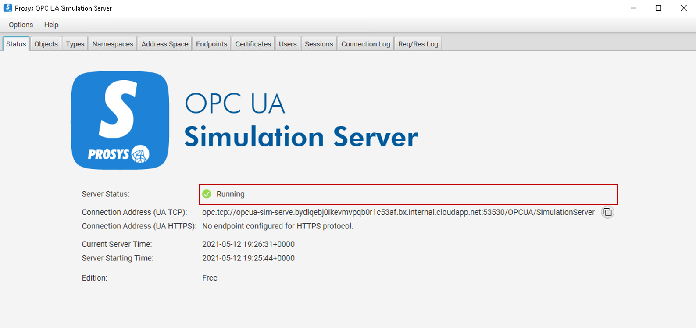
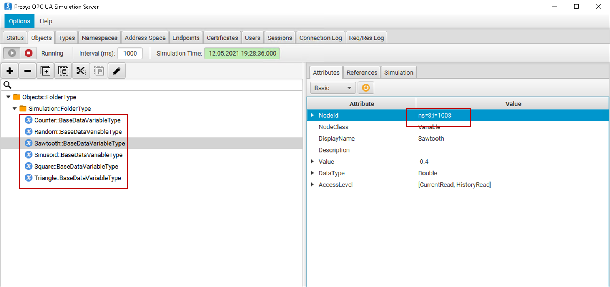
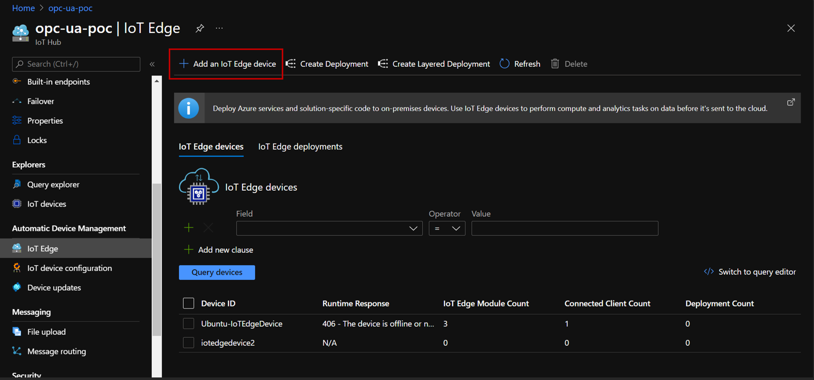
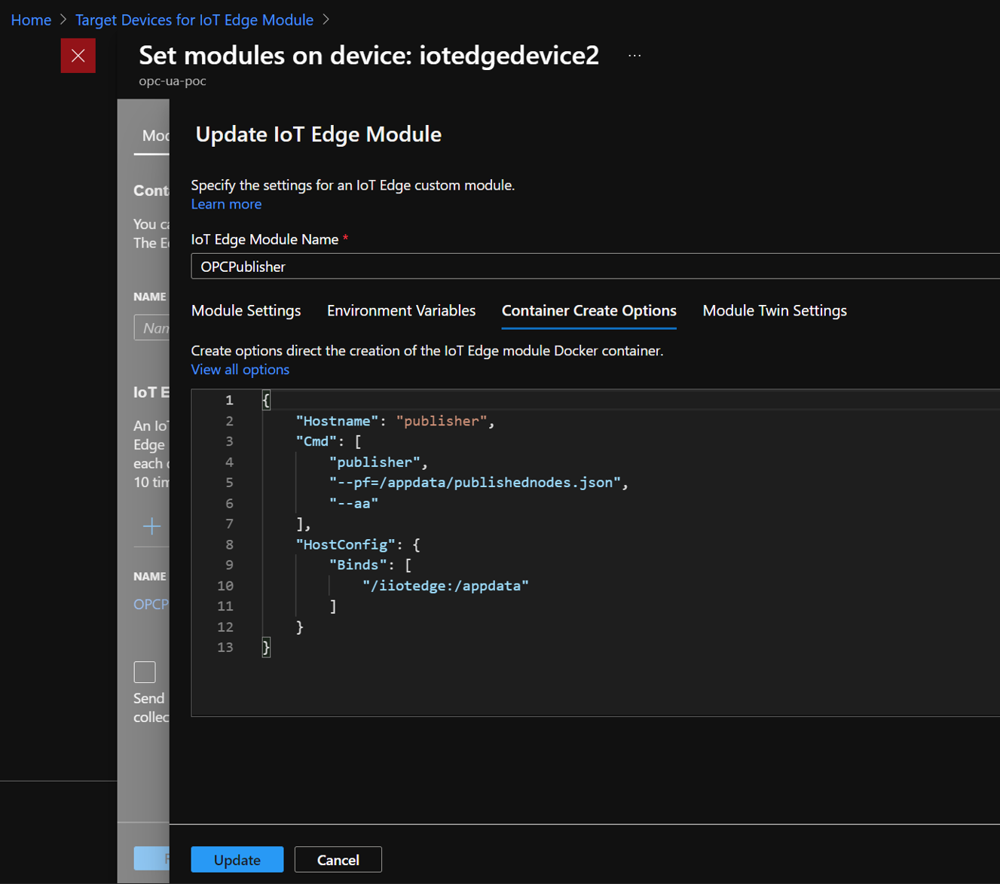
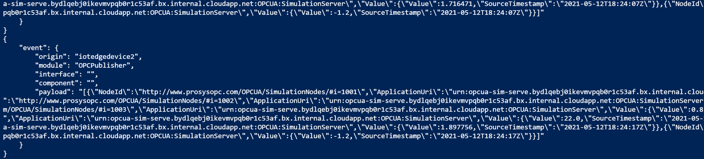
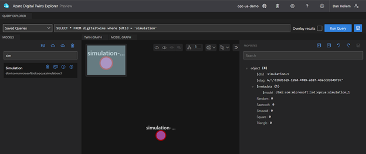
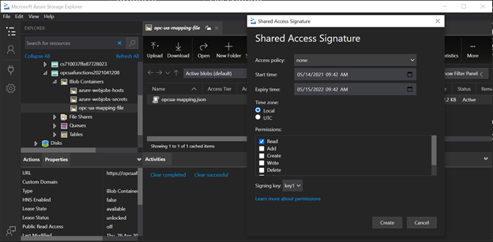
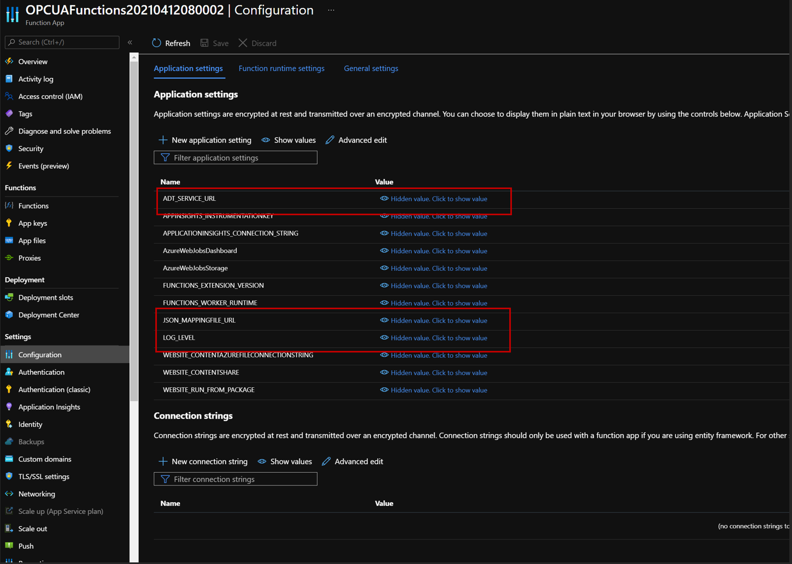
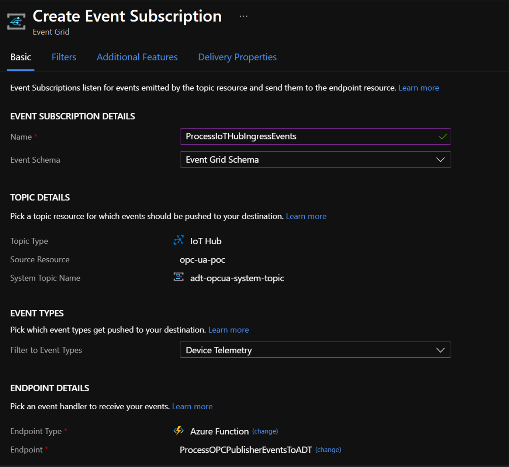

---
# Mandatory fields.
title: How to get OPC UA data into Azure Digital Twins
titleSuffix: Azure Digital Twins
description: Steps to get your Azure OPC UA Data into Azure Digital Twins
author: dahellem
ms.author: dahellem # Microsoft employees only
ms.date: 5/20/2021
ms.topic: how-to
ms.service: digital-twins
# Optional fields. Don't forget to remove # if you need a field.
# ms.custom: can-be-multiple-comma-separated
# ms.reviewer: MSFT-alias-of-reviewer
# manager: MSFT-alias-of-manager-or-PM-counterpart
---

# Get OPC UA data into Azure Digital Twins

## Architecture

Getting your OPC UA Server data to flow into Azure Digital Twins is hard. There are multiple components you need to install on different devices, custom code you need to write, and settings you need to configure. But it can be done. To help, we put together a proof of concept that connects all these pieces together to get your OPC UA nodes into Azure Digital Twins. We hope this will provide you the right guidance and tools to build upon for your solutions.

| Component                       | Description                                                                                                                                                |
| ------------------------------- | ---------------------------------------------------------------------------------------------------------------------------------------------------------- |
| ProSys OPC UA Simulation Server | Free OPC UA Server to simulate the OPC UA data                                                                                                             |
| IoT Edge                        | IoT Hub service that gets installed on a local Linux gateway device. This is required for the OPC Publisher module to run and send data to IoT Hub.        |
| OPC Publisher                   | IoT Edge module built by the Azure Industrial IoT team. This is the module that connects to your OPC UA Server and sends the node data into Azure IoT Hub. |
| Azure IoT Hub                   | OPC Publisher sends the OPC UA telemetry into Azure IoT Hub. From there we can process that data through an Azure Function and into Azure Digital Twins.   |
| Azure Digital Twins             | Azure Digital Twins the platform that enables you to create a digital representation of real-world things, places, business processes, and people.         |
| Azure Function                  | Custom Azure Function is used to process the telemetry coming into Azure IoT Hub into the right twins and properties in Azure Digital Twins.               |

This will feel complicated the first time you try it. There are a lot of steps and configurations that need to be done. But after you done it a couple times, it becomes much easier.

> [!TIP]
> All of the files you need for this proof of concept are located in this [GitHub Repo](https://github.com/Azure-Samples/opcua-to-azure-digital-twins). We recommend you clone or download this repo before you get started.

Finally, this article does not address converting OPC UA nodes into DTDL. It only addresses getting the telemetry from your OPC UA Server into Azure Digital Twins using an existing model. If you are interested in generating DTDL models from OPC UA data, check out the [UANodeSetWebViewer](https://github.com/barnstee/UANodesetWebViewer) and [OPCUA2DTDL](https://github.com/khilscher/OPCUA2DTDL) repos.

## Setup Edge Components

The first steps are getting the devices and software setup on the edge. This includes your OPC UA simulation server, gateway device, and IoT Hub components. The steps to install these components are well documented, but we wanted to step through these together so you can see the whole story. However, if you want more details, you can read the following articles:

- Step-by-step guide to installing OPC Publisher on Azure IoT Edge | Kevin Hilscher
- Install IoT Edge on Linux | Microsoft Docs
- OPC Publisher | GitHub Repo
- Configure OPC Publisher | Microsoft Docs

## OPC UA Server

This is a proof of concept, and we did not have access to physical devices running a real OPC UA Server. So instead, we installed the free [Prosys OPC UA Simulation Server](https://www.prosysopc.com/products/opc-ua-simulation-server/) on a Windows VM to generate OPC UA data. If you already have an OPC UA device, or another OPC UA simulation server, you can skip to the next step.

### Windows 10 virtual machine

You don’t need a lot of power to run the ProSys Software. This Windows 10 VM (see specs below) should do.


Your VM must be reachable over the internet. To keep things simple, I opened all ports and assigned the VM a Public IP address. This is a security risk, but it is a proof of concept, and we are okay with the risk. You may want to consider better security measures for your environment.


### Install OPC UA simulation software

From your new Windows virtual machine, install the [Prosys OPC UA Simulation Server](https://www.prosysopc.com/products/opc-ua-simulation-server/). Launch once the download and install are completed. It takes a few moments to start the OPC UA server and the Service Status will let you know when it is running.



Copy the Connection Address (UA TCP) and replace the machine name with your Public IP of your VM. You will need it for the publishednodes.json file later.

```
opc.tcp://{ip address}:53530/OPCUA/SimulationServer
```

For this proof of concept, we are going to use the simulation nodes provided by default in the Simulation folder. Each item will have a unique NodeId (ns=3;i=1003) value. You will need these NodeId values for the publishednodes.json and opcua-mapping.json files later in this article.



### Verify success

- ProSys Simulation Server setup and running
- Copied the UA TCP Connection Address (`opc.tcp://{ip address}:53530/OPCUA/SimulationServer`)
- Captured the list of NodeId’s (`ns=3;i=1003`) for the simulated nodes you want published

## Setup IoT Edge device

Create an Azure IoT Hub instance by following these steps. Creating a free instance is adequate for a proof of concept.


Go to the IoT Edge item in the left navigation and select the “Add an IoT Edge device”.



Once your device is created, copy the primary or secondary connection string value. You will need this later when you setup your physical edge device.


## Setup gateway device

In order to get your OPC UA Server data into IoT Hub, we need to have another device that runs IoT Edge with the OPC Publisher module. OPC Publisher will then listen to OPC UA node updates and will publish the telemetry into IoT Hub in a json format.

### Create Ubuntu Server virtual machine

We recommend using Ubuntu Server instead of Windows because it is easier to configure the OPC Publisher.


> [!TIP]
> The default size “Standard_b1s – vcpu, 1GiB memory ($7.59/month)” is too slow for RDP. Try updating it to the 2 GiB memory for a better RDP experience.

> [!NOTE]
> If you choose to RDP into your Ubuntu VM, you can follow [the instructions here](https://docs.microsoft.com/en-us/azure/virtual-machines/linux/use-remote-desktop).

### Install IoT Edge container

Follow the instructions to Install IoT Edge on Linux.

Once the installation completes run:

```
admin@gateway:~$ sudo iotedge check
```

This will run number of tests to make sure your installation is good.

### Instal OPC Publisher module

The OPC Publisher module now needs to be installed on your gateway device. The easiest way to install the OPC Publisher module is from the [Azure Marketplace](https://azuremarketplace.microsoft.com/en-us/marketplace/apps/microsoft_iot.iotedge-opc-publisher) and follow the steps documented in the [GitHub Repo](https://github.com/Azure/iot-edge-opc-publisher).


In the “Container Create Options” make sure you add the following json:



```JSON
{
    "Hostname": "opcpublisher",
    "Cmd": [
        "--pf=./publishednodes.json",
        "--aa"
    ],
    "HostConfig": {
        "Binds": [
            "/iiotedge:/appdata"
        ]
    }
}
```

This should work without any changes, but you may need to adjust the settings if your gateway device differs from our guidance so far.

Follow the prompts to create the module. After about 15 seconds, you can run `iotedge list` on your gateway device. You should now see the OPCPublisher module up and running.


Finally, go to the `/iiotedge` directory and create a publishednodes.json file. The Id’s need to match the nodeId’s from the OPC Server. Your file should like something like this:

```JSON
[
    {
        "EndpointUrl": "opc.tcp://20.185.195.172:53530/OPCUA/SimulationServer",
        "UseSecurity": false,
        "OpcNodes": [
            {
                "Id": "ns=3;i=1001"
            },
            {
                "Id": "ns=3;i=1002"
            },
            {
                "Id": "ns=3;i=1003"
            },
            {
                "Id": "ns=3;i=1004"
            },
            {
                "Id": "ns=3;i=1005"
            },
            {
                "Id": "ns=3;i=1006"
            }
        ]
    }
]
```

Save your changes to the publishednodes.json file and run the following command:

```
sudo iotedge logs OPCPublisher -f
```

This will give you the output of the OPC Publisher logs. If everything is configured and running correctly, you will see something like this.


To monitor the messages flowing into Azure IoT hub, you can use the following command:

```
az iot hub monitor-events -n {iot-hub-instance} -t 0
```



> [!TIP]
> Try using [Azure IoT Explorer](https://docs.microsoft.com/en-us/azure/iot-pnp/howto-use-iot-explorer) to monitor IoT Hub messages.

Sweet, you now have data flowing from an OPC UA Server into IoT Hub. Next up, getting the telemetry data into Azure Digital Twins.

### Verify success

- IoT Hub instance created.
- IoT Edge device provisioned.
- Ubuntu Server VM created.
- IoT Edge installed and on Ubuntu VM.
- OPC Publisher module installed.
- Publishednodes.json file created and configured.
- OPC Publisher module running, and telemetry data is flowing to IoT Hub.

## Setup Azure Digital Twins

Now that we have data flowing from OPC UA Server into Azure IoT Hub, we need to setup and configure Azure Digital Twins. For this example, we are just going to use a single model and a single twin instance to match the properties on the simulation server. For a more complex example, see the chocolate factory example in the [GitHub Repo](https://github.com/Azure-Samples/opcua-to-azure-digital-twins).

### Create Azure Digital Twins instance

[Follow the documentation](./how-to-set-up-instance-portal) to deploy a new Azure Digital Twins instance from the Azure Portal.

### Upload model & create twin

We recommend using [Azure Digital Twins Explorer](https://docs.microsoft.com/en-us/samples/azure-samples/digital-twins-explorer/digital-twins-explorer/) to upload the `simulation` model and create a new twin called “simulation-1”.



> [!TIP]
> If you are not familiar with Azure Digital Twins, visit the [sample scenario](./quickstart-azure-digital-twins-explorer) documentation to get started.

### Verify success

- Azure Digital Twins instance deployed.
- `Simulation` model uploaded into Azure Digital Twins instance.
- “simulation-1” twin created.

## Publish Azure Function

Now that we have the OPC UA nodes data flowing into IoT Hub, we need to map and save that data to the correct twin and properties in Azure Digital Twins. This is where our Azure Function and opcua-mapping.json file come in.

It works like this:

- An Event Subscription is configured for an Azure Function to process incoming messages into IoT Hub.
- The Azure Function will grab the Node Id for each item and do lookup against the items in the opcua-mapping.json file. In this file, you define the twinId and property, for where you want the value to nodeId saved.
- The Azure Function will then generate the appropriate patch document and will run the twin property updates accordingly.

### Create opcua-mapping.json file

The opcua-mapping.json looks like this (see the [GitHub repo](https://github.com/Azure-Samples/opcua-to-azure-digital-twins) for full example):

```JSON
[
    {
        "NodeId": "1025",
        "TwinId": "grinding",
        "Property": "ChasisTemperature",
        "ModelId": "dtmi:com:microsoft:iot:e2e:digital_factory:production_step_grinding;1"
    },
    ...
]
```

| Property | Description                                                          | Required |
| -------- | -------------------------------------------------------------------- | -------- |
| NodeId   | Value from the OPC UA node. For example: ns=3;i={value}              | ✔        |
| TwinId   | Twin Id ($dtId) of the twin you want to save the telemetry value for | ✔        |
| Property | Name of the property on the twin to save the telemetry value         | ✔        |
| ModelId  | The modelId to create the twin if the Twin Id does not exist         | ✔        |

> ![IMPORTANT]
> You will need to create a mapping entry for each and every NodeId

Now that we have our mapping file, we need to store it someplace that is accessible from the Azure Function. Azure Blob Storage is a good place. You can use [Azure Storage Explorer](https://azure.microsoft.com/en-us/features/storage-explorer/) to create your storage container and import the opcua-mapping.json file. Then create a shared access signature and save that url, as you will need it later for the Azure Function.



### Publish Azure Function

**Step 1:** Clone or download this [GitHub repo](https://github.com/Azure-Samples/opcua-to-azure-digital-twins) and open the OPCUAFunctions solution in Visual Studio.

**Step 2:** Follow these steps to [publish the function](./how-to-create-azure-function?tabs=cli#publish-the-function-app-to-azure) and [setting up security access](./how-to-create-azure-function?tabs=portal#set-up-security-access-for-the-function-app).

**Step 3:** We need to add some application settings to setup your environment properly. Go to the Azure Portal and find your newly created Azure Function. Then click on the “Configuration” section. There are three application settings you need to create.

| Setting              | Description                                                                                          | Required |
| -------------------- | ---------------------------------------------------------------------------------------------------- | -------- |
| ADT_SERVICE_URL      | URL for your Azure Digital Twins instance. Example: `https://example.api.eus.digitaltwins.azure.net` | ✔        |
| JSON_MAPPINGFILE_URL | URL of the shared access signature for the opcua-mapping.json                                        | ✔        |
| LOG_LEVEL            | Log level verbosity. Default is 100. Verbose is 300                                                  |          |



> [!TIP]
> Set the `LOG_LEVEL` application setting on the function to 300 for a more verbose logging experience. 

### Event Subscription

Finally, [follow these instructions](./tutorial-end-to-end#process-simulated-telemetry-from-an-iot-hub-device) to create an event subscription to connect your newly added function app to IoT Hub. This is needed so that data can flow from the gateway device into IoT Hub through the function, which then updates the Azure Digital Twins.

Your event subscription should look like this...



Everything is setup, running, and data should be flowing from your OPC UA Simulation Server, through IoT Hub, and into your Azure Digital Twins instances. Here are a couple Azure CLI commands to monitor the data flowing through IoT Hub and your Azure Function.

#### Commands

To monitor IoT Hub events
```
az iot hub monitor-events -n {hub-name} -t 0
```

Monitor Azure Fucntion event processing 
```
az webapp log tail –name {function-name} --resource-group {resource-group}
```

### Verify success

* Created and imported opcua-mapping.json file into a blob storage container. 
* Published Azure Function.
* Added three new application settings to the Azure Functions app.
* Event Subscription created.

## Next steps


### Verify success ggg

[!INCLUDE [digital-twins-setup-verify-role-assignment.md](../../includes/digital-twins-setup-verify-role-assignment.md)]

You now have an Azure Digital Twins instance ready to go, and have assigned permissions to manage it.

In the “Container Create Options” make sure you add the following json:

## Next steps

Test out individual REST API calls on your instance using the Azure Digital Twins CLI commands:

- [az dt reference](/cli/azure/ext/azure-iot/dt?preserve-view=true&view=azure-cli-latest)
- [_How-to: Use the Azure Digital Twins CLI_](how-to-use-cli.md)

Or, see how to connect a client application to your instance with authentication code:

- [_How-to: Write app authentication code_](how-to-authenticate-client.md)
