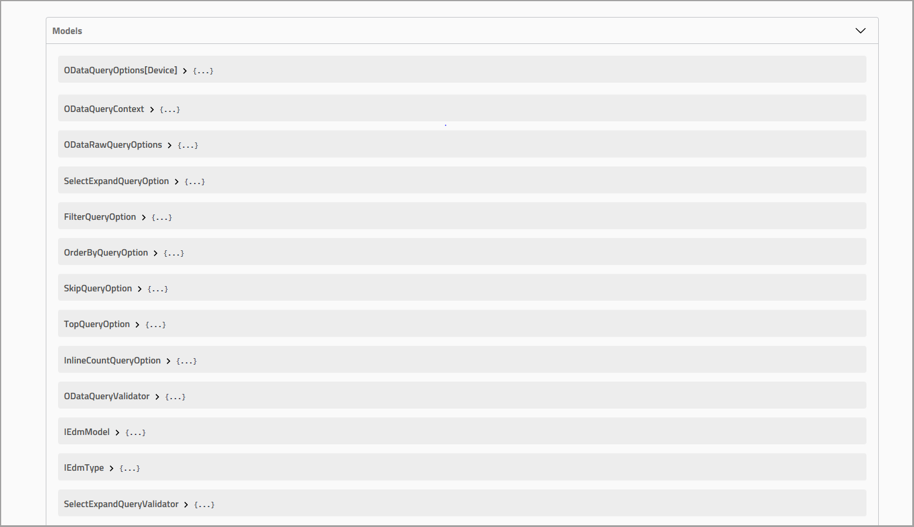
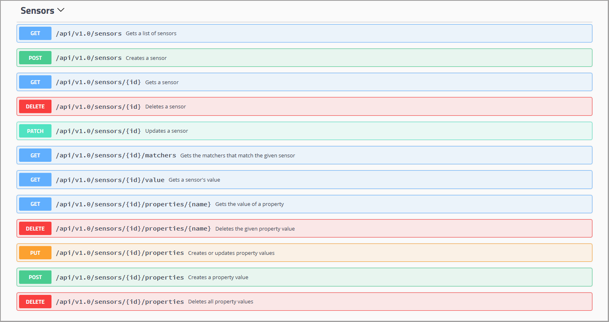
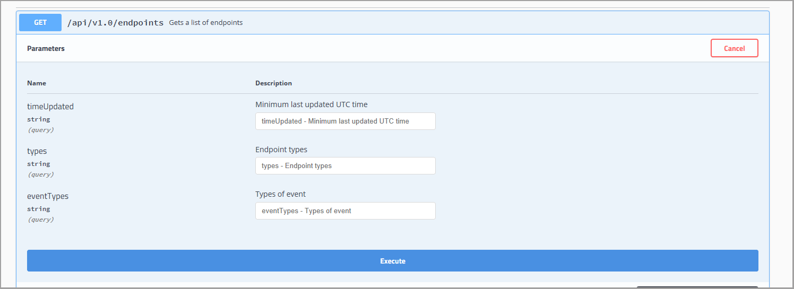
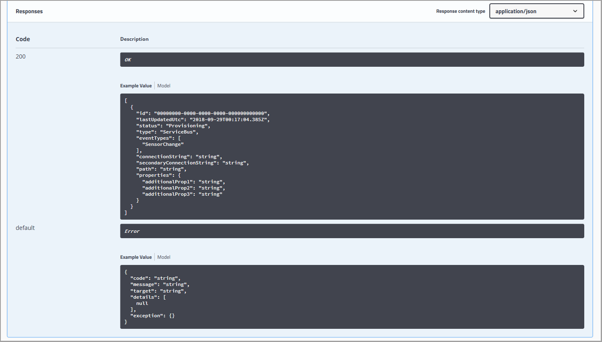
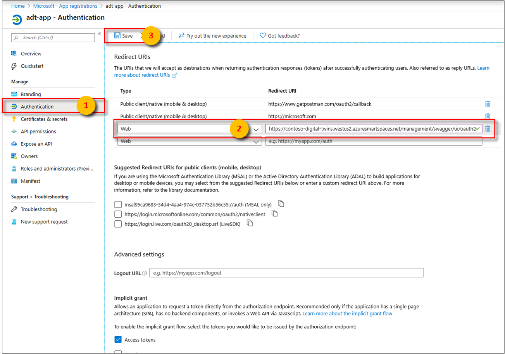
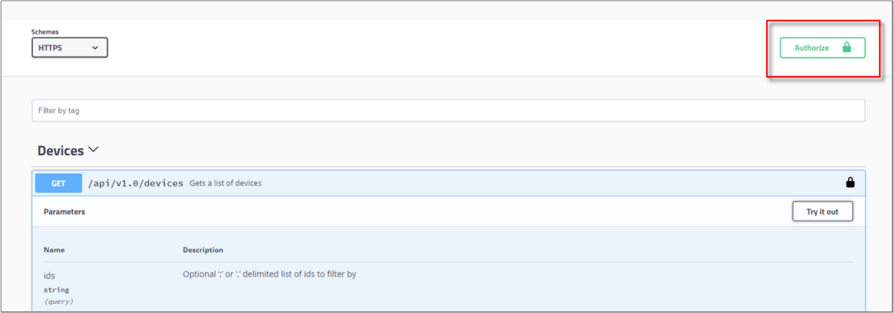
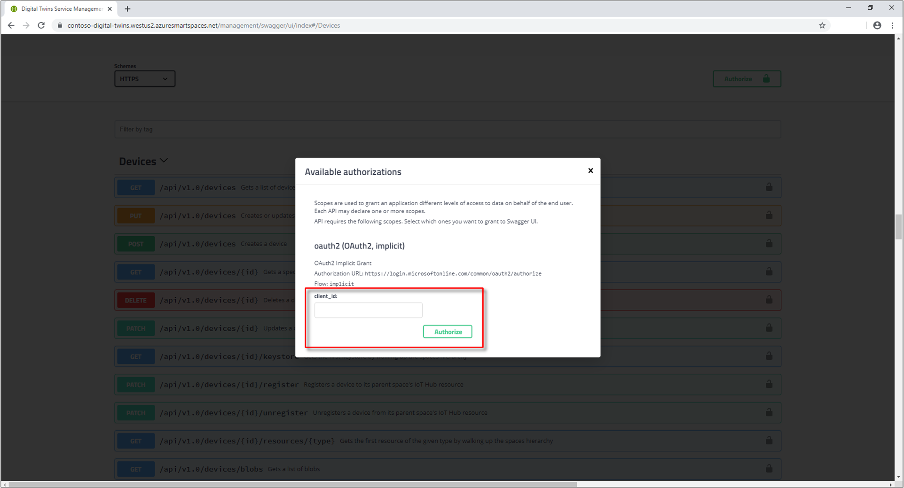
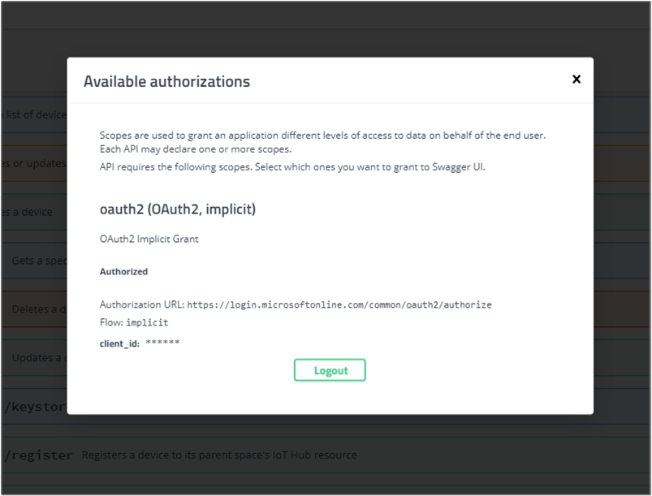

# Azure Digital Twins Swagger reference documentation

Each provisioned Azure Digital Twins instance includes its own automatically generated Swagger reference documentation.

[Swagger](https://swagger.io/), or [OpenAPI](https://www.openapis.org/), unites complex API information into an interactive and language-agnostic reference resource. Swagger provides critical reference material about which JSON payloads, HTTP methods, and specific endpoints to use to perform operations against an API.

## Swagger summary

Swagger provides an interactive summary of your API, which includes:

* API and object model information.
* REST API endpoints that specify the required request payloads, headers, parameters, context paths, and HTTP methods.
* Testing of API functionalities.
* Example response information used to validate and confirm HTTP responses.
* Error code information.

Swagger is a convenient tool to assist with development and testing calls made to the Azure Digital Twins Management APIs.

[!INCLUDE [Digital Twins Swagger](../../includes/digital-twins-swagger.md)]

## Reference material

The automatically generated Swagger reference material supplies a quick overview of important concepts, available Management API endpoints, and a description of each object model to assist development and testing.

A concise summary describes the API.

[](media/how-to-use-swagger/swagger-management-top-img.png#lightbox)

Management API object models are also listed.

[](media/how-to-use-swagger/swagger-management-models-img.png#lightbox)

You can select each listed object model for a more detailed summary of key attributes.

[](media/how-to-use-swagger/swagger-management-model-img.png#lightbox)

The generated Swagger object models are convenient to read all available Azure Digital Twins [objects and APIs](./concepts-objectmodel-spatialgraph.md). Developers can use this resource when they build solutions on Azure Digital Twins.

## Endpoint summary

Swagger also provides a thorough overview of all endpoints that compose the Management APIs.

Each listed endpoint also includes the required request information, such as the:

* Required parameters.
* Required parameter data types.
* HTTP method to access the resource.

[](media/how-to-use-swagger/swagger-management-endpoints-img.png#lightbox)

Select each resource to display their additional contents to get a more detailed overview.

## Use Swagger to test endpoints

One of the powerful functionalities Swagger provides is the ability to test an API endpoint directly through the documentation UI.

After you select a specific endpoint, the **Try it out** button will be displayed.

[](media/how-to-use-swagger/swagger-management-try-img.png#lightbox)

Expand that section to bring up input fields for each required and optional parameter. Enter the correct values, and select **Execute**.

[](media/how-to-use-swagger/swagger-management-tried-img.png#lightbox)

After you execute the test, you can validate the response data.

## Swagger response data

Each listed endpoint also includes response body data to validate your development and tests. These examples include the status codes and JSON for successful HTTP requests.

[](media/how-to-use-swagger/swagger-management-response-img.png#lightbox)

The examples also include error codes to help debug or improve failing tests.

## Swagger OAuth 2.0 authorization

> [!NOTE]
> * The user principal that created the Azure Digital Twins resource will have a Space Administrator role assignment and will be able to create additional role assignments for other users. Those users and their roles can be authorized to call the APIs.

1. Follow the steps in [the Quickstart](quickstart-view-occupancy-dotnet.md#set-permissions-for-your-app) to create and configure an Azure Active Directory application. Alternatively, you can reuse an existing app registration.

1. Add the following **Redirect URI** to your Azure Active Directory app registration:

    [](media/how-to-use-swagger/swagger-aad-redirect-url-registration.png#lightbox)

    ```plaintext
    https://YOUR_SWAGGER_URL/ui/oauth2-redirect-html
    ```
    | Name  | Replace with | Example |
    |---------|---------|---------|
    | YOUR_SWAGGER_URL | Your Management REST API documentation URL found in the portal  | `https://yourDigitalTwinsName.yourLocation.azuresmartspaces.net/management/swagger` |

1. Select the **Implicit grant** > **Access tokens** check box to allow the OAuth 2.0 implicit grant flow to be used. Select **Configure**, then **Save**.

1. Copy the **Client ID** of your Azure Active Directory app.

After completing the Azure Active Directory registration:

1. Select the **Authorize** button on your swagger page.

    [](media/how-to-use-swagger/swagger-select-authorize-btn.png#lightbox)

1. Paste the application ID into the **client_id** field.

    [](media/how-to-use-swagger/swagger-auth-form.png#lightbox)

1. You will then be redirected to the following success modal.

    [](media/how-to-use-swagger/swagger-auth-redirect-img.png#lightbox)

To learn more about interactively testing requests protected by OAuth 2.0, read the [official documentation](https://swagger.io/docs/specification/authentication/oauth2/).

## Next steps

- To read more about Azure Digital Twins object models and the spatial intelligence graph, read [Understand Azure Digital Twins object models](./concepts-objectmodel-spatialgraph.md).

- To learn how to authenticate with your Management API, read [Authenticate with APIs](./security-authenticating-apis.md).
