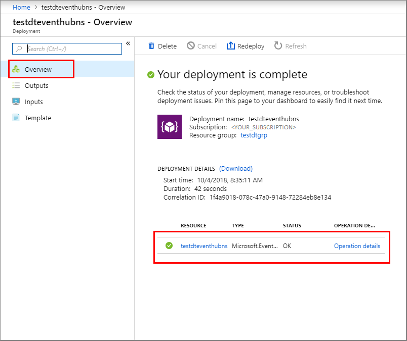
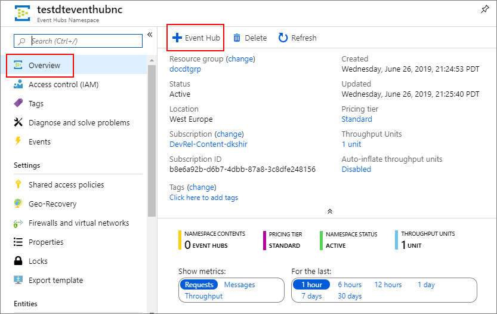
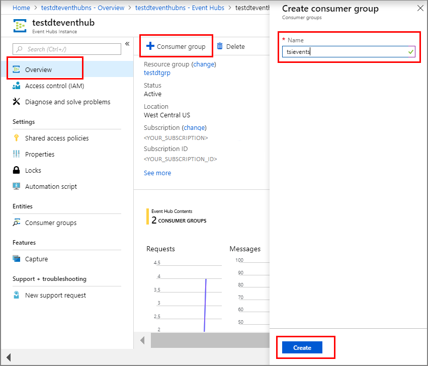
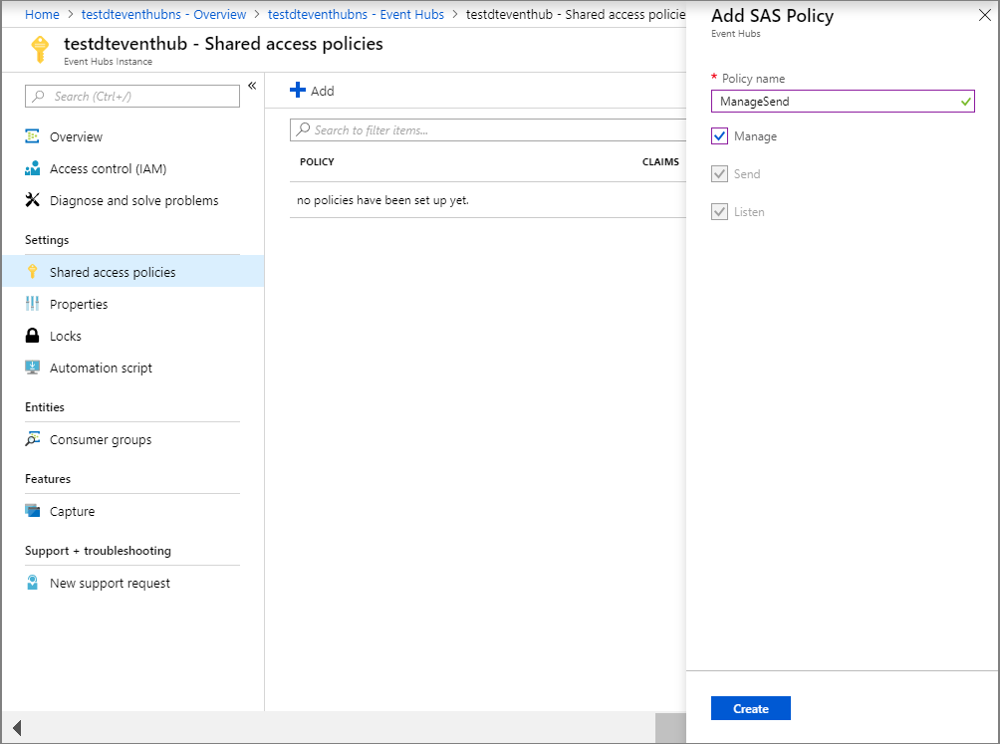
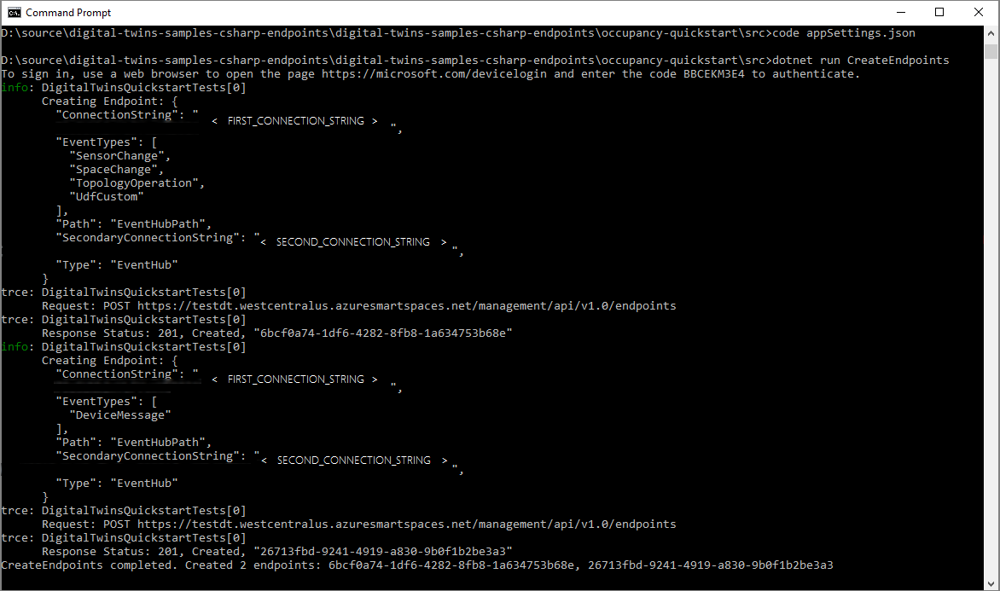
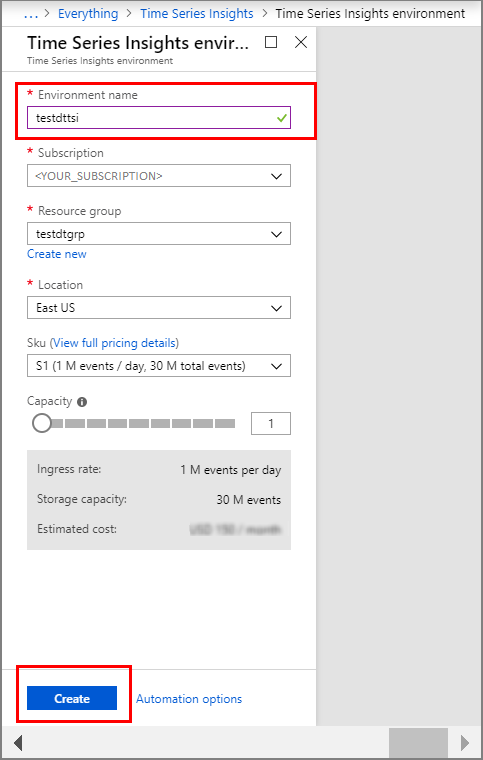
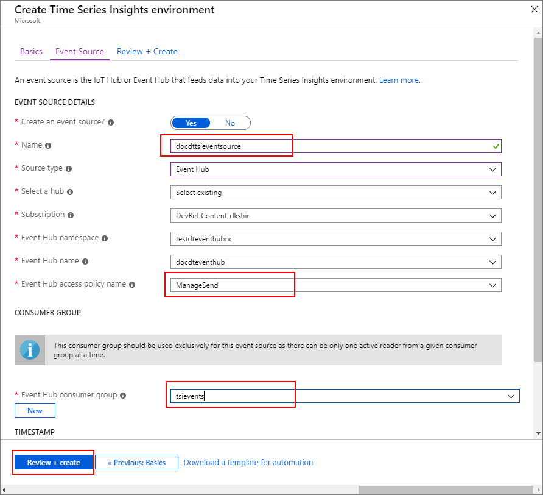
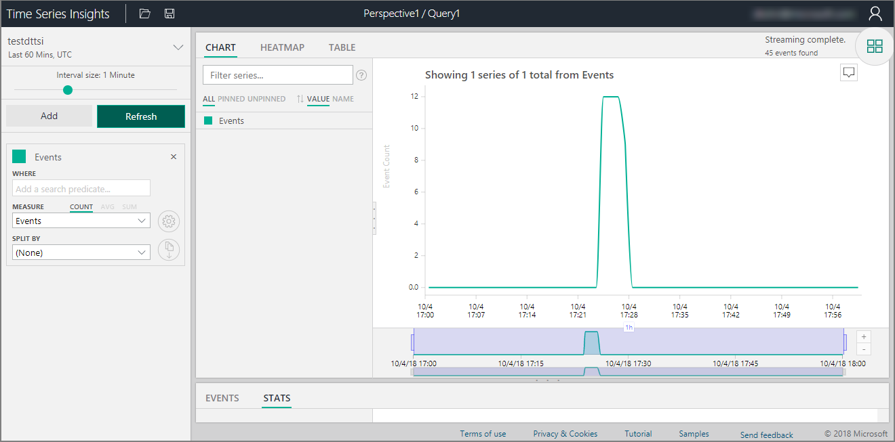
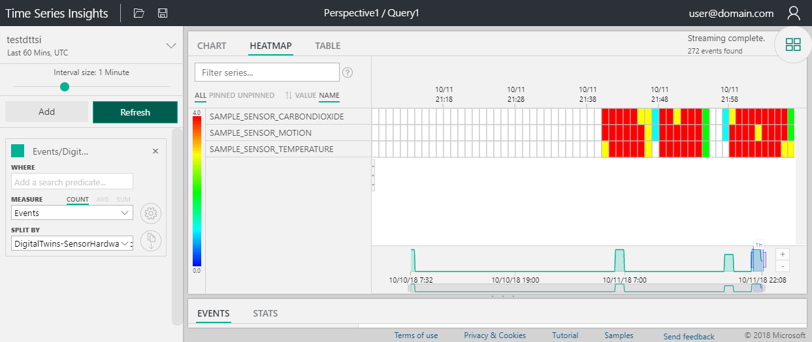

# Tutorial: Visualize and analyze events from your Azure Digital Twins spaces by using Time Series Insights

After you deploy your Azure Digital Twins instance, provision your spaces, and implement a custom function to monitor specific conditions, you can visualize the events and data coming from your spaces to look for trends and anomalies.

In [the first tutorial](tutorial-facilities-setup.md), you configured the spatial graph of an imaginary building, with a room that contains sensors for motion, carbon dioxide, and temperature. In [the second tutorial](tutorial-facilities-udf.md), you provisioned your graph and a user-defined function. The function monitors these sensor values and triggers notifications for the right conditions. That is, the room is empty, and the temperature and carbon dioxide levels are normal.

This tutorial shows you how you can integrate the notifications and data coming from your Azure Digital Twins setup with Azure Time Series Insights. You can then visualize your sensor values over time. You can look for trends such as which room is getting the most use and which are the busiest times of the day. You can also detect anomalies such as which rooms feel stuffier and hotter, or whether an area in your building is sending consistently high temperature values, indicating faulty air conditioning.

In this tutorial, you learn how to:

> [!div class="checklist"]
> * Stream data by using Azure Event Hubs.
> * Analyze with Time Series Insights.

## Prerequisites

This tutorial assumes that you have [configured](tutorial-facilities-setup.md) and [provisioned](tutorial-facilities-udf.md) your Azure Digital Twins setup. Before proceeding, make sure that you have:

- An [Azure account](https://azure.microsoft.com/free/?WT.mc_id=A261C142F).
- An instance of Digital Twins running.
- The [Digital Twins C# samples](https://github.com/Azure-Samples/digital-twins-samples-csharp) downloaded and extracted on your work machine.
- [.NET Core SDK version 2.1.403 or later](https://www.microsoft.com/net/download) on your development machine to run the sample. Run `dotnet --version` to verify that the right version is installed.

## Stream data by using Event Hubs

You can use the [Event Hubs](../event-hubs/event-hubs-about.md) service to create a pipeline to stream your data. This section shows you how to create your event hub as the connector between your Azure Digital Twins and Time Series Insights instances.

### Create an event hub

1. Sign in to the [Azure portal](https://portal.azure.com).

1. In the left pane, select **Create a resource**.

1. Search for and select **Event Hubs**. Select **Create**.

1. Enter a **Name** for your Event Hubs namespace. Choose **Standard** for **Pricing tier**, your **Subscription**, the **Resource group** that you used for your Digital Twins instance, and the **Location**. Select **Create**.

1. In the Event Hubs namespace deployment, select the **Overview** pane, then select **Go to resource**.

    

1. In the Event Hubs namespace **Overview** pane, select the **Event Hub** button at the top.
    

1. Enter a **Name** for your event hub, and select **Create**.

   After the event hub is deployed, it appears in the **Event Hubs** pane of the Event Hubs namespace with an **Active** status. Select this event hub to open its **Overview** pane.

1. Select the **Consumer group** button at the top, and enter a name such as **tsievents** for the consumer group. Select **Create**.

    

   After the consumer group is created, it appears in the list at the bottom of the event hub's **Overview** pane.

1. Open the **Shared access policies** pane for your event hub, and select the **Add** button. Enter **ManageSend** as the policy name, make sure all the check boxes are selected, and select **Create**.

    

1. Open the ManageSend policy that you created, and copy the values for **Connection string--primary key** and **Connection string--secondary key** to a temporary file. You'll need these values to create an endpoint for the event hub in the next section.

### Create an endpoint for the event hub

1. In the command window, make sure you're in the **occupancy-quickstart\src** folder of the Azure Digital Twins sample.

1. Open the file **actions\createEndpoints.yaml** in your editor. Replace the contents with the following:

    ```yaml
    - type: EventHub
      eventTypes:
      - SensorChange
      - SpaceChange
      - TopologyOperation
      - UdfCustom
      connectionString: Primary_connection_string_for_your_event_hub
      secondaryConnectionString: Secondary_connection_string_for_your_event_hub
      path: Name_of_your_Event_Hub
    - type: EventHub
      eventTypes:
      - DeviceMessage
      connectionString: Primary_connection_string_for_your_event_hub
      secondaryConnectionString: Secondary_connection_string_for_your_event_hub
      path: Name_of_your_Event_Hub
    ```

1. Replace the placeholders `Primary_connection_string_for_your_event_hub` with the value of **Connection string--primary key** for the event hub. Make sure the format of this connection string is as follows:

   ```plaintext
   Endpoint=sb://nameOfYourEventHubNamespace.servicebus.windows.net/;SharedAccessKeyName=ManageSend;SharedAccessKey=yourShareAccessKey1GUID;EntityPath=nameOfYourEventHub
   ```

1. Replace the placeholders `Secondary_connection_string_for_your_event_hub` with the value of **Connection string--secondary key** for the event hub. Make sure the format of this connection string is as follows: 

   ```plaintext
   Endpoint=sb://nameOfYourEventHubNamespace.servicebus.windows.net/;SharedAccessKeyName=ManageSend;SharedAccessKey=yourShareAccessKey2GUID;EntityPath=nameOfYourEventHub
   ```

1. Replace the placeholders `Name_of_your_Event_Hub` with the name of your Event Hub.

    > [!IMPORTANT]
    > Enter all values without any quotes. Make sure there's at least one space character after the colons in the YAML file. You can also validate your YAML file contents by using any online YAML validator, such as [this tool](https://onlineyamltools.com/validate-yaml).

1. Save and close the file. Run the following command in the command window, and sign in with your Azure account when prompted.

    ```cmd/sh
    dotnet run CreateEndpoints
    ```

   It creates two endpoints for your event hub.

   

## Analyze with Time Series Insights

1. In the left pane of the [Azure portal](https://portal.azure.com), select **Create a resource**. 

1. Search for and select a new **Time Series Insights** resource. Select **Create**.

1. Enter a **Name** for your Time Series Insights instance, and then select your **Subscription**. Select the **Resource group** that you used for your Digital Twins instance, and your **Location**. Select **Next: Event Source** button or the **Event Source** tab.

    

1. In the **Event Source** tab, enter a **Name**, select **Event Hub** as the **Source type**, and make sure the other values are selected correctly. Select **ManageSend** for **Event Hub access policy name**, and then select the consumer group that you created in the previous section for **Event Hub consumer group**. Select **Review + create**.

    

1. In the **Review + Create** pane, review the information you entered, and select **Create**.

1. In the deployment pane, select the Time Series Insights resource you just created. It opens the **Overview** pane for your Time Series Insights environment.

1. Select the **Go to Environment** button at the top. If you get a data access warning, open the **Data Access Policies** pane for your Time Series Insights instance, select **Add**, select **Contributor** as the role, and select the appropriate user.

1. The **Go to Environment** button opens the [Time Series Insights explorer](../time-series-insights/time-series-insights-explorer.md). If it doesn't show any events, simulate device events by browsing to the **device-connectivity** project of your Digital Twins sample, and running `dotnet run`.

1. After a few simulated events are generated, go back to the Time Series Insights explorer, and select the refresh button at the top. You should see analytical charts being created for your simulated sensor data. 

    

1. In the Time Series Insights explorer, you can then generate charts and heatmaps for different events and data from your rooms, sensors, and other resources. On the left side, use the **MEASURE** and **SPLIT BY** drop-down boxes to create your own visualizations. 

   For example, select **Events** for **MEASURE** and **DigitalTwins-SensorHardwareId** for **SPLIT BY**, to generate a heatmap for each of your sensors. The heatmap will be similar to the following image:

   

## Clean up resources

If you want to stop exploring Azure Digital Twins beyond this point, feel free to delete resources created in this tutorial:

1. From the left menu in the [Azure portal](https://portal.azure.com), select **All resources**, select your Digital Twins resource group, and then select **Delete**.

    > [!TIP]
    > If you experienced trouble deleting your Digital Twins instance, a service update has been rolled out with the fix. Please retry deleting your instance.

2. If necessary, delete the sample applications on your work machine.

## Next steps

Go to the next article to learn more about spatial intelligence graphs and object models in Azure Digital Twins.

> [!div class="nextstepaction"]
> [Understanding Digital Twins object models and spatial intelligence graph](concepts-objectmodel-spatialgraph.md)
