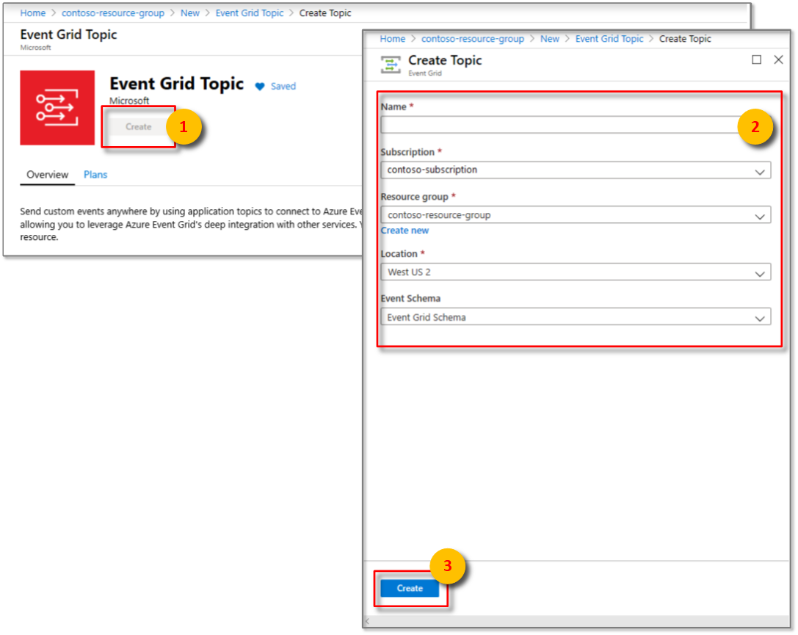
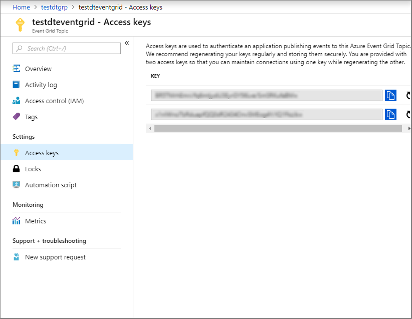
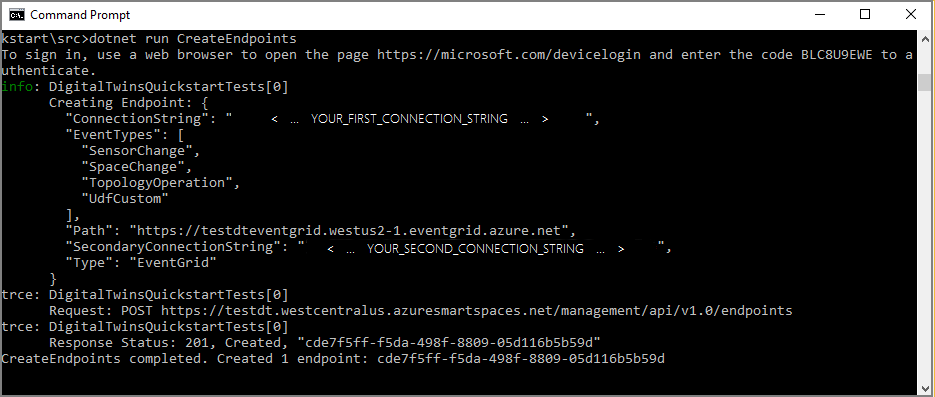
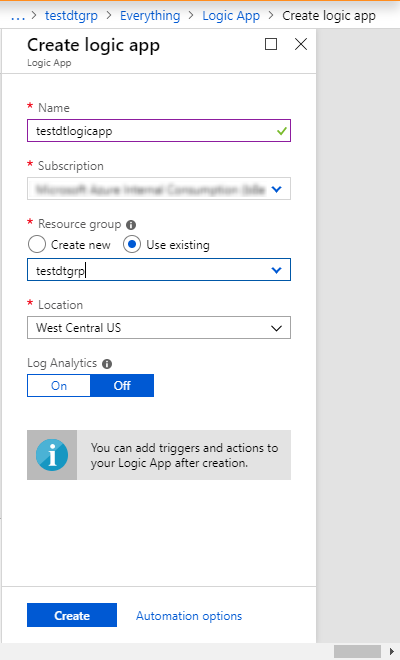
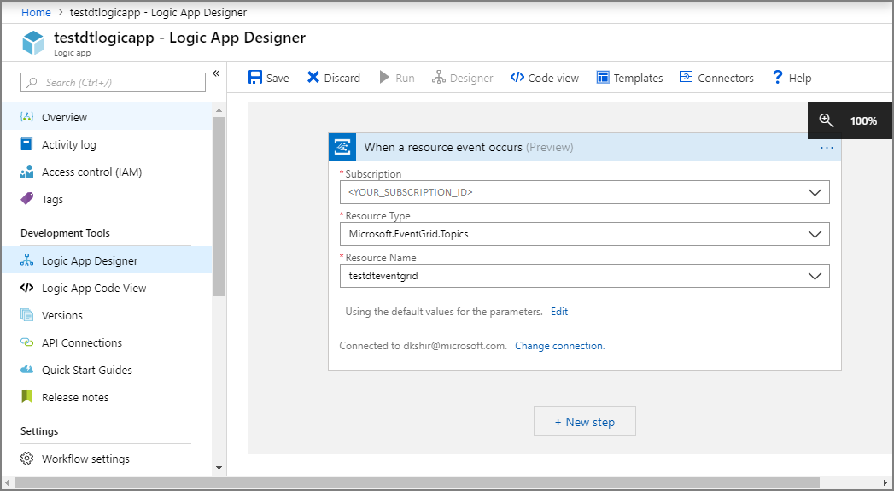
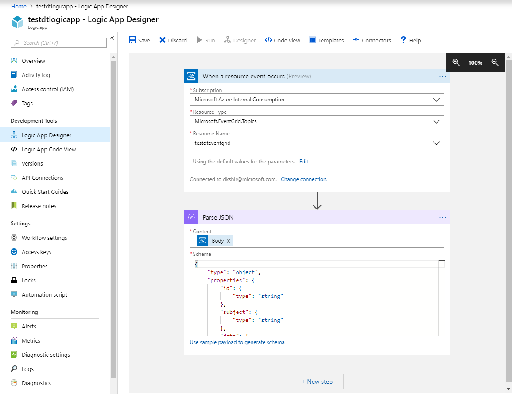
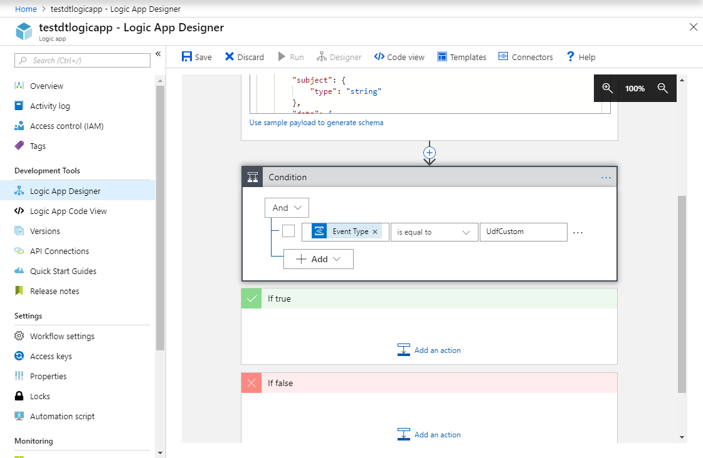
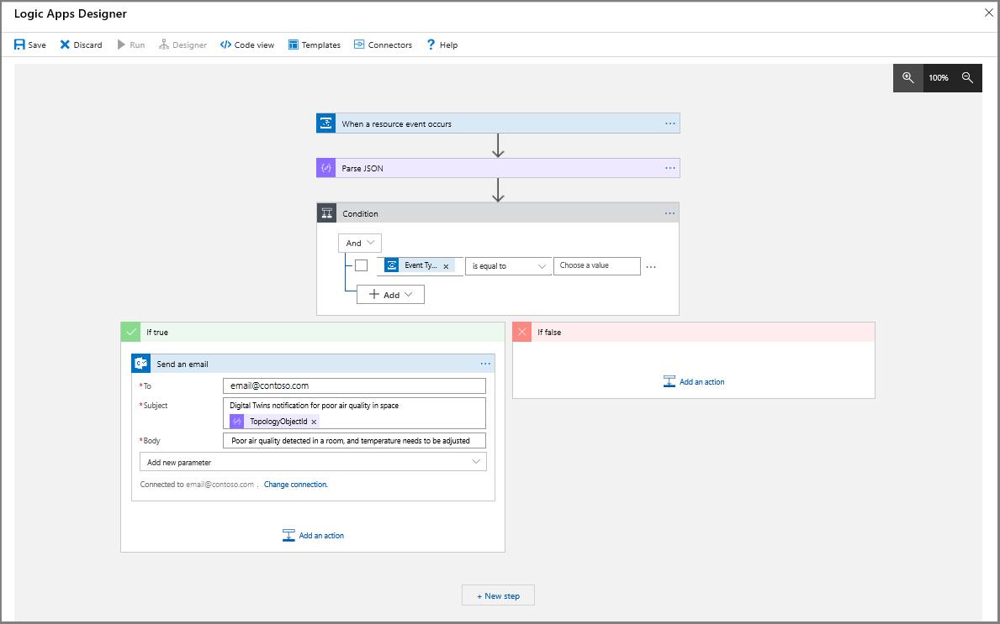
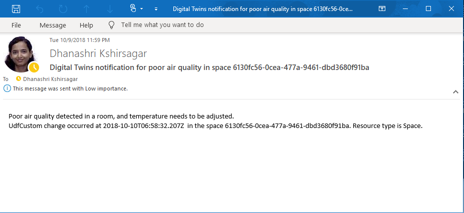

# Tutorial: Receive notifications from your Azure Digital Twins spaces using Logic Apps

Once you have deployed your Azure Digital Twins instance, provisioned your spaces, and implemented custom functions to monitor specific conditions, you can notify your office admin via email when the monitored conditions occur. 

In [the first tutorial](tutorial-facilities-setup.md), you configured the spatial graph of an imaginary building, with a room containing sensors for motion, carbon dioxide, and temperature. In [the second tutorial](tutorial-facilities-udf.md), you provisioned your graph and a custom function called the user-defined function to monitor these sensor values and trigger notifications when the room is empty, and the temperature and carbon dioxide are in a comfortable range. This tutorial shows how you can integrate these notifications with Azure Logic Apps to send emails when such a room is available. An office administrator can use this information to help the employees book the most productive meeting room. 

In this tutorial, you learn how to:

> [!div class="checklist"]
> * Integrate events with Event Grid
> * Notify events with Logic App
    
## Prerequisites

This tutorial assumes that you have [configured](tutorial-facilities-setup.md) and [provisioned](tutorial-facilities-udf.md) your Azure Digital Twins setup. Before proceeding, make sure that you have:
- An [Azure account](https://azure.microsoft.com/free/?WT.mc_id=A261C142F).
- An instance of Digital Twins running.
- The [Digital Twins C# samples](https://github.com/Azure-Samples/digital-twins-samples-csharp) downloaded and extracted on your work machine.
- [.NET Core SDK version 2.1.403 or above](https://www.microsoft.com/net/download) on your development machine to run the sample. Run `dotnet --version` to verify if the right version is installed. 
- An Office 365 account to send notification e-mails.

## Integrate events with Event Grid 
In this section, you will set up an [Event Grid](../event-grid/overview.md) to collect events from your Digital Twins instance, and redirect them to an [event handler](../event-grid/event-handlers.md) such as Logic Apps.

### Create Event Grid Topic
[Event Grid Topics](../event-grid/concepts.md#topics) provides an interface to route the events generated by the user-defined function. 

1. Sign in to the [Azure portal](https://portal.azure.com).

1. On the left navigation panel, click **Create a resource**. 

1. Search for and select **Event Grid Topic**. Click **Create**.

1. Enter a **Name** for your event grid topic, and choose the **Subscription**. Select the **Resource group** you used or created for your Digital Twins instance, and the **Location**. Click **Create**. 

    

1. Navigate to the event grid topic from your resource group, click on **Overview**, and copy the value for **Topic Endpoint** to a temporary file. You will need this URL in the following section. 

1. Click on **Access keys**, and copy **Key 1** and **Key 2** to a temporary file. You will need these values to create the endpoint in the following section.

    

### Create an endpoint for the Event Grid Topic

1. In the command window, make sure you are in the **_occupancy-quickstart\src_** folder of the Digital Twins sample.

1. Open the file **_actions\createEndpoints.yaml_** in your Visual Studio Code editor. Make sure it has the following contents:

    ```yaml
    - type: EventGrid
      eventTypes:
      - SensorChange
      - SpaceChange
      - TopologyOperation
      - UdfCustom
      connectionString: Primary_connection_string_for_your_Event_Grid
      secondaryConnectionString: Secondary_connection_string_for_your_Event_Grid
      path: Event_Grid_Topic_Path
    ```

1. Replace the placeholder `Primary_connection_string_for_your_Event_Grid` with the value of **Key1**. 

1. Replace the placeholder `Secondary_connection_string_for_your_Event_Grid` with the value of **Key2**.

1. Replace the placeholder `Event_Grid_Topic_Path` with the path of the event grid topic. Get this path by removing the *https://* and the trailing resource paths from the **Topic Endpoint** URL. It should look similar to this format: **yourEventGridName.yourLocation.eventgrid.azure.net**. 

    > [!IMPORTANT]
    > Enter all values without any quotes. Make sure there is at least one space character after the colons in the *YAML* file. You may also validate your *YAML* file contents using any online YAML validator such as [this tool](https://onlineyamltools.com/validate-yaml).

1. Save and close the file. In the command window, run the following command, and sign in when prompted. 

    ```cmd/sh
    dotnet run CreateEndpoints
    ```

   This command creates the endpoint for the Event Grid. 

   


## Notify events with Logic App
The [Azure Logic Apps](../logic-apps/logic-apps-overview.md) service allows you to create automated tasks for events received from other services. In this section, you will set up Logic Apps to create email notifications for events routed from your spatial sensors, with the help of an [Event Grid Topic](../event-grid/overview.md).

1. In the left navigation pane of the [Azure portal](https://portal.azure.com), click **Create a resource**.

1. Search and select a new **Logic App** resource. Click **Create**.

1. Enter a **Name** for your Logic App, and then select your **Subscription**, your **Resource group**, and **Location**. Click **Create**.

    

1. Open your Logic App when it is deployed, and then open the **Logic App Designer** pane. 

1. Select the **When an Event Grid event occurs** trigger. **Sign in** to your tenant with your Azure account when prompted. Confirm to **Allow access** to your Event Grid when prompted. Click **Continue**.

1. In the **When a resource event occurs (Preview)** window, 
    1. Select the **Subscription** that you used to create the Event Grid previously,

    1. Select **Microsoft.EventGrid.Topics** as the **Resource Type**,

    1. Select your Event Grid resource from the dropdown box for the **Resource Name**.

    

1. Click the **New step** button.

1. In the **Choose an action** window,
    1. Search the phrase *parse json*, and select the **Parse JSON** action.

    1. Click within the **Content** field, and select **Body** from the **Dynamic content** list.

    1. Click **Use sample to payload to generate schema**. Paste the following JSON payload, and then click **Done**.

        ```JSON
        {
        "id": "32162f00-a8f1-4d37-aee2-9312aabba0fd",
        "subject": "UdfCustom",
        "data": {
          "TopologyObjectId": "20efd3a8-34cb-4d96-a502-e02bffdabb14",
          "ResourceType": "Space",
          "Payload": "\"Air quality is poor.\"",
          "CorrelationId": "32162f00-a8f1-4d37-aee2-9312aabba0fd"
        },
        "eventType": "UdfCustom",
        "eventTime": "0001-01-01T00:00:00Z",
        "dataVersion": "1.0",
        "metadataVersion": "1",
        "topic": "/subscriptions/a382ee71-b48e-4382-b6be-eec7540cf271/resourceGroups/HOL/providers/Microsoft.EventGrid/topics/DigitalTwinEventGrid"
        }
        ```
    
    This payload has fictitious values. Logic App uses this sample payload to generate a **Schema**.
    
    

1. Click the **New step** button.

1. In the **Choose an action** window,
    1. Search and select **Condition Control** from the list of **Actions**. 

    1. Click within the first **Choose a value** textbox, and select **eventType** from the **Dynamic content** list for the **Parse JSON** window.

    1. Click within the second **Choose a value** textbox, and type *UdfCustom*.

    

1. In the **If true** window,
    1. Click on **Add an action**, and select *Office 365 Outlook*.

    1. From the list of **Actions**, select **Send an email**. Click **Sign in** and use your email account credentials. Click **Allow access** when prompted.

    1. In the **To** box, enter your email ID to receive notifications. In the **Subject**, enter the text *Digital Twins notification for poor air quality in space*, and then select **TopologyObjectId** from the **Dynamic content** list for **Parse JSON**.

    1. In the **Body** of the same window, enter text similar to this: *Poor air quality detected in a room, and temperature needs to be adjusted*. Feel free to elaborate using elements from the **Dynamic content** list as shown below.

    

1. Click **Save** button at the top of the **Logic App Designer** pane.

1. Make sure to simulate sensor data by navigating to the **_device-connectivity_** folder of the Digital Twin sample in a command window, and running `dotnet run`.

In a few minutes, you should start getting email notifications from this Logic App. 

   

To stop receiving these emails, navigate to your **Logic App** in the portal, and select the **Overview** pane. Click **Disable**.


## Clean up resources

If you wish to stop exploring Azure Digital Twins beyond this point, feel free to delete resources created in this tutorial:

1. From the left-hand menu in the [Azure portal](http://portal.azure.com), click **All resources**, select your Digital Twins resource group, and **Delete** it.
2. If you need to, you may proceed to delete the sample applications on your work machine as well. 


## Next steps

You may proceed to the next tutorial to learn how to visualize your sensor data, analyze trends and spot anomalies. 
> [!div class="nextstepaction"]
> [Tutorial: Visualize and analyze events from your Azure Digital Twins spaces using Time Series Insights](tutorial-facilities-analyze.md)

You may also proceed to learn more about the spatial intelligence graphs and object models in Azure Digital Twins. 
> [!div class="nextstepaction"]
> [Understanding Digital Twins object models and spatial intelligence graph](concepts-objectmodel-spatialgraph.md)