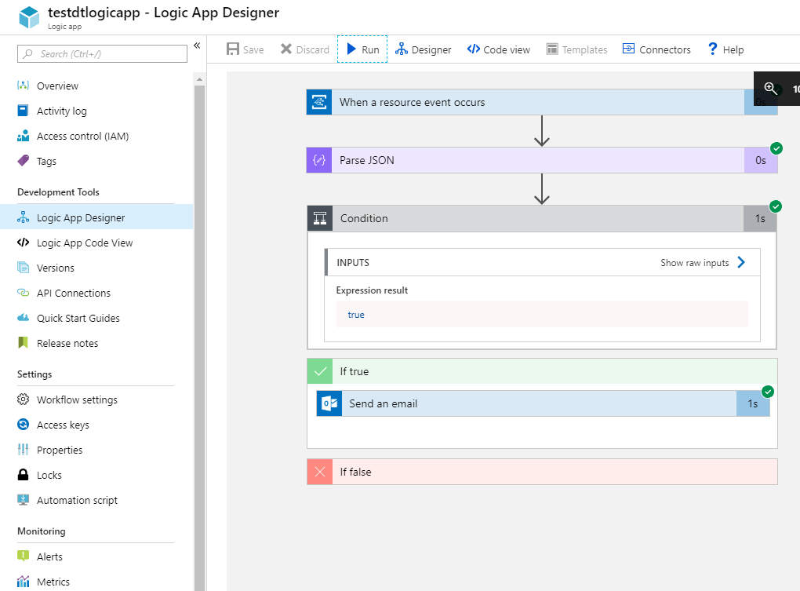

# Tutorial: Receive notifications from your building with Azure Digital Twins 

This tutorial demonstrates how to use Azure Digital Twins to receive notifications for events in your provisioned spaces. Once you have provisioned the spatial graph and user-defined function using the steps in the previous tutorials, and simulated the device events, you can integrate the events with other services to create a custom notification system. In this tutorial, you will use Azure Logic App to create email notifications based on telemetry data from your simulated device sensors.

In this tutorial, you learn how to:

> [!div class="checklist"]
> * Create event integration with Event Grid 
> * Create email notifications with Logic App

If you don’t have an Azure account, create a [free account](https://azure.microsoft.com/free/?WT.mc_id=A261C142F).

## Prerequisites

This tutorial assumes that you have completed the steps to [Provision your Azure Digital Twins setup](tutorial-facilities-setup.md), as well as [Custom monitor your Azure Digital Twins setup](tutorial-facilities-udf.md). Before proceeding, make sure that you have:
- an instance of Digital Twins running, and 
- the [Azure Digital Twins sample application](https://github.com/Azure-Samples/digital-twins-samples-csharp) downloaded and extracted on your work machine.

## Create event integration with Event Grid 
In this section, we will use [Event Grid](../event-grid/overview.md) to collect events from your Digital Twin instance as the [source](../event-grid/event-sources.md), and redirect them to an [event handler](../event-grid/event-handlers.md) like the Logic App.

### Create Event Grid Topic
[Event Grid Topics](../event-grid/concepts.md#topics) provides an interface to route the events generated by the user-defined function. 

1. Sign in to the [Azure portal](https://portal.azure.com).

1. On the left navigation panel, select **Resource groups**, and search for the resource group you created or used for your Digital Twins instance. 

1. On the **Overview** pane of your resource group, click the **Add** button.

1. Search for and select **Event Grid Topic**. Click **Create**.

1. Enter a **Name** for your Event Grid Topic, choose **Subscription**, the **Resource group**, and the **Location**. Click **Create**. 

    

1. Navigate to the event grid topic from your resource group, click on **Overview**, and copy the value for **Topic Endpoint** to a temporary *Notepad* file. You will need this URL in the proceeding section. 

1. Click on **Access keys**, and copy **Key 1** and **Key 2** to the temporary *Notepad* file. You will need these values to create the endpoint in the proceeding steps.

    

### Create an endpoint for the Event Grid Topic

1. In a command window, navigate to the Digital Twins sample, and then run the following:
```cmd/sh
cd occupancy-quickstart\src
```
1. Open the file *actions\createEndpoints.yaml* in your editor. Make sure it has the following contents:
```yaml
- type: EventGrid
  eventTypes:
  - SensorChange
  - SpaceChange
  - TopologyOperation
  - UdfCustom
  connectionString: <Primary connection string for your Event Grid>
  secondaryConnectionString: <Secondary connection string for your Event Grid>
  path: <Event Grid Topic Name>
```
1. Assign the value of **Key1** to the `connectionString`, and the value of **Key2** to the `secondaryConnectionString`. 
1. Enter the path of the Event Grid Topic as the `path`. Get this path by modifying the **Topic Endpoint** URL to this format: *yourEventGridName.yourLocation.eventgrid.azure.net*.
1. Enter all values as is, without any quotes. Make sure there are no additional spaces, since *YAML* is a senstive file format.
1. Save and close the file. Run the following in the command window. 
```cmd/sh
dotnet run CreateEndpoints
```
   The endpoint for the Event Grid will be created. 

   


## Create email notifications with Logic App
[Azure Logic Apps](../logic-apps/logic-apps-overview.md) allow you to create automated tasks like creating an email notification system for events received from other services. In this section, you will set up Logic Apps to create email notifications for events routed from your spatial sensors, with the help of an [Event Grid Topic](../event-grid/overview.md).

1. Sign in to the [Azure portal](https://portal.azure.com).
1. In the left navigation pane, click **Resource groups**, and then select the resource group you created or used for your Digital Twins instance. 
1. Click **Add** button on top, and search and select a new **Logic App** resource. Click **Create**.
1. Enter a **Name** for your Logic App, and then select your **Subscription**, your **Resource group**, and **Location**. Click **Create**.
    

1. Open your Logic App when it is deployed, and then open the **Logic App Designer** pane. 
1. Pick the **When an Event Grid event occurs** trigger. Sign in with your Azure account when prompted. Confirm to **Allow access** to your Event Grid when prompted. Click **Continue**.
1. In the **When a resource event occurs (Preview)** window, 
    1. Select the **Subscription** that you used to create the Event Grid previously,
    1. Select **Microsoft.EventGrid.Topics** as the **Resource Type**,
    1. Select your Event Grid resource from the drop down for the **Resource Name**.
1. Click **New step**.
1. In the **Choose an action** window,
    1. Search *parse json*, and select the **Parse JSON** action.
    1. Click within the textbox in front of the **Content** field, and select **Body** from the **Dynamic content** list.
    1. Click **Use sample to payload to generate schema** and paste the following JSON payload:
        ```JSON
        {
        "id": "32162f00-a8f1-4d37-aee2-9312aabba0fd",
        "subject": "UdfCustom",
        "data": {
          "TopologyObjectId": "20efd3a8-34cb-4d96-a502-e02bffdabb14",
          "ResourceType": "Space",
          "Payload": "\"Air quality is poor.\"",
          "CorrelationId": "32162f00-a8f1-4d37-aee2-9312aabba0fd"
        },
        "eventType": "UdfCustom",
        "eventTime": "0001-01-01T00:00:00Z",
        "dataVersion": "1.0",
        "metadataVersion": "1",
        "topic": "/subscriptions/a382ee71-b48e-4382-b6be-eec7540cf271/resourceGroups/HOL/providers/Microsoft.EventGrid/topics/DigitalTwinEventGrid"
        }
        ```
    
    Click **Done**. Note that this payload has fictitious values. Logic App uses this sample payload to generate a **Schema**.
    
    

1. Click **New step**.
1. In the **Choose an action** window,
    1. Search and select **Condition** Action. 
    1. Click within the first **Choose a value** textbox, and select **eventType** from the **Dynamic content** list for the **Parse JSON** window.
    1. Click within the second **Choose a value** textbox, and type *UdfCustom*.
1. In the **If true** window,
    1. Click on **Add an action**, search for *email*, and select the email client of your choice. This tutorial uses *Office 365 Outlook*. 
    1. Select **Send an email** from the **Actions** list. Click **Sign in** and use your email account credentials. Click **Allow access** when prompted.
    1. In the **Send an email** window, enter your email ID to receive notifications. In the **Subject**, enter *Digital Twins notification for poor air quality in space* and then select **TopologyObjectId** from the **Dynamic content** list for **Parse JSON**.
    1. In the **Body** of the same window, enter text similar to this: *Poor air quality detected in a room, and temperature needs to be adjusted*. Feel free to elaborate using elements from the **Dynamic content** list as shown below.

    
1. Click **Save** button at the top of the **Logic App Designer** pane.
1. If your device simulation is not already running, open a command window, and navigate to the *device-connectivity* folder of the Digital Twin sample. Run `dotnet run` to start generating simulated sensor data.

In a few moments, observe the state of the Logic App change as it receives events from your simulated device. 

   

In a few minutes, you should start getting email notifications from this Logic App. To stop these emails, navigate to your **Logic App** in the portal and select the **Overview** pane. Click **Disable**.


## Clean up resources

If you wish to stop exploring Azure Digital Twins beyond this point, feel free to delete resources created in this tutorial:

1. From the left-hand menu in the [Azure portal](http://portal.azure.com), click **All resources**, select and **Delete** your Digital Twins resource group.
2. If you need to, you may proceed to delete the sample applications on your work machine as well. 


## Next steps

Proceed to the next tutorial to learn how to create warm data analysis on your Digital Twins telemetry. 
> [!div class="nextstepaction"]
> [Tutorial: Visualize and analyze events from your building](tutorial-facilities-analyze.md)

