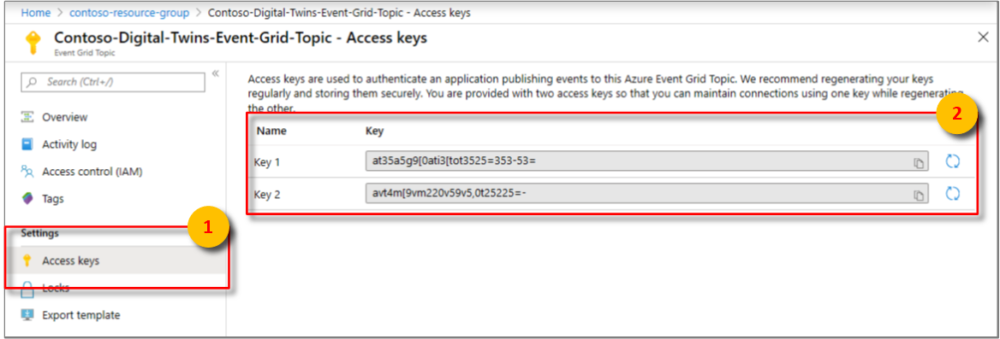
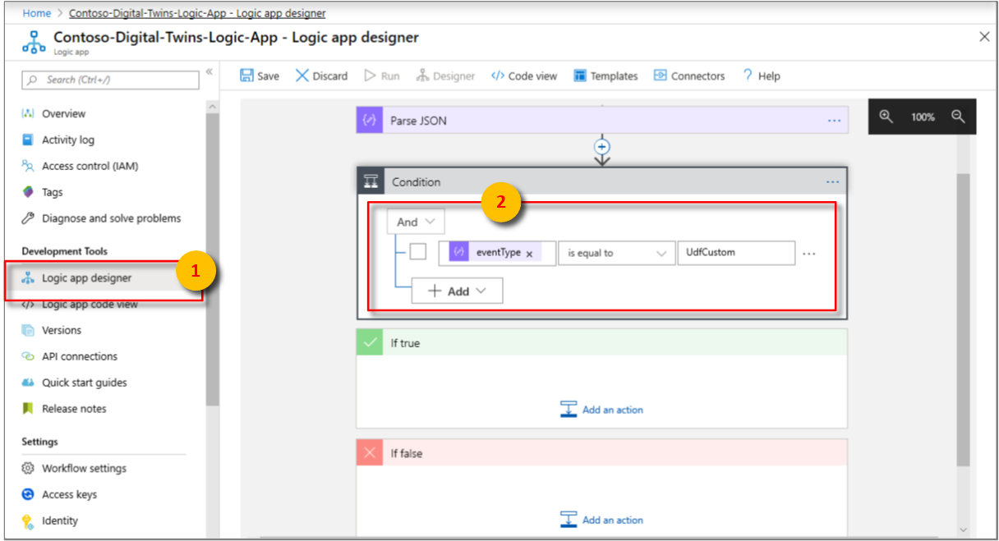

# Tutorial: Receive notifications from your Azure Digital Twins spaces by using Logic Apps

After you deploy your Azure Digital Twins instance, provision your spaces, and implement custom functions to monitor specific conditions, you can notify your office admin via email when the monitored conditions occur.

In [the first tutorial](tutorial-facilities-setup.md), you configured the spatial graph of an imaginary building. A room in the building contains sensors for motion, carbon dioxide, and temperature. In [the second tutorial](tutorial-facilities-udf.md), you provisioned your graph and a user-defined function to monitor these sensor values and trigger notifications when the room is empty, and the temperature and carbon dioxide are in a comfortable range. 

This tutorial shows how you can integrate these notifications with Azure Logic Apps to send emails when such a room is available. An office administrator can use this information to help the employees book the most productive meeting room.

In this tutorial, you learn how to:

> [!div class="checklist"]
> * Integrate events with Azure Event Grid.
> * Notify events with Logic Apps.

## Prerequisites

This tutorial assumes that you have [configured](tutorial-facilities-setup.md) and [provisioned](tutorial-facilities-udf.md) your Azure Digital Twins setup. Before proceeding, make sure that you have:

- An [Azure account](https://azure.microsoft.com/free/?WT.mc_id=A261C142F).
- An instance of Digital Twins running.
- The [Digital Twins C# samples](https://github.com/Azure-Samples/digital-twins-samples-csharp) downloaded and extracted on your work machine.
- [.NET Core SDK version 2.1.403 or later](https://www.microsoft.com/net/download) on your development machine to run the sample. Run `dotnet --version` to verify that the right version is installed.
- An [Office 365](https://products.office.com/home) account to send notification e-mails.

> [!TIP]
> Use a unique Digital Twins instance name if you're provisioning a new instance.

## Integrate events with Event Grid

In this section, you set up [Event Grid](../event-grid/overview.md) to collect events from your Azure Digital Twins instance, and redirect them to an [event handler](../event-grid/event-handlers.md) such as Logic Apps.

### Create an event grid topic

An [event grid topic](../event-grid/concepts.md#topics) provides an interface to route the events generated by the user-defined function. 

1. Sign in to the [Azure portal](https://portal.azure.com).

1. In the left pane, select **Create a resource**. 

1. Search for and select **Event Grid Topic**. Select **Create**.

1. Enter a **Name** for your event grid topic, and choose the **Subscription**. Select the **Resource group** that you used or created for your Digital Twins instance, and the **Location**. Select **Create**. 

    [](./media/tutorial-facilities-events/create-event-grid-topic.png#lightbox)

1. Browse to the event grid topic from your resource group, select **Overview**, and copy the value for **Topic Endpoint** to a temporary file. You'll need this URL in the next section. 

1. Select **Access keys**, and copy **Key 1** and **Key 2** to a temporary file. You'll need these values to create the endpoint in the next section.

    [](./media/tutorial-facilities-events/tutorial-event-grid-keys.png#lightbox)

### Create an endpoint for the event grid topic

1. In the command window, make sure you're in the **occupancy-quickstart\src** folder of the Digital Twins sample.

1. Open the file **actions\createEndpoints.yaml** in your Visual Studio Code editor. Make sure it has the following contents:

    ```yaml
    - type: EventGrid
      eventTypes:
      - SensorChange
      - SpaceChange
      - TopologyOperation
      - UdfCustom
      connectionString: <Primary connection string for your Event Grid>
      secondaryConnectionString: <Secondary connection string for your Event Grid>
      path: <Event Grid Topic Name without https:// and /api/events, e.g. eventgridname.region.eventgrid.azure.net>
    ```

1. Replace the placeholder `<Primary connection string for your Event Grid>` with the value of **Key 1**.

1. Replace the placeholder `<Secondary connection string for your Event Grid>` with the value of **Key 2**.

1. Replace the placeholder for **path** with the path of the event grid topic. Get this path by removing **https://** and the trailing resource paths from the **Topic Endpoint** URL. It should look similar to this format: *yourEventGridName.yourLocation.eventgrid.azure.net*.

    > [!IMPORTANT]
    > Enter all values without any quotes. Make sure there's at least one space character after the colons in the YAML file. You can also validate your YAML file contents by using any online YAML validator such as [this tool](https://onlineyamltools.com/validate-yaml).

1. Save and close the file. In the command window, run the following command, and sign in when prompted. 

    ```cmd/sh
    dotnet run CreateEndpoints
    ```

   This command creates the endpoint for Event Grid. 

   [](./media/tutorial-facilities-events/dotnet-create-endpoints.png#lightbox)

## Notify events with Logic Apps

You can use the [Azure Logic Apps](../logic-apps/logic-apps-overview.md) service to create automated tasks for events received from other services. In this section, you set up Logic Apps to create email notifications for events routed from your spatial sensors, with the help of an [event grid topic](../event-grid/overview.md).

1. In the left pane of the [Azure portal](https://portal.azure.com), select **Create a resource**.

1. Search and select a new **Logic App** resource. Select **Create**.

1. Enter a **Name** for your Logic App resource, and then select your **Subscription**, **Resource group**, and **Location**. Select **Create**.

    [](./media/tutorial-facilities-events/tutorial-create-logic-app.png#lightbox)

1. Open your Logic Apps resource when it's deployed, and then open the **Logic app designer** pane. 

1. Select the **When an Event Grid resource event occurs** trigger. Expand the **Azure Event Grid** option, and sign in to your tenant with your Azure account when prompted. Select **Allow access** for your Event Grid resource if prompted. Select **Continue**.

1. In the **When a resource event occurs** window: 
   
   a. Select the **Subscription** that you used to create the event grid topic.

   b. Select **Microsoft.EventGrid.Topics** for **Resource Type**.

   c. Select your Event Grid resource from the drop-down box for **Resource Name**.

   [](./media/tutorial-facilities-events/logic-app-resource-event.png#lightbox)

1. Select the **New step** button.

1. In the **Choose an action** window:

   a. Search the phrase **parse json**, and select the **Parse JSON** action.

   b. In the **Content** field, select **Body** from the **Dynamic content** list.

   c. Select **Use sample payload to generate schema**. Paste the following JSON payload, and then select **Done**.

    ```JSON
    {
    "id": "32162f00-a8f1-4d37-aee2-9312aabba0fd",
    "subject": "UdfCustom",
    "data": {
      "TopologyObjectId": "20efd3a8-34cb-4d96-a502-e02bffdabb14",
      "ResourceType": "Space",
      "Payload": "\"Air quality is poor.\"",
      "CorrelationId": "32162f00-a8f1-4d37-aee2-9312aabba0fd"
    },
    "eventType": "UdfCustom",
    "eventTime": "0001-01-01T00:00:00Z",
    "dataVersion": "1.0",
    "metadataVersion": "1",
    "topic": "/subscriptions/a382ee71-b48e-4382-b6be-eec7540cf271/resourceGroups/HOL/providers/Microsoft.EventGrid/topics/DigitalTwinEventGrid"
    }
    ```

    This payload has fictitious values. Logic Apps uses this sample payload to generate a *schema*.

    [](./media/tutorial-facilities-events/logic-app-parse-json.png#lightbox)

1. Select the **New step** button.

1. In the **Choose an action** window:

   a. Select **Control > Condition** or search **Condition** from the **Actions** list. 

   b. In the first **Choose a value** text box, select **eventType** from the **Dynamic content** list for the **Parse JSON** window.

   c. In the second **Choose a value** text box, enter `UdfCustom`.

   [](./media/tutorial-facilities-events/tutorial-logic-app-condition.png#lightbox)

1. In the **If true** window:

   a. Select **Add an action**, and select **Office 365 Outlook**.

   b. From the **Actions** list, select **Send an email (V2)**. Select **Sign in** and use your email account credentials. Select **Allow access** if prompted.

   c. In the **To** box, enter your email ID to receive notifications. In **Subject**, enter the text **Digital Twins notification for poor air quality in space**. Then select **TopologyObjectId** from the **Dynamic content** list for **Parse JSON**.

   d. Under **Body** in the same window, enter text similar to the following: **Poor air quality detected in a room, and temperature needs to be adjusted**. Feel free to elaborate by using elements from the **Dynamic content** list.

   [](./media/tutorial-facilities-events/tutorial-logic-app-send-email.png#lightbox)

1. Select the **Save** button at the top of the **Logic app designer** pane.

1. Make sure to simulate sensor data by browsing to the **device-connectivity** folder of the Digital Twins sample in a command window, and running `dotnet run`.

In a few minutes, you should start getting email notifications from this Logic Apps resource. 

   [](./media/tutorial-facilities-events/logic-app-notification.png#lightbox)

To stop receiving these emails, go to your Logic Apps resource in the portal, and select the **Overview** pane. Select **Disable**.

## Clean up resources

If you want to stop exploring Azure Digital Twins at this point, feel free to delete resources created in this tutorial:

1. From the left menu in the [Azure portal](https://portal.azure.com), select **All resources**, select your Digital Twins resource group, and select **Delete**.

    > [!TIP]
    > If you experienced trouble deleting your Digital Twins instance, a service update has been rolled out with the fix. Please retry deleting your instance.

2. If necessary, delete the sample applications on your work machine.

## Next steps

To learn how to visualize your sensor data, analyze trends, and spot anomalies, go to the next tutorial:

> [!div class="nextstepaction"]
> [Tutorial: Visualize and analyze events from your Azure Digital Twins spaces using Time Series Insights](tutorial-facilities-analyze.md)

You can also learn more about the spatial intelligence graphs and object models in Azure Digital Twins:

> [!div class="nextstepaction"]
> [Understanding Digital Twins object models and spatial intelligence graph](concepts-objectmodel-spatialgraph.md)
