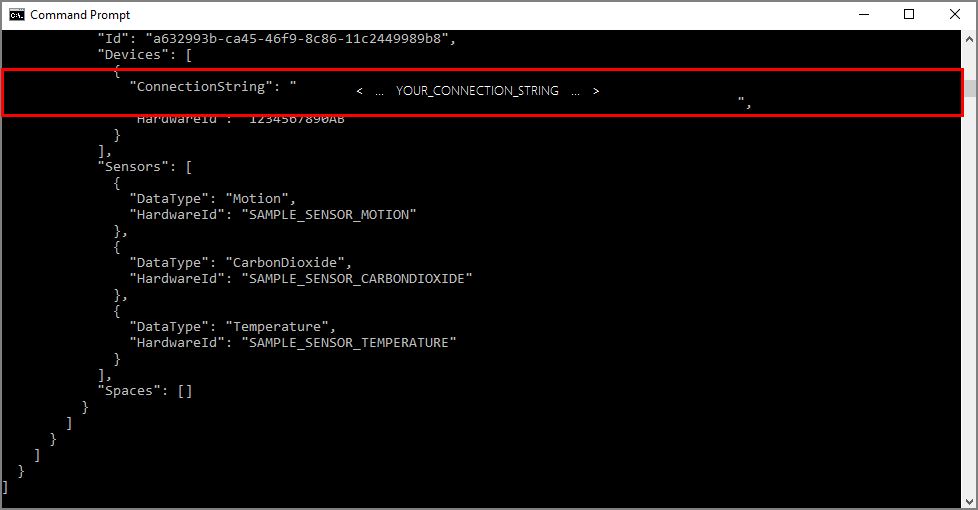
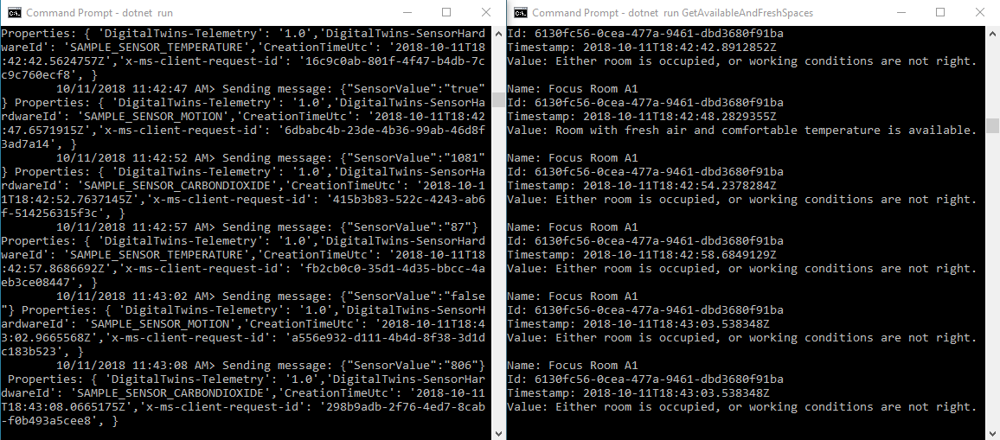

# Tutorial: Provision your building and monitor working conditions with Azure Digital Twins

This tutorial demonstrates how to use Azure Digital Twins to monitor your spaces for desired temperature conditions and comfort level. Once you have [configured your sample building](tutorial-facilities-setup.md), you can provision your building and run custom functions on your sensor data using the steps in this tutorial.

In this tutorial, you learn how to:

> [!div class="checklist"]
> * Define conditions to monitor
> * Create a user-defined function
> * Simulate sensor data
> * Get results of user-defined function

## Prerequisites

This tutorial assumes that you have [configured your Azure Digital Twins setup](tutorial-facilities-setup.md). Before proceeding, make sure that you have:
- an [Azure account](https://azure.microsoft.com/free/?WT.mc_id=A261C142F),
- an instance of Digital Twins running, 
- the [Digital Twins C# samples](https://github.com/Azure-Samples/digital-twins-samples-csharp) downloaded and extracted on your work machine, 
- [.NET Core SDK version 2.1.403 or above](https://www.microsoft.com/net/download) on your development machine to build and run the sample. Run `dotnet --version` to verify if the right version is installed. 
- [Visual Studio Code](https://code.visualstudio.com/) to explore the sample code. 

## Define conditions to monitor
You can define a set of specific conditions to monitor in the device or sensor data, called **Matchers**. You can then define functions called the *user-defined functions*, which execute custom logic on data coming from your spaces and devices, when the conditions specified by the matchers occur. For more information, read the [Data Processing and User-Defined Functions](concepts-user-defined-functions.md). 

From the **_occupancy-quickstart_** sample project, open the file **_src\actions\provisionSample.yaml_** in Visual Studio Code. Note the section that begins with the type **matchers**. Each entry under this type creates a matcher with the specified **Name**, that will monitor a sensor of type **dataTypeValue**. Notice how it relates to the space named *Focus Room A1*, which has a **devices** node, containing a few **sensors**. To provision a matcher that will track one of these sensors, its **dataTypeValue** should match with that sensor's **dataType**. 

Add the following matcher below the existing matchers, making sure the keys are aligned and spaces are not replaced by tabs:

```yaml
      - name: Matcher Temperature
        dataTypeValue: Temperature
```

This will track the *SAMPLE_SENSOR_TEMPERATURE* sensor that you added in [the first tutorial](tutorial-facilities-setup.md).

<a id="udf" />

## Create a user-defined function
User-defined functions or UDFs allow you to customize the processing of your sensor data. They are custom JavaScript code that can run within your Digital Twins instance, when specific conditions as described by the matchers occur. You can create *matchers* and *user-defined functions* for each sensor that you want to monitor. For more detailed information, read [Data processing and user-defined functions](concepts-user-defined-functions.md). 

In the sample *provisionSample.yaml* file, look for a section beginning with the type **userdefinedfunctions**. This section provisions a user-defined function with a given **Name**, that acts on the list of matchers under the **matcherNames**. Notice how you can provide your own JavaScript file for the UDF as the **script**. Also note the section named **roleassignments**. It assigns the *Space Administrator* role to the user-defined function; this allows it to access the events coming from any of the provisioned spaces. 

1. Configure the UDF to include the temperature matcher by adding the following line to the `matcherNames` node in the *provisionSample.yaml* file:

    ```yaml
            - Matcher Temperature
    ```

1. Open the file **_src\actions\userDefinedFunctions\availability.js_** in your editor. This is the file referred in the **script** element of the *provisionSample.yaml*. The user-defined function in this file looks for conditions when no motion is detected in the room, as well as carbon dioxide levels are below 1000 ppm. Modify the JavaScript file to monitor temperature in addition to other conditions. Add the following lines of code to look for conditions when no motion is detected in the room, carbon dioxide levels are below 1000 ppm, and temperature is below 78 degrees Fahrenheit:
    1. At the top of the file, add the following lines for temperature below the comment `// Add your sensor type here`:

        ```JavaScript
            var temperatureType = "Temperature";
            var temperatureThreshold = 78;
        ```
   
    1. Add the following lines after the statement which defines `var motionSensor`, below the comment `// Add your sensor variable here`:

        ```JavaScript
            var temperatureSensor = otherSensors.find(function(element) {
                return element.DataType === temperatureType;
            });
        ```
    
    1. Add the following line after the statement which defines `var carbonDioxideValue`, below the comment `// Add your sensor latest value here`:

        ```JavaScript
            var temperatureValue = getFloatValue(temperatureSensor.Value().Value);
        ```
    
    1. Remove the following lines of code from below the comment `// Modify this line to monitor your sensor value`: 

        ```JavaScript
            if(carbonDioxideValue === null || motionValue === null) {
                sendNotification(telemetry.SensorId, "Sensor", "Error: Carbon dioxide or motion are null, returning");
                return;
            }
        ```
       
       Replace them with the following lines:

        ```JavaScript
            if(carbonDioxideValue === null || motionValue === null || temperatureValue === null){
                sendNotification(telemetry.SensorId, "Sensor", "Error: Carbon dioxide, motion, or temperature are null, returning");
                return;
            }
        ```
    
    1. Remove the following lines of code from below the comment `// Modify these lines as per your sensor`:

        ```JavaScript
            var availableFresh = "Room is available and air is fresh";
            var noAvailableOrFresh = "Room is not available or air quality is poor";
        ```

       Replace them with the following lines:

        ```JavaScript
            var alert = "Room with fresh air and comfortable temperature is available.";
            var noAlert = "Either room is occupied, or working conditions are not right.";
        ```
    
    1. Remove the following *if-else* code block after the comment `// Modify this code block for your sensor`:

        ```JavaScript
            // If carbonDioxide less than threshold and no presence in the room => log, notify and set parent space computed value
            if(carbonDioxideValue < carbonDioxideThreshold && !presence) {
                log(`${availableFresh}. Carbon Dioxide: ${carbonDioxideValue}. Presence: ${presence}.`);
                setSpaceValue(parentSpace.Id, spaceAvailFresh, availableFresh);

                // Set up custom notification for air quality
                parentSpace.Notify(JSON.stringify(availableFresh));
            }
            else {
                log(`${noAvailableOrFresh}. Carbon Dioxide: ${carbonDioxideValue}. Presence: ${presence}.`);
                setSpaceValue(parentSpace.Id, spaceAvailFresh, noAvailableOrFresh);

                // Set up custom notification for air quality
                parentSpace.Notify(JSON.stringify(noAvailableOrFresh));
            }
        ```
      
       And replace it with the following *if-else* block:

        ```JavaScript
            // If sensor values are within range and room is available
            if(carbonDioxideValue < carbonDioxideThreshold && temperatureValue < temperatureThreshold && presence) {
                log(`${alert}. Carbon Dioxide: ${carbonDioxideValue}. Temperature: ${temperatureValue}. Presence: ${presence}.`);

                // log, notify and set parent space computed value
                setSpaceValue(parentSpace.Id, spaceAvailFresh, alert);

                // Set up notification for this alert
                parentSpace.Notify(JSON.stringify(alert));
            }
            else {
                log(`${noAlert}. Carbon Dioxide: ${carbonDioxideValue}. Temperature: ${temperatureValue}. Presence: ${presence}.`);
    
                // log, notify and set parent space computed value
                setSpaceValue(parentSpace.Id, spaceAvailFresh, noAlert);
            }
        ```
        
        The modified UDF will look for a condition where a room becomes available and has the carbon dioxide and temperature within tolerable limits. It will generate a notification with the statement `parentSpace.Notify(JSON.stringigy(alert));` when this condition is met. It will set the value of the monitored space regardless of whether the condition is met, with the corresponding message.
    
    1. Save the file. 

1. Open command window, and navigate to the folder **_occupancy-quickstart\src_**. Run the following command to provision your spatial intelligence graph and user-defined function. 

    ```cmd/sh
    dotnet run ProvisionSample
    ```

   > [!IMPORTANT]
   > To prevent unauthorized access to your Digital Twins management API, the **_occupancy-quickstart_** application requires you to sign in with your Azure account credentials every time you run it. It will direct you to a Sign-in page, and give a session-specific code to enter on that page. Follow the prompts to sign in with your Azure account.


1. Once your account is authenticated, the application will start creating a sample spatial graph as configured in the *provisionSample.yaml*. Wait until the provisioning completes; it will take a few minutes. Once completed, observe the messages in the command window and notice how your spatial graph is created. Notice how it creates an IoT hub at the root node or the `Venue`. 

1. From the output in the command window, copy the value of the `ConnectionString`, under the `Devices` section, to your clipboard. You will need this value to simulate the device connection in the following section.

    

> [!TIP]
> If you get an error message similar to "The I/O operation has been aborted because of either a thread exit or an application request" in the middle of the provisioning, please try running the command again. This might happen if the HTTP client timed out due to a network issue.

<a id="simulate" />

## Simulate sensor data
In this section, you will use the project named *device-connectivity* in the sample, to simulate sensor data for detecting motion, temperature, and carbon dioxide. This project generates random values for the sensors, and sends them to the IoT hub by using the device connection string.

1. In a separate command window, navigate to the Digital Twins sample, and then to the **_device-connectivity_** folder.

1. Run this command to make sure the dependencies for the project are correct:

    ```cmd/sh
    dotnet restore
    ```

1. Open the *appSettings.json* file in your editor, edit the following values:
    1. *DeviceConnectionString*: Assign the value of `ConnectionString` in the output window from the previous section. Make sure to copy this string completely, within the quotes, for the simulator to connect properly with the IoT hub.

    1. *HardwareId* within the *Sensors* array: Since you are simulating events from sensors provisioned to your Digital Twins instance, the hardware ID and the names of the sensors in this file should match with `sensors` node of the *provisionSample.yaml* file. Add a new entry for the temperature sensor; the **Sensors** node in the *appSettings.json* should look like the following:

        ```JSON
        "Sensors": [{
          "DataType": "Motion",
          "HardwareId": "SAMPLE_SENSOR_MOTION"
        },{
          "DataType": "CarbonDioxide",
          "HardwareId": "SAMPLE_SENSOR_CARBONDIOXIDE"
        },{
          "DataType": "Temperature",
          "HardwareId": "SAMPLE_SENSOR_TEMPERATURE"
        }]
        ```

1. Run this command to start simulating device events for temperature, motion, and carbon dioxide:

    ```cmd/sh
    dotnet run
    ```

   > [!NOTE] 
   > Since the simulation sample does not directly communicate with your Digital Twin instance, it does not require you to authenticate.

## Get results of user-defined function
The user-defined function runs every time your instance receives device and sensor data. This section queries your Digital Twins instance to get the results of the user-defined function. You will see in near real time, when a room is available, the air is fresh and temperature is right. 

1. Open the command window you used to provision the sample, or a new command window, and navigate to the **_occupancy-quickstart\src_** folder of the sample again. 

1. Run the following command and sign in when prompted:

    ```cmd/sh
    dotnet run GetAvailableAndFreshSpaces
    ```

The output window will show how the user-defined function executes, and intercepts events from the device simulation. 

   

Depending on whether the monitored condition is met, user-defined function sets the value of space with the relevant message as we saw in [the section above](#udf), which the `GetAvailableAndFreshSpaces` function prints out on the console. 

## Clean up resources

If you wish to stop exploring Azure Digital Twins beyond this point, feel free to delete resources created in this tutorial:

1. From the left-hand menu in the [Azure portal](http://portal.azure.com), click **All resources**, select your Digital Twins resource group, and **Delete** it.
2. If you need to, you may proceed to delete the sample applications on your work machine as well. 


## Next steps

Now that you have provisioned your spaces and created a framework to trigger custom notifications, you can proceed to any of the following tutorials. 

> [!div class="nextstepaction"]
> [Tutorial: Receive notifications from your Azure Digital Twins spaces using Logic Apps](tutorial-facilities-events.md)

Or,

> [!div class="nextstepaction"]
> [Tutorial: Visualize and analyze events from your Azure Digital Twins spaces using Time Series Insights](tutorial-facilities-analyze.md)
