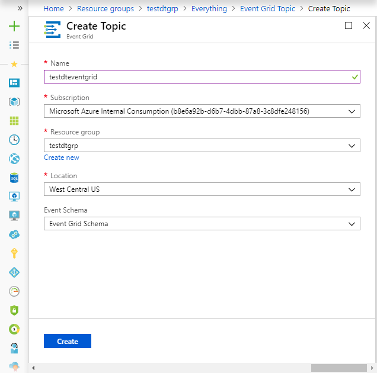
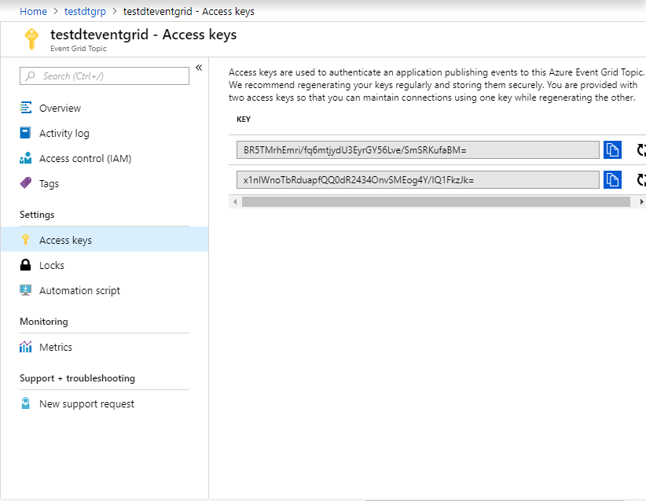

# Tutorial: Custom monitor your Azure Digital Twins setup

Azure Digital Twins service allows you to bring together people, places and things in a coherent spatial system. This is the second tutorial in a series that demonstrate how to use the Digital Twins to manage your facilities for efficient space utilization. Once you have provisioned your sample building using the steps in the previous tutorial, you can create and run custom computations on your sensor data using this tutorial.

In this tutorial, you learn how to:

> [!div class="checklist"]
> * Create Matchers
> * Create a User-Defined Function
> * Create endpoints for the User-Defined Function
> * Simulate sensor data
> * Run the User-Defined Function

If you don’t have an Azure, create a [free account](https://azure.microsoft.com/free/?WT.mc_id=A261C142F).

## Prerequisites

This tutorial assumes that you have completed the steps to [Provision your Azure Digital Twins setup](tutorial-facilities-setup.md). Before proceeding, make sure that you have:
- an instance of Digital Twins running, and 
- the [Azure Digital Twins sample application](https://github.com/Azure-Samples/digital-twins-samples-csharp) downloaded or cloned on your work machine.

## Create Matchers
Matchers define a set of specific conditions in the device or sensor data. Matchers will help you take action on the particular set of conditions, in the form of *user-defined functions*. The user-defined function can use one or more matchers to create a custom computation on the events coming from your spaces and devices. For more information, read the [Data Processing and User-Defined Functions](concepts-user-defined-functions.md). 

In the Digital Twins sample, navigate to the folder *occupancy-quickstart\src\actions* and open the file *provisionSample.yaml*. Note the section that begins with the type **matchers**. Each entry under this type creates a matcher with the specified **Name** and recording sensor data of type **dataTypeValue**. Notice how it relates to the space named *Focus Room A1*, which has a **devices** containing a few **sensors** provisioned for it. The **dataTypeValue** for the matchers should be one of these sensor's **dataType** values. This means, we are provisioning a matcher that will track conditions for this particular sensor's data. 

Add the following matcher below the existing matchers:
```yaml
      - name: Matcher Temperature
        dataTypeValue: Temperature
```
This will track the *SAMPLE_SENSOR_TEMPERATURE* sensor.  

## Create User-Defined Function
User-defined functions or UDFs allow you to customize the processing of telemetry data from your sensors. They are custom JavaScript code that can run within your Digital Twins instance, when specific conditions as described by the matchers occur. You can create *matchers* and *user-defined functions* for each sensor that you want to monitor. For more detailed information, read [Data Processing and User-Defined Functions](concepts-user-defined-functions.md). 

In the *provisionSample.yaml* file in the Digital Twins sample, look for section beginning with the type **userdefinedfunctions**. This section provisions a user-defined function of with a given **Name** and acting on the list of matchers under the **matcherNames**. Notice how you can add your own code for the UDF as the **script**. Also note the section named **roleassignments**. It assigns the *Space Administrator* role to the user-defined function. This is required for the function to access the events coming from any of the provisioned spaces. 

1. Open the file *src\actions\userDefinedFunctions\availability.js*, which is the file mentioned in the **script** element of the *provisionSample.yaml*, in your editor. Add the following lines of code:
    1. At the top of the file, add the following lines for temperature:
    ```JavaScript
        var temperatureType = "Temperature";
        var temperatureThreshold = 73;
    ```
    1. Add the following lines after the statement which defines `var motionSensor`:
    ```JavaScript
        var temperatureSensor = otherSensors.find(function(element) {
            return element.DataType === temperatureType;
        });
    ```
    1. Add the following line after the statement which defines `carbonDioxideValue`:
    ```JavaScript
        var temperatureValue = getFloatValue(temperatureSensor.Value().Value);
    ```
    1. Remove the following lines of code: 
    ```JavaScript
        if(carbonDioxideValue === null || motionValue === null) {
            sendNotification(telemetry.SensorId, "Sensor", "Error: Carbon dioxide or motion are null, returning");
            return;
        }
    ```
       Replace this code snippet with the following:
    ```JavaScript
        if(carbonDioxideValue === null || motionValue === null || temperatureValue === null){
            sendNotification(telemetry.SensorId, "Sensor", "Error: Carbon dioxide, motion, or temperature are null, returning");
            return;
        }
    ```
    1. Replace the line `var availableFresh = "Room is available and air is fresh";` with `var availableFresh = "Room is available, air is fresh, and temperature is just right.";`.
    1. Remove the following lines of code:
    ```JavaScript
        // If carbonDioxide less than threshold and no presence in the room => log, notify and set parent space computed value
        if(carbonDioxideValue < carbonDioxideThreshold && !presence) {
            log(`${availableFresh}. Carbon Dioxide: ${carbonDioxideValue}. Presence: ${presence}.`);
            setSpaceValue(parentSpace.Id, spaceAvailFresh, availableFresh);

            // Set up custom notification for air quality
            parentSpace.Notify(JSON.stringify(availableFresh));
        }
        else {
            log(`${noAvailableOrFresh}. Carbon Dioxide: ${carbonDioxideValue}. Presence: ${presence}.`);
            setSpaceValue(parentSpace.Id, spaceAvailFresh, noAvailableOrFresh);

            // Set up custom notification for air quality
            parentSpace.Notify(JSON.stringify(noAvailableOrFresh));
        }
    ```
      And replace them with the following:
    ```JavaScript
        // If carbonDioxide and temperature less than threshold and no presence in the room => log, notify and set parent space computed value
        if(carbonDioxideValue < carbonDioxideThreshold && temperatureValue < temperatureThreshold && !presence) {
            log(`${availableFresh}. Carbon Dioxide: ${carbonDioxideValue}. Temperature: ${temperatureValue}. Presence: ${presence}.`);
            setSpaceValue(parentSpace.Id, spaceAvailFresh, availableFresh);

            // Set up custom notification for air quality
            parentSpace.Notify(JSON.stringify(availableFresh));
        }
        else {
            log(`${noAvailableOrFresh}. Carbon Dioxide: ${carbonDioxideValue}. Temperature: ${temperatureValue}. Presence: ${presence}.`);
            setSpaceValue(parentSpace.Id, spaceAvailFresh, noAvailableOrFresh);

            // Set up custom notification for air quality
            parentSpace.Notify(JSON.stringify(noAvailableOrFresh));
        }
    ```
    1. Save the file. 

1. Run `dotnet run ProvisionSample` at the command line to provision your spatial topology and user-defined function. 

1. Follow the prompt to authenticate your application, by pasting the code at `https://microsoft.com/devicelogin`, and then signing in with your Azure account.

1. Once your login is authenticated, the application creates a sample spatial graph as configured in the *provisionSample.yaml*. Observe the messages in the command window and notice how your spatial graph gets created. Notice how it creates an IoT hub at the root node or the `Venue`. 

1. From the output in the command window, copy the value of the `ConnectionString`, under the `Devices` section, to your clipboard. You will need this value to simulate the device connection in the following tutorial.

    


## Create endpoints for User-Defined Functions
In this section, we will use [Event Grid](../event-grid/overview.md) to create an event notification system. Your Event Grid instance will use your Digital Twin instance as the [event source](../event-grid/event-sources.md), collect your sensor/device events, and redirect them to an [event handler](../event-grid/event-handlers.md) like Logic App, Event Hubs, etc. In the sample application, the UDF creates 

### Create Event Grid Topic
[Event Grid Topics](../event-grid/concepts.md#topics) provides endpoints for your application to send events. The User-Defined Function uses these endpoints on the backend to receive the events from your sensors. 

1. Sign in to the [Azure portal](https://portal.azure.com).

1. On the left navigation panel, select **Resource groups**, and search for the resource group you created or used for your Digital Twins instance. 

1. On the **Overview** pane of your resource group, click the **Add** button.

1. Search for and select **Event Grid Topic**. Click **Create**.

1. Enter a **Name** for your Event Grid Topic, choose **Subscription**, the **Resource group**, and the **Location**. Click **Create**. 

    

1. Navigate to the event grid topic from your resource group, click on **Access keys**, and copy **Key 1** and **Key 2** to your clipboard. You will use them to create the endpoint in the proceding steps.

    

### Create an endpoint for the Event Grid Topic

Make a POST call for the endpoint `POST https://{{endpoint-management}}/api/v1.0/endpoints`, with the following body:

```
{
  "type": "EventGrid",
  "path": "<topicName coming from Topic Endpoint>",
  "eventTypes": ["SensorChange","TopologyOperation", "SpaceChange", "UdfCustom"],
  "connectionString": "<Key 1 of the Event Grid Topic>",
  "secondaryConnectionString": "<Key 2 of the Event Grid Topic>"
}
```

## Simulate sensor data
In this section, you will simulate sensor data for detecting motion, temperature and carbon dioxide. You will use the sample Digital Twins application downloaded in the [first tutorial of the series](tutorial-facilities-setup.md) for device simulation.

1. In a command window, navigate to the sample Digital Twins application folder, and then run `cd device-connectivity`.
1. Run `dotnet restore` to make sure the dependencies for the project are correct.
1. Open the *appSettings.json* file in your editor, edit the following values:
    1. *DeviceConnectionString*: Assign the value of `ConnectionString` in the output window when you [provisioned your spatial graph](tutorial-facilities-setup.md#provision-your-spaces-and-device).
    2. *HardwareId* within the *Sensors* array: Make sure the hardware ID and the names match with what you had in the *provisionSample.yaml* file.
2. Run `dotnet run` to start simulating device events for temperature, motion and carbon dioxide. 

## Run the user-defined function

1. In a separate command window, navigate to the Digital Twin sample again. 

1. Run the following commands:

```cmd/sh
cd occupancy-quickstart
dotnet run GetAvailableAndFreshSpaces
```

The output window will show how the user-defined function executes, and intercepts events from the device simulation. 

   


## Clean up resources

If you wish to stop exploring Azure Digital Twins beyond this point, feel free to delete resources created in this tutorial:

1. From the left-hand menu in the [Azure portal](http://portal.azure.com), click **All resources**, select and **Delete** your Digital Twins resource group.
2. If you need to, you may proceed to delete the sample applications on your work machine as well. 


## Next steps

Proceed to the next tutorial in the series to learn how to create notifications for the simulated sensor data for your sample building. 
> [!div class="nextstepaction"]
> [Next steps button](tutorial-facilities-events.md)

