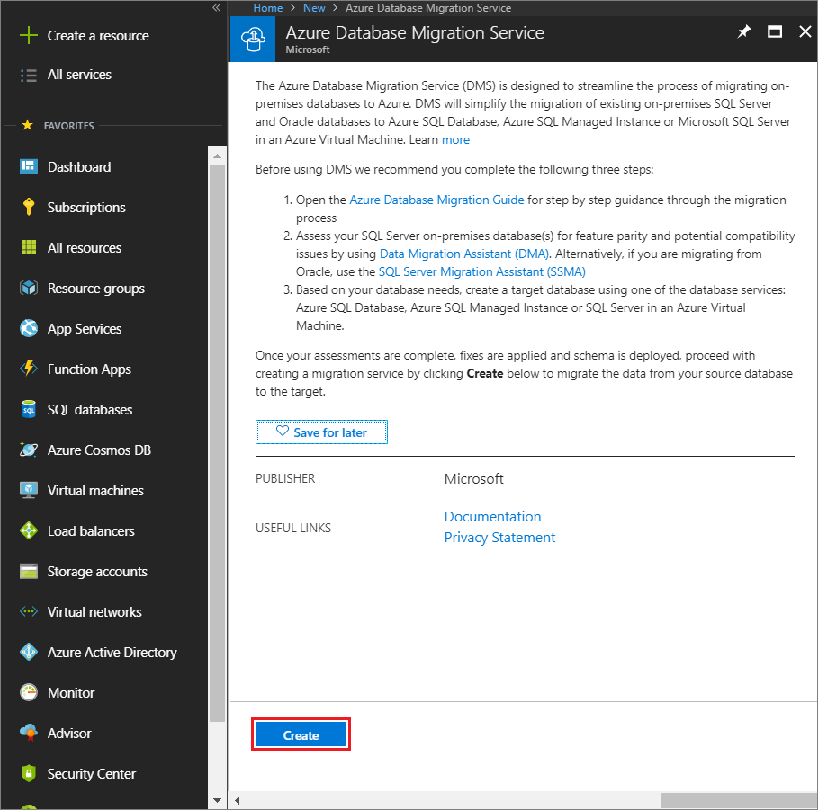
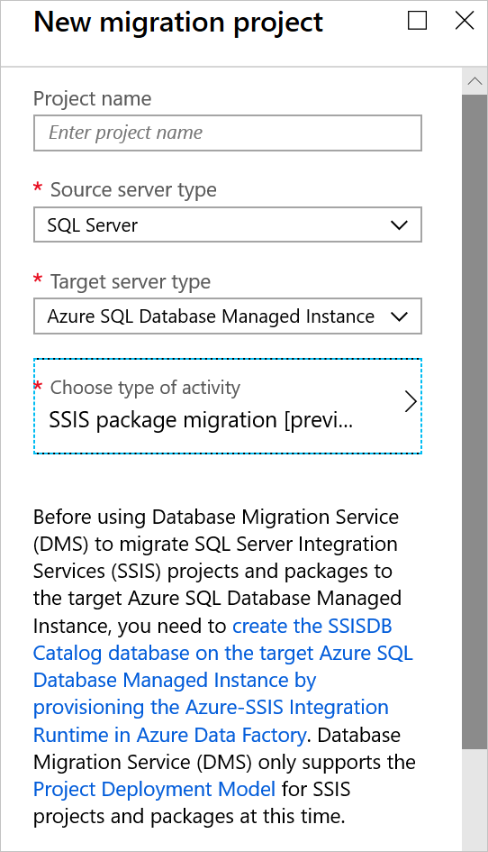
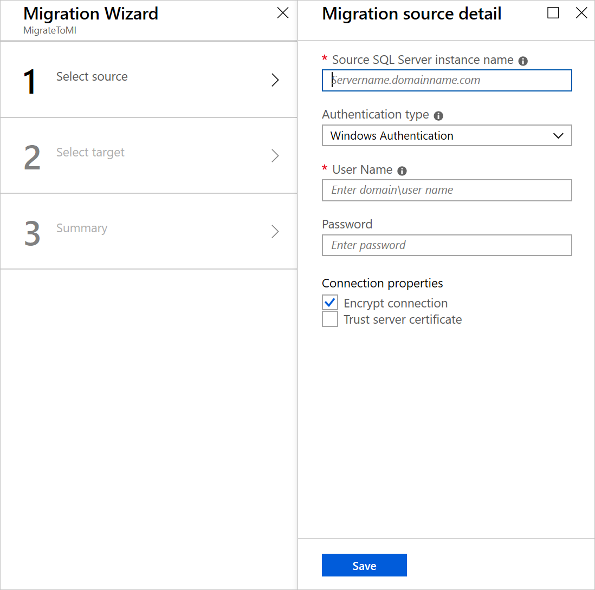
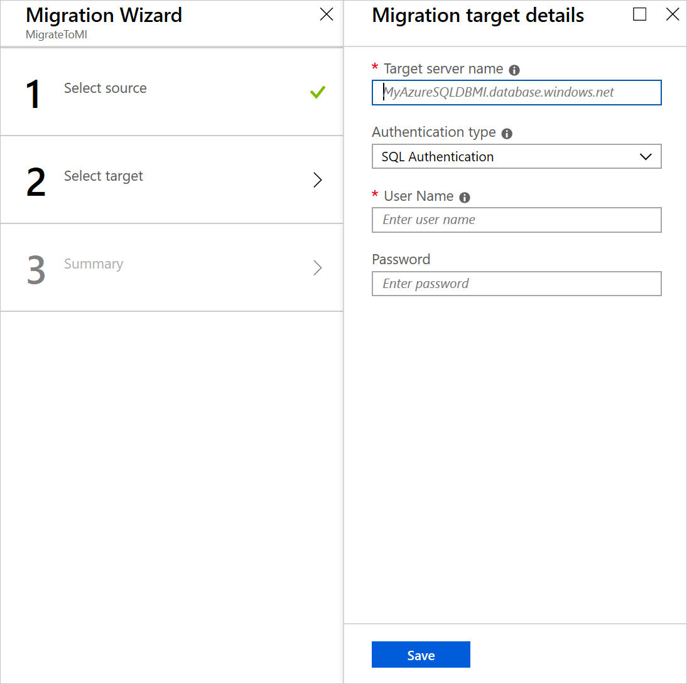
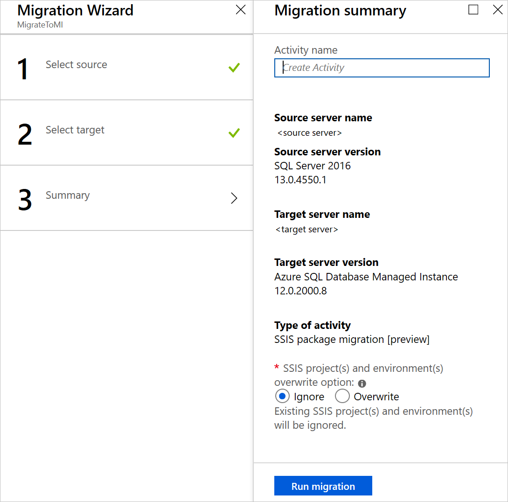

# Migrate SQL Server Integration Services packages to an Azure SQL Database managed instance
If you use SQL Server Integration Services (SSIS) and want to migrate your SSIS projects/packages from the source SSISDB hosted by SQL Server to the destination SSISDB hosted by an Azure SQL Database managed instance, you can use Azure Database Migration Service.

If the version of SSIS you use is earlier than 2012 or you use non-SSISDB package store types, before migrating your SSIS projects/packages, you need to convert them by using the Integration Services Project Conversion Wizard, which can also be launched from SSMS. For more information, see the article [Converting projects to the project deployment model](https://docs.microsoft.com/sql/integration-services/packages/deploy-integration-services-ssis-projects-and-packages?view=sql-server-2017#convert).

> [!NOTE]
> Azure Database Migration Service (DMS) currently does not support Azure SQL Database as a target migration destination. To redeploy SSIS projects/packages to Azure SQL Database, see the article [Redeploy SQL Server Integration Services packages to Azure SQL Database](https://docs.microsoft.com/azure/dms/how-to-migrate-ssis-packages).

In this article, you learn how to:
> [!div class="checklist"]
>
> * Assess source SSIS projects/packages.
> * Migrate SSIS projects/packages to Azure.

## Prerequisites

To complete these steps, you need:

* To create an Azure Virtual Network (VNet) for the Azure Database Migration Service by using the Azure Resource Manager deployment model, which provides site-to-site connectivity to your on-premises source servers by using either [ExpressRoute](https://docs.microsoft.com/azure/expressroute/expressroute-introduction) or [VPN](https://docs.microsoft.com/azure/vpn-gateway/vpn-gateway-about-vpngateways). For more information, see the article [Network topologies for Azure SQL Database managed instance migrations using Azure Database Migration Service]( https://aka.ms/dmsnetworkformi). For more information about creating a VNet, see the [Virtual Network Documentation](https://docs.microsoft.com/azure/virtual-network/), and especially the quickstart articles with step-by-step details.
* To ensure that your VNet Network Security Group rules don't block the following inbound communication ports to Azure Database Migration Service: 443, 53, 9354, 445, 12000. For more detail on Azure VNet NSG traffic filtering, see the article [Filter network traffic with network security groups](https://docs.microsoft.com/azure/virtual-network/virtual-network-vnet-plan-design-arm).
* To configure your [Windows Firewall for source database engine access](https://docs.microsoft.com/sql/database-engine/configure-windows/configure-a-windows-firewall-for-database-engine-access?view=sql-server-2017).
* To open your Windows Firewall to allow the Azure Database Migration Service to access the source SQL Server, which by default is TCP port 1433.
* If you're running multiple named SQL Server instances using dynamic ports, you may wish to enable the SQL Browser Service and allow access to UDP port 1434 through your firewalls so that the Azure Database Migration Service can connect to a named instance on your source server.
* If you're using a firewall appliance in front of your source databases, you may need to add firewall rules to allow the Azure Database Migration Service to access the source database(s) for migration, as well as files via SMB port 445.
* An Azure SQL Database managed instance to host SSISDB. If you need to create one, follow the detail in the article [Create an Azure SQL Database Managed Instance](https://docs.microsoft.com/azure/sql-database/sql-database-managed-instance-get-started).
* To ensure that the logins used to connect the source SQL Server and target managed instance are members of the sysadmin server role.
* To verify that SSIS is provisioned in Azure Data Factory (ADF) containing Azure-SSIS Integration Runtime (IR) with the destination SSISDB hosted by an Azure SQL Database managed instance (as described in the article [Create the Azure-SSIS integration runtime in Azure Data Factory](https://docs.microsoft.com/azure/data-factory/create-azure-ssis-integration-runtime)).

## Assess source SSIS projects/packages

While assessment of source SSISDB isn't yet integrated into the Database Migration Assistant (DMA), your SSIS projects/packages will be assessed/validated as they're redeployed to the destination SSISDB hosted on an Azure SQL Database managed instance.

## Register the Microsoft.DataMigration resource provider

1. Sign in to the Azure portal, select **All services**, and then select **Subscriptions**.

    

2. Select the subscription in which you want to create the instance of Azure Database Migration Service, and then select **Resource providers**.

    

3. Search for migration, and then to the right of **Microsoft.DataMigration**, select **Register**.

    

## Create an Azure Database Migration Service instance

1. In the Azure portal, select + **Create a resource**, search for **Azure Database Migration Service**, and then select **Azure Database Migration Service** from the drop-down list.

     

2. On the **Azure Database Migration Service** screen, select **Create**.

    

3. On the **Create Migration Service** screen, specify a name for the service, the subscription, and a new or existing resource group.

4. Select the location in which you want to create the instance of DMS.

5. Select an existing VNet or create one.

    The VNet provides Azure Database Migration Service with access to the source SQL Server and target Azure SQL Database managed instance.

    For more information on how to create a VNet in Azure portal, see the article [Create a virtual network using the Azure portal](https://aka.ms/DMSVnet).

    For additional detail, see the article [Network topologies for Azure SQL DB managed instance migrations using the Azure Database Migration Service](https://aka.ms/dmsnetworkformi).

6. Select a pricing tier.

    For more information on costs and pricing tiers, see the [pricing page](https://aka.ms/dms-pricing).

    

7. Select **Create** to create the service.

## Create a migration project

After an instance of the service is created, locate it within the Azure portal, open it, and then create a new migration project.

1. In the Azure portal, select **All services**, search for Azure Database Migration Service, and then select **Azure Database Migration Services**.

    

2. On the **Azure Database Migration Service** screen, search for the name of the instance that you created, and then select the instance.

3. Select + **New Migration Project**.

4. On the **New migration project** screen, specify a name for the project, in the **Source server type** text box, select **SQL Server**, in the **Target server type** text box, select **Azure SQL Database Managed Instance**, and then for **Choose type of activity**, select **SSIS package migration**.

   

5. Select **Create** to create the project.

## Specify source details

1. On the **Migration source detail** screen, specify the connection details for the source SQL Server.

2. If you haven't installed a trusted certificate on your server, select the **Trust server certificate** check box.

    When a trusted certificate isn't installed, SQL Server generates a self-signed certificate when the instance is started. This certificate is used to encrypt the credentials for client connections.

    > [!CAUTION]
    > SSL connections that are encrypted using a self-signed certificate does not provide strong security. They are susceptible to man-in-the-middle attacks. You should not rely on SSL using self-signed certificates in a production environment or on servers that are connected to the internet.

   

3. Select **Save**.

## Specify target details

1. On the **Migration target details** screen, specify the connection details for the target.

     

2. Select **Save**.

## Review the migration summary

1. On the **Migration summary** screen, in the **Activity name** text box, specify a name for the migration activity.

2. For the **SSIS project(s) and environment(s) overwrite option**, specify whether to overwrite or ignore existing SSIS projects and environments.

    

3. Review and verify the details associated with the migration project.

## Run the migration

* Select **Run migration**.

## Next steps

* Review the migration guidance in the Microsoft [Database Migration Guide](https://datamigration.microsoft.com/).
