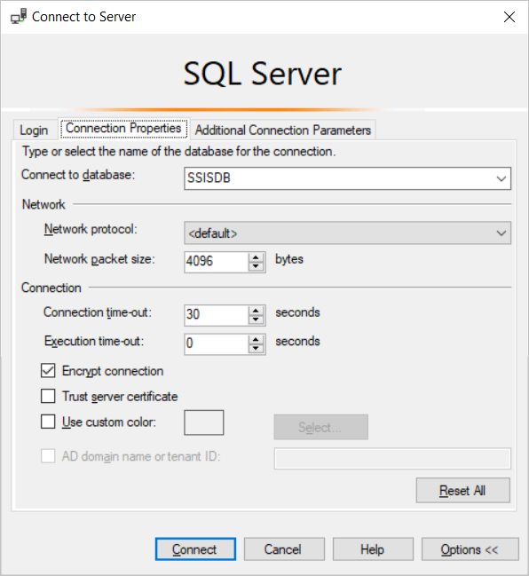
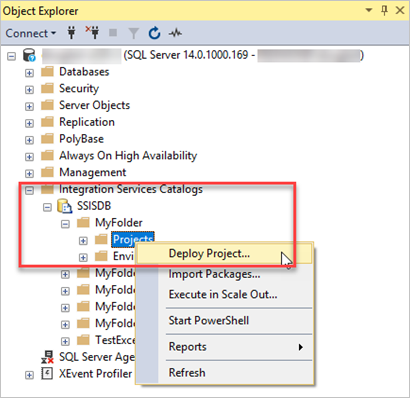
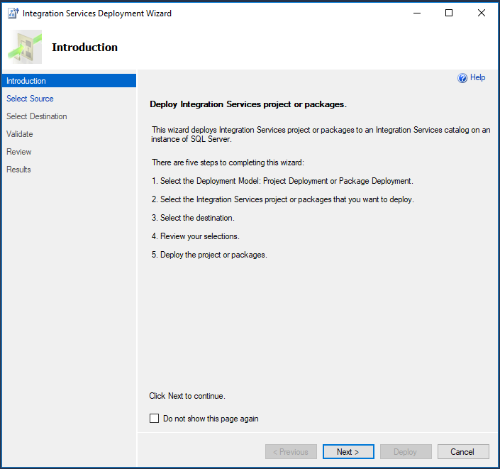
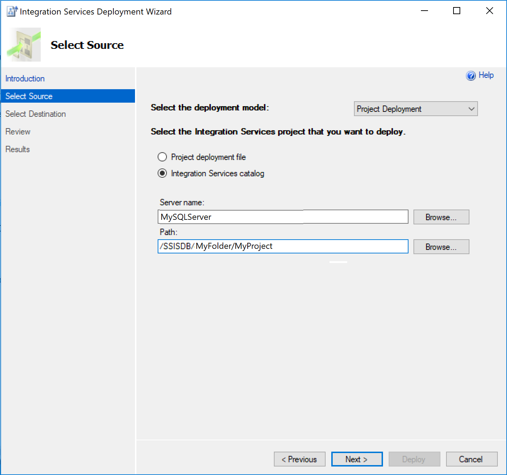
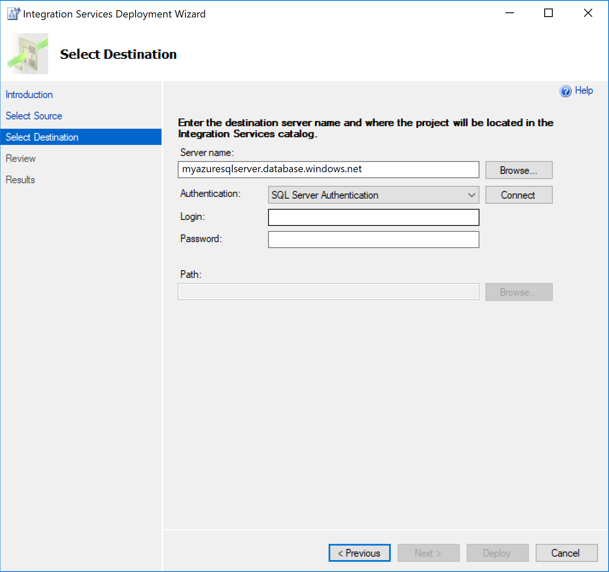
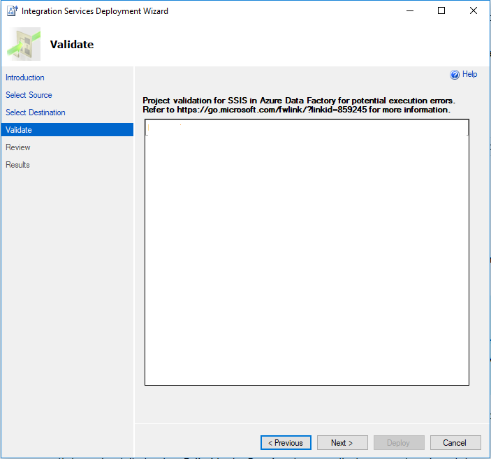

# Redeploy SQL Server Integration Services packages to Azure SQL Database

If you use SQL Server Integration Services (SSIS) and want to migrate your SSIS projects/packages from the source SSISDB hosted by SQL Server to the destination SSISDB hosted by Azure SQL Database, you can redeploy them using the Integration Services Deployment Wizard. You can launch the wizard from within SQL Server Management Studio (SSMS).

If the version of SSIS you use is earlier than 2012, before redeploying your SSIS projects/packages into the project deployment model, you first need to convert them by using the Integration Services Project Conversion Wizard, which can also be launched from SSMS. For more information, see the article [Converting projects to the project deployment model](https://docs.microsoft.com/sql/integration-services/packages/deploy-integration-services-ssis-projects-and-packages?view=sql-server-2017#convert).

> [!NOTE]
> The Azure Database Migration Service (DMS) currently does not support the migration of a source SSISDB to an Azure SQL Database server, but you can redeploy your SSIS projects/packages using the following process.

In this article, you learn how to:
> [!div class="checklist"]
>
> * Assess source SSIS projects/packages.
> * Migrate SSIS projects/packages to Azure.

## Prerequisites

To complete these steps, you need:

* SSMS version 17.2 or later.
* An instance of your target database server to host SSISDB. If you don’t already have one, create an Azure SQL Database server (without a database) using the Azure portal by navigating to the SQL Server (logical server only) [form](https://ms.portal.azure.com/#create/Microsoft.SQLServer).
* SSIS must be provisioned in Azure Data Factory (ADF) containing Azure-SSIS Integration Runtime (IR) with the destination SSISDB hosted by the instance of Azure SQL Database server (as described in the article [Provision the Azure-SSIS Integration Runtime in Azure Data Factory](https://docs.microsoft.com/azure/data-factory/tutorial-deploy-ssis-packages-azure)).

## Assess source SSIS projects/packages

While assessment of source SSISDB is not yet integrated into the Database Migration Assistant (DMA) or the Azure Database Migration Service (DMS), your SSIS projects/packages will be assessed/validated as they are redeployed to the destination SSISDB hosted on an Azure SQL Database server.

## Migrate SSIS projects/packages

To migrate SSIS projects/packages to Azure SQL Database server, perform the following steps.

1. Open SSMS, and then select **Options** to display the **Connect to Server** dialog box.

2. On the **Login** tab, specify the information necessary to connect to the Azure SQL Database server that will host the destination SSISDB.

    

3. On the **Connection Properties** tab, in the **Connect to database** text box, select or enter **SSISDB**, and then select **Connect**.

    

4. In the SSMS Object Explorer, expand the **Integration Services Catalogs** node, expand **SSISDB**, and if there are no existing folders, then right-click **SSISDB** and create a new folder.

5. Under **SSISDB**, expand any folder, right-click **Projects**, and then select **Deploy Project**.

    

6. In the Integration Services Deployment Wizard, on the **Introduction** page, review the information, and then select **Next**.

    

7. On the **Select Source** page, specify the existing SSIS project that you want to deploy.

    If SSMS is also connected to the SQL Server hosting the source SSISDB, select **Integration Services catalog**, and then enter the server name and project path in your catalog to deploy your project directly.

    Alternately, select **Project deployment file**, and then specify the path to an existing project deployment file (.ispac) to deploy your project.

    
 
8. Select **Next**.
9. On the **Select Destination** page, specify the destination for your project.

    a. In the Server name text box, enter the fully qualified Azure SQL Database server name (<server_name>.database.windows.net).

    b. Provide the authentication information, and then select **Connect**.

    

    c. Select **Browse** to specify the destination folder in SSISDB, and then select **Next**.

    > [!NOTE]
    > The **Next** button is enabled only after you've selected **Connect**.

10. On the **Validate** page, view any errors/warnings, and then if necessary, modify your packages accordingly.

    

11. Select **Next**.

12. On the **Review** page, review your deployment settings.

    > [!NOTE]
    > You can change your settings by selecting **Previous** or by selecting any of the step links in the left pane.

13. Select **Deploy** to start the deployment process.

14. After the deployment process is completed, you can view the Results page, which displays the success or failure of each deployment action.
    a. If any action failed, in the **Result** column, select **Failed** to display an explanation of the error.
    b. Optionally, select **Save Report** to save the results to an XML file.

15. Select **Close** to exit the Integration Services Deployment Wizard.

If the deployment of your project succeeds without failure, you can select any packages it contains to run on your Azure-SSIS IR.

## Next steps

* Review the migration guidance in the Microsoft [Database Migration Guide](https://datamigration.microsoft.com/).
