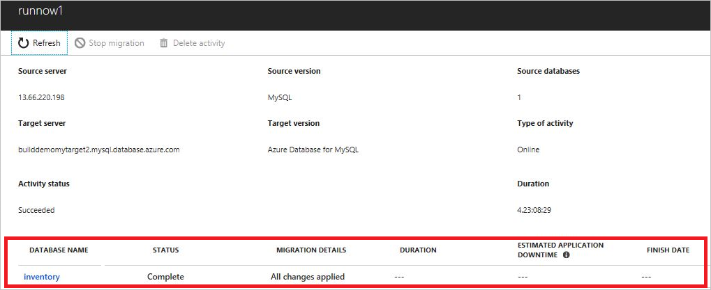
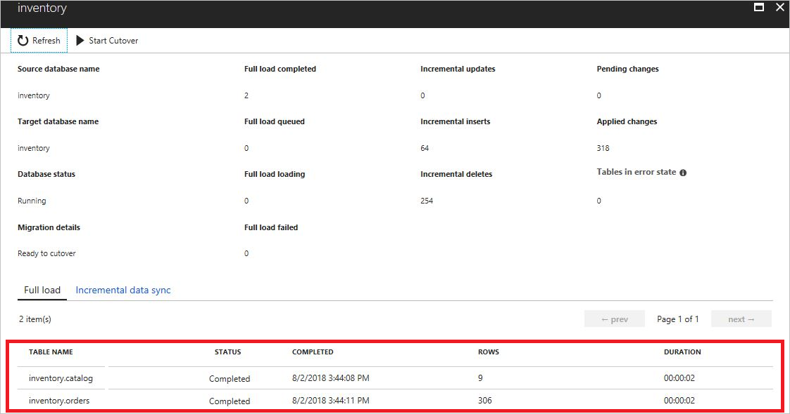
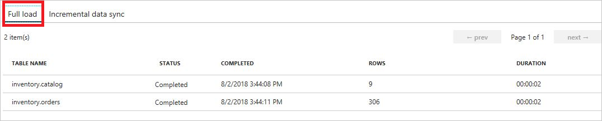
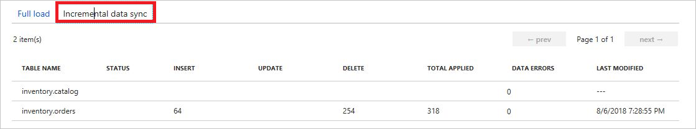

# Monitor migration activity using the Azure Database Migration Service
In this article, you learn how to monitor the progress of a migration at both a database level and a table level.

## Monitor at the database level
To monitor activity at the database level, view the database-level blade:

> [!NOTE]
> Selecting the database hyperlink will show you the list of tables and their migration progress.

The following table lists the fields on the database-level blade and describes the various status values associated with each.

<table id='overview' class='overview'>
  <thead>
    <tr>
      <th class="x-hidden-focus"><strong>Field name</strong></th>
      <th><strong>Field substatus</strong></th>
      <th><strong>Description</strong></th>
    </tr>
  </thead>
  <tbody>
    <tr>
      <td rowspan="3" class="ActivityStatus"><strong>Activity status</strong></td>
      <td>Running</td>
      <td>Migration activity is running.</td>
    </tr>
    <tr>
      <td>Succeeded</td>
      <td>Migration activity succeeded without issues.</td>
    </tr>
    <tr>
      <td>Faulted</td>
      <td>Migration failed. Select the ‘See error details’ link under migration details for the complete error message.</td>
    </tr>
    <tr>
      <td rowspan="4" class="Status"><strong>Status</strong></td>
      <td>Initializing</td>
      <td>DMS is setting up the migration pipeline.</td>
    </tr>
    <tr>
      <td>Running</td>
      <td>DMS pipeline is running and performing migration.</td>
    </tr>
    <tr>
      <td>Complete</td>
      <td>Migration completed.</td>
    </tr>
    <tr>
      <td>Failed</td>
      <td>Migration failed. Click on migration details to see migration errors.</td>
    </tr>
    <tr>
      <td rowspan="5" class="migration-details"><strong>Migration details</strong></td>
      <td>Initiating the migration pipeline</td>
      <td>DMS is setting up the migration pipeline.</td>
    </tr>
    <tr>
      <td>Full data load in progress</td>
      <td>DMS is performing initial load.</td>
    </tr>
    <tr>
      <td>Ready for Cutover</td>
      <td>After initial load is completed, DMS will mark database as ready for cutover. User should check if data has caught up on continuous sync.</td>
    </tr>
    <tr>
      <td>All changes applied</td>
      <td>Initial load and continuous sync are complete. This status also occurs after the database is cutover successfully.</td>
    </tr>
    <tr>
      <td>See error details</td>
      <td>Click on the link to show error details.</td>
    </tr>
    <tr>
      <td rowspan="1" class="duration"><strong>Duration</strong></td>
      <td>N/A</td>
      <td>Total time from migration activity being initialized to migration completed or migration faulted.</td>
    </tr>
     </tbody>
</table>

## Monitor at table level – Quick Summary
To monitor activity at the table level, view the table-level blade. The top portion of the blade shows the detailed number of rows migrated in full load and incremental updates. 

The bottom portion of the blade lists the tables and shows a quick summary of migration progress.

The following table describes the fields shown in the table-level details.

| Field name        | Description       |
| ------------- | ------------- |
| **Full load completed**      | Number of tables completed full data load. |
| **Full load queued**      | Number of tables being queued for full load.      |
| **Full load loading** | Number of tables failed.      |
| **Incremental updates**      | Number of change data capture (CDC) updates in rows applied to target. |
| **Incremental inserts**      | Number of CDC inserts in rows applied to target.      |
| **Incremental deletes** | Number of CDC deletes in rows applied to target.      |
| **Pending changes**      | Number of CDC in rows that are still waiting to get applied to target. |
| **Applied changes**      | Total of CDC updates, inserts, and deletes in rows applied to target.      |
| **Tables in error state** | Number of tables that are in ‘error’ state during migration. Some examples that tables can go into error state are when there are duplicates identified in the target or data isn't compatible loading in the target table.      |

## Monitor at table level – Detailed Summary
There are two tabs that show migration progress in Full load and Incremental data sync.
	

The following table describes the fields shown in table level migration progress.

| Field name        | Description       |
| ------------- | ------------- |
| **Status - Syncing**      | Continuous sync is running. |
| **Insert**      | Number of CDC inserts in rows applied to target.      |
| **Update** | Number of CDC updates in rows applied to target.      |
| **Delete**      | Number of CDC deletes in rows applied to target. |
| **Total Applied**      | Total of CDC updates, inserts, and deletes in rows applied to target. |
| **Data Errors** | Number of data errors happened in this table. Some examples of the errors are *511: Cannot create a row of size %d which is greater than the allowable maximum row size of %d, 8114: Error converting data type %ls to %ls.*  Customer should query from dms_apply_exceptions table in Azure target to see the error details.    |

> [!NOTE]
> CDC values of Insert, Update and Delete and Total Applied may decrease when database is cutover or migration is restarted.

## Next steps
- Review the migration guidance in the Microsoft [Database Migration Guide](/data-migration/).
