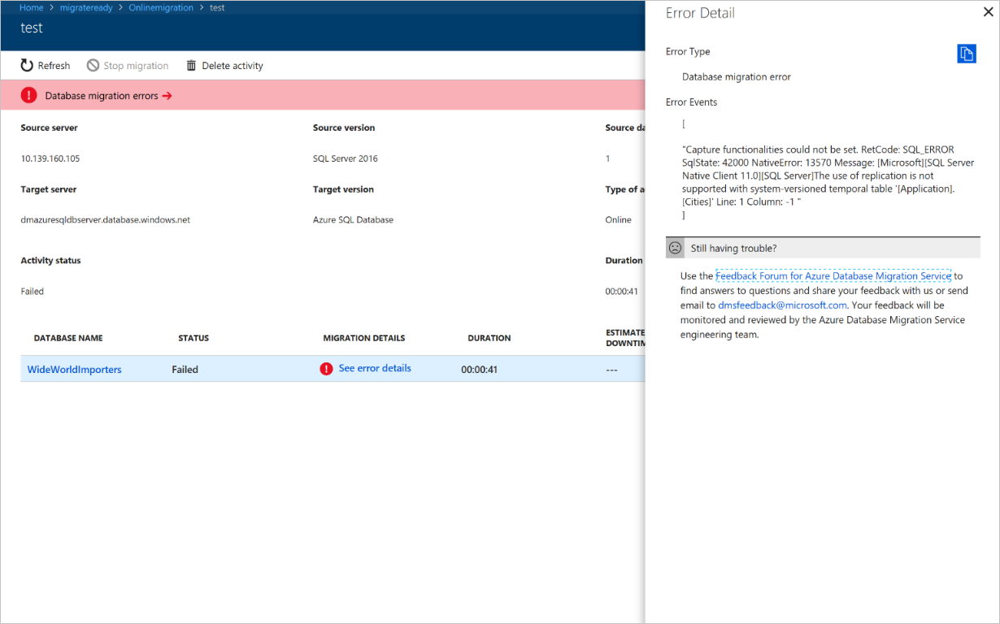
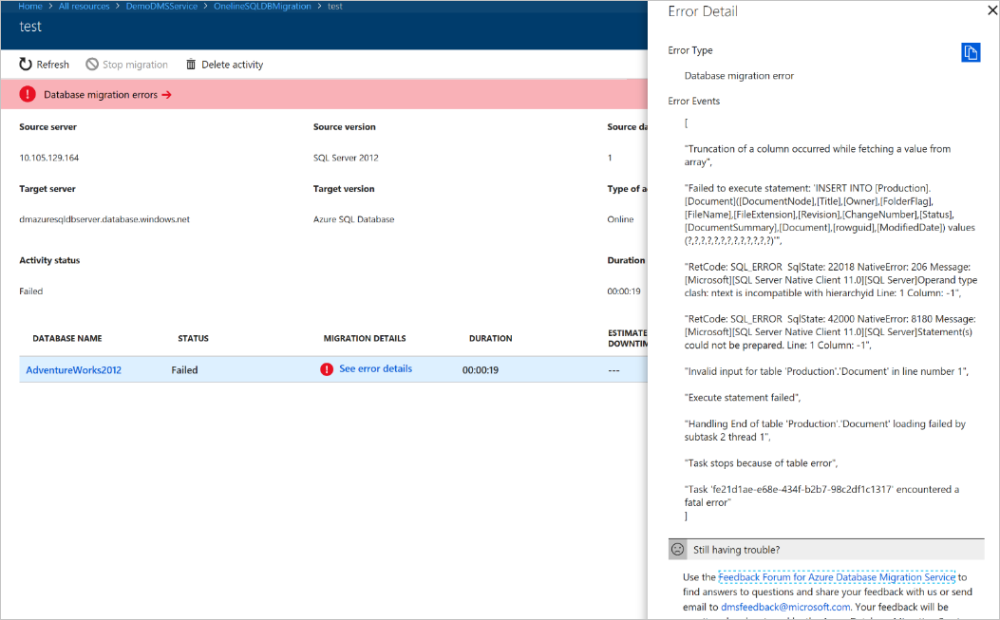
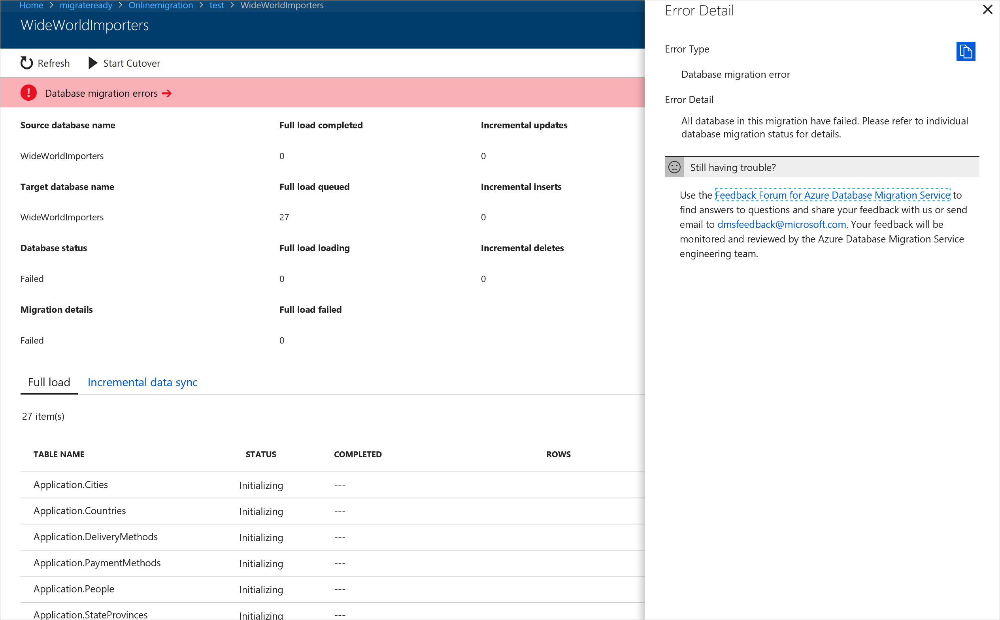

---
title: "Known issues: Online migrations to SQL Database"
titleSuffix: Azure Database Migration Service
description: Learn about known issues/migration limitations with online migrations to Azure SQL Database using the Azure Database Migration Service.
services: database-migration
author: pochiraju
ms.author: rajpo
manager: craigg
ms.reviewer: craigg
ms.service: dms
ms.workload: data-services
ms.custom: "seo-lt-2019"
ms.topic: article
ms.date: 02/20/2020
---

# Known issues/migration limitations with online migrations to Azure SQL Database

Known issues and limitations associated with online migrations from SQL Server to Azure SQL Database are described below.

> [!IMPORTANT]
> With online migrations of SQL Server to Azure SQL Database, migration of SQL_variant data types is not supported.

### Migration of temporal tables not supported

**Symptom**

If your source database consists of one or more temporal tables, your database migration fails during the “Full data load” operation and you may see the following message:

```
{ "resourceId":"/subscriptions/<subscription id>/resourceGroups/migrateready/providers/Microsoft.DataMigration/services/<DMS Service name>", "errorType":"Database migration error", "errorEvents":"["Capture functionalities could not be set. RetCode: SQL_ERROR SqlState: 42000 NativeError: 13570 Message: [Microsoft][SQL Server Native Client 11.0][SQL Server]The use of replication is not supported with system-versioned temporal table '[Application. Cities]' Line: 1 Column: -1 "]" }
```

 

**Workaround**

Use the following steps.

1. Find the temporal tables in your source schema using the query below.

     ``` 
     select name,temporal_type,temporal_type_desc,* from sys.tables where temporal_type <>0
     ```

2. Exclude these tables from the **Configure migration settings** blade, on which you specify tables for migration.

3. Rerun the migration activity.

**Resources**

For more information, see the article [Temporal Tables](https://docs.microsoft.com/sql/relational-databases/tables/temporal-tables?view=sql-server-2017).

### Migration of tables includes one or more columns with the hierarchyid data type

**Symptom**

You may see a SQL Exception suggesting “ntext is incompatible with hierarchyid” during the “Full data load” operation:



**Workaround**

Use the following steps.

1. Find the user tables that include columns with the hierarchyid data type using the query below.

      ``` 
      select object_name(object_id) 'Table name' from sys.columns where system_type_id =240 and object_id in (select object_id from sys.objects where type='U')
      ```

2. Exclude these tables from the **Configure migration settings** blade, on which you specify tables for migration.

3. Rerun the migration activity.

### Migration failures with various integrity violations with active triggers in the schema during “Full data load” or “Incremental data sync”

**Workaround**

Use the following steps.

1. Find the triggers that are currently active in the source database using the query below:

     ```
     select * from sys.triggers where is_disabled =0
     ```

2. Disable the triggers on your source database using the steps provided in the article [DISABLE TRIGGER (Transact-SQL)](https://docs.microsoft.com/sql/t-sql/statements/disable-trigger-transact-sql?view=sql-server-2017).

3. Rerun the migration activity.

### Support for LOB data types

**Symptom**

If the length of Large Object (LOB) column is bigger than 32 KB, data might get truncated at the target. You can check the length of LOB column using the query below:

``` 
SELECT max(DATALENGTH(ColumnName)) as LEN from TableName
```

**Workaround**

If you have an LOB column that is bigger than 32 KB, contact the engineering team at [Ask Azure Database Migrations](mailto:AskAzureDatabaseMigrations@service.microsoft.com).

### Issues with timestamp columns

**Symptom**

Azure Database Migration Service doesn't migrate the source timestamp value; instead, Azure Database Migration Service generates a new timestamp value in the target table.

**Workaround**

If you need Azure Database Migration Service to migrate the exact timestamp value stored in the source table, contact the engineering team at [Ask Azure Database Migrations](mailto:AskAzureDatabaseMigrations@service.microsoft.com).

### Data migration errors don't provide additional details on the Database detailed status blade

**Symptom**

When you come across migration failures in the Databases details status view, selecting the **Data migration errors** link on the top ribbon may not provide  additional details specific to the migration failures.



**Workaround**

To get to specific failure details, use the following steps.

1. Close the Database detailed status blade to display the Migration activity screen.

     

2. Select **See error details** to view specific error messages that help you to troubleshoot migration errors.

### Geography datatype not supported in SQLDB online migration

**Symptom**

Migration fails with an error message containing the following text:

     “** encountered a fatal error”, "errorEvents":<Table>.<Column> is of type 'GEOGRAPHY', which is not supported by 'Full Load' under 'Full LOB' support mode."

**Workaround**

While Azure Database Migration Service supports the Geography data type for offline migrations to Azure SQL Database, for online migrations, the Geography datatype is not supported. Try alternate methods to change the datatype at the source to a supported type before attempting to use Azure Database Migration Service for an online migration of this database.

### Supported editions

**Symptom**

Migration fails with an error message containing the following text:

    Migration settings validation error: The edition of the server [Business Intelligence Edition (64-bit)] does not match the supported edition(s) [Enterprise,Standard,Developer].

**Workaround**

Support for online migrations to Azure SQL Database using Azure Database Migration Service extends only to the Enterprise, Standard, and Developer editions. Be sure that you are using a supported edition before beginning the migration process.
