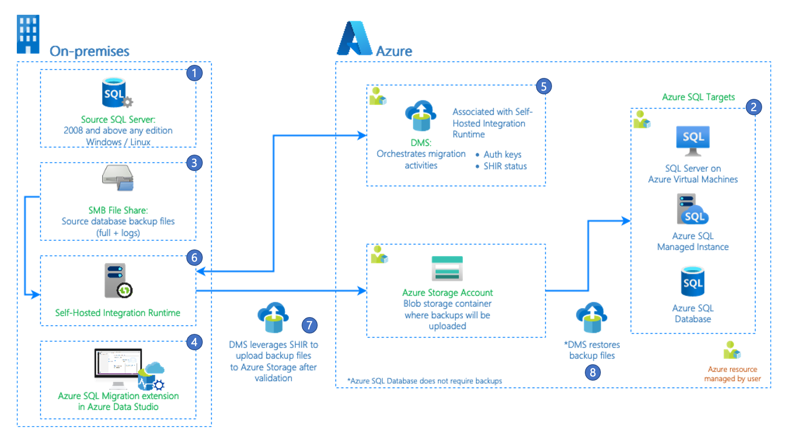

# Migrate databases with Azure SQL migration extension for Azure Data Studio

The [Azure SQL migration extension for Azure Data Studio](/sql/azure-data-studio/extensions/azure-sql-migration-extension) enables you to assess, get right-sized Azure recommendations and migrate your SQL Server databases to Azure.

The key benefits of using the Azure SQL migration extension for Azure Data Studio are:

- A responsive user interface that provides you with an end-to-end migration experience that starts with a migration readiness assessment, SKU recommendation (based on performance data).
- An enhanced assessment mechanism that can evaluate SQL Server instances, identifying databases ready for migration to the different Azure SQL targets.
    > [!NOTE]
    > You can assess SQL Server databases running on Windows and Linux Operating systems using the Azure SQL migration extension.
- An SKU recommendation engine (Preview) that collects performance data from the source SQL Server instance on-premises, generating right-sized SKU recommendations based on your Azure SQL target.
- A reliable Azure service powered by Azure Database Migration Service that orchestrates data movement activities to deliver a seamless migration experience.
- The ability to run online (for migrations requiring minimal downtime) or offline (for migrations where downtime persists through the migration) migration modes to suit your business requirements.
- The flexibility to create and configure a self-hosted integration runtime to provide your own compute for accessing the source SQL Server and backups in your on-premises environment.

Check the following step-by-step tutorials for more information about each specific migration scenario by Azure SQL target:

| Migration scenario | Migration mode
|---------|---------|
SQL Server to Azure SQL Managed Instance| [Online](./tutorial-sql-server-managed-instance-online-ads.md) / [Offline](./tutorial-sql-server-managed-instance-offline-ads.md)
SQL Server to SQL Server on Azure Virtual Machine|[Online](./tutorial-sql-server-to-virtual-machine-online-ads.md) / [Offline](./tutorial-sql-server-to-virtual-machine-offline-ads.md)
SQL Server to Azure SQL Database (Preview)| [Offline](./tutorial-sql-server-azure-sql-database-offline-ads.md)

> [!IMPORTANT]
> If your target is Azure SQL Database (Preview), make sure to deploy the database schema before starting the migration. You can use tools as [SQL Server dacpac extension](/sql/azure-data-studio/extensions/sql-server-dacpac-extension) or, [SQL Database Projects extension](/sql/azure-data-studio/extensions/sql-database-project-extension) for Azure Data Studio.

The following 16-minute video explains recent updates and features added to the Azure SQL migration extension in Azure Data Studio. Including the new workflow for SQL Server database assessments and SKU recommendations.

<iframe src="https://aka.ms/docs/player?show=data-exposed&ep=assess-get-recommendations-migrate-sql-server-to-azure-using-azure-data-studio" width="800" height="450"></iframe>

## Architecture of Azure SQL migration extension for Azure Data Studio

Azure Database Migration Service (DMS) is one of the core components in the overall architecture. DMS provides a reliable migration orchestrator to enable database migrations to Azure SQL. 
Create or reuse an existing DMS using the Azure SQL migration extension in Azure Data Studio (ADS).
DMS uses Azure Data Factory's self-hosted integration runtime to access and upload valid backup files from your on-premises network share or your Azure Storage account.

The workflow of the migration process is illustrated below.

1. **Source SQL Server**: SQL Server instance on-premises, private cloud, or any public cloud virtual machine. All versions of SQL Server 2008 and above are supported.
2. **Target Azure SQL**: Supported Azure SQL targets are **Azure SQL Managed Instance**, **SQL Server on Azure Virtual Machines** (*registered with SQL IaaS extension - [full management mode](/azure/azure-sql/virtual-machines/windows/sql-server-iaas-agent-extension-automate-management#management-modes)*), or **Azure SQL Database (Preview)**.
3. **Network File Share**: Server Message Block (SMB) network file share where backup files are stored for the database(s) to be migrated. Azure Storage blob containers and Azure Storage file share are also supported.
4. **Azure Data Studio**: Download and install the [Azure SQL migration extension in Azure Data Studio](/sql/azure-data-studio/extensions/azure-sql-migration-extension).
5. **Azure DMS**: Azure service that orchestrates migration pipelines to do data movement activities from on-premises to Azure. DMS is associated with Azure Data Factory's (ADF) self-hosted integration runtime (IR) and provides the capability to register and monitor the self-hosted IR.
6. **Self-hosted integration runtime (IR)**: Self-hosted IR should be installed on a machine that can connect to the source SQL Server and the location of the backup file. DMS provides the authentication keys and registers the self-hosted IR.
7. **Backup files upload to Azure Storage**: DMS uses self-hosted IR to upload valid backup files from the on-premises backup location to your Azure Storage account. Data movement activities and pipelines are automatically created in the migration workflow to upload the backup files.
8. **Restore backups on target Azure SQL**: DMS restores backup files from your Azure Storage account to the supported target Azure SQL. 

    > [!NOTE]
    > If your migration target is Azure SQL Database (Preview), you don't need backups to perform this migration. The migration to Azure SQL Database is considered a logical migration involving the database's pre-creation and data movement (performed by DMS).

    > [!IMPORTANT]
    > With online migration mode, DMS continuously uploads the backup source files to Azure Storage and restores them to the target until you complete the final step of cutting over to the target.
    >
    > In offline migration mode, DMS uploads the backup source files to Azure Storage and restores them to the target without requiring you to perform a cutover.

## Prerequisites

The following sections walk through the prerequisites for each supported Azure SQL target.

### [Azure SQL Managed Instance](#tab/azure-sql-mi)

[!INCLUDE [dms-ads-sqlmi-prereq](../../includes/dms-ads-sqlmi-prereq.md)]

### [SQL Server on Azure Virtual Machine](#tab/azure-sql-vm)

[!INCLUDE [dms-ads-sqlvm-prereq](../../includes/dms-ads-sqlvm-prereq.md)]

### [Azure SQL Database (Preview)](#tab/azure-sql-db)

[!INCLUDE [dms-ads-sqldb-prereq](../../includes/dms-ads-sqldb-prereq.md)]

---

### Recommendations for using self-hosted integration runtime for database migrations
- Use a single self-hosted integration runtime for multiple source SQL Server databases.
- Install only one instance of self-hosted integration runtime on any single machine.
- Associate only one self-hosted integration runtime with one DMS.
- The self-hosted integration runtime uses resources (memory / CPU) on the machine where it's installed. Install the self-hosted integration runtime on a machine different from your source SQL Server. However, having the self-hosted integration runtime close to the data source reduces the time for the self-hosted integration runtime to connect to the data source. 
- Use the self-hosted integration runtime only when you have your database backups in an on-premises SMB network share. Self-hosted integration runtime isn't required for database migrations if your source database backups are already in the Azure storage blob container.
- We recommend up to 10 concurrent database migrations per self-hosted integration runtime on a single machine. To increase the number of concurrent database migrations, scale-out self-hosted runtime up to four nodes or create separate self-hosted integration runtime on different machines.
- Configure self-hosted integration runtime to auto-update to automatically apply any new features, bug fixes, and enhancements that are released. To learn more, see [Self-hosted Integration Runtime Auto-update](../data-factory/self-hosted-integration-runtime-auto-update.md).

## Monitor database migration progress from the Azure portal
When you migrate the database(s) using the Azure SQL migration extension for Azure Data Studio, the migrations are orchestrated by the Azure Database Migration Service that was selected in the wizard. To monitor database migrations from the Azure portal, 
- Open the [Azure portal](https://portal.azure.com/)
- Search for your Azure Database Migration Service by the resource name
  :::image type="content" source="media/migration-using-azure-data-studio/search-dms-portal.png" alt-text="Search Azure Database Migration Service resource in portal":::
- Select the **Monitor migrations** tile on the **Overview** page to view the details of your database migrations.
  :::image type="content" source="media/migration-using-azure-data-studio/dms-ads-monitor-portal.png" alt-text="Monitor migrations in Azure portal":::

## Known issues and limitations
- Overwriting existing databases using DMS in your target Azure SQL Managed Instance or SQL Server on Azure Virtual Machine isn't supported.
- Configuring high availability and disaster recovery on your target to match source topology isn't supported by DMS.
- The following server objects aren't supported:
    - Logins
    - SQL Server Agent jobs
    - Credentials
    - SSIS packages
    - Server roles
    - Server audit
- SQL Server 2008 and below as target versions aren't supported when migrating to SQL Server on Azure Virtual Machines.
- If you're using SQL Server 2012 or SQL Server 2014, you need to store your source database backup files on an Azure Storage Blob Container instead of using the network share option. Store the backup files as page blobs since block blobs are only supported in SQL 2016 and after.
- You can't use an existing self-hosted integration runtime created from Azure Data Factory for database migrations with DMS. Initially, the self-hosted integration runtime should be created using the Azure SQL migration extension in Azure Data Studio and can be reused for further database migrations. 

## Pricing
- Azure Database Migration Service is free to use with the Azure SQL migration extension in Azure Data Studio. You can migrate multiple SQL Server databases using the Azure Database Migration Service at no charge using the service or the Azure SQL migration extension.
- There's no data movement or data ingress cost for migrating your databases from on-premises to Azure. If the source database is moved from another region or an Azure VM, you may incur [bandwidth charges](https://azure.microsoft.com/pricing/details/bandwidth/) based on your bandwidth provider and routing scenario.
- Provide your machine or on-premises server to install Azure Data Studio.
- A self-hosted integration runtime is needed to access database backups from your on-premises network share.

## Regional Availability
For the list of Azure regions that support database migrations using the Azure SQL migration extension for Azure Data Studio (powered by Azure DMS), see [Azure products available by region](https://azure.microsoft.com/global-infrastructure/services/?products=database-migration)

## Next steps

- For an overview and installation of the Azure SQL migration extension, see [Azure SQL migration extension for Azure Data Studio](/sql/azure-data-studio/extensions/azure-sql-migration-extension).