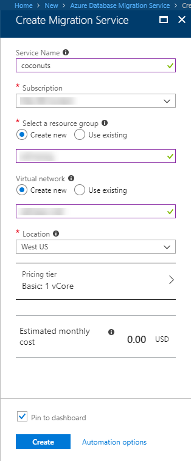

# Create a Database Migration Service instance using the Azure portal
In this quick start, you use the Azure portal to create an instance of the Azure Database Migration Service.  After you create the service, you will be able to use it to migrate data from SQL Server on premises to an Azure SQL database.

If you don't have an Azure subscription, create a [free](https://azure.microsoft.com/free/) account before you begin.

## Log in to the Azure portal
Open your web browser, and navigate to the [Microsoft Azure portal](https://portal.azure.com/). Enter your credentials to sign in to the portal. The default view is your service dashboard.

## Register the resource provider
You need to register the Microsoft.DataMigration resource provider before you create your first Database Migration Service.

1. In the Azure portal, select **All services**, and then select **Subscriptions**.

1. Select the subscription in which you want to create the instance of the Azure Database Migration Service, and then select **Resource providers**.

1. Search for migration, and then to the right of Microsoft.DataMigration, select **Register**.

## Create Azure Database Migration Service
1. Click **+** to create a new service.  Database Migration Service is still in preview.  

1. Search the marketplace for "migration", select "Database Migration Service (preview)," then click **create**.

    

    - Choose a **Service name** that is memorable and unique to identify your Azure Database Migration Service Instance.
    - Select your Azure **Subscription** in which you want to create the Database Migration Service.
    - Create a new **Network** with a unique name.
    - Choose the **Location** that is closest to your source or target server.
    - Select Basic: 1 vCore for the **Pricing tier**.

1. Click **Create**.

After a few moments, your Azure Database Migration service will be created and ready to use.  You'll see the Database Migration Service as shown in the image.

## Clean up resources
You can clean up the resources that you created in the quickstart by deleting the [Azure resource group](../azure-resource-manager/resource-group-overview.md).  To delete the resource group, navigate to the Database Migration Service you created, click on the **Resource group** name and then select **Delete resource group**.  This action deletes all of the assets in the resource group as well as the group itself.

## Next steps
> [!div class="nextstepaction"]
> [Migrate SQL Server on-premises to Azure SQL DB](tutorial-sql-server-to-azure-sql.md)