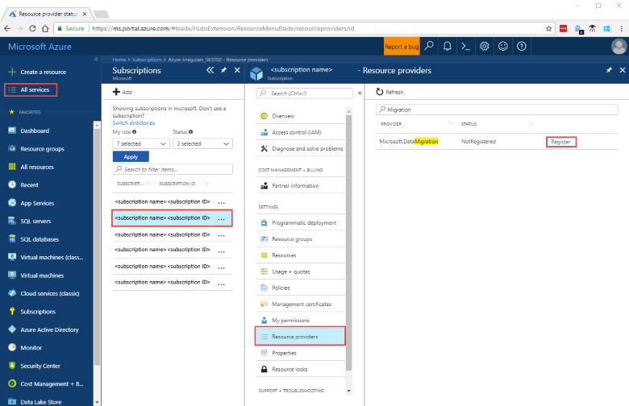
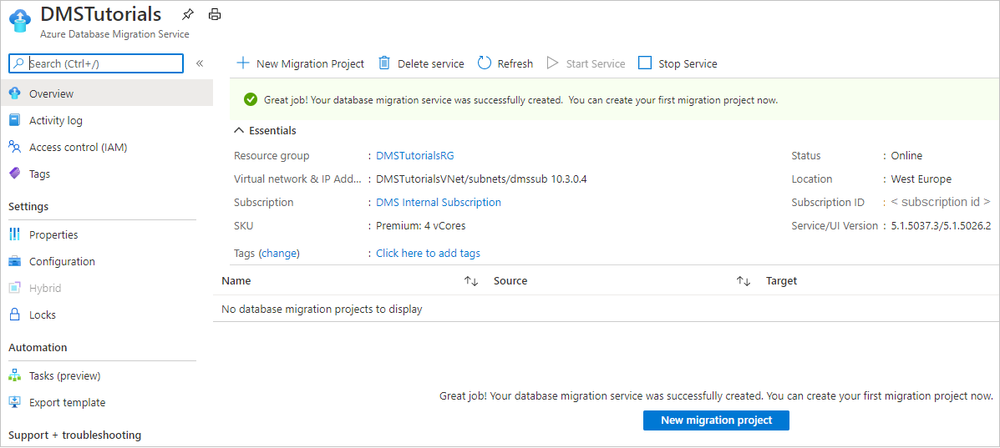

# Quickstart: Create an instance of the Azure Database Migration Service by using the Azure portal

In this quickstart, you use the Azure portal to create an instance of Azure Database Migration Service. After you create the instance, you can use it to migrate data from multiple database sources to Azure data platforms, such as from SQL Server to Azure SQL Database or from SQL Server to an Azure SQL Managed Instance.

If you don't have an Azure subscription, create a [free](https://azure.microsoft.com/free/) account before you begin.

## Sign in to the Azure portal

Open your web browser, navigate to the [Microsoft Azure portal](https://portal.azure.com/), and then enter your credentials to sign in to the portal. The default view is your service dashboard.

> [!NOTE]
> You can create up to 10 instances of DMS per subscription per region. If you require a greater number of instances, please create a support ticket.

## Register the resource provider

Register the Microsoft.DataMigration resource provider before you create your first instance of the Database Migration Service.

1. In the Azure portal, search for and select **Subscriptions**.

   

2. Select the subscription in which you want to create the instance of Azure Database Migration Service, and then select **Resource providers**.

    

3. Search for migration, and then select **Register** for **Microsoft.DataMigration**.

    

## Create an instance of the service

1. In the Azure portal menu or on the **Home** page, select **Create a resource**. Search for and select **Azure Database Migration Service**.

    

2. On the **Azure Database Migration Service** screen, select **Create**.

    

3. On the **Create Migration Service** basics screen:

     - Select the subscription.
     - Create a new resource group or choose an existing one.
     - Specify a name for the instance of the Azure Database Migration Service.
     - Select the location in which you want to create the instance of Azure Database Migration Service.
     - Choose **Azure** as the service mode.
     - Select a pricing tier. For more information on costs and pricing tiers, see the [pricing page](https://aka.ms/dms-pricing).
     
    

     - Select Next: Networking.

4. On the **Create Migration Service** networking screen:

    - Select an existing virtual network or create a new one. The virtual network provides Azure Database Migration Service with access to the source database and target environment. For more information about how to create a virtual network in the Azure portal, see the article [Create a virtual network using the Azure portal](../virtual-network/quick-create-portal.md).

    

    - Select **Review + Create** to create the service. 
    
    - After a few moments, your instance of Azure Database Migration service is created and ready to use:

    

## Clean up resources

You can clean up the resources created in this quickstart by deleting the [Azure resource group](../azure-resource-manager/management/overview.md). To delete the resource group, navigate to the instance of the Azure Database Migration Service that you created. Select the **Resource group** name, and then select **Delete resource group**. This action deletes all assets in the resource group as well as the group itself.

## Next steps

* [Migrate SQL Server to Azure SQL Database](tutorial-sql-server-to-azure-sql.md)
* [Migrate SQL Server to an Azure SQL Managed Instance offline](tutorial-sql-server-to-managed-instance.md)
* [Migrate SQL Server to an Azure SQL Managed Instance online](tutorial-sql-server-managed-instance-online.md)
