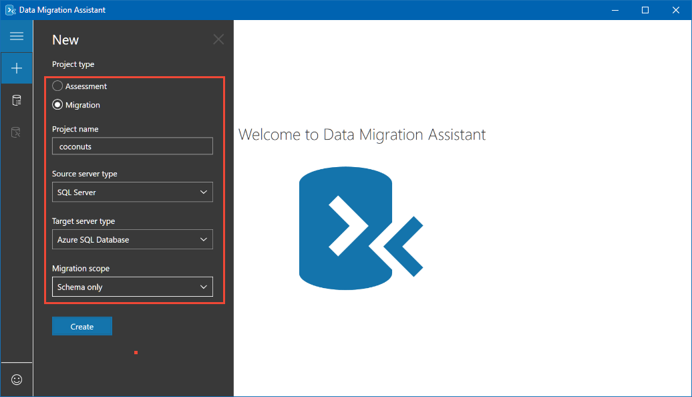
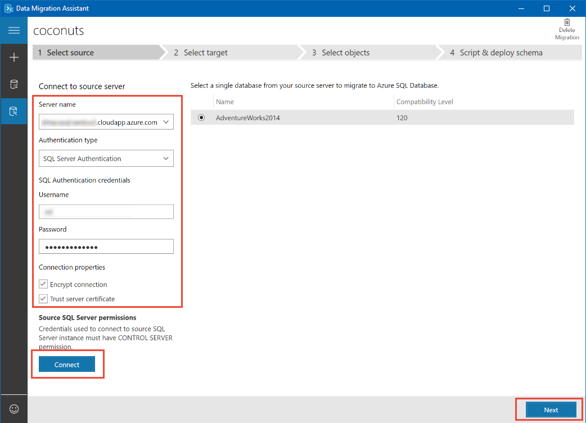
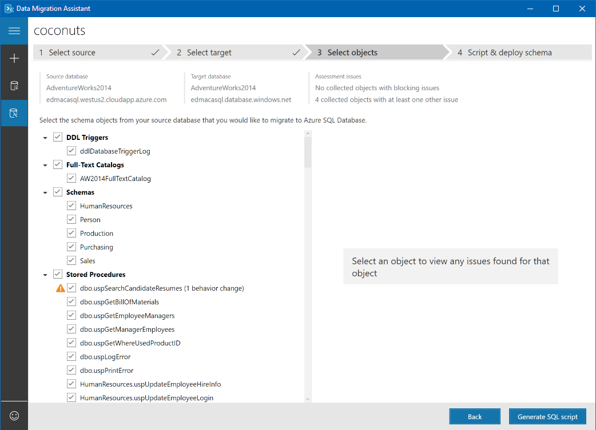
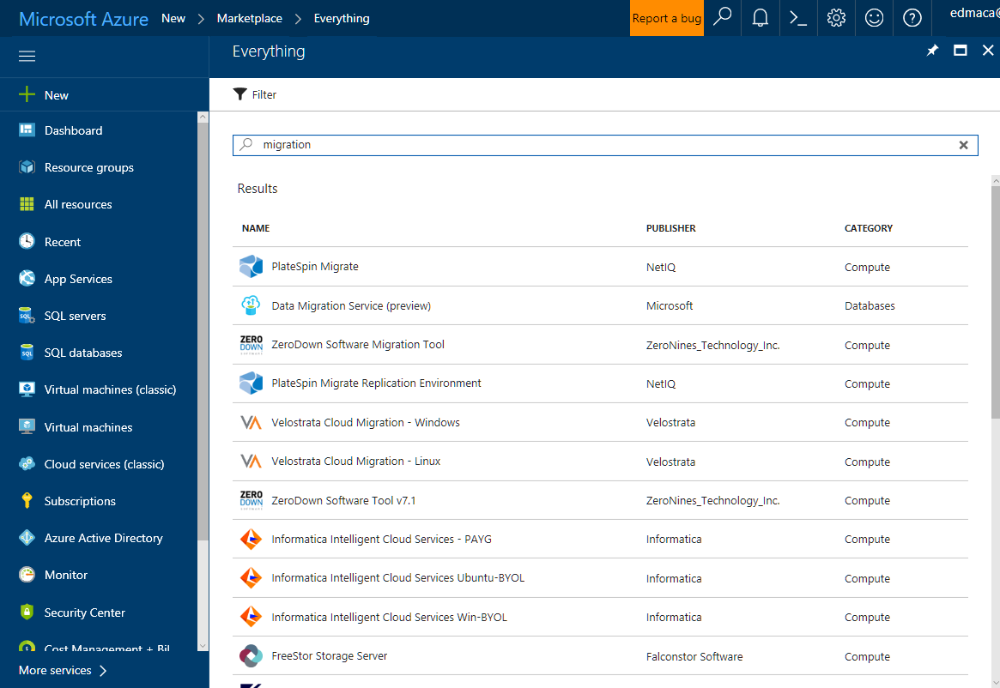
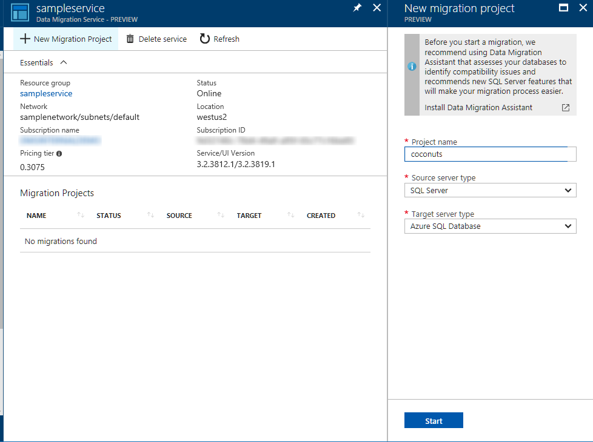
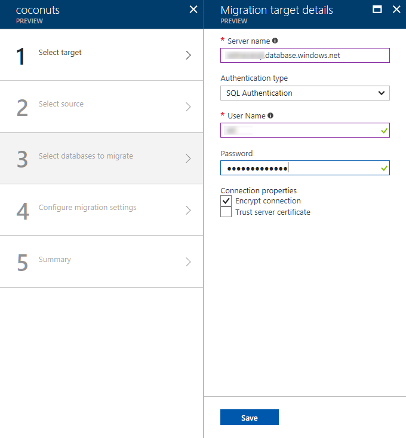
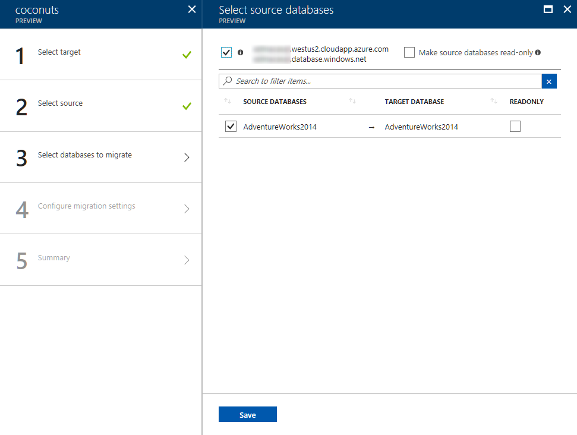
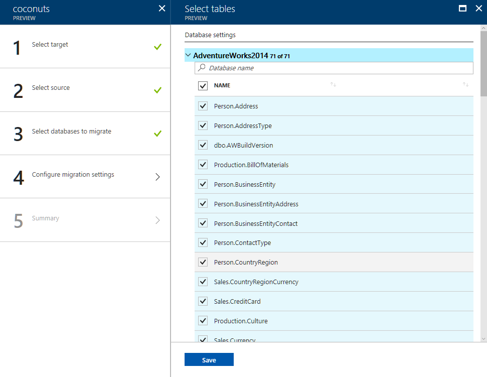
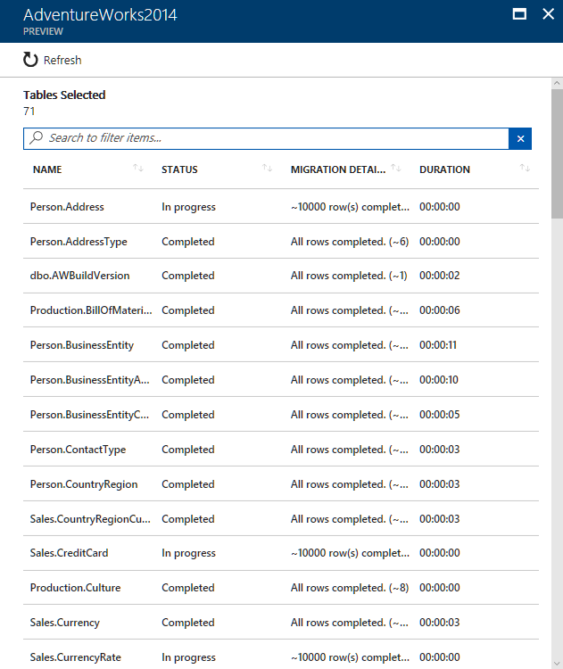

# Migrate AdventureWorks
This quickstart migrates the sample AdventureWorks 2014 database from an on-premises SQL Server instance to an Azure SQL database.  It uses Microsoft Data Migration Assistant to migrate the schema and Azure Data Migration Service to migrate the data.

## Prerequisites
- An instance of SQL Server with an AdventureWorks 2014 database that is directly connected to Azure.
- An empty Azure SQL database.
- [Microsoft Data Migration Assistant](https://aka.ms/get-dma)
- Azure Data Migration Service requires a VNET created by using the Azure Resource Manager deployment model, which provides site-to-site connectivity to your on-premises source servers by using either [ExpressRoute](https://docs.microsoft.com/azure/expressroute/expressroute-introduction) or [VPN](https://docs.microsoft.com/azure/vpn-gateway/vpn-gateway-about-vpngateways).

## Create a migration project
1. Open Microsoft Data Migration assistant and choose **+** to create a new project.
1. Set **Project type** to "Migration."
1. Give the project a memorable name.
1. Choose "SQL Server" for **Source server type**.
1. For **Target server type**, choose "Azure SQL Database."
1. **Migration scope** must be set to "Schema only."

1. Click **Create**.

## Select schema source
1. Enter your server name or IP address.
1. Choose the appropriate **authentication type** for your server.  This example uses SQL Authentication, your screen may look slightly different.
1. Enter your **username** and **password**.
1. Ensure **Encrypt connection** is checked and if you are using a self-signed certificate also check **Trust server certificate**
1. Click **Connect**.

1. Choose AdventureWorks 2014 and click **Next**.

> [!NOTE]
> Credentials used to connect to the source SQL Server instance must have CONTROL SERVER permission.

## Select schema target
1. Enter the name of your Azure SQL server.
1. Choose the appropriate **Authentication type** for your server.  This example uses SQL Authentication, your screen may look slightly different.
1. Ensure **Encrypt connection** is checked.
1. Click **Connect**.
1. Choose your Azure SQL database and then click **Next**.

> [!NOTE]
> The principal used to connect to the target Azure SQL database must have CONTROL DATABASE permission on the target database.

## Select schema objects
Choose the objects you want to migrate to the target.  By default all of the database objects are selected.  You can click on individual objects and see any issues associated with it.  For purposes of this quickstart, you don't need to be concerned with any of the listed issues.

When you're satisfied that all database objects are selected, click **Generate SQL scripts**.

## Script and deploy schema
You can review potential migration issues by clicking **Next issue** and **Previous issue**.  You should see a total of four instances of these two issues:

- Full-Text Search has changed since SQL Server 2008.
- SERVERPROPERTY('LCID') result differs from SQL Server 2000.

You don't need to be concerned with any of these issues, they are warnings and not errors.  When you're ready, click **Deploy schema**.

## Create Data Migration Service
Navigate to the Azure portal and click **+** to create a new service.  Data Migration Service is still in preview.  Search the marketplace for "migration" and select "Data Migration Service (preview)."

Setting|Suggested value|Description
---|---|---
Service name |*example-name*|Choose a unique name that identifies your Azure Data Migration Service.
Subscription|*my subscription*|The Azure subscription that you want to use. If you have multiple subscriptions, choose the appropriate subscription in which the resource is billed for.
Network|*mynetworkname*| Create a new network with a unique name.
Location |*mylocation*| Choose the location that is closest to your source or target server.

## Create new migration project
1. Click on "New Migration Project."
1. Give the project a memorable name.
1. Select "SQL Server" as the **Source server type**.
1. Set **Target server type** to  "Azure SQL Database."

1. Click **Start**.

## Select data target
Setting|Suggested value|Description
---|---|---
Server name |*example-name*|Enter the fully qualified name of your Azure SQL server.
Authentication type||Choose the appropriate type for your server, either "SQL Authentication" or "Windows Authentication."
User name|*myusername*| Your user name
Password |*mypassword*| Your password

Ensure **Encrypt connection** is checked and if you are using a self-signed certificate also check **Trust server certificate**.

## Select data source
Setting|Suggested value|Description
---|---|---
Server name |*example-name*|Enter the fully qualified name or IP address of your SQL Server.
Authentication type| |Choose the appropriate type for your server, either "SQL Authentication" or "Windows Authentication"
User name|*myusername*| Your user name
Password |*mypassword*| Your password

Ensure **Encrypt connection** is checked and if you are using a self-signed certificate also check **Trust server certificate**.

> [!NOTE]
> If you enter your credentials correctly but still receive an error message, you need to check **Trust server certificate**.

## Select source databases
Check AdventureWorks2014 and select your target database.  You can make a database read only for the duration of the migration.

Click **Save**

## Select tables
If it exists in the source, target, and is empty, a table is automatically checked for migration.  Expand AdventureWorks2014 and review the selected tables. When you are satisfied that they are all selected, click **Save**.

## Run and monitor
To see detailed migration status:

1. Click **Run migration**.
1. Click your migration's name.
1. Click AdventureWorks2014.

 
## Next steps
- Request a [preview of Azure Data Migration Service](https://aka.ms/get-dms).
- Overview of [Data Migration Assistant](https://aka.ms/dma).