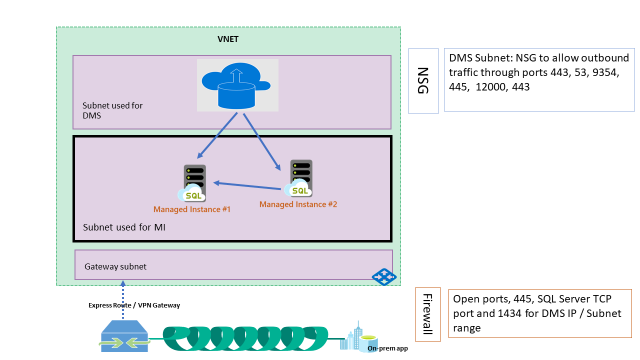
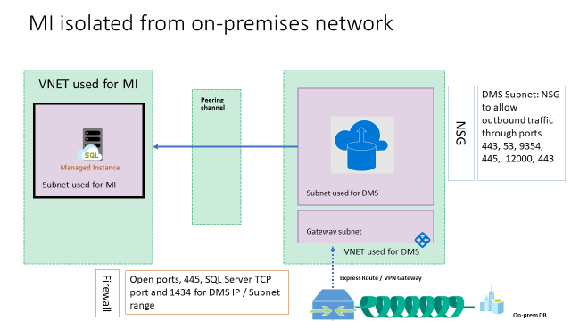
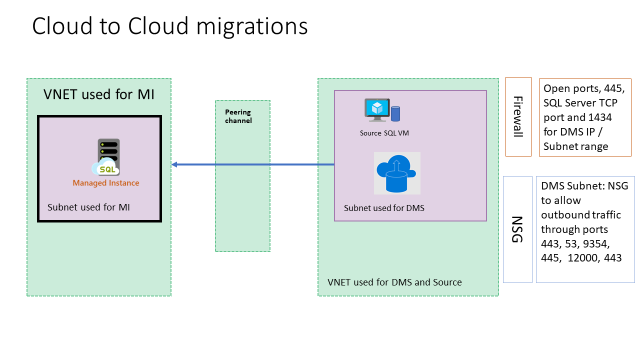
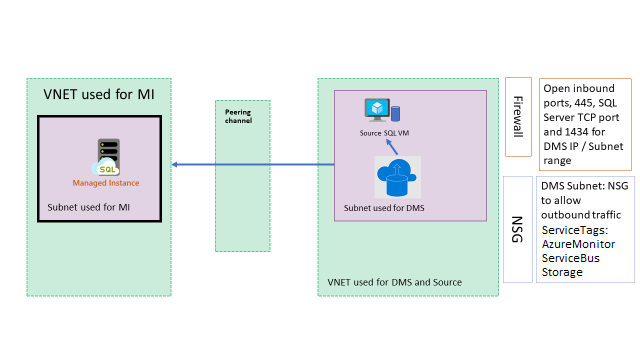

# Network topologies for Azure SQL Managed Instance migrations using Azure Database Migration Service

This article discusses various network topologies that Azure Database Migration Service can work with to provide a comprehensive migration experience from SQL Servers to Azure SQL Managed Instance.

## Azure SQL Managed Instance configured for Hybrid workloads 

Use this topology if your Azure SQL Managed Instance is connected to your on-premises network. This approach provides the most simplified network routing and yields maximum data throughput during the migration.

**Requirements**

- In this scenario, the SQL Managed Instance and the Azure Database Migration Service instance are created in the same Microsoft Azure Virtual Network, but they use different subnets.  
- The virtual network used in this scenario is also connected to the on-premises network by using either [ExpressRoute](https://docs.microsoft.com/azure/expressroute/expressroute-introduction) or [VPN](https://docs.microsoft.com/azure/vpn-gateway/vpn-gateway-about-vpngateways).

## SQL Managed Instance isolated from the on-premises network

Use this network topology if your environment requires one or more of the following scenarios:

- The SQL Managed Instance is isolated from on-premises connectivity, but your Azure Database Migration Service instance is connected to the on-premises network.
- If Role Based Access Control (RBAC) policies are in place and you need to limit the users to accessing the same subscription that is hosting the SQL Managed Instance.
- The  virtual networks used for the SQL Managed Instance and Azure Database Migration Service are in different subscriptions.

**Requirements**

- The virtual network that Azure Database Migration Service uses for this scenario must also be connected to the on-premises network by using either (https://docs.microsoft.com/azure/expressroute/expressroute-introduction) or [VPN](https://docs.microsoft.com/azure/vpn-gateway/vpn-gateway-about-vpngateways).
- Set up [VNet network peering](https://docs.microsoft.com/azure/virtual-network/virtual-network-peering-overview) between the virtual network used for SQL Managed Instance and Azure Database Migration Service.

## Cloud-to-cloud migrations: Shared virtual network

Use this topology if the source SQL Server is hosted in an Azure VM and shares the same virtual network with SQL Managed Instance and Azure Database Migration Service.

**Requirements**

- No additional requirements.

## Cloud to cloud migrations: Isolated virtual network

Use this network topology if your environment requires one or more of the following scenarios:

- The SQL Managed Instance is provisioned in an isolated virtual network.
- If Role Based Access Control (RBAC) policies are in place and you need to limit the users to accessing the same subscription that is hosting SQL Managed Instance.
- The virtual networks used for SQL Managed Instance and Azure Database Migration Service are in different subscriptions.

**Requirements**

- Set up [VNet network peering](https://docs.microsoft.com/azure/virtual-network/virtual-network-peering-overview) between the virtual network used for SQL Managed Instance and Azure Database Migration Service.

## Inbound security rules

| **NAME**   | **PORT** | **PROTOCOL** | **SOURCE** | **DESTINATION** | **ACTION** |
|------------|----------|--------------|------------|-----------------|------------|
| DMS_subnet | Any      | Any          | DMS SUBNET | Any             | Allow      |

## Outbound security rules

| **NAME**                  | **PORT**                                              | **PROTOCOL** | **SOURCE** | **DESTINATION**           | **ACTION** | **Reason for rule**                                                                                                                                                                              |
|---------------------------|-------------------------------------------------------|--------------|------------|---------------------------|------------|--------------------------------------------------------------------------------------------------------------------------------------------------------------------------------------------------|
| management                | 443,9354                                              | TCP          | Any        | Any                       | Allow      | Management plane communication through Service Bus and Azure blob storage.  (If Microsoft peering is enabled, you may not need this rule.)                                                             |
| Diagnostics               | 12000                                                 | TCP          | Any        | Any                       | Allow      | DMS uses this rule to collect diagnostic information for troubleshooting purposes.                                                                                                                      |
| SQL Source server         | 1433 (or TCP IP port that SQL Server is listening to) | TCP          | Any        | On-premises address space | Allow      | SQL Server source connectivity from DMS  (If you have site-to-site connectivity, you may not need this rule.)                                                                                       |
| SQL Server named instance | 1434                                                  | UDP          | Any        | On-premises address space | Allow      | SQL Server named instance source connectivity from DMS  (If you have site-to-site connectivity, you may not need this rule.)                                                                        |
| SMB share                 | 445                                                   | TCP          | Any        | On-premises address space | Allow      | SMB network share for DMS to store database backup files for migrations to Azure SQL Database MI and SQL Servers on Azure VM  (If you have site-to-site connectivity, you may not need this rule). |
| DMS_subnet                | Any                                                   | Any          | Any        | DMS_Subnet                | Allow      |                                                                                                                                                                                                  |

## See also

- [Migrate SQL Server to SQL Managed Instance](https://docs.microsoft.com/azure/dms/tutorial-sql-server-to-managed-instance)
- [Overview of prerequisites for using Azure Database Migration Service](https://docs.microsoft.com/azure/dms/pre-reqs)
- [Create a virtual network using the Azure portal](https://docs.microsoft.com/azure/virtual-network/quick-create-portal)

## Next steps

- For an overview of Azure Database Migration Service, see the article [What is Azure Database Migration Service?](dms-overview.md).
- For current information about regional availability of Azure Database Migration Service, see the [Products available by region](https://azure.microsoft.com/global-infrastructure/services/?products=database-migration) page.
