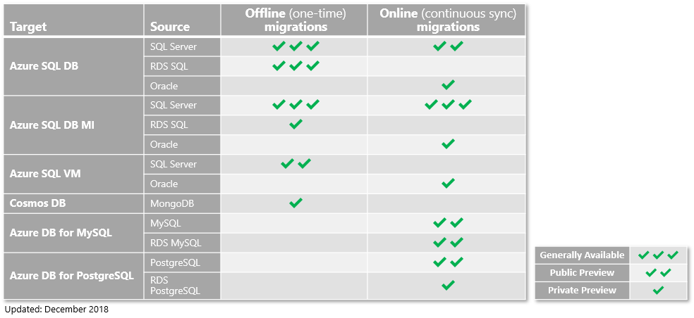

---
title: Database migration scenario status | Microsoft Docs
description: Learn about the status of the migration scenarios supported by the Azure Database Migration Service.
services: database-migration
author: pochiraju
ms.author: rajpo
manager: 
ms.reviewer: 
ms.service: database-migration
ms.workload: data-services
ms.custom: mvc
ms.topic: article
ms.date: 12/09/2018
---

# Status of migration scenarios supported by the Azure Database Migration Service
This article identifies the status of the various migration scenarios supported by the Azure Database Migration Service.

## Migration scenario status
The following graphic shows the current status of the migration scenarios supported when using the Azure Database Migration Service.

   

> [!NOTE]
> Scenarios that are in Public Preview or Generally Available are accessible to everyone. To take advantage of scenarios that are in Private Preview, submit a nomination via the [DMS Preview site](https://aka.ms/dms-preview).

## Next steps
For an overview of the Azure Database Migration Service and regional availability, see the article [What is the Azure Database Migration Service](dms-overview.md). 
