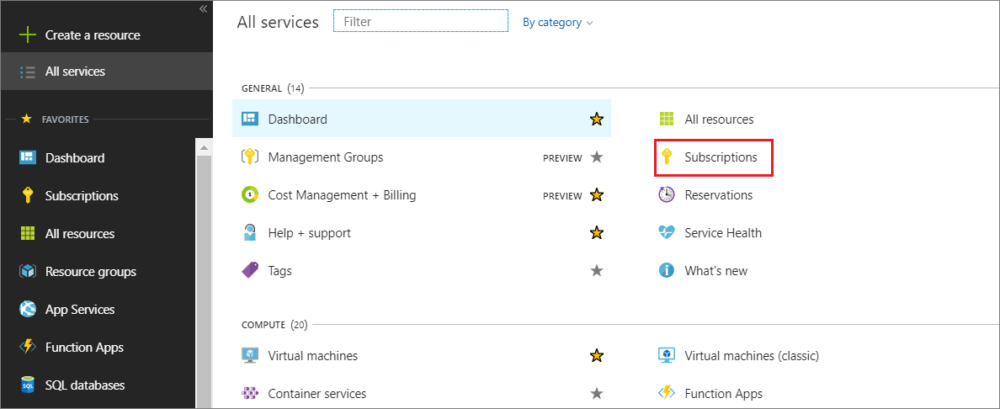
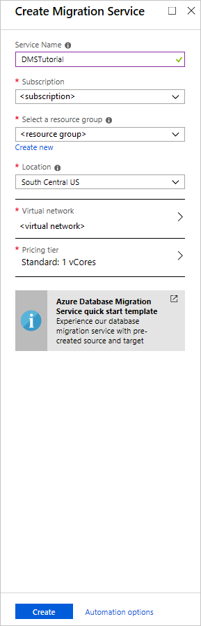
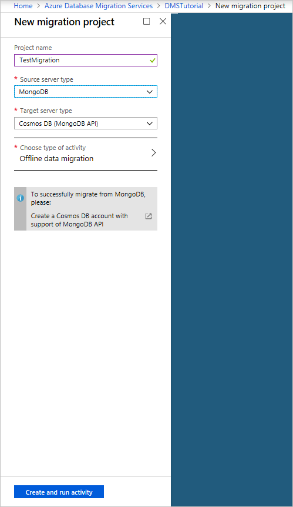
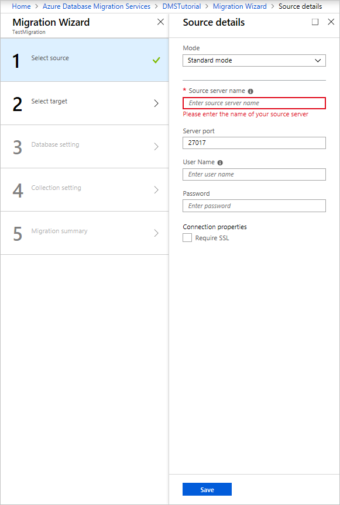
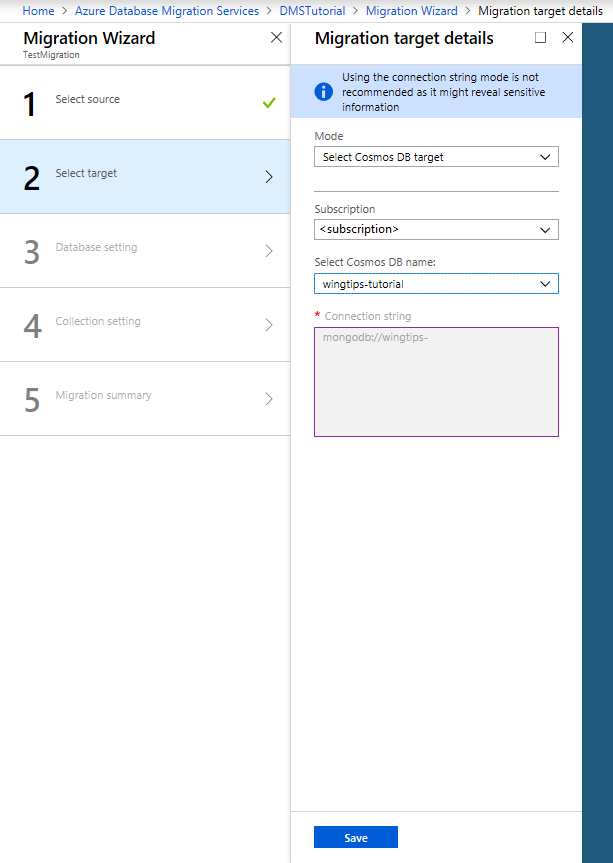
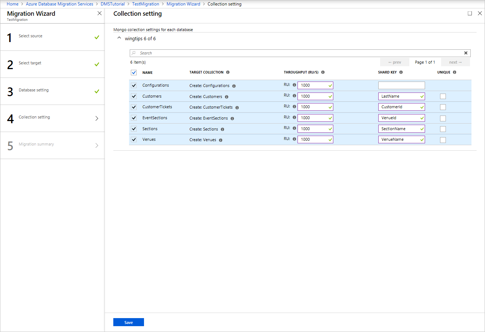
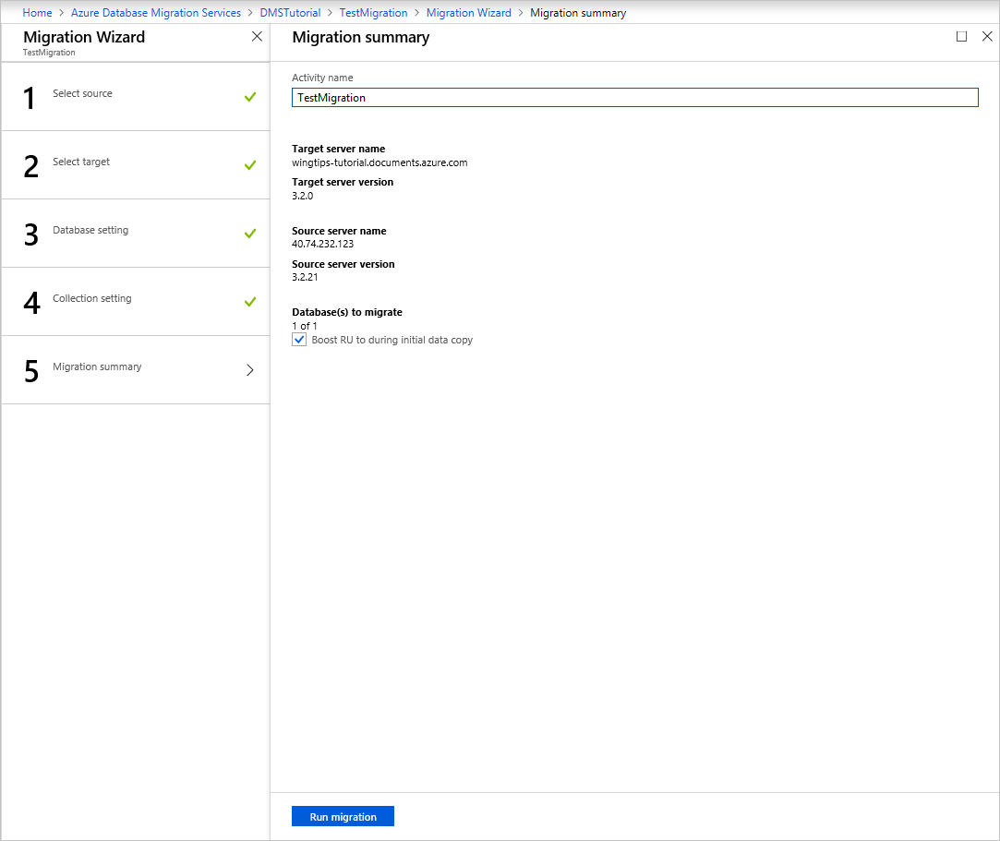
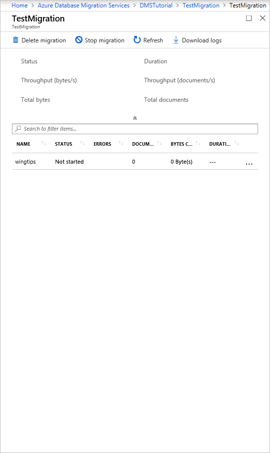
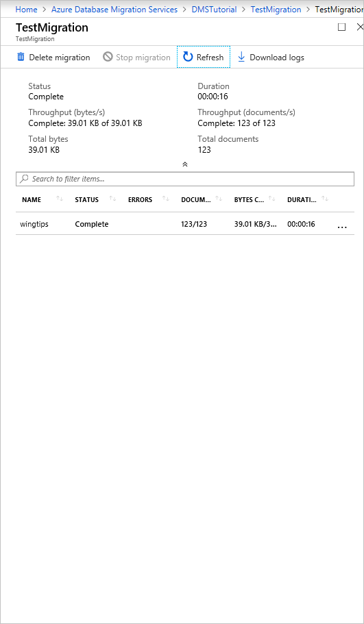
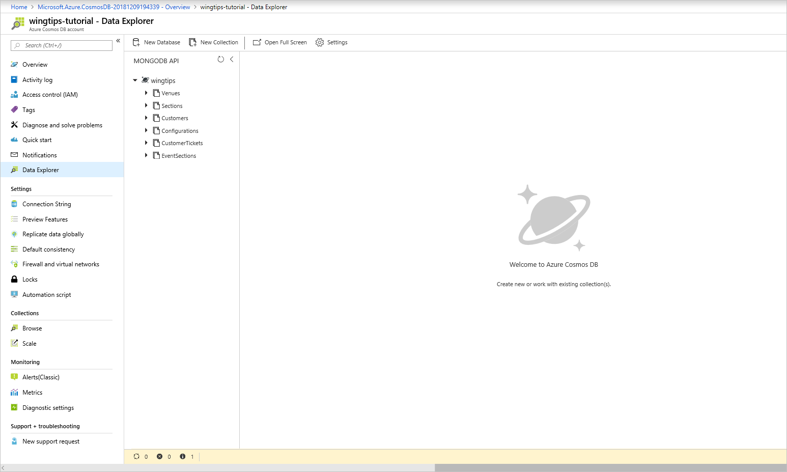

# Tutorial: Migrate MongoDB to Azure Cosmos DB's API for MongoDB offline using DMS

You can use Azure Database Migration Service to perform an offline (one-time) migration of databases from an on-premises or cloud instance of MongoDB to Azure Cosmos DB's API for MongoDB.

In this tutorial, you learn how to:
> [!div class="checklist"]
>
> * Create an instance of Azure Database Migration Service.
> * Create a migration project by using Azure Database Migration Service.
> * Run the migration.
> * Monitor the migration.

In this tutorial, you migrate a dataset in MongoDB hosted in an Azure Virtual Machine to Azure Cosmos DB's API for MongoDB by using Azure Database Migration Service. If you don't have a MongoDB source set up already, see the article [Install and configure MongoDB on a Windows VM in Azure](https://docs.microsoft.com/azure/virtual-machines/windows/install-mongodb).

## Prerequisites

To complete this tutorial, you need to:

* [Complete the pre-migration](../cosmos-db/mongodb-pre-migration.md) steps such as estimating throughput, choosing a partition key, and the indexing policy.
* [Create an Azure Cosmos DB's API for MongoDB account](https://ms.portal.azure.com/#create/Microsoft.DocumentDB).
* Create a Microsoft Azure Virtual Network for Azure Database Migration Service by using Azure Resource Manager deployment model, which provides site-to-site connectivity to your on-premises source servers by using either [ExpressRoute](https://docs.microsoft.com/azure/expressroute/expressroute-introduction) or [VPN](https://docs.microsoft.com/azure/vpn-gateway/vpn-gateway-about-vpngateways). For more information about creating a virtual network, see the [Virtual Network Documentation](https://docs.microsoft.com/azure/virtual-network/), and especially the quickstart articles with step-by-step details.

    > [!NOTE]
    > During virtual network setup, if you use ExpressRoute with network peering to Microsoft, add the following service [endpoints](https://docs.microsoft.com/azure/virtual-network/virtual-network-service-endpoints-overview) to the subnet in which the service will be provisioned:
    >
    > * Target database endpoint (for example, SQL endpoint, Cosmos DB endpoint, and so on)
    > * Storage endpoint
    > * Service bus endpoint
    >
    > This configuration is necessary because Azure Database Migration Service lacks internet connectivity.

* Ensure that your virtual network Network Security Group (NSG) rules don't block the following communication ports: 53, 443, 445, 9354, and 10000-20000. For more detail on virtual network NSG traffic filtering, see the article [Filter network traffic with network security groups](https://docs.microsoft.com/azure/virtual-network/virtual-networks-nsg).
* Open your Windows firewall to allow Azure Database Migration Service to access the source MongoDB server, which by default is TCP port 27017.
* When using a firewall appliance in front of your source database(s), you may need to add firewall rules to allow Azure Database Migration Service to access the source database(s) for migration.

## Register the Microsoft.DataMigration resource provider

1. Sign in to the Azure portal, select **All services**, and then select **Subscriptions**.

   

2. Select the subscription in which you want to create the instance of the Azure Database Migration Service, and then select **Resource providers**.

    

3. Search for migration, and then to the right of **Microsoft.DataMigration**, select **Register**.

        

## Create an instance

1. In the Azure portal, select + **Create a resource**, search for Azure Database Migration Service, and then select **Azure Database Migration Service** from the drop-down list.

    

2. On the **Azure Database Migration Service** screen, select **Create**.

    
  
3. On the **Create Migration Service** screen, specify a name for the service, the subscription, and a new or existing resource group.

4. Select the location in which you want to create the instance of Azure Database Migration Service. 

5. Select an existing virtual network or create a new one.

    The virtual network provides Azure Database Migration Service with access to the source MongoDB instance and the target Azure Cosmos DB account.

    For more information about how to create a virtual network in the Azure portal, see the article [Create a virtual network using the Azure portal](https://aka.ms/DMSVnet).

6. Select a pricing tier.

    For more information on costs and pricing tiers, see the [pricing page](https://aka.ms/dms-pricing).

    

7. Select **Create** to create the service.

## Create a migration project

After the service is created, locate it within the Azure portal, open it, and then create a new migration project.

1. In the Azure portal, select **All services**, search for Azure Database Migration Service, and then select **Azure Database Migration Services**.

      

2. On the **Azure Database Migration Services** screen, search for the name of Azure Database Migration Service instance that you created, and then select the instance.

3. Select + **New Migration Project**.

4. On the **New migration project** screen, specify a name for the project, in the **Source server type** text box, select **MongoDB**, in the **Target server type** text box, select **CosmosDB (MongoDB API)**, and then for **Choose type of activity**, select **Offline data migration**. 

    

5. Select **Create and run activity** to create the project and run the migration activity.

## Specify source details

1. On the **Source details** screen, specify the connection details for the source MongoDB server.

   > [!IMPORTANT]
   > Azure Database Migration Service does not support Azure Cosmos DB as a source.

    There are three modes to connect to a source:
   * **Standard mode**, which accepts a fully qualified domain name or an IP address, Port number, and connection credentials.
   * **Connection string mode**, which accepts a MongoDB Connection string as described in the article [Connection String URI Format](https://docs.mongodb.com/manual/reference/connection-string/).
   * **Data from Azure storage**, which accepts a blob container SAS URL. Select **Blob contains BSON dumps** if the blob container has BSON dumps produced by the MongoDB [bsondump tool](https://docs.mongodb.com/manual/reference/program/bsondump/), and de-select it if the container contains JSON files.

     If you select this option, be sure that the storage account connection string appears in the format:

     ```
     https://blobnameurl/container?SASKEY
     ```

     This blob container SAS connection string can be found in Azure Storage explorer. Creating the SAS for the concerned container will provide you the URL in above requested format.
     
     Also, based on the type dump information in Azure Storage, keep the following detail in mind.

     * For BSON dumps, the data within the blob container must be in bsondump format, such that data files are placed into folders named after the containing databases in the format collection.bson. Metadata files (if any) should be named using the format *collection*.metadata.json.

     * For JSON dumps, the files in the blob container must be placed into folders named after the containing databases. Within each database folder, data files must be placed in a subfolder called "data" and named using the format *collection*.json. Metadata files (if any) must be placed in a subfolder called "metadata" and named using the same format, *collection*.json. The metadata files must be in the same format as produced by the MongoDB bsondump tool.

    > [!IMPORTANT]
    > It is discouraged to use a self-signed certificate on the mongo server. However, if one is used, please connect to the server using **connection string mode** and ensure that your connection string has “”
    >
    >```
    >&sslVerifyCertificate=false
    >```

   You can also use the IP Address for situations in which DNS name resolution isn't possible.

   

2. Select **Save**.

## Specify target details

1. On the **Migration target details** screen, specify the connection details for the target Azure Cosmos DB account, which is the pre-provisioned Azure Cosmos DB's API for MongoDB account to which you're migrating your MongoDB data.

    

2. Select **Save**.

## Map to target databases

1. On the **Map to target databases** screen, map the source and the target database for migration.

    If the target database contains the same database name as the source database, Azure Database Migration Service selects the target database by default.

    If the string **Create** appears next to the database name, it indicates that Azure Database Migration Service didn't find the target database, and the service will create the database for you.

    At this point in the migration, you can [provision throughput](https://docs.microsoft.com/azure/cosmos-db/set-throughput). In Cosmos DB, you can provision throughput either at the database-level or individually for each collection. Throughput is measured in [Request Units](https://docs.microsoft.com/azure/cosmos-db/request-units) (RUs). Learn more about [Azure Cosmos DB pricing](https://azure.microsoft.com/pricing/details/cosmos-db/).

    

2. Select **Save**.
3. On the **Collection setting** screen, expand the collections listing, and then review the list of collections that will be migrated.

    Azure Database Migration Service auto selects all the collections that exist on the source MongoDB instance that don't exist on the target Azure Cosmos DB account. If you want to remigrate collections that already include data, you need to explicitly select the collections on this blade.

    You can specify the amount of RUs that you want the collections to use. Azure Database Migration Service suggests smart defaults based on the collection size.

    > [!NOTE]
    > Perform the database migration and collection in parallel using multiple instances of Azure Database Migration Service, if necessary, to speed up the run.

    You can also specify a shard key to take advantage of [partitioning in Azure Cosmos DB](https://docs.microsoft.com/azure/cosmos-db/partitioning-overview) for optimal scalability. Be sure to review the  [best practices for selecting a shard/partition key](https://docs.microsoft.com/azure/cosmos-db/partitioning-overview#choose-partitionkey).

    

4. Select **Save**.

5. On the **Migration summary** screen, in the **Activity name** text box, specify a name for the migration activity.

    

## Run the migration

* Select **Run migration**.

    The migration activity window appears, and the **Status** of the activity is **Not started**.

    

## Monitor the migration

* On the migration activity screen, select **Refresh** to update the display until the **Status** of the migration shows as **Completed**.

   > [!NOTE]
   > You can select the Activity to get details of database- and collection-level migration metrics.

    

## Verify data in Cosmos DB

* After the migration completes, you can check your Azure Cosmos DB account to verify that all the collections were migrated successfully.

    

## Post-migration optimization

After you migrate the data stored in MongoDB database to Azure Cosmos DB’s API for MongoDB, you can connect to Azure Cosmos DB and manage the data. You can also perform other post-migration optimization steps such as optimizing the indexing policy, update the default consistency level, or configure global distribution for your Azure Cosmos DB account. For more information, see the [Post-migration optimization](../cosmos-db/mongodb-post-migration.md) article.

## Additional resources

* [Cosmos DB service information](https://azure.microsoft.com/services/cosmos-db/)

## Next steps

* Review  migration guidance for additional scenarios in the Microsoft [Database Migration Guide](https://datamigration.microsoft.com/).
