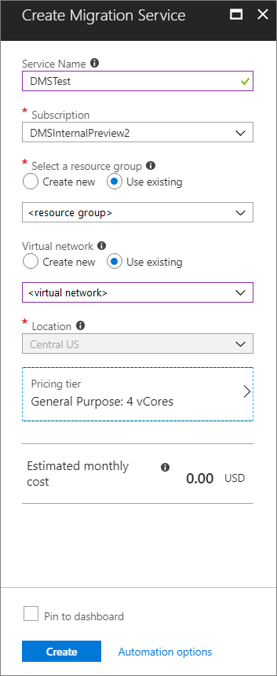
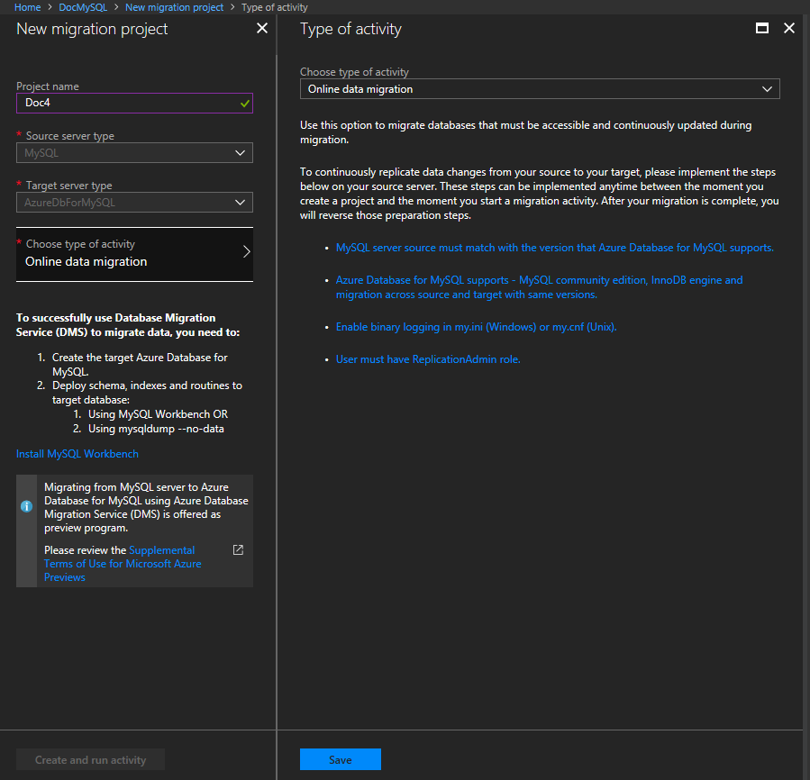
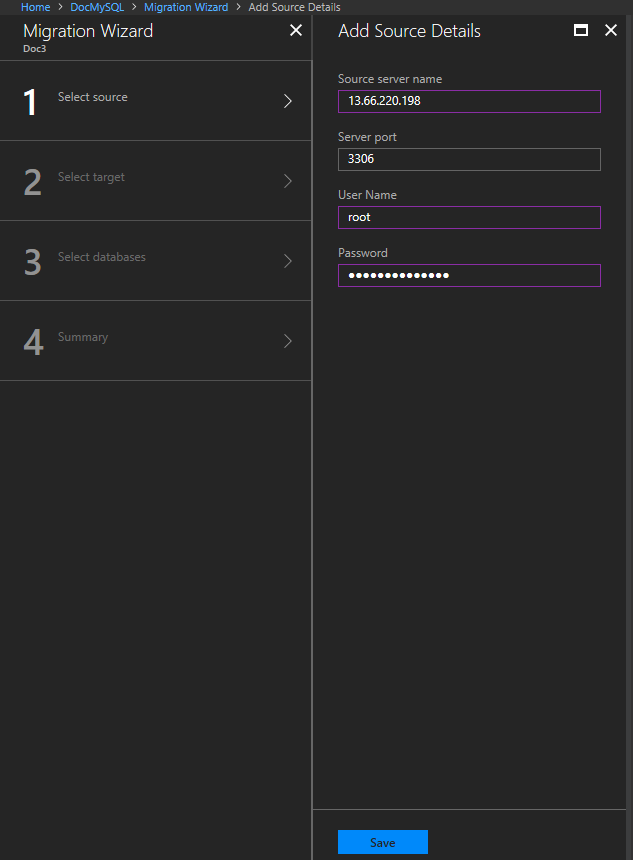
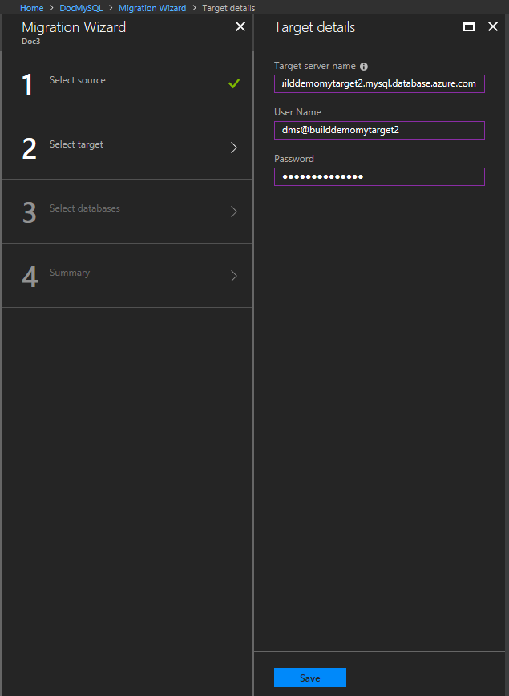
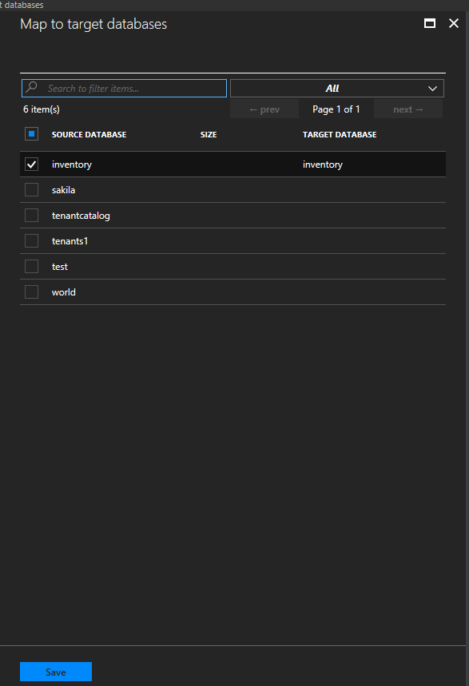
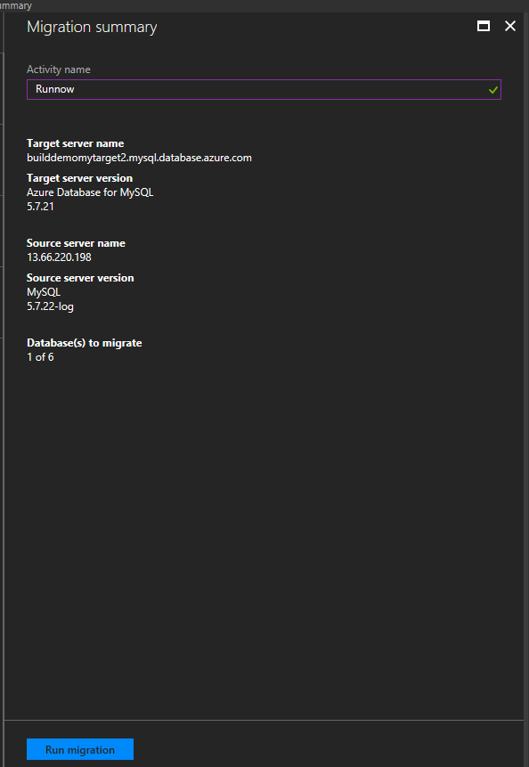
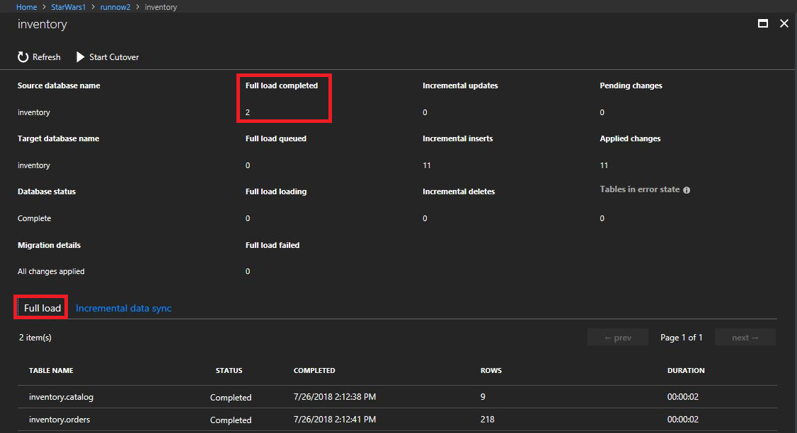
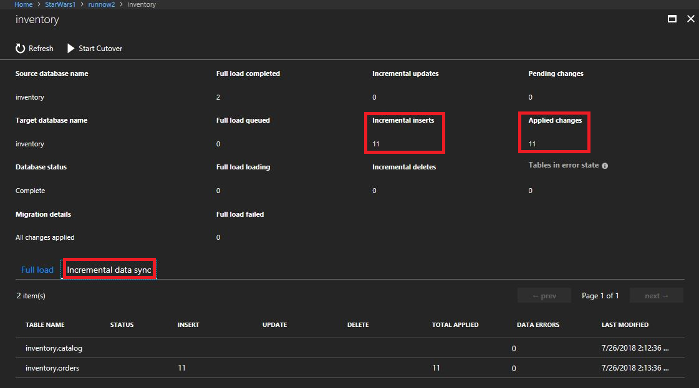

# Tutorial: Migrate MySQL to Azure Database for MySQL online using DMS

You can use Azure Database Migration Service to migrate the databases from an on-premises MySQL instance to [Azure Database for MySQL](https://docs.microsoft.com/azure/mysql/) with minimal downtime. In other words, migration can be achieved with minimum downtime to the application. In this tutorial, you migrate the **Employees** sample database from an on-premises instance of MySQL 5.7 to Azure Database for MySQL by using an online migration activity in Azure Database Migration Service.

In this tutorial, you learn how to:
> [!div class="checklist"]
>
> * Migrate the sample schema using mysqldump utility.
> * Create an instance of Azure Database Migration Service.
> * Create a migration project by using Azure Database Migration Service.
> * Run the migration.
> * Monitor the migration.

> [!NOTE]
> Using Azure Database Migration Service to perform an online migration requires creating an instance based on the Premium pricing tier.

> [!IMPORTANT]
> For an optimal migration experience, Microsoft recommends creating an instance of Azure Database Migration Service in the same Azure region as the target database. Moving data across regions or geographies can slow down the migration process and introduce errors.

## Prerequisites

To complete this tutorial, you need to:

* Download and install [MySQL community edition](https://dev.mysql.com/downloads/mysql/) 5.6 or 5.7. The on-premises MySQL version must match with Azure Database for MySQL version. For example, MySQL 5.6 can only migrate to Azure Database for MySQL 5.6 and not upgraded to 5.7.
* [Create an instance in Azure Database for MySQL](https://docs.microsoft.com/azure/mysql/quickstart-create-mysql-server-database-using-azure-portal). Refer to the article [Use MySQL Workbench to connect and query data](https://docs.microsoft.com/azure/mysql/connect-workbench) for details about how to connect and create a database using the Azure portal.  
* Create an Azure Virtual Network (VNet) for Azure Database Migration Service by using Azure Resource Manager deployment model, which provides site-to-site connectivity to your on-premises source servers by using either [ExpressRoute](https://docs.microsoft.com/azure/expressroute/expressroute-introduction) or [VPN](https://docs.microsoft.com/azure/vpn-gateway/vpn-gateway-about-vpngateways). For more information about creating a VNet, see the [Virtual Network Documentation](https://docs.microsoft.com/azure/virtual-network/), and especially the quickstart articles with step-by-step details.

    > [!NOTE]
    > During VNet setup, if you use ExpressRoute with network peering to Microsoft, add the following service [endpoints](https://docs.microsoft.com/azure/virtual-network/virtual-network-service-endpoints-overview) to the subnet in which the service will be provisioned:
    > * Target database endpoint (for example, SQL endpoint, Cosmos DB endpoint, and so on)
    > * Storage endpoint
    > * Service bus endpoint
    >
    > This configuration is necessary because Azure Database Migration Service lacks internet connectivity.

* Ensure that your VNet Network Security Group rules don't block the following inbound communication ports to Azure Database Migration Service: 443, 53, 9354, 445, 12000. For more detail on Azure VNet NSG traffic filtering, see the article [Filter network traffic with network security groups](https://docs.microsoft.com/azure/virtual-network/virtual-network-vnet-plan-design-arm).
* Configure your [Windows Firewall for database engine access](https://docs.microsoft.com/sql/database-engine/configure-windows/configure-a-windows-firewall-for-database-engine-access).
* Open your Windows firewall to allow Azure Database Migration Service to access the source MySQL Server, which by default is TCP port 3306.
* When using a firewall appliance in front of your source database(s), you may need to add firewall rules to allow Azure Database Migration Service to access the source database(s) for migration.
* Create a server-level [firewall rule](https://docs.microsoft.com/azure/sql-database/sql-database-firewall-configure) for Azure Database for MySQL to allow Azure Database Migration Service access to the target databases. Provide the subnet range of the VNet used for Azure Database Migration Service.
* The source MySQL must be on supported MySQL community edition. To determine the version of MySQL instance, in the MySQL utility or MySQL Workbench, run the following command:

    ```
    SELECT @@version;
    ```

* Azure Database for MySQL supports only InnoDB tables. To convert MyISAM tables to InnoDB, see the article [Converting Tables from MyISAM to InnoDB](https://dev.mysql.com/doc/refman/5.7/en/converting-tables-to-innodb.html)

* Enable binary logging in the my.ini (Windows) or my.cnf (Unix) file in source database by using the  following configuration:

  * **server_id** = 1 or greater (relevant only for MySQL 5.6)
  * **log-bin** =\<path> (relevant only for MySQL 5.6)
       For example: log-bin = E:\MySQL_logs\BinLog
  * **binlog_format** = row
  * **Expire_logs_days** = 5 (it's recommended to not use zero; relevant only for MySQL 5.6)
  * **Binlog_row_image** = full (relevant only for MySQL 5.6)
  * **log_slave_updates** = 1

* The user must have the ReplicationAdmin role with the following privileges:

  * **REPLICATION CLIENT** - Required for Change Processing tasks only. In other words, Full Load only tasks don't require this privilege.
  * **REPLICATION REPLICA** - Required for Change Processing tasks only. In other words, Full Load only tasks don't require this privilege.
  * **SUPER** - Only required in versions earlier than MySQL 5.6.6.

## Migrate the sample schema

To complete all the database objects like table schemas, indexes and stored procedures, we need to extract schema from the source database and apply to the database. To extract schema, you can use mysqldump with the `--no-data` parameter.

Assuming you have MySQL **Employees** sample database in the on-premises system, the command to do schema migration using mysqldump is:

```
mysqldump -h [servername] -u [username] -p[password] --databases [db name] --no-data > [schema file path]
```

For example:

```
mysqldump -h 10.10.123.123 -u root -p --databases employees --no-data > d:\employees.sql
```

To import schema to Azure Database for MySQL target, run the following command:

```
mysql.exe -h [servername] -u [username] -p[password] [database]< [schema file path]
 ```

For example:

```
mysql.exe -h shausample.mysql.database.azure.com -u dms@shausample -p employees < d:\employees.sql
 ```

If you have foreign keys in your schema, the initial load and continuous sync of the migration will fail.  Execute the following script in MySQL Workbench to extract the drop foreign key script and add foreign key script.

```
SET group_concat_max_len = 8192;
    SELECT SchemaName, GROUP_CONCAT(DropQuery SEPARATOR ';\n') as DropQuery, GROUP_CONCAT(AddQuery SEPARATOR ';\n') as AddQuery
    FROM
    (SELECT
    KCU.REFERENCED_TABLE_SCHEMA as SchemaName,
	KCU.TABLE_NAME,
	KCU.COLUMN_NAME,
	CONCAT('ALTER TABLE ', KCU.TABLE_NAME, ' DROP FOREIGN KEY ', KCU.CONSTRAINT_NAME) AS DropQuery,
    CONCAT('ALTER TABLE ', KCU.TABLE_NAME, ' ADD CONSTRAINT ', KCU.CONSTRAINT_NAME, ' FOREIGN KEY (`', KCU.COLUMN_NAME, '`) REFERENCES `', KCU.REFERENCED_TABLE_NAME, '` (`', KCU.REFERENCED_COLUMN_NAME, '`) ON UPDATE ',RC.UPDATE_RULE, ' ON DELETE ',RC.DELETE_RULE) AS AddQuery
	FROM INFORMATION_SCHEMA.KEY_COLUMN_USAGE KCU, information_schema.REFERENTIAL_CONSTRAINTS RC
	WHERE
	  KCU.CONSTRAINT_NAME = RC.CONSTRAINT_NAME
	  AND KCU.REFERENCED_TABLE_SCHEMA = RC.UNIQUE_CONSTRAINT_SCHEMA
  AND KCU.REFERENCED_TABLE_SCHEMA = 'SchemaName') Queries
  GROUP BY SchemaName;
 ```

Run the drop foreign key (which is the second column) in the query result to drop foreign key.

> [!IMPORTANT]
> If importing data using a backup, remove the CREATE DEFINER commands manually or by using the --skip-definer command when performing a mysqldump. DEFINER requires super privileges to create and is restricted in Azure Database for MySQL.

If you have a trigger in the data (insert or update trigger), it will enforce data integrity in the target ahead of the replicated data from the source. The recommendation is to disable triggers in all the tables at the target during migration, and then enable the triggers after migration is done.

To disable triggers in the target database, use the following command:

```
SELECT Concat('DROP TRIGGER ', Trigger_Name, ';') FROM  information_schema.TRIGGERS WHERE TRIGGER_SCHEMA = 'your_schema';
```

## Register the Microsoft.DataMigration resource provider

1. Sign in to the Azure portal, select **All services**, and then select **Subscriptions**.

   

2. Select the subscription in which you want to create the instance of Azure Database Migration Service, and then select **Resource providers**.

    

3. Search for migration, and then to the right of **Microsoft.DataMigration**, select **Register**.

    

## Create a DMS instance

1. In the Azure portal, select + **Create a resource**, search for Azure Database Migration Service, and then select **Azure Database Migration Service** from the drop-down list.

    

2. On the **Azure Database Migration Service** screen, select **Create**.

    
  
3. On the **Create Migration Service** screen, specify a name for the service, the subscription, and a new or existing resource group.

4. Select an existing VNet or create a new one.

    The VNet provides Azure Database Migration Service with access to the source SQL Server and the target Azure SQL Database instance.

    For more information about how to create a VNet in the Azure portal, see the article [Create a virtual network using the Azure portal](https://aka.ms/DMSVnet).

5. Select a pricing tier.

    For more information on costs and pricing tiers, see the [pricing page](https://aka.ms/dms-pricing).

    

6. Select **Create** to create the service.

## Create a migration project

After the service is created, locate it within the Azure portal, open it, and then create a new migration project.

1. In the Azure portal, select **All services**, search for Azure Database Migration Service, and then select **Azure Database Migration Services**.

      

2. On the **Azure Database Migration Services** screen, search for the name of Azure Database Migration Service instance that you created, and then select the instance.

     

3. Select + **New Migration Project**.
4. On the **New migration project** screen, specify a name for the project, in the **Source server type** text box, select **MySQL**, in the **Target server type** text box, select **AzureDbForMySQL**.
5. In the **Choose type of activity** section, select **Online data migration**

    

    > [!NOTE]
    > Alternately, you can choose **Create project only** to create the migration project now and execute the migration later.

6. Select **Save**, note the requirements to successfully use DMS to migrate data, and then select **Create and run activity**.

## Specify source details

1. On the **Add Source Details** screen, specify the connection details for the source MySQL instance.

    

## Specify target details

1. Select **Save**, and then on the **Target details** screen, specify the connection details for the target Azure Database for MySQL server, which is the pre-provisioned instance of Azure Database for MySQL to which the **Employees** schema was deployed by using mysqldump.

    

2. Select **Save**, and then on the **Map to target databases** screen, map the source and the target database for migration.

    If the target database contains the same database name as the source database, Azure Database Migration Service selects the target database by default.

    

3. Select **Save**, on the **Migration summary** screen, in the **Activity name** text box, specify a name for the migration activity, and then review the summary to ensure that the source and target details match what you previously specified.

    

## Run the migration

* Select **Run migration**.

    The migration activity window appears, and the **Status** of the activity is **initializing**.

## Monitor the migration

1. On the migration activity screen, select **Refresh** to update the display until the **Status** of the migration shows as **Complete**.

     

2. Under **Database Name**, select specific database to get to the migration status for **Full data load** and **Incremental data sync** operations.

    Full data load will show the initial load migration status while Incremental data sync will show change data capture (CDC) status.

     

     

## Perform migration cutover

After the initial Full load is completed, the databases are marked **Ready to cutover**.

1. When you're ready to complete the database migration, select **Start Cutover**.

    

2. Make sure to stop all the incoming transactions to the source database; wait until the **Pending changes** counter shows **0**.
3. Select **Confirm**, and the select **Apply**.
4. When the database migration status shows **Completed**, connect your applications to the new target Azure SQL Database.

## Next steps

* For information about known issues and limitations when performing online migrations to Azure Database for MySQL, see the article [Known issues and workarounds with Azure Database for MySQL online migrations](known-issues-azure-mysql-online.md).
* For information about Azure Database Migration Service, see the article [What is Azure Database Migration Service?](https://docs.microsoft.com/azure/dms/dms-overview).
* For information about Azure Database for MySQL, see the article [What is Azure Database for MySQL?](https://docs.microsoft.com/azure/mysql/overview).
