# Tutorial: Migrate MySQL to Azure Database for MySQL online using DMS

You can use Azure Database Migration Service to migrate the databases from an on-premises MySQL instance to [Azure Database for MySQL](../mysql/index.yml) with minimal downtime. In other words, migration can be achieved with minimum downtime to the application. In this tutorial, you migrate the **Employees** sample database from an on-premises instance of MySQL 5.7 to Azure Database for MySQL by using an online migration activity in Azure Database Migration Service.

> [!IMPORTANT]
> The “MySQL to Azure Database for MySQL” online migration scenario is being replaced with a parallelized, highly performant offline migration scenario on June 1, 2021. For online migrations, you can use this new offering together with [data-in replication](https://docs.microsoft.com/azure/mysql/concepts-data-in-replication). Alternatively, use open-source tools such as [MyDumper/MyLoader](https://centminmod.com/mydumper.html) with data-in replication for online migrations. 

In this tutorial, you learn how to:
> [!div class="checklist"]
>
> * Migrate the sample schema using mysqldump utility.
> * Create an instance of Azure Database Migration Service.
> * Create a migration project by using Azure Database Migration Service.
> * Run the migration.
> * Monitor the migration.

> [!NOTE]
> Using Azure Database Migration Service to perform an online migration requires creating an instance based on the Premium pricing tier.

> [!IMPORTANT]
> For an optimal migration experience, Microsoft recommends creating an instance of Azure Database Migration Service in the same Azure region as the target database. Moving data across regions or geographies can slow down the migration process and introduce errors.

> [!NOTE]
> Bias-free communication
>
> Microsoft supports a diverse and inclusionary environment. This article contains references to the word _slave_. The Microsoft [style guide for bias-free communication](https://github.com/MicrosoftDocs/microsoft-style-guide/blob/master/styleguide/bias-free-communication.md) recognizes this as an exclusionary word. The word is used in this article for consistency because it's currently the word that appears in the software. When the software is updated to remove the word, this article will be updated to be in alignment.
>


## Prerequisites

To complete this tutorial, you need to:

* Download and install [MySQL community edition](https://dev.mysql.com/downloads/mysql/) 5.6 or 5.7. The on-premises MySQL version must match with Azure Database for MySQL version. For example, MySQL 5.6 can only migrate to Azure Database for MySQL 5.6 and not upgraded to 5.7. Migrations to or from MySQL 8.0 are not supported.
* [Create an instance in Azure Database for MySQL](../mysql/quickstart-create-mysql-server-database-using-azure-portal.md). Refer to the article [Use MySQL Workbench to connect and query data](../mysql/connect-workbench.md) for details about how to connect and create a database using the Workbench application.  
* Create a Microsoft Azure Virtual Network for Azure Database Migration Service by using Azure Resource Manager deployment model, which provides site-to-site connectivity to your on-premises source servers by using either [ExpressRoute](../expressroute/expressroute-introduction.md) or [VPN](../vpn-gateway/vpn-gateway-about-vpngateways.md). For more information about creating a virtual network, see the [Virtual Network Documentation](../virtual-network/index.yml), and especially the quickstart articles with step-by-step details.

    > [!NOTE]
    > During virtual networkNet setup, if you use ExpressRoute with network peering to Microsoft, add the following service [endpoints](../virtual-network/virtual-network-service-endpoints-overview.md) to the subnet in which the service will be provisioned:
    >
    > * Target database endpoint (for example, SQL endpoint, Cosmos DB endpoint, and so on)
    > * Storage endpoint
    > * Service bus endpoint
    >
    > This configuration is necessary because Azure Database Migration Service lacks internet connectivity.

* Ensure that your virtual network Network Security Group rules don't block the outbound port 443 of ServiceTag for ServiceBus, Storage and AzureMonitor. For more detail on virtual network NSG traffic filtering, see the article [Filter network traffic with network security groups](../virtual-network/virtual-network-vnet-plan-design-arm.md).
* Configure your [Windows Firewall for database engine access](/sql/database-engine/configure-windows/configure-a-windows-firewall-for-database-engine-access).
* Open your Windows firewall to allow Azure Database Migration Service to access the source MySQL Server, which by default is TCP port 3306.
* When using a firewall appliance in front of your source database(s), you may need to add firewall rules to allow Azure Database Migration Service to access the source database(s) for migration.
* Create a server-level [firewall rule](../azure-sql/database/firewall-configure.md) for Azure Database for MySQL to allow Azure Database Migration Service access to the target databases. Provide the subnet range of the virtual network used for Azure Database Migration Service.
* The source MySQL must be on supported MySQL community edition. To determine the version of MySQL instance, in the MySQL utility or MySQL Workbench, run the following command:

    ```
    SELECT @@version;
    ```

* Azure Database for MySQL supports only InnoDB tables. To convert MyISAM tables to InnoDB, see the article [Converting Tables from MyISAM to InnoDB](https://dev.mysql.com/doc/refman/5.7/en/converting-tables-to-innodb.html)

* Enable binary logging in the my.ini (Windows) or my.cnf (Unix) file in source database by using the  following configuration:

  * **server_id** = 1 or greater (relevant only for MySQL 5.6)
  * **log-bin** =\<path> (relevant only for MySQL 5.6)
       For example: log-bin = E:\MySQL_logs\BinLog
  * **binlog_format** = row
  * **Expire_logs_days** = 5 (it's recommended to not use zero; relevant only for MySQL 5.6)
  * **Binlog_row_image** = full (relevant only for MySQL 5.6)
  * **log_slave_updates** = 1

* The user must have the ReplicationAdmin role with the following privileges:

  * **REPLICATION CLIENT** - Required for Change Processing tasks only. In other words, Full Load only tasks don't require this privilege.
  * **REPLICATION REPLICA** - Required for Change Processing tasks only. In other words, Full Load only tasks don't require this privilege.
  * **SUPER** - Only required in versions earlier than MySQL 5.6.6.

## Migrate the sample schema

To complete all the database objects like table schemas, indexes and stored procedures, we need to extract schema from the source database and apply to the database. To extract schema, you can use mysqldump with the `--no-data` parameter.

Assuming you have MySQL **Employees** sample database in the on-premises system, the command to do schema migration using mysqldump is:

```
mysqldump -h [servername] -u [username] -p[password] --databases [db name] --no-data > [schema file path]
```

For example:

```
mysqldump -h 10.10.123.123 -u root -p --databases employees --no-data > d:\employees.sql
```

To import schema to Azure Database for MySQL target, run the following command:

```
mysql.exe -h [servername] -u [username] -p[password] [database]< [schema file path]
 ```

For example:

```
mysql.exe -h shausample.mysql.database.azure.com -u dms@shausample -p employees < d:\employees.sql
 ```

If you have foreign keys in your schema, the initial load and continuous sync of the migration will fail.  Execute the following script in MySQL Workbench to extract the drop foreign key script and add foreign key script.

```sql
SET group_concat_max_len = 8192;
    SELECT SchemaName, GROUP_CONCAT(DropQuery SEPARATOR ';\n') as DropQuery, GROUP_CONCAT(AddQuery SEPARATOR ';\n') as AddQuery
    FROM
    (SELECT
    KCU.REFERENCED_TABLE_SCHEMA as SchemaName,
    KCU.TABLE_NAME,
    KCU.COLUMN_NAME,
    CONCAT('ALTER TABLE ', KCU.TABLE_NAME, ' DROP FOREIGN KEY ', KCU.CONSTRAINT_NAME) AS DropQuery,
    CONCAT('ALTER TABLE ', KCU.TABLE_NAME, ' ADD CONSTRAINT ', KCU.CONSTRAINT_NAME, ' FOREIGN KEY (`', KCU.COLUMN_NAME, '`) REFERENCES `', KCU.REFERENCED_TABLE_NAME, '` (`', KCU.REFERENCED_COLUMN_NAME, '`) ON UPDATE ',RC.UPDATE_RULE, ' ON DELETE ',RC.DELETE_RULE) AS AddQuery
    FROM INFORMATION_SCHEMA.KEY_COLUMN_USAGE KCU, information_schema.REFERENTIAL_CONSTRAINTS RC
    WHERE
      KCU.CONSTRAINT_NAME = RC.CONSTRAINT_NAME
      AND KCU.REFERENCED_TABLE_SCHEMA = RC.UNIQUE_CONSTRAINT_SCHEMA
  AND KCU.REFERENCED_TABLE_SCHEMA = 'SchemaName') Queries
  GROUP BY SchemaName;
 ```

Run the drop foreign key (which is the second column) in the query result to drop foreign key.

> [!NOTE]
> Azure DMS does not support the CASCADE referential action, which helps to automatically delete or update a matching row in the child table when a row is deleted or updated in the parent table. For more information, in the MySQL documentation, see the Referential Actions section of the article [FOREIGN KEY Constraints](https://dev.mysql.com/doc/refman/8.0/en/create-table-foreign-keys.html).
> Azure DMS requires that you drop foreign key constraints in the target database server during the initial data load, and you cannot use referential actions. If your workload depends on updating a related child table via this referential action, we recommend that you perform a [dump and restore](../mysql/concepts-migrate-dump-restore.md) instead. 


> [!IMPORTANT]
> If importing data using a backup, remove the CREATE DEFINER commands manually or by using the --skip-definer command when performing a mysqldump. DEFINER requires super privileges to create and is restricted in Azure Database for MySQL.

If you have triggers in the database, it will enforce data integrity in the target ahead of full data migration from the source. The recommendation is to disable triggers on all the tables in the target during migration, and then enable the triggers after migration is done.

Execute the following script in MySQL Workbench on the target database to extract the drop trigger script and add trigger script.

```sql
SELECT
	SchemaName,
    GROUP_CONCAT(DropQuery SEPARATOR ';\n') as DropQuery,
    Concat('DELIMITER $$ \n\n', GROUP_CONCAT(AddQuery SEPARATOR '$$\n'), '$$\n\nDELIMITER ;') as AddQuery
FROM
(
SELECT 
	TRIGGER_SCHEMA as SchemaName,
	Concat('DROP TRIGGER `', TRIGGER_NAME, "`") as DropQuery,
    Concat('CREATE TRIGGER `', TRIGGER_NAME, '` ', ACTION_TIMING, ' ', EVENT_MANIPULATION, 
			'\nON `', EVENT_OBJECT_TABLE, '`\n' , 'FOR EACH ', ACTION_ORIENTATION, ' ',
            ACTION_STATEMENT) as AddQuery
FROM  
	INFORMATION_SCHEMA.TRIGGERS
ORDER BY EVENT_OBJECT_SCHEMA, EVENT_OBJECT_TABLE, ACTION_TIMING, EVENT_MANIPULATION, ACTION_ORDER ASC
) AS Queries
GROUP BY SchemaName
```

Run the generated drop trigger query (DropQuery column) in the result to drop triggers in the target database. The add trigger query can be saved, to be used post data migration completion.

## Register the Microsoft.DataMigration resource provider

1. Sign in to the Azure portal, select **All services**, and then select **Subscriptions**.

   

2. Select the subscription in which you want to create the instance of Azure Database Migration Service, and then select **Resource providers**.

    

3. Search for migration, and then to the right of **Microsoft.DataMigration**, select **Register**.

    

## Create a Database Migration Service instance

1. In the Azure portal, select + **Create a resource**, search for Azure Database Migration Service, and then select **Azure Database Migration Service** from the drop-down list.

    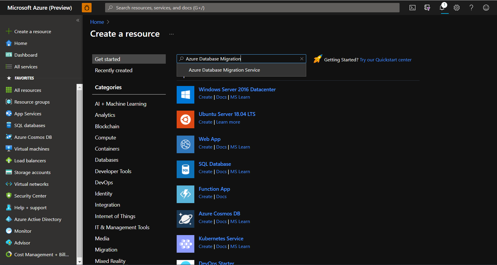

2. On the **Azure Database Migration Service** screen, select **Create**.

    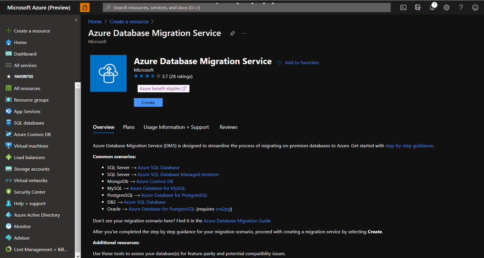
  
3. On the **Create Migration Service** screen, specify a name for the service, the subscription, and a new or existing resource group.

4. Select a pricing tier and move to the networking screen. Offline migration capability is available in both Standard and Premium pricing tier.

    For more information on costs and pricing tiers, see the [pricing page](https://aka.ms/dms-pricing).

    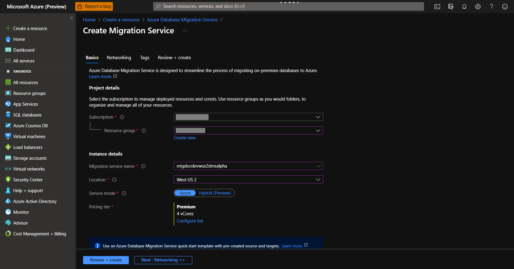

5. Select an existing virtual network from the list or provide the name of new virtual network to be created. Move to the review + create screen. Optionally you can add tags to the service using the tags screen.

    The virtual network provides Azure Database Migration Service with access to the source SQL Server and the target Azure SQL Database instance.

    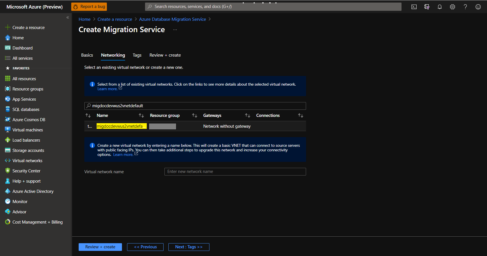

    For more information about how to create a virtual network in the Azure portal, see the article [Create a virtual network using the Azure portal](../virtual-network/quick-create-portal.md).

6. Review the configurations and select **Create** to create the service.
    
    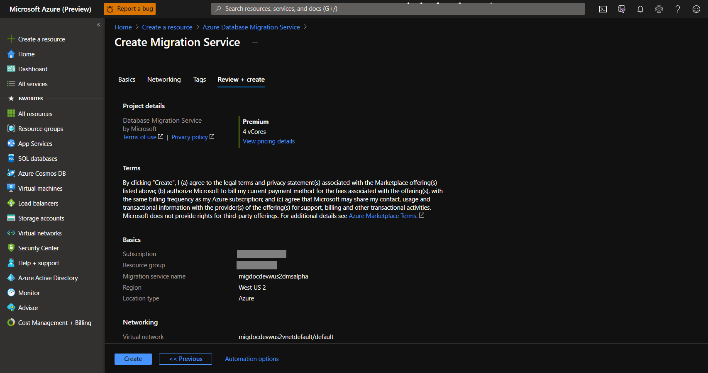

## Create a migration project

After the service is created, locate it within the Azure portal, open it, and then create a new migration project.  

1. In the Azure portal, select **All services**, search for Azure Database Migration Service, and then select **Azure Database Migration Services**.

    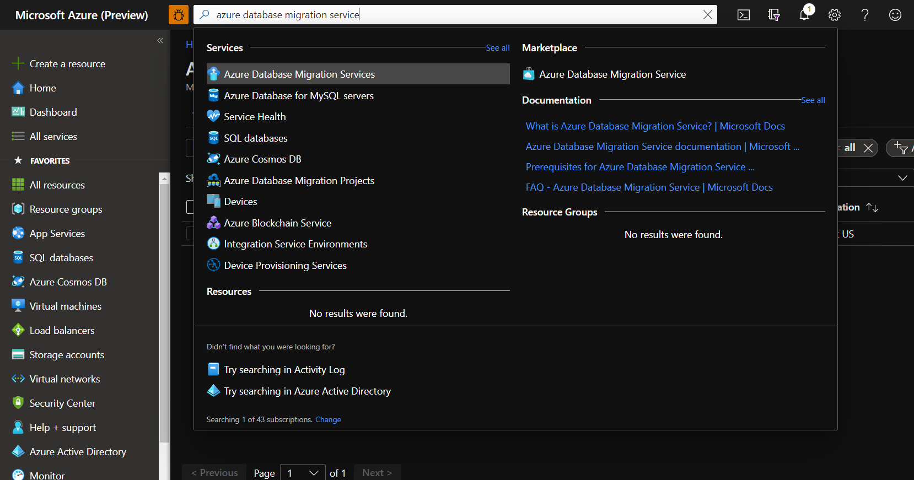

2. Select your migration service instance from the search results and select + **New Migration Project**.
    
    

3. On the **New migration project** screen, specify a name for the project, in the **Source server type** selection box, select **MySQL**, in the **Target server type** selection box, select **Azure Database For MySQL** and in the **Migration activity type** selection box, select **Online data migration**. Select **Create and run activity**.

    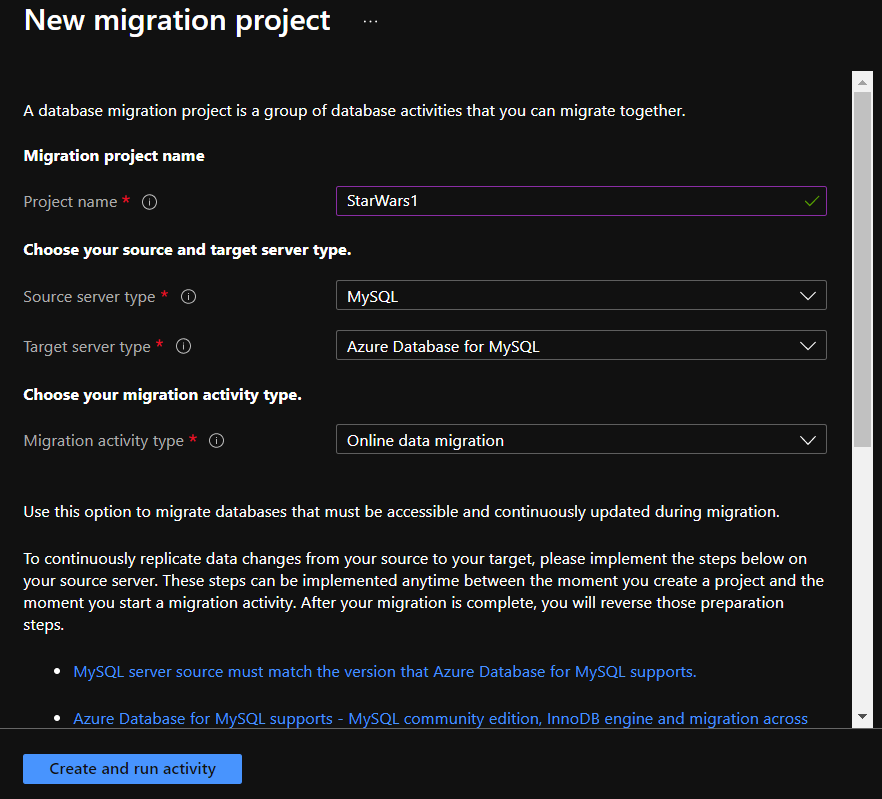

    > [!NOTE]
    > Alternately, you can choose **Create project only** to create the migration project now and execute the migration later.

## Configure migration project

1. On the **Select source** screen, specify the connection details for the source MySQL instance, and select **Next : Select target>>**

    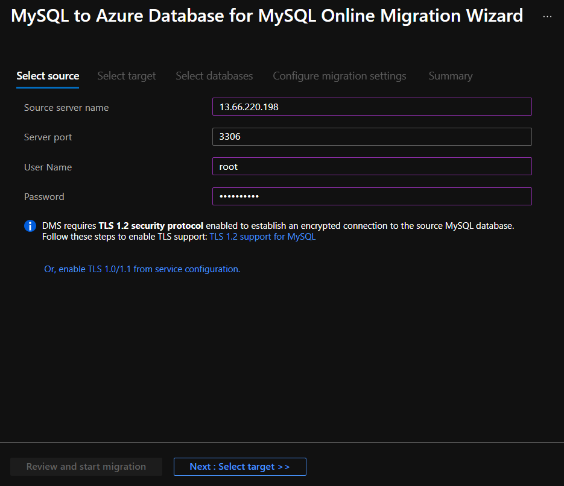

2. On the **Select target** screen, specify the connection details for the target Azure Database for MySQL instance, and select **Next : Select databases>>**

    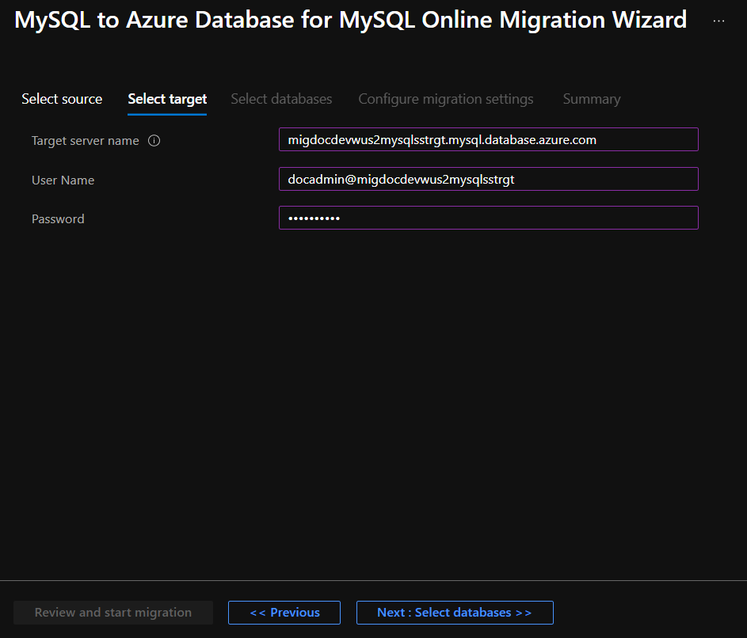

3. On the **Select databases** screen, map the source and the target database for migration, and select **Next : Configure migration settings>>**. You can select the **Make Source Server Readonly** option to make the source as read-only, but be cautious that this is a server level setting. If selected, it sets the entire server to read-only, not just the selected databases.
    
    If the target database contains the same database name as the source database, Azure Database Migration Service selects the target database by default.
    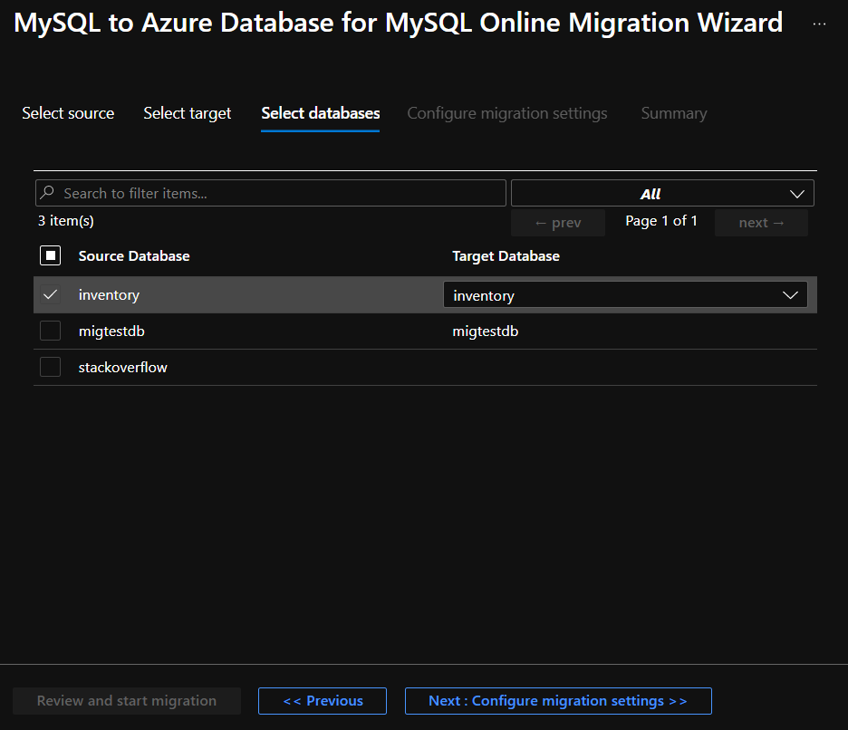
    
    > [!NOTE] 
   > Though you can select multiple databases in this step, each instance of Azure Database Migration Service supports up to 4 databases for concurrent migration. Also, there is a limit of 10 instances of Azure Database Migration Service per subscription per region. For example, if you have 80 databases to migrate, you can migrate 40 of them to the same region concurrently, but only if you have created 10 instances of the Azure Database Migration Service.

4. On the **Configure migration settings** screen, select the tables to be part of migration, and select **Next : Summary>>**. If the target tables have any data, they are not selected by default but you can explicitly select them and they will be truncated before starting the migration.

    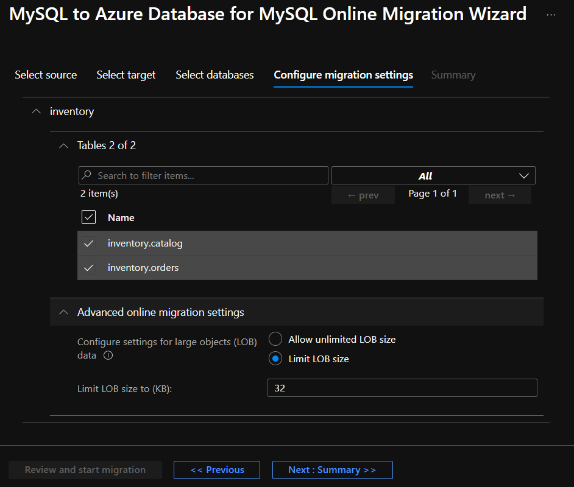

5. On the **Summary** screen, in the **Activity name** text box, specify a name for the migration activity and review the summary to ensure that the source and target details match what you previously specified.

    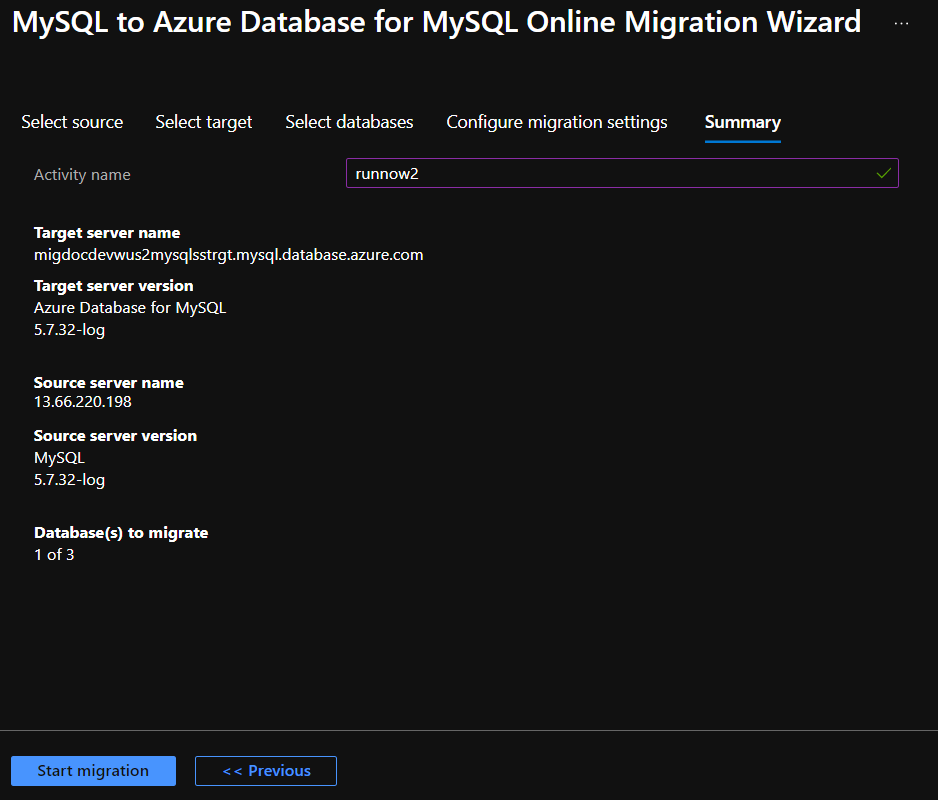

6. Select **Start migration**. The migration activity window appears, and the **Status** of the activity is **Initializing**. The **Status** changes to **Running** when the table migrations start.

## Monitor the migration

1. On the migration activity screen, select **Refresh** to update the display until the **Status** of the migration shows as **Complete**.

     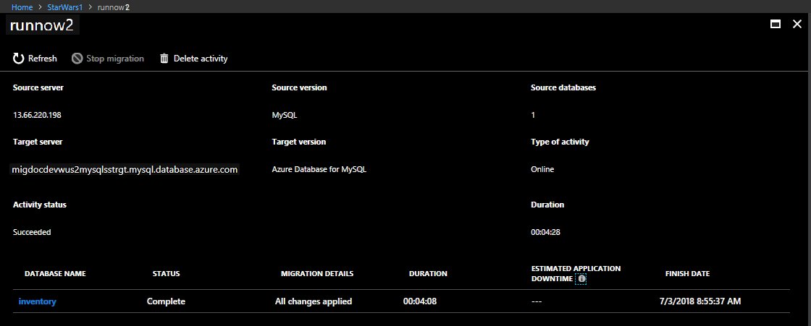

2. Under **Database Name**, select specific database to get to the migration status for **Full data load** and **Incremental data sync** operations.

    Full data load will show the initial load migration status while Incremental data sync will show change data capture (CDC) status.

     

     

## Perform migration cutover

After the initial Full load is completed, the databases are marked **Ready to cutover**.

1. When you're ready to complete the database migration, select **Start Cutover**.

    

2. Make sure to stop all the incoming transactions to the source database; wait until the **Pending changes** counter shows **0**.
3. Select **Confirm**, and the select **Apply**.
4. When the database migration status shows **Completed**, connect your applications to the new target Azure SQL Database.

## Next steps

* For information about known issues and limitations when performing online migrations to Azure Database for MySQL, see the article [Known issues and workarounds with Azure Database for MySQL online migrations](known-issues-azure-mysql-online.md).
* For information about Azure Database Migration Service, see the article [What is Azure Database Migration Service?](./dms-overview.md).
* For information about Azure Database for MySQL, see the article [What is Azure Database for MySQL?](../mysql/overview.md).
