# Tutorial: Migrate Oracle to Azure Database for PostgreSQL online using DMS (Preview)

You can use Azure Database Migration Service to migrate the databases from Oracle databases hosted on-premises or on virtual machines to [Azure Database for PostgreSQL](https://docs.microsoft.com/azure/postgresql/) with minimal downtime. In other words, you can complete the migration with minimal downtime to the application. In this tutorial, you migrate the **HR** sample database from an on-premises or virtual machine instance of Oracle 11g to Azure Database for PostgreSQL by using the online migration activity in Azure Database Migration Service.

In this tutorial, you learn how to:
> [!div class="checklist"]
>
> * Assess the migration effort using the ora2pg tool.
> * Migrate the sample schema using the ora2pg tool.
> * Create an instance of Azure Database Migration Service.
> * Create a migration project by using Azure Database Migration Service.
> * Run the migration.
> * Monitor the migration.

> [!NOTE]
> Using Azure Database Migration Service to perform an online migration requires creating an instance based on the Premium pricing tier.

> [!IMPORTANT]
> For an optimal migration experience, Microsoft recommends creating an instance of Azure Database Migration Service in the same Azure region as the target database. Moving data across regions or geographies can slow down the migration process and introduce errors.

[!INCLUDE [online-offline](../../includes/database-migration-service-offline-online.md)]

This article describes how to perform an online migration from Oracle to Azure Database for PostgreSQL.

## Prerequisites

To complete this tutorial, you need to:

* Download and install [Oracle 11g Release 2 (Standard Edition, Standard Edition One, or Enterprise Edition)](https://www.oracle.com/technetwork/database/enterprise-edition/downloads/index.html).
* Download the sample **HR** database from [here](https://docs.oracle.com/database/121/COMSC/installation.htm#COMSC00002).
* Download and install ora2pg on either [Windows](https://github.com/Microsoft/DataMigrationTeam/blob/master/Whitepapers/Steps%20to%20Install%20ora2pg%20on%20Windows.pdf) or [Linux](https://github.com/Microsoft/DataMigrationTeam/blob/master/Whitepapers/Steps%20to%20Install%20ora2pg%20on%20Linux.pdf).
* [Create an instance in Azure Database for PostgreSQL](https://docs.microsoft.com/azure/postgresql/quickstart-create-server-database-portal).
* Connect to the instance and create a database using the instruction in this [document](https://docs.microsoft.com/azure/postgresql/tutorial-design-database-using-azure-portal).
* Create an Azure Virtual Network (VNet) for Azure Database Migration Service by using the Azure Resource Manager deployment model, which provides site-to-site connectivity to your on-premises source servers by using either [ExpressRoute](https://docs.microsoft.com/azure/expressroute/expressroute-introduction) or [VPN](https://docs.microsoft.com/azure/vpn-gateway/vpn-gateway-about-vpngateways). For more information about creating a VNet, see the [Virtual Network Documentation](https://docs.microsoft.com/azure/virtual-network/), and especially the quickstart articles with step-by-step details.

  > [!NOTE]
  > During VNet setup, if you use ExpressRoute with network peering to Microsoft, add the following service [endpoints](https://docs.microsoft.com/azure/virtual-network/virtual-network-service-endpoints-overview) to the subnet in which the service will be provisioned:
  > * Target database endpoint (for example, SQL endpoint, Cosmos DB endpoint, and so on)
  > * Storage endpoint
  > * Service bus endpoint
  >
  > This configuration is necessary because Azure Database Migration Service lacks internet connectivity.

* Ensure that your VNet Network Security Group (NSG) rules don't block the following inbound communication ports to Azure Database Migration Service: 443, 53, 9354, 445, 12000. For more detail on Azure VNet NSG traffic filtering, see the article [Filter network traffic with network security groups](https://docs.microsoft.com/azure/virtual-network/virtual-network-vnet-plan-design-arm).
* Configure your [Windows Firewall for database engine access](https://docs.microsoft.com/sql/database-engine/configure-windows/configure-a-windows-firewall-for-database-engine-access).
* Open your Windows firewall to allow Azure Database Migration Service to access the source Oracle server, which by default is TCP port 1521.
* When using a firewall appliance in front of your source database(s), you may need to add firewall rules to allow Azure Database Migration Service to access the source database(s) for migration.
* Create a server-level [firewall rule](https://docs.microsoft.com/azure/sql-database/sql-database-firewall-configure) for Azure Database for PostgreSQL to allow Azure Database Migration Service access to the target databases. Provide the subnet range of the VNet used for Azure Database Migration Service.
* Enable access to the source Oracle databases.

  > [!NOTE]
  > The DBA role is required for a user to connect to the Oracle source.

  * Archive Redo Logs is required for incremental sync in Azure Database Migration Service to capture data change. Follow these steps to configure the Oracle source:
    * Sign in using SYSDBA privilege by running the following command:

      ```
      sqlplus (user)/(password) as sysdba
      ```

    * Shut down the database instance by running the following command.

      ```
      SHUTDOWN IMMEDIATE;
      ```

      Wait for the confirmation `'ORACLE instance shut down'`.

    * Start the new instance and mount (but don't open) the database to enable or disable archiving bu running the following command:

      ```
      STARTUP MOUNT;
      ```

      The database must be mounted; wait for confirmation 'Oracle instance started'.

    * Change the database archiving mode by running the following command:

      ```
      ALTER DATABASE ARCHIVELOG;
      ```

    * Open the database for normal operations by running the following command:

      ```
      ALTER DATABASE OPEN;
      ```

      You may need to restart for the ARC file to show up.

    * To verify, run the following command:

      ```
      SELECT log_mode FROM v$database;
      ```

      You should receive a response `'ARCHIVELOG'`. If the response is `'NOARCHIVELOG'`, then the requirement isn't met.

  * Enable supplemental logging for replication using one of the following options.

    * **Option 1**.
      Change the database level supplemental logging to cover all the tables with PK and unique index. The detection query will return `'IMPLICIT'`.

      ```
      ALTER DATABASE ADD SUPPLEMENTAL LOG DATA (PRIMARY KEY, UNIQUE) COLUMNS;
      ```

      Change the table level supplemental logging. Run only for tables that have data manipulation and don't have PKs or unique indexes.

      ```
      ALTER TABLE [TABLENAME] ADD SUPPLEMENTAL LOG DATA (ALL) COLUMNS;
      ```

    * **Option 2**.
      Change the database level supplemental logging to cover all the tables, and the detection query returns `'YES'`.

      ```
      ALTER DATABASE ADD SUPPLEMENTAL LOG DATA;
      ```

      Change the table level supplemental logging. Follow the logic below to run only one statement for every table.

      If the table has a primary key:

      ```
      ALTER TABLE xxx ADD SUPPLEMENTAL LOG DATA (PRIMARY KEY) COLUMNS;
      ```

      If the table has a unique index:

      ```
      ALTER TABLE xxx ADD SUPPLEMENTAL LOG GROUP (first unique index columns) ALWAYS;
      ```

      Otherwise, run the following command:

      ```
      ALTER TABLE xxx ADD SUPPLEMENTAL LOG DATA (ALL) COLUMNS;
      ```

    To verify, run the following command:

      ```
      SELECT supplemental_log_data_min FROM v$database;
      ```

    You should receive a response `'YES'`.

> [!IMPORTANT]
> For the public preview release of this scenario, Azure Database Migration Service supports Oracle version 10g or 11g. Customers running Oracle version 12c or later should note that the minimum authentication protocol allowed for ODBC driver to connect to Oracle must be 8. For an Oracle source that is version 12c or later, you must configure the authentication protocol as follows:
>
> * Update SQLNET.ORA:
>
>    ```
>    SQLNET.ALLOWED_LOGON_VERSION_CLIENT = 8
>    SQLNET.ALLOWED_LOGON_VERSION_SERVER = 8
>    ```
>
> * Restart your computer for the new settings to take effect.
> * Change the password for existing users:
>
>    ```
>    ALTER USER system IDENTIFIED BY {pswd}
>    ```
>
>   For more information, see the page [here](http://www.dba-oracle.com/t_allowed_login_version_server.htm).
>
> Finally, remember that changing the authentication protocol may impact client authentication.

## Assess the effort for an Oracle to Azure Database for PostgreSQL migration

We recommend using ora2pg to assess the effort required to migrate from Oracle to Azure Database for PostgreSQL. Use the `ora2pg -t SHOW_REPORT` directive to create a report listing all the Oracle objects, the estimated migration cost (in developer days), and certain database objects that may require special attention as part of the conversion.

Most customers will spend a considerable amount time reviewing the assessment report and considering the automatic and manual conversion effort.

To configure and run ora2pg to create an assessment report, see the **Premigration: Assessment** section of the [Oracle to Azure Database for PostgreSQL Cookbook](https://github.com/Microsoft/DataMigrationTeam/blob/master/Whitepapers/Oracle%20to%20Azure%20PostgreSQL%20Migration%20Cookbook.pdf). A sample ora2pg assessment report is available for reference [here](http://ora2pg.darold.net/report.html).

## Export the Oracle schema

We recommend that you use ora2pg to convert the Oracle schema and other Oracle objects (types, procedures, functions, etc.) to a schema that is compatible with Azure Database for PostgreSQL. ora2pg includes many directives to help you pre-define certain data types. For example, you can use the `DATA_TYPE` directive to replace all NUMBER(*,0) with bigint rather than NUMERIC(38).

You can run ora2pg to export each of the database objects in .sql files. You can then review the .sql files before importing them to Azure Database for PostgreSQL using psql or you can execute the .SQL script in PgAdmin.

```
psql -f [FILENAME] -h [AzurePostgreConnection] -p 5432 -U [AzurePostgreUser] -d database 
```

For example:

```
psql -f %namespace%\schema\sequences\sequence.sql -h server1-server.postgres.database.azure.com -p 5432 -U username@server1-server -d database
```

To configure and run ora2pg for schema conversion, see the **Migration: Schema and data** section of the [Oracle to Azure Database for PostgreSQL Cookbook](https://github.com/Microsoft/DataMigrationTeam/blob/master/Whitepapers/Oracle%20to%20Azure%20PostgreSQL%20Migration%20Cookbook.pdf).

## Set up the schema in Azure Database for PostgreSQL

By default, Oracle keeps the schema.table.column in all upper cases, while PostgreSQL keeps schema.table.column in lower case. For Azure Database Migration Service to start data movement from Oracle to Azure Database for PostgreSQL, the schema.table.column must be the same case format as the Oracle source.

For example, if the Oracle source has as schema of “HR”.”EMPLOYEES”.”EMPLOYEE_ID”, then the PostgreSQL schema must use the same format.

To ensure that the case format of the schema.table.column is the same for both Oracle and Azure Database for PostgreSQL, we recommend that you use the following steps.

> [!NOTE]
> You can use a different approach to derive the upper-case schema. We are working to improve and automate this step.

1. Export schemas using ora2pg with lower cases. In the table creation sql script, create a schema with upper case “SCHEMA” manually.
2. Import the rest of the Oracle objects, such as triggers, sequences, procedures, types, and functions, into Azure Database for PostgreSQL.
3. To make TABLE and COLUMN UPPER case, run the following script:

   ```
   -- INPUT: schema name
   set schema.var = “HR”;

   -- Generate statements to rename tables and columns
   SELECT 1, 'SET search_path = "' ||current_setting('schema.var')||'";'
   UNION ALL 
   SELECT 2, 'alter table "'||c.relname||'" rename '||a.attname||' to "'||upper(a.attname)||'";'
   FROM pg_class c
   JOIN pg_attribute a ON a.attrelid = c.oid
   JOIN pg_type t ON a.atttypid = t.oid
   LEFT JOIN pg_catalog.pg_constraint r ON c.oid = r.conrelid
    AND r.conname = a.attname
   WHERE c.relnamespace = (select oid from pg_namespace where nspname=current_setting('schema.var')) AND a.attnum > 0 AND c.relkind ='r'
   UNION ALL
   SELECT 3, 'alter table '||c.relname||' rename to "'||upper(c.relname)||'";'
   FROM pg_catalog.pg_class c
    LEFT JOIN pg_catalog.pg_namespace n ON n.oid = c.relnamespace
   WHERE c.relkind ='r' AND n.nspname=current_setting('schema.var')
   ORDER BY 1;
   ```

* Drop the foreign key in the target database for the full load to run. Refer to the **Migrate the sample schema** section of the article [here](https://docs.microsoft.com/azure/dms/tutorial-postgresql-azure-postgresql-online) for a script that you can use to drop the foreign key.
* Use Azure Database Migration Service to run for full load and sync.
* When the data in the target Azure Database for PostgreSQL instance is caught up with the source, perform database cutover in Azure Database Migration Service.
* To make SCHEMA, TABLE, and COLUMN lower case (if the schema for Azure Database for PostgreSQL should be this way for application query), run the following script:

  ```
  -- INPUT: schema name
  set schema.var = hr;
  
  -- Generate statements to rename tables and columns
  SELECT 1, 'SET search_path = "' ||current_setting('schema.var')||'";'
  UNION ALL
  SELECT 2, 'alter table "'||c.relname||'" rename "'||a.attname||'" to '||lower(a.attname)||';'
  FROM pg_class c
  JOIN pg_attribute a ON a.attrelid = c.oid
  JOIN pg_type t ON a.atttypid = t.oid
  LEFT JOIN pg_catalog.pg_constraint r ON c.oid = r.conrelid
     AND r.conname = a.attname
  WHERE c.relnamespace = (select oid from pg_namespace where nspname=current_setting('schema.var')) AND a.attnum > 0 AND c.relkind ='r'
  UNION ALL
  SELECT 3, 'alter table "'||c.relname||'" rename to '||lower(c.relname)||';'
  FROM pg_catalog.pg_class c
     LEFT JOIN pg_catalog.pg_namespace n ON n.oid = c.relnamespace
  WHERE c.relkind ='r' AND n.nspname=current_setting('schema.var')
  ORDER BY 1;
  ```

## Register the Microsoft.DataMigration resource provider

1. Sign in to the Azure portal, select **All services**, and then select **Subscriptions**.

   

2. Select the subscription in which you want to create the instance of the Azure Database Migration Service, and then select **Resource providers**.

    

3. Search for migration, and then to the right of **Microsoft.DataMigration**, select **Register**.

    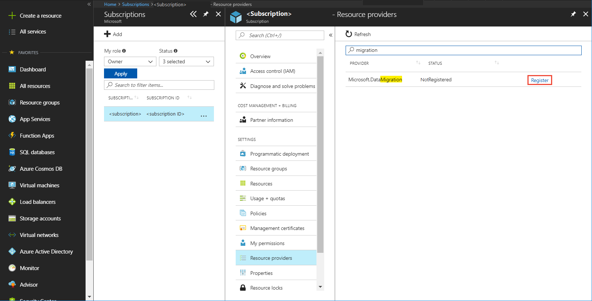

## Create a DMS instance

1. In the Azure portal, select + **Create a resource**, search for Azure Database Migration Service, and then select **Azure Database Migration Service** from the drop-down list.

    

2. On the **Azure Database Migration Service** screen, select **Create**.

    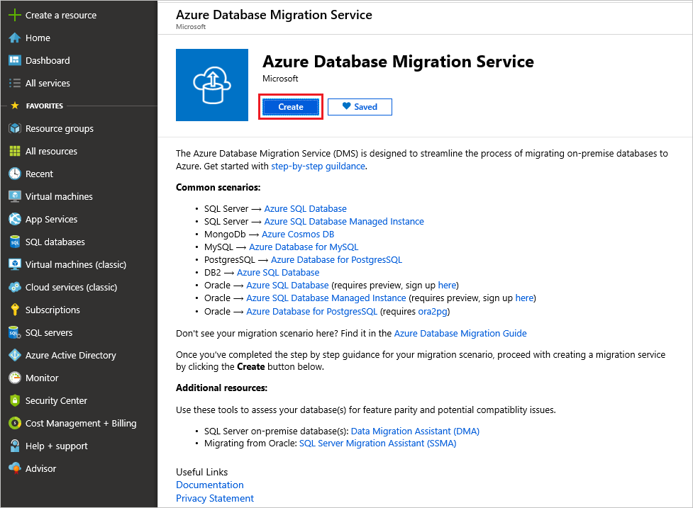
  
3. On the **Create Migration Service** screen, specify a name for the service, the subscription, and a new or existing resource group.

4. Select an existing VNet or create a new one.

    The VNet provides Azure Database Migration Service with access to the source Oracle and the target Azure  Database for PostgreSQL instance.

    For more information about how to create a VNet in the Azure portal, see the article [Create a virtual network using the Azure portal](https://aka.ms/DMSVnet).

5. Select a pricing tier.

    For more information on costs and pricing tiers, see the [pricing page](https://aka.ms/dms-pricing).

    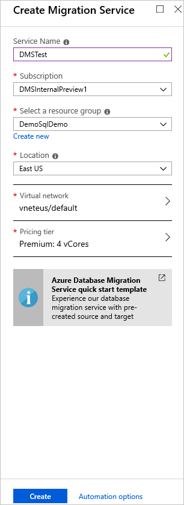

6. Select **Create** to create the service.

## Create a migration project

After the service is created, locate it within the Azure portal, open it, and then create a new migration project.

1. In the Azure portal, select **All services**, search for Azure Database Migration Service, and then select **Azure Database Migration Services**.

    

2. On the **Azure Database Migration Services** screen, search for the name of the Azure Database Migration Service instance that you created, and then select the instance.

    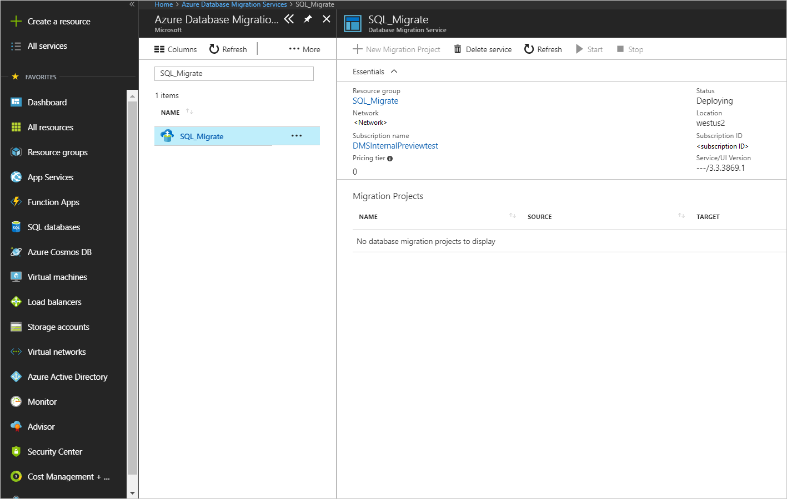

3. Select + **New Migration Project**.
4. On the **New migration project** screen, specify a name for the project, in the **Source server type** text box, select **Oracle**, in the **Target server type** text box, select **Azure Database for PostgreSQL**.
5. In the **Choose type of activity** section, select **Online data migration**.

   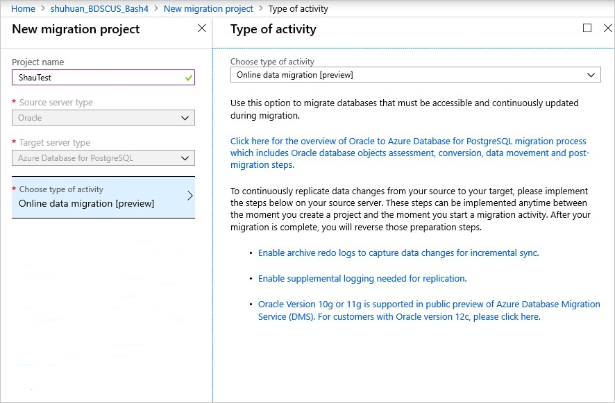

   > [!NOTE]
   > Alternately, you can choose **Create project only** to create the migration project now and execute the migration later.

6. Select **Save**, note the requirements to successfully use Azure Database Migration Service to perform an online migration, and then select **Create and run activity**.

## Specify source details

* On the **Add Source Details** screen, specify the connection details for the source Oracle instance.

  

## Upload Oracle OCI driver

1. Select **Save**, and then on the **Install OCI driver** screen, sign into your Oracle account and download the driver **instantclient-basiclite-windows.x64-12.2.0.1.0.zip** (37,128,586 Byte(s)) (SHA1 Checksum: 865082268) from [here](https://www.oracle.com/technetwork/topics/winx64soft-089540.html#ic_winx64_inst).
2. Download the driver to a shared folder.

   Make sure the folder is shared with the username that you specified with minimum Read-only access. Azure Database Migration Service accesses and reads from the share to upload the OCI driver to Azure by impersonating the username you specify.

   The username you specify must be a Windows user account.

   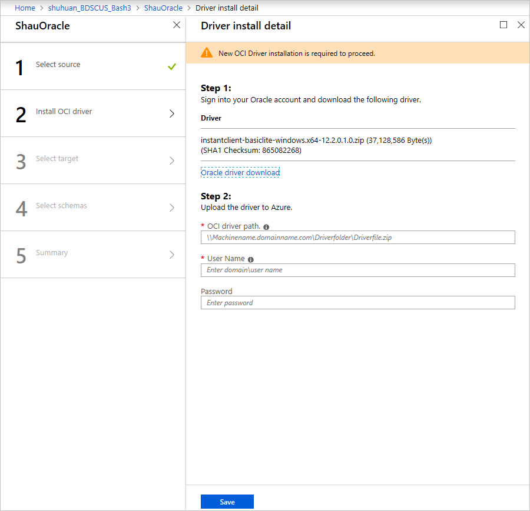

## Specify target details

1. Select **Save**, and then on the **Target details** screen, specify the connection details for the target Azure Database for PostgreSQL server, which is the pre-provisioned instance of Azure Database for PostgreSQL to which the **HR** schema was deployed.

    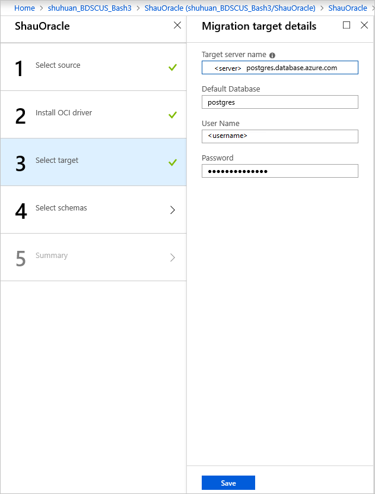

2. Select **Save**, and then on the **Map to target databases** screen, map the source and the target database for migration.

    If the target database contains the same database name as the source database, Azure Database Migration Service selects the target database by default.

    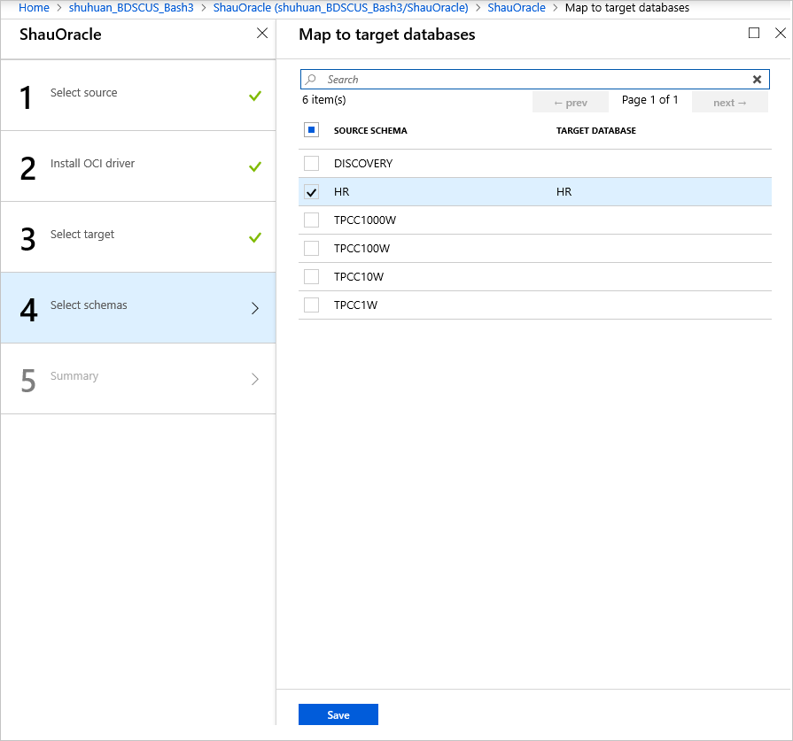

3. Select **Save**, on the **Migration summary** screen, in the **Activity name** text box, specify a name for the migration activity, and then review the summary to ensure that the source and target details match what you previously specified.

    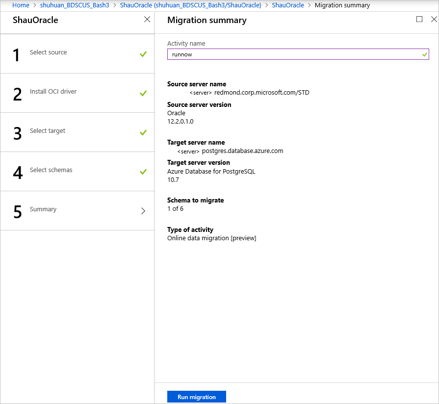

## Run the migration

* Select **Run migration**.

  The migration activity window appears, and the **Status** of the activity is **initializing**.

## Monitor the migration

1. On the migration activity screen, select **Refresh** to update the display until the **Status** of the migration shows as **Running**.

     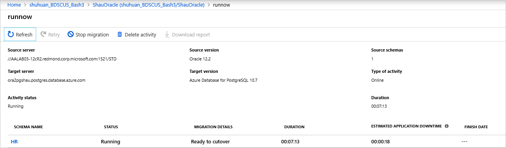

2. Under **Database Name**, select a specific database to get to the migration status for **Full data load** and **Incremental data sync** operations.

    Full data load will show the initial load migration status while Incremental data sync will show change data capture (CDC) status.

     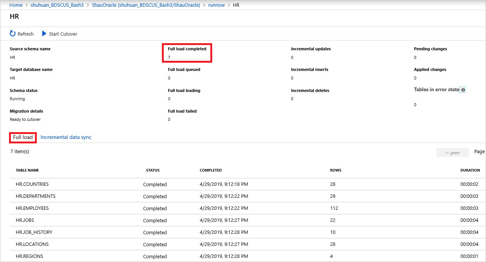

     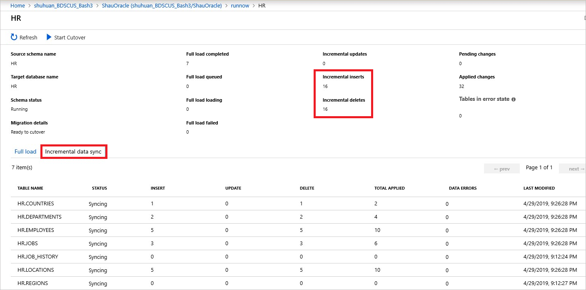

## Perform migration cutover

After the initial Full load is completed, the databases are marked **Ready to cutover**.

1. When you're ready to complete the database migration, select **Start Cutover**.

2. Make sure to stop all the incoming transactions to the source database; wait until the **Pending changes** counter shows **0**.

   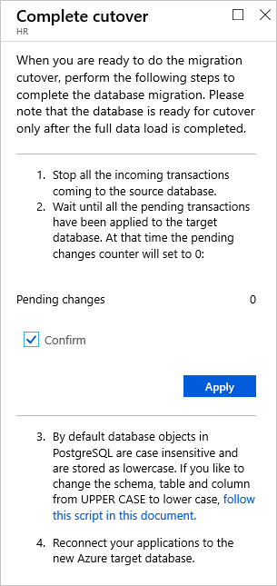

3. Select **Confirm**, and then select **Apply**.
4. When the database migration status shows **Completed**, connect your applications to the new target Azure Database for PostgreSQL instance.

 > [!NOTE]
 > Since PostgreSQL by default has schema.table.column in lower case, you can revert from upper case to lower case by using the script in the **Set up the schema in Azure Database for PostgreSQL** section earlier in this article.

## Next steps

* For information about known issues and limitations when performing online migrations to Azure Database for PostgreSQL, see the article [Known issues and workarounds with Azure Database for PostgreSQL online migrations](known-issues-azure-postgresql-online.md).
* For information about the Azure Database Migration Service, see the article [What is Azure Database Migration Service?](https://docs.microsoft.com/azure/dms/dms-overview).
* For information about Azure Database for PostgreSQL, see the article [What is Azure Database for PostgreSQL?](https://docs.microsoft.com/azure/postgresql/overview).
