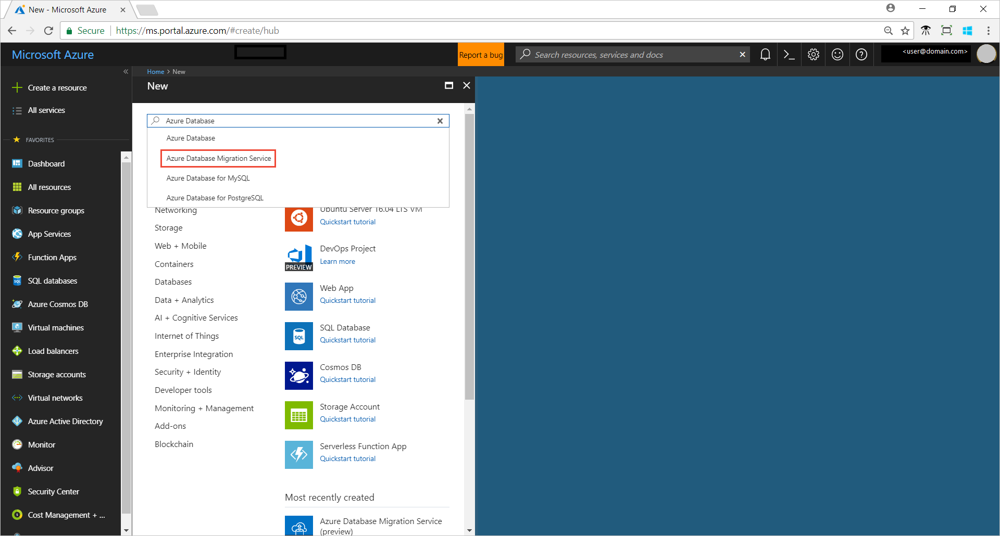
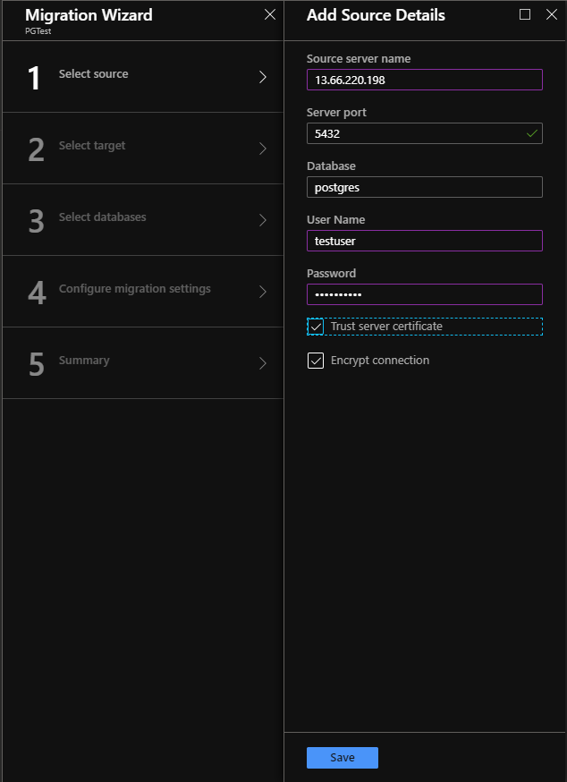
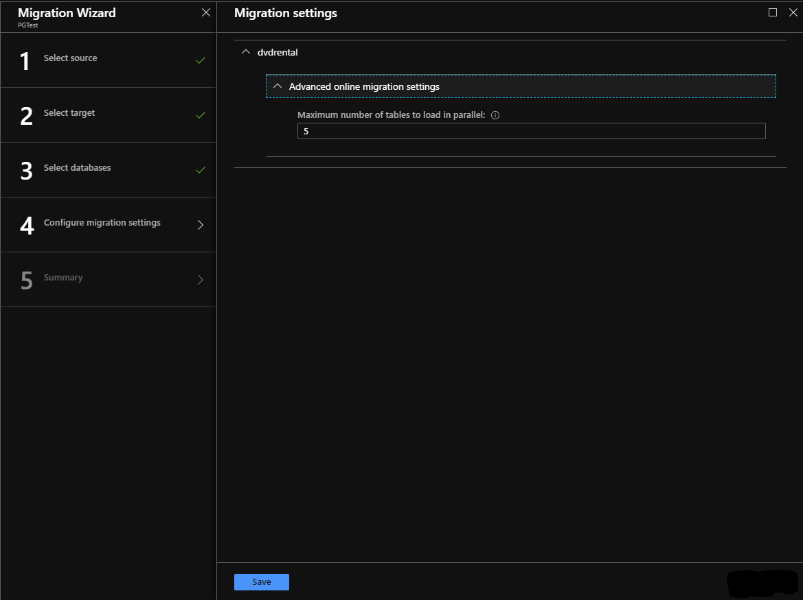
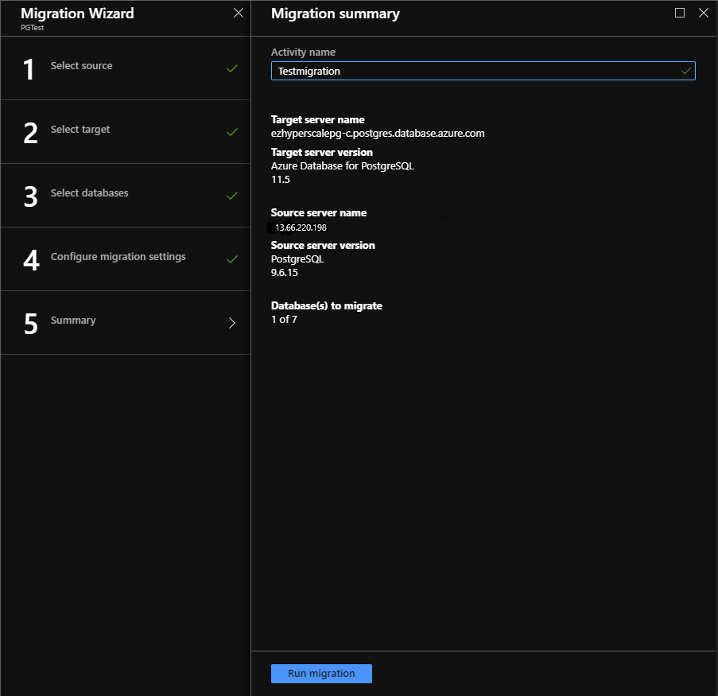
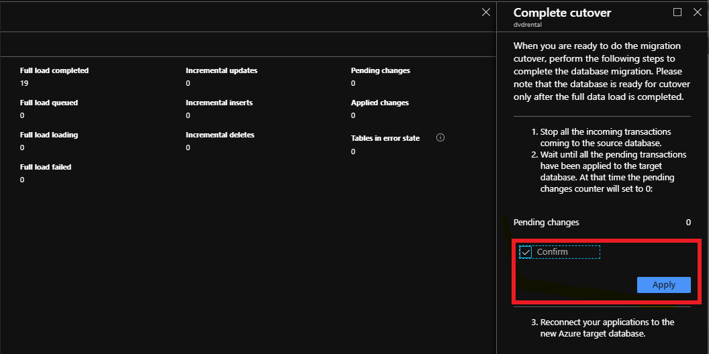

# Tutorial: Migrate PostgreSQL to Azure DB for PostgreSQL online using DMS via the Azure portal

You can use Azure Database Migration Service to migrate the databases from an on-premises PostgreSQL instance to [Azure Database for PostgreSQL](https://docs.microsoft.com/azure/postgresql/) with minimal downtime to the application. In this tutorial, you migrate the **DVD Rental** sample database from an on-premises instance of PostgreSQL 9.6 to Azure Database for PostgreSQL by using the online migration activity in Azure Database Migration Service.

In this tutorial, you learn how to:
> [!div class="checklist"]
>
> * Migrate the sample schema using the pg_dump utility.
> * Create an instance of Azure Database Migration Service.
> * Create a migration project in Azure Database Migration Service.
> * Run the migration.
> * Monitor the migration.
> * Perform migration cutover.

> [!NOTE]
> Using Azure Database Migration Service to perform an online migration requires creating an instance based on the Premium pricing tier. We encrypt disk to prevent data theft during the process of migration

> [!IMPORTANT]
> For an optimal migration experience, Microsoft recommends creating an instance of Azure Database Migration Service in the same Azure region as the target database. Moving data across regions or geographies can slow down the migration process and introduce errors.

## Prerequisites

To complete this tutorial, you need to:

* Download and install [PostgreSQL community edition](https://www.postgresql.org/download/) 9.4, 9.5, 9.6, or 10. The source PostgreSQL Server version must be 9.4, 9.5, 9.6, 10, or 11. For more information, see the article [Supported PostgreSQL Database Versions](https://docs.microsoft.com/azure/postgresql/concepts-supported-versions).

    Also note that the target Azure Database for PostgreSQL version must be equal to or later than the on-premises PostgreSQL version. For example, PostgreSQL 9.6 can migrate to Azure Database for PostgreSQL 9.6, 10, or 11, but not to Azure Database for PostgreSQL 9.5.

* [Create an Azure Database for PostgreSQL server](https://docs.microsoft.com/azure/postgresql/quickstart-create-server-database-portal) or [Create an Azure Database for PostgreSQL - Hyperscale (Citus) server](https://docs.microsoft.com/azure/postgresql/quickstart-create-hyperscale-portal).
* Create a Microsoft Azure Virtual Network for Azure Database Migration Service by using the Azure Resource Manager deployment model, which provides site-to-site connectivity to your on-premises source servers by using either [ExpressRoute](https://docs.microsoft.com/azure/expressroute/expressroute-introduction) or [VPN](https://docs.microsoft.com/azure/vpn-gateway/vpn-gateway-about-vpngateways). For more information about creating a virtual network, see the [Virtual Network Documentation](https://docs.microsoft.com/azure/virtual-network/), and especially the quickstart articles with step-by-step details.

    > [!NOTE]
    > During virtual network setup, if you use ExpressRoute with network peering to Microsoft, add the following service [endpoints](https://docs.microsoft.com/azure/virtual-network/virtual-network-service-endpoints-overview) to the subnet in which the service will be provisioned:
    >
    > * Target database endpoint (for example, SQL endpoint, Cosmos DB endpoint, and so on)
    > * Storage endpoint
    > * Service bus endpoint
    >
    > This configuration is necessary because Azure Database Migration Service lacks internet connectivity.

* Ensure that the Network Security Group (NSG) rules for your virtual network don't block the following inbound communication ports to Azure Database Migration Service: 443, 53, 9354, 445, 12000. For more detail on virtual network NSG traffic filtering, see the article [Filter network traffic with network security groups](https://docs.microsoft.com/azure/virtual-network/virtual-network-vnet-plan-design-arm).
* Configure your [Windows Firewall for database engine access](https://docs.microsoft.com/sql/database-engine/configure-windows/configure-a-windows-firewall-for-database-engine-access).
* Open your Windows firewall to allow Azure Database Migration Service to access the source PostgreSQL Server, which by default is TCP port 5432.
* When using a firewall appliance in front of your source database(s), you may need to add firewall rules to allow the Azure Database Migration Service to access the source database(s) for migration.
* Create a server-level [firewall rule](https://docs.microsoft.com/azure/sql-database/sql-database-firewall-configure) for Azure Database for PostgreSQL to allow Azure Database Migration Service to access to the target databases. Provide the subnet range of the virtual network used for Azure Database Migration Service.
* Enable logical replication in the postgresql.config file, and set the following parameters:

  * wal_level = **logical**
  * max_replication_slots = [number of slots], recommend setting to **five slots**
  * max_wal_senders =[number of concurrent tasks] - The max_wal_senders parameter sets the number of concurrent tasks that can run, recommend setting to **10 tasks**

> [!IMPORTANT]
> All tables in your existing database need a primary key to ensure that changes can be synced to the target database.

## Migrate the sample schema

To complete all the database objects like table schemas, indexes and stored procedures, we need to extract schema from the source database and apply to the database.

1. Use pg_dump -s command to create a schema dump file for a database.

    ```
    pg_dump -o -h hostname -U db_username -d db_name -s > your_schema.sql
    ```

    For example, to create a schema dump file for the **dvdrental** database:

    ```
    pg_dump -o -h localhost -U postgres -d dvdrental -s -O -x > dvdrentalSchema.sql
    ```

    For more information about using the pg_dump utility, see the examples in the [pg-dump](https://www.postgresql.org/docs/9.6/static/app-pgdump.html#PG-DUMP-EXAMPLES) tutorial.

2. Create an empty database in your target environment, which is Azure Database for PostgreSQL.

    For details on how to connect and create a database, see the article [Create an Azure Database for PostgreSQL server in the Azure portal](https://docs.microsoft.com/azure/postgresql/quickstart-create-server-database-portal) or [Create an Azure Database for PostgreSQL - Hyperscale (Citus) server in the Azure portal](https://docs.microsoft.com/azure/postgresql/quickstart-create-hyperscale-portal).

    > [!NOTE]
    > An instance of Azure Database for PostgreSQL - Hyperscale (Citus) has only a single database: **citus**.

3. Import the schema into the target database you created by restoring the schema dump file.

    ```
    psql -h hostname -U db_username -d db_name < your_schema.sql
    ```

    For example:

    ```
    psql -h mypgserver-20170401.postgres.database.azure.com  -U postgres -d dvdrental citus < dvdrentalSchema.sql
    ```

4. To extract the drop foreign key script and add it at the destination (Azure Database for PostgreSQL), in PgAdmin or in psql, run the following script.

   > [!IMPORTANT]
   > Foreign keys in your schema will cause the initial load and continuous sync of the migration to fail.

    ```
    SELECT Q.table_name
        ,CONCAT('ALTER TABLE ', table_schema, '.', table_name, STRING_AGG(DISTINCT CONCAT(' DROP CONSTRAINT ', foreignkey), ','), ';') as DropQuery
            ,CONCAT('ALTER TABLE ', table_schema, '.', table_name, STRING_AGG(DISTINCT CONCAT(' ADD CONSTRAINT ', foreignkey, ' FOREIGN KEY (', column_name, ')', ' REFERENCES ', foreign_table_schema, '.', foreign_table_name, '(', foreign_column_name, ')' ), ','), ';') as AddQuery
    FROM
        (SELECT
        S.table_schema,
        S.foreignkey,
        S.table_name,
        STRING_AGG(DISTINCT S.column_name, ',') AS column_name,
        S.foreign_table_schema,
        S.foreign_table_name,
        STRING_AGG(DISTINCT S.foreign_column_name, ',') AS foreign_column_name
    FROM
        (SELECT DISTINCT
        tc.table_schema,
        tc.constraint_name AS foreignkey,
        tc.table_name,
        kcu.column_name,
        ccu.table_schema AS foreign_table_schema,
        ccu.table_name AS foreign_table_name,
        ccu.column_name AS foreign_column_name
        FROM information_schema.table_constraints AS tc
        JOIN information_schema.key_column_usage AS kcu ON tc.constraint_name = kcu.constraint_name AND tc.table_schema = kcu.table_schema
        JOIN information_schema.constraint_column_usage AS ccu ON ccu.constraint_name = tc.constraint_name AND ccu.table_schema = tc.table_schema
    WHERE constraint_type = 'FOREIGN KEY'
        ) S
        GROUP BY S.table_schema, S.foreignkey, S.table_name, S.foreign_table_schema, S.foreign_table_name
        ) Q
        GROUP BY Q.table_schema, Q.table_name;
    ```

5. Run the drop foreign key (which is the second column) in the query result.

6. To disable triggers in target database, run the script below.

   > [!IMPORTANT]
   > Triggers (insert or update) in the data enforce data integrity in the target ahead of the data being replicated  from the source. As a result, it's recommended that you disable triggers in all the tables **at the target** during migration, and then re-enable the triggers after migration is complete.

    ```
    SELECT DISTINCT CONCAT('ALTER TABLE ', event_object_schema, '.', event_object_table, ' DISABLE TRIGGER ', trigger_name, ';')
    FROM information_schema.triggers
    ```

## Register the Microsoft.DataMigration resource provider

1. Sign in to the Azure portal, select **All services**, and then select **Subscriptions**.

   

2. Select the subscription in which you want to create the instance of Azure Database Migration Service, and then select **Resource providers**.

    

3. Search for migration, and then to the right of **Microsoft.DataMigration**, select **Register**.

    

## Create a DMS instance

1. In the Azure portal, select + **Create a resource**, search for Azure Database Migration Service, and then select **Azure Database Migration Service** from the drop-down list.

    

2. On the **Azure Database Migration Service** screen, select **Create**.

    
  
3. On the **Create Migration Service** screen, specify a name, the subscription, a new or existing resource group, and the location for the service.

4. Select an existing virtual network or create a new one.

    The virtual network provides Azure Database Migration Service with access to the source PostgreSQL server and the target Azure Database for PostgreSQL instance.

    For more information about how to create a virtual network in the Azure portal, see the article [Create a virtual network using the Azure portal](https://aka.ms/DMSVnet).

5. Select a pricing tier.

    For more information on costs and pricing tiers, see the [pricing page](https://aka.ms/dms-pricing).

    

6. Select **Review + create** to create the service.

   Service creation will complete within about 10 to 15 minutes.

## Create a migration project

After the service is created, locate it within the Azure portal, open it, and then create a new migration project.

1. In the Azure portal, select **All services**, search for Azure Database Migration Service, and then select **Azure Database Migration Services**.

      

2. On the **Azure Database Migration Services** screen, search for the name of Azure Database Migration Service instance that you created, select the instance, and then select + **New Migration Project**.

3. On the **New migration project** screen, specify a name for the project, in the **Source server type** text box, select **PostgresSQL**, in the **Target server type** text box, select **Azure Database for PostgreSQL**.

4. In the **Choose type of activity** section, select **Online data migration**.

    

    > [!NOTE]
    > Alternately, you can choose **Create project only** to create the migration project now and execute the migration later.

5. Select **Save**, note the requirements to successfully use Azure Database Migration Service to migrate data, and then select **Create and run activity**.

## Specify source details

1. On the **Add Source Details** screen, specify the connection details for the source PostgreSQL instance.

    

2. Select **Save**.

## Specify target details

1. On the **Target details** screen, specify the connection details for the target Hyperscale (Citus) server, which is the pre-provisioned instance of Hyperscale (Citus) to which the **DVD Rentals** schema was deployed by using pg_dump.

    

2. Select **Save**, and then on the **Map to target databases** screen, map the source and the target database for migration.

    If the target database contains the same database name as the source database, Azure Database Migration Service selects the target database by default.

    

3. Select **Save**, and then on the **Migration settings** screen, accept the default values.

    

4. Select **Save**, on the **Migration summary** screen, in the **Activity name** text box, specify a name for the migration activity, and then review the summary to ensure that the source and target details match what you previously specified.

    

## Run the migration

* Select **Run migration**.

    The migration activity window appears, and the **Status** of the activity should update to show as **Backup in Progress**.

## Monitor the migration

1. On the migration activity screen, select **Refresh** to update the display until the **Status** of the migration shows as **Complete**.

     

2. When the migration is complete, under **Database Name**, select a specific database to get to the migration status for **Full data load** and **Incremental data sync** operations.

   > [!NOTE]
   > **Full data load** shows the initial load migration status, while **Incremental data sync** shows change data capture (CDC) status.

     

     

## Perform migration cutover

After the initial Full load is completed, the databases are marked **Ready to cutover**.

1. When you're ready to complete the database migration, select **Start Cutover**.

2. Wait until the **Pending changes** counter shows **0** to ensure that all incoming transactions to the source database are stopped, select the **Confirm** checkbox, and then select **Apply**.

    

3. When the database migration status shows **Completed**, connect your applications to the new target instance of Azure Database for PostgreSQL.

## Next steps

* For information about known issues and limitations when performing online migrations to Azure Database for PostgreSQL, see the article [Known issues and workarounds with Azure Database for PostgreSQL online migrations](known-issues-azure-postgresql-online.md).
* For information about the Azure Database Migration Service, see the article [What is the Azure Database Migration Service?](https://docs.microsoft.com/azure/dms/dms-overview).
* For information about Azure Database for PostgreSQL, see the article [What is Azure Database for PostgreSQL?](https://docs.microsoft.com/azure/postgresql/overview).
