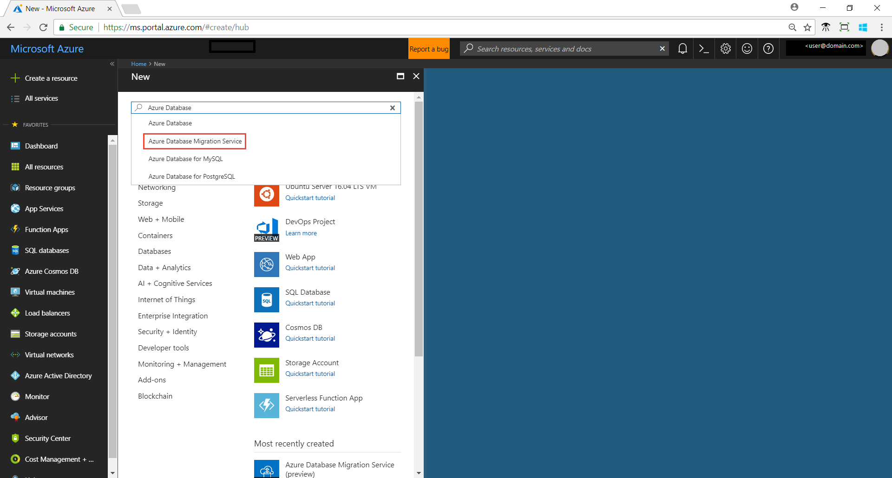
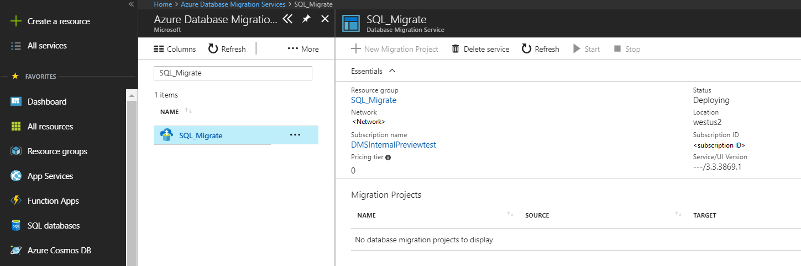
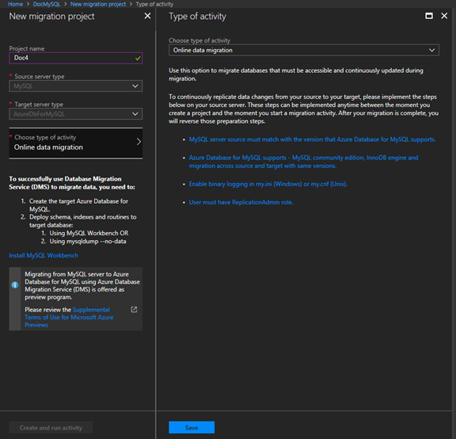
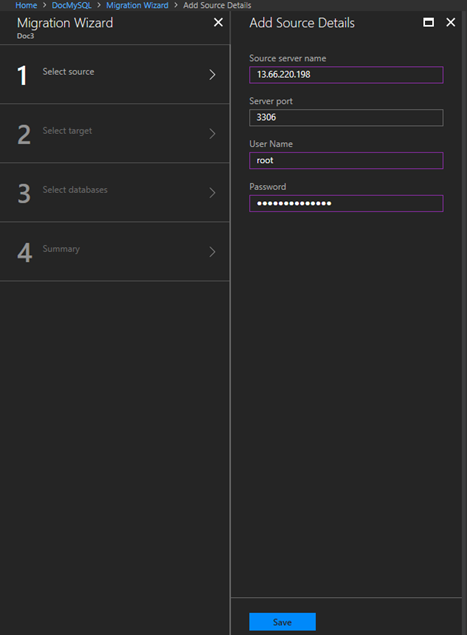
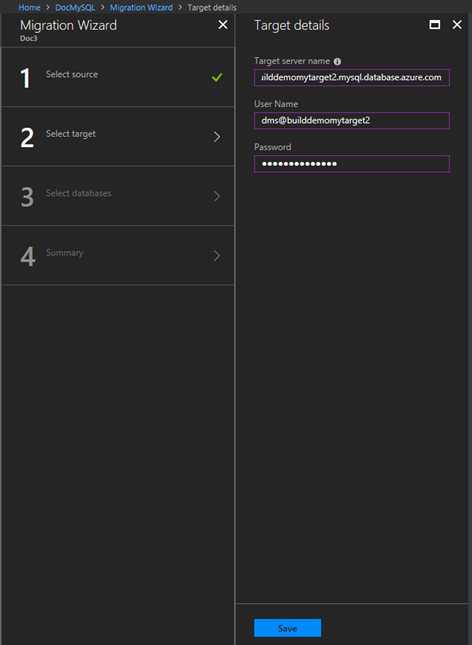
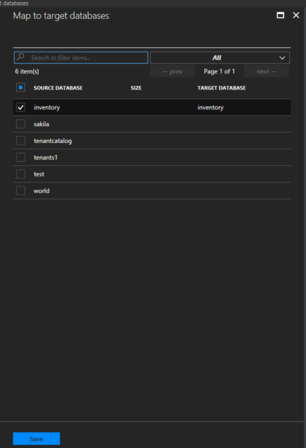
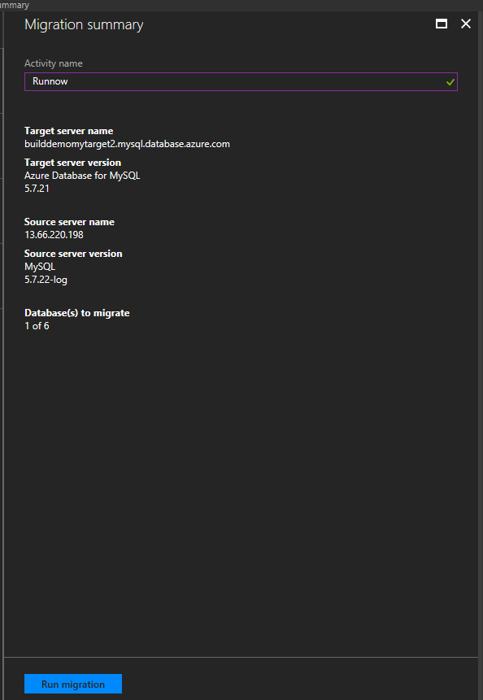
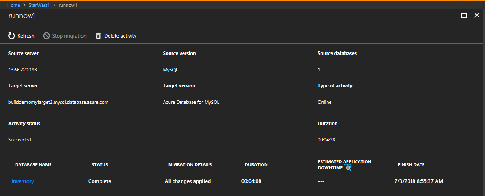
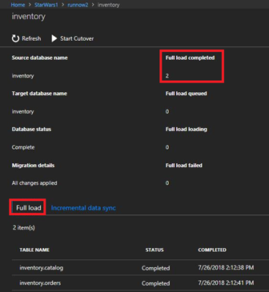
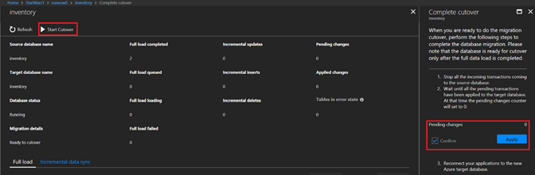

# Tutorial: Migrate RDS MySQL to Azure Database for MySQL online using DMS

You can use Azure Database Migration Service to migrate databases from an RDS MySQL instance to [Azure Database for MySQL](https://docs.microsoft.com/azure/mysql/) while the source database remains online during migration. In other words, migration can be achieved with minimal downtime to the application. In this tutorial, you migrate the **Employees** sample database from an instance of RDS MySQL to Azure Database for MySQL by using the online migration activity in Azure Database Migration Service.

In this tutorial, you learn how to:
> [!div class="checklist"]
> * Migrate the sample schema by using the mysqldump and mysql utilities.
> * Create an instance of Azure Database Migration Service.
> * Create a migration project by using Azure Database Migration Service.
> * Run the migration.
> * Monitor the migration.

> [!NOTE]
> Using the Azure Database Migration Service to perform an online migration requires creating an instance based on the Premium pricing tier. For more information, see the Azure Database Migration Service [pricing](https://azure.microsoft.com/pricing/details/database-migration/) page.

> [!IMPORTANT]
> For an optimal migration experience, Microsoft recommends creating an instance of the Azure Database Migration Service in the same Azure region as the target database. Moving data across regions or geographies can slow down the migration process and introduce errors.

[!INCLUDE [online-offline](../../includes/database-migration-service-offline-online.md)]

This article describes how to perform an online migration from an instance of RDS MySQL to Azure Database for MySQL.

## Prerequisites

To complete this tutorial, you need to:

* Ensure that the source MySQL server is running a supported MySQL community edition. To determine the version of your MySQL instance, in the mysql utility or MySQL Workbench, run the command:

    ```
    SELECT @@version;
    ```

    For more information, see the article [Supported Azure Database for MySQL versions](https://docs.microsoft.com/azure/mysql/concepts-supported-versions).

* Download and install the [MySQL **Employees** sample database](https://dev.mysql.com/doc/employee/en/employees-installation.html).
* Create an instance of [Azure Database for MySQL](https://docs.microsoft.com/azure/mysql/quickstart-create-mysql-server-database-using-azure-portal).
* Create an Azure Virtual Network (VNet) for Azure Database Migration Service by using the Azure Resource Manager deployment model, which provides site-to-site connectivity to your on-premises source servers by using either [ExpressRoute](https://docs.microsoft.com/azure/expressroute/expressroute-introduction) or [VPN](https://docs.microsoft.com/azure/vpn-gateway/vpn-gateway-about-vpngateways). For more information about creating a VNet, see the [Virtual Network Documentation](https://docs.microsoft.com/azure/virtual-network/), and especially the quickstart articles with step-by-step details.
* Ensure that your VNet Network Security Group rules don't block the following inbound communication ports to Azure Database Migration Service: 443, 53, 9354, 445, and 12000. For more detail on Azure VNet NSG traffic filtering, see the article [Filter network traffic with network security groups](https://docs.microsoft.com/azure/virtual-network/virtual-networks-nsg).
* Configure your [Windows Firewall for database engine access](https://docs.microsoft.com/sql/database-engine/configure-windows/configure-a-windows-firewall-for-database-engine-access).
* Open your Windows firewall to allow Azure Database Migration Service to access the source MySQL server, which by default is TCP port 3306.
* When using a firewall appliance in front of your source database(s), you may need to add firewall rules to allow the Azure Database Migration Service to access the source database(s) for migration.
* Create a server-level [firewall rule](https://docs.microsoft.com/azure/sql-database/sql-database-firewall-configure) for the Azure Database for MySQL server to allow Azure Database Migration Service access to the target databases. Provide the subnet range of the VNet used for Azure Database Migration Service.

> [!NOTE]
> Azure Database for MySQL only supports InnoDB tables. To convert MyISAM tables to InnoDB, please see the article [Converting Tables from MyISAM to InnoDB](https://dev.mysql.com/doc/refman/5.7/en/converting-tables-to-innodb.html) .

### Set up AWS RDS MySQL for replication

1. To create a new parameter group, follow the instructions provided by AWS in the article [MySQL Database Log Files](https://docs.aws.amazon.com/AmazonRDS/latest/UserGuide/USER_LogAccess.Concepts.MySQL.html), in the **Binary Logging Format** section.
2. Create a new parameter group with the following configuration:
    * binlog_format = row
    * binlog_checksum = NONE
3. Save the new parameter group.

## Migrate the schema

1. Extract the schema from the source database and apply to the target database to complete migration of all database objects such as table schemas, indexes, and stored procedures.

    The easiest way to migrate only the schema is to use mysqldump with the --no-data parameter. The command to migrate the schema is:

    ```
    mysqldump -h [servername] -u [username] -p[password] --databases [db name] --no-data > [schema file path]
    ```
    
    For example, to dump a schema file for the **Employees** database, use the following command:
    
    ```
    mysqldump -h 10.10.123.123 -u root -p --databases employees --no-data > d:\employees.sql
    ```

2. Import the schema to target service, which is Azure Database for MySQL. To restore the schema dump file, run the following command:

    ```
    mysql.exe -h [servername] -u [username] -p[password] [database]< [schema file path]
    ```

    For example, to import the schema for the **Employees** database:

    ```
    mysql.exe -h shausample.mysql.database.azure.com -u dms@shausample -p employees < d:\employees.sql
    ```

3. If you have foreign keys in your schema, the initial load and continuous sync of the migration will fail. To extract the drop foreign key script and add foreign key script at the destination (Azure Database for MySQL), run the following script in MySQL Workbench:

    ```
    SET group_concat_max_len = 8192;
        SELECT SchemaName, GROUP_CONCAT(DropQuery SEPARATOR ';\n') as DropQuery, GROUP_CONCAT(AddQuery SEPARATOR ';\n') as AddQuery
        FROM
        (SELECT
        KCU.REFERENCED_TABLE_SCHEMA as SchemaName,
    	KCU.TABLE_NAME,
    	KCU.COLUMN_NAME,
    	CONCAT('ALTER TABLE ', KCU.TABLE_NAME, ' DROP FOREIGN KEY ', KCU.CONSTRAINT_NAME) AS DropQuery,
        CONCAT('ALTER TABLE ', KCU.TABLE_NAME, ' ADD CONSTRAINT ', KCU.CONSTRAINT_NAME, ' FOREIGN KEY (`', KCU.COLUMN_NAME, '`) REFERENCES `', KCU.REFERENCED_TABLE_NAME, '` (`', KCU.REFERENCED_COLUMN_NAME, '`) ON UPDATE ',RC.UPDATE_RULE, ' ON DELETE ',RC.DELETE_RULE) AS AddQuery
    	FROM INFORMATION_SCHEMA.KEY_COLUMN_USAGE KCU, information_schema.REFERENTIAL_CONSTRAINTS RC
    	WHERE
    	  KCU.CONSTRAINT_NAME = RC.CONSTRAINT_NAME
    	  AND KCU.REFERENCED_TABLE_SCHEMA = RC.UNIQUE_CONSTRAINT_SCHEMA
      AND KCU.REFERENCED_TABLE_SCHEMA = ('SchemaName') Queries
      GROUP BY SchemaName;
    ```

4. Run the drop foreign key (which is the second column) in the query result to drop the foreign key.

5. If you have triggers (insert or update trigger) in the data, it will enforce data integrity in the target before replicating data from the source. The recommendation is to disable triggers in all the tables *at the target* during migration, and then enable the triggers after migration is complete.

    To disable triggers in target database:

    ```
    select concat ('alter table ', event_object_table, ' disable trigger ', trigger_name)
    from information_schema.triggers;
    ```

6. If there are instances of the ENUM data type in any tables, we recommend temporarily updating to the ‘character varying’ datatype in the target table. WHen data replication is complete, then revert the data type to ENUM.

## Register the Microsoft.DataMigration resource provider

1. Sign in to the Azure portal, select **All services**, and then select **Subscriptions**.

   

2. Select the subscription in which you want to create the instance of Azure Database Migration Service, and then select **Resource providers**.

    

3. Search for migration, and then to the right of **Microsoft.DataMigration**, select **Register**.

    

## Create an instance of Azure Database Migration Service

1. In the Azure portal, select + **Create a resource**, search for Azure Database Migration Service, and then select **Azure Database Migration Service** from the drop-down list.

    

2. On the **Azure Database Migration Service** screen, select **Create**.

    
  
3. On the **Create Migration Service** screen, specify a name for the service, the subscription, and a new or existing resource group.

4. Select the location in which you want to create the instance of Azure Database Migration Service.

5. Select an existing VNet or create a new one.

    The VNet provides Azure Database Migration Service with access to the source MySQL instance and the target Azure Database for MySQL instance.

    For more information about how to create a VNet in the Azure portal, see the article [Create a virtual network using the Azure portal](https://aka.ms/DMSVnet).

6. Select a pricing tier; for this online migration, be sure to select the Premium: 4vCores pricing tier.

    

7. Select **Create** to create the service.

## Create a migration project

After the service is created, locate it within the Azure portal, open it, and then create a new migration project.

1. In the Azure portal, select **All services**, search for Azure Database Migration Service, and then select **Azure Database Migration Services**.

      

2. On the **Azure Database Migration Services** screen, search for the name of the Azure Database Migration Service instance that you created, and then select the instance.

     

3. Select + **New Migration Project**.
4. On the **New migration project** screen, specify a name for the project, in the **Source server type** text box, select **MySQL**, and then in the **Target server type** text box, select **AzureDbForMySQL**.
5. In the **Choose type of activity** section, select **Online data migration**.

    > [!IMPORTANT]
    > Be sure to select **Online data migration**; offline migrations are not supported for this scenario.

    

    > [!NOTE]
    > Alternately, you can choose **Create project only** to create the migration project now and execute the migration later.

6. Select **Save**.

7. Select **Create and run activity** to create the project and run the migration activity.

    > [!NOTE]
    > Please make a note of the pre-requisites needed to set up online migration in the project creation blade.

## Specify source details

* On the **Migration source detail** screen, specify the connection details for the source MySQL instance.

   

## Specify target details

1. Select **Save**, and then on the **Target details** screen, specify the connection details for the target Azure Database for MySQL server, which is pre-provisioned and has the **Employees** schema deployed using MySQLDump.

    

2. Select **Save**, and then on the **Map to target databases** screen, map the source and the target database for migration.

    If the target database contains the same database name as the source database, Azure Database Migration Service selects the target database by default.

    

3. Select **Save**, on the **Migration summary** screen, in the **Activity name** text box, specify a name for the migration activity, and then review the summary to ensure that the source and target details match what you previously specified.

    

## Run the migration

* Select **Run migration**.

    The migration activity window appears, and the **Status** of the activity is **Initializing**.

## Monitor the migration

1. On the migration activity screen, select **Refresh** to update the display until the **Status** of the migration shows as **Running**.

    

2. Under **DATABASE NAME**, select a specific database to get to the migration status for **Full data load** and **Incremental data sync** operations.

    **Full data load** shows the initial load migration status, while **Incremental data sync** shows change data capture (CDC) status.

    

    

## Perform migration cutover

After the initial Full load is completed, the databases are marked **Ready to Cutover**.

1. When you're ready to complete the database migration, select **Start Cutover**.

    

2. Make sure to stop all the incoming transactions to the source database; wait until the **Pending changes** counter shows **0**.
3. Select **Confirm**, and the select **Apply**.
4. When the database migration status shows **Completed**, connect your applications to the new target Azure Database for MySQL database.

Your online migration of an on-premises instance of MySQL to Azure Database for MySQL is now complete.

## Next steps

* For information about the Azure Database Migration Service, see the article [What is the Azure Database Migration Service?](https://docs.microsoft.com/azure/dms/dms-overview).
* For information about Azure Database for MySQL, see the article [What is Azure Database for MySQL?](https://docs.microsoft.com/azure/mysql/overview).
* For other questions, email the [Ask Azure Database Migrations](mailto:AskAzureDatabaseMigrations@service.microsoft.com) alias.
