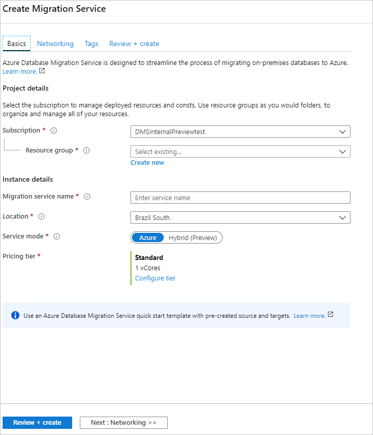
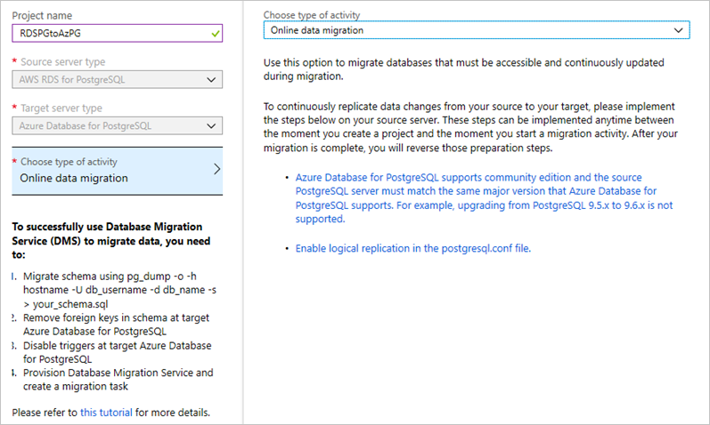
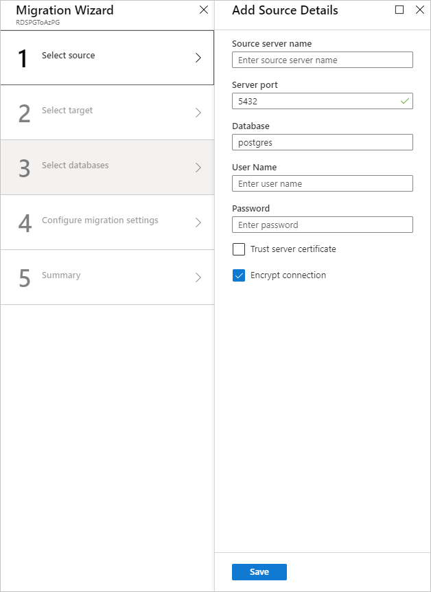
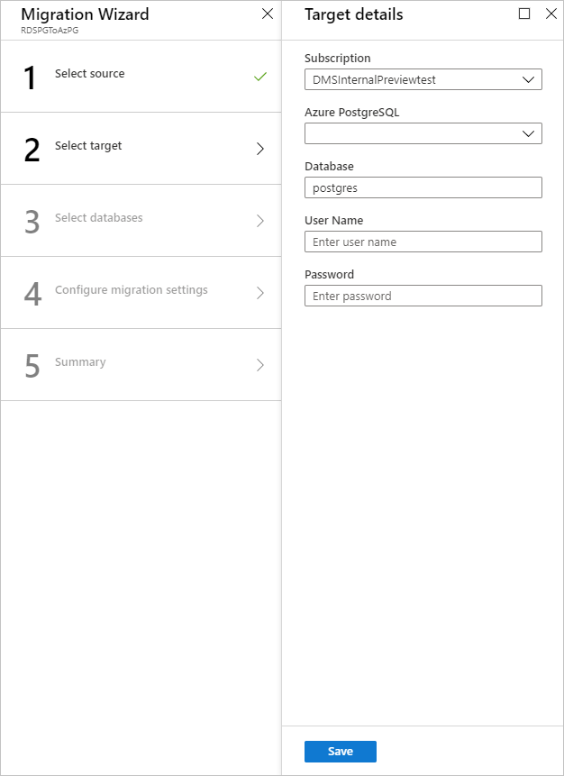
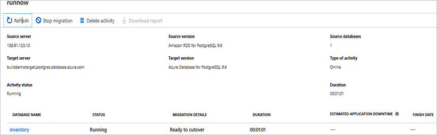
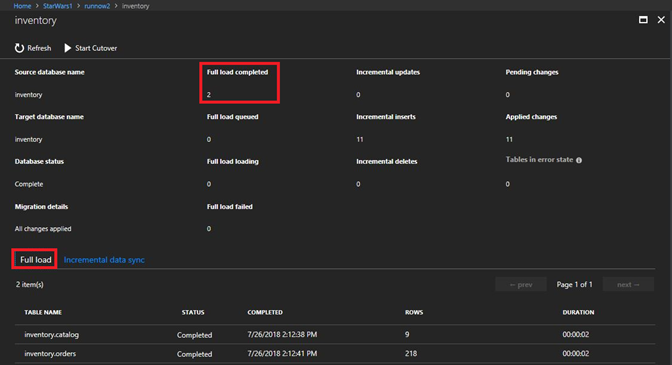
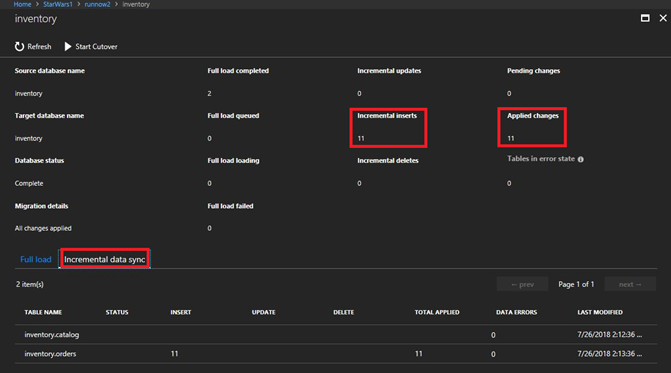

# Tutorial: Migrate RDS PostgreSQL to Azure DB for PostgreSQL online using DMS

You can use Azure Database Migration Service to migrate databases from an RDS PostgreSQL instance to [Azure Database for PostgreSQL](../postgresql/index.yml) while the source database remains online during migration. In other words, migration can be achieved with minimal downtime to the application. In this tutorial, you migrate the **DVD Rental** sample database from an instance of RDS PostgreSQL 9.6 to Azure Database for PostgreSQL by using the online migration activity in Azure Database Migration Service.

In this tutorial, you learn how to:
> [!div class="checklist"]
>
> * Migrate the sample schema by using the pg_dump utility.
> * Create an instance of Azure Database Migration Service.
> * Create a migration project by using Azure Database Migration Service.
> * Run the migration.
> * Monitor the migration.
> * Perform migration cutover.

> [!NOTE]
> Using the Azure Database Migration Service to perform an online migration requires creating an instance based on the Premium pricing tier. For more information, see the Azure Database Migration Service [pricing](https://azure.microsoft.com/pricing/details/database-migration/) page. We encrypt disk to prevent data theft during the process of migration.

> [!IMPORTANT]
> For an optimal migration experience, Microsoft recommends creating an instance of the Azure Database Migration Service in the same Azure region as the target database. Moving data across regions or geographies can slow down the migration process and introduce errors.

[!INCLUDE [online-offline](../../includes/database-migration-service-offline-online.md)]

This article describes how to perform an online migration from an on-premises instance of PostgreSQL to Azure Database for PostgreSQL.

## Prerequisites

To complete this tutorial, you need to:

* Download and install [PostgreSQL community edition](https://www.postgresql.org/download/) 9.5, 9.6, or 10. The source PostgreSQL Server version must be 9.5.11, 9.6.7, 10, or later. For more information, see the article [Supported PostgreSQL Database Versions](../postgresql/concepts-supported-versions.md).

   Also note that the target Azure Database for PostgreSQL version must be equal to or later than the RDS PostgreSQL version. For example, RDS PostgreSQL 9.6 can only migrate to Azure Database for PostgreSQL 9.6, 10, or 11, but not to Azure Database for PostgreSQL 9.5.

* Create an instance of [Azure Database for PostgreSQL](../postgresql/quickstart-create-server-database-portal.md) or [Azure Database for PostgreSQL - Hyperscale (Citus)](../postgresql/hyperscale/quickstart-create-portal.md). Refer to this [section](../postgresql/quickstart-create-server-database-portal.md#connect-to-the-server-with-psql) of the document for detail on how to connect to the PostgreSQL Server using pgAdmin.
* Create a Microsoft Azure Virtual Network for Azure Database Migration Service by using the Azure Resource Manager deployment model, which provides site-to-site connectivity to your on-premises source servers by using either [ExpressRoute](../expressroute/expressroute-introduction.md) or [VPN](../vpn-gateway/vpn-gateway-about-vpngateways.md). For more information about creating a virtual network, see the [Virtual Network Documentation](../virtual-network/index.yml), and especially the quickstart articles with step-by-step details.
* Ensure that your virtual network Network Security Group rules don't block the outbound port 443 of ServiceTag for ServiceBus, Storage and AzureMonitor. For more detail on virtual network NSG traffic filtering, see the article [Filter network traffic with network security groups](../virtual-network/virtual-network-vnet-plan-design-arm.md).
* Configure your [Windows Firewall for database engine access](/sql/database-engine/configure-windows/configure-a-windows-firewall-for-database-engine-access).
* Open your Windows firewall to allow Azure Database Migration Service to access the source PostgreSQL server, which by default is TCP port 5432.
* When using a firewall appliance in front of your source database(s), you may need to add firewall rules to allow the Azure Database Migration Service to access the source database(s) for migration.
* Create a server-level [firewall rule](../postgresql/concepts-firewall-rules.md) for the Azure Database for PostgreSQL server to allow Azure Database Migration Service access to the target databases. Provide the subnet range of the virtual network used for Azure Database Migration Service.

### Set up AWS RDS PostgreSQL for replication

1. To create a new parameter group, follow the instructions provided by AWS in the article [Working with DB Parameter Groups](https://docs.aws.amazon.com/AmazonRDS/latest/UserGuide/USER_WorkingWithParamGroups.html).
2. Use the master user name to connect to the source from Azure Database Migration Service. If you use an account other than the master user account, the account must have the rds_superuser role and the rds_replication role. The rds_replication role grants permissions to manage logical slots and to stream data using logical slots.
3. Create a new parameter group with the following configuration:

    a. Set the rds.logical_replication parameter in your DB parameter group to 1.

    b. max_wal_senders =[number of concurrent tasks] - The max_wal_senders parameter sets the number of concurrent tasks that can run, recommend 10 tasks.

    c. max_replication_slots – = [number of slots], recommend set to five slots.

4. Associate the parameter group you created to the RDS PostgreSQL instance.

## Migrate the schema

1. Extract the schema from the source database and apply to the target database to complete migration of all database objects such as table schemas, indexes, and stored procedures.

    The easiest way to migrate only the schema is to use pg_dump with the -s option. For more information, see the [examples](https://www.postgresql.org/docs/9.6/app-pgdump.html#PG-DUMP-EXAMPLES) in the Postgres pg_dump tutorial.

    ```
    pg_dump -O -h hostname -U db_username -d db_name -s > your_schema.sql
    ```

    For example, to dump a schema file for the **dvdrental** database, use the following command:

    ```
    pg_dump -O -h localhost -U postgres -d dvdrental -s  > dvdrentalSchema.sql
    ```

2. Create an empty database in the target service, which is Azure Database for PostgreSQL. To connect and create a database, refer to one of the following articles:

    * [Create an Azure Database for PostgreSQL server by using the Azure portal](../postgresql/quickstart-create-server-database-portal.md)
    * [Create an Azure Database for PostgreSQL - Hyperscale (Citus) server using the Azure portal](../postgresql/hyperscale/quickstart-create-portal.md)

3. Import the schema to target service, which is Azure Database for PostgreSQL. To restore the schema dump file, run the following command:

    ```
    psql -h hostname -U db_username -d db_name < your_schema.sql
    ```

    For example:

    ```
    psql -h mypgserver-20170401.postgres.database.azure.com  -U postgres -d dvdrental < dvdrentalSchema.sql
    ```

  > [!NOTE]
   > The migration service internally handles the enable/disable of foreign keys and triggers to ensure a reliable and robust data migration. As a result, you do not have to worry about making any modifications to the target database schema.

[!INCLUDE [resource-provider-register](../../includes/database-migration-service-resource-provider-register.md)]

## Create an instance of Azure Database Migration Service

1. In the Azure portal, select + **Create a resource**, search for Azure Database Migration Service, and then select **Azure Database Migration Service** from the drop-down list.

    

2. On the **Azure Database Migration Service** screen, select **Create**.

    
  
3. On the **Create Migration Service** screen, specify a name for the service, the subscription, and a new or existing resource group.

4. Select the location in which you want to create the instance of Azure Database Migration Service.

5. Select an existing virtual network or create a new one.

    The virtual network provides Azure Database Migration Service with access to the source PostgreSQL instance and the target Azure Database for PostgreSQL instance.

    For more information about how to create a virtual network in the Azure portal, see the article [Create a virtual network using the Azure portal](../virtual-network/quick-create-portal.md).

6. Select a pricing tier; for this online migration, be sure to select the Premium: 4vCores pricing tier.

    

7. Select **Create** to create the service.

## Create a migration project

After the service is created, locate it within the Azure portal, open it, and then create a new migration project.

1. In the Azure portal, select **All services**, search for Azure Database Migration Service, and then select **Azure Database Migration Services**.

      

2. On the **Azure Database Migration Services** screen, search for the name of the Azure Database Migration Service instance that you created, select the instance, and then select + **New Migration Project**.
3. On the **New migration project** screen, specify a name for the project, in the **Source server type** text box, select **AWS RDS for PostgreSQL**, and then in the **Target server type** text box, select **Azure Database for PostgreSQL**.
4. In the **Choose type of activity** section, select **Online data migration**.

    > [!IMPORTANT]
    > Be sure to select **Online data migration**; offline migrations are not supported for this scenario.

    

    > [!NOTE]
    > Alternately, you can choose **Create project only** to create the migration project now and execute the migration later.

5. Select **Save**.

6. Select **Create and run activity** to create the project and run the migration activity.

    > [!NOTE]
    > Please make a note of the pre-requisites needed to set up online migration in the project creation blade.

## Specify source details

* On the **Add Source Details** screen, specify the connection details for the source PostgreSQL instance.

   

## Specify target details

1. Select **Save**, and then on the **Target details** screen, specify the connection details for the target Azure Database for PostgreSQL server, which is pre-provisioned and has the **DVD Rentals** schema deployed using pg_dump.

    

2. Select **Save**, and then on the **Map to target databases** screen, map the source and the target database for migration.

    If the target database contains the same database name as the source database, Azure Database Migration Service selects the target database by default.

    

3. Select **Save**, on the **Migration summary** screen, in the **Activity name** text box, specify a name for the migration activity, and then review the summary to ensure that the source and target details match what you previously specified.

    

## Run the migration

* Select **Run migration**.

    The migration activity window appears, and the **Status** of the activity is **Initializing**.

## Monitor the migration

1. On the migration activity screen, select **Refresh** to update the display until the **Status** of the migration shows as **Running**.

    

2. Under **DATABASE NAME**, select a specific database to get to the migration status for **Full data load** and **Incremental data sync** operations.

    **Full data load** shows the initial load migration status, while **Incremental data sync** shows change data capture (CDC) status.

    

    

## Perform migration cutover

After the initial Full load is completed, the databases are marked **Ready to Cutover**.

1. When you're ready to complete the database migration, select **Start Cutover**.

2. Wait until the **Pending changes** counter shows **0** to ensure that all incoming transactions to the source database are stopped, select the **Confirm** checkbox, and then select **Apply**.

    

3. When the database migration status shows **Completed**, connect your applications to the new target Azure Database for PostgreSQL database.

Your online migration of an on-premises instance of RDS PostgreSQL to Azure Database for PostgreSQL is now complete.

## Next steps

* For information about the Azure Database Migration Service, see the article [What is the Azure Database Migration Service?](./dms-overview.md).
* For information about Azure Database for PostgreSQL, see the article [What is Azure Database for PostgreSQL?](../postgresql/overview.md).
* For other questions, email the [Ask Azure Database Migrations](mailto:AskAzureDatabaseMigrations@service.microsoft.com) alias.
