# Tutorial: Migrate RDS SQL Server to Azure SQL Database or an Azure SQL Database managed instance online using DMS
You can use the Azure Database Migration Service to migrate the databases from an RDS SQL Server instance to [Azure SQL Database](https://docs.microsoft.com/azure/sql-database/) or an [Azure SQL Database managed instance](https://docs.microsoft.com/azure/sql-database/sql-database-managed-instance-index) with minimal downtime. In this tutorial, you migrate the **Adventureworks2012** database restored to an RDS SQL Server instance of SQL Server 2012 (or later) to Azure SQL Database or an Azure SQL Database managed instance by using the Azure Database Migration Service.

In this tutorial, you learn how to:
> [!div class="checklist"]
> * Create an instance of Azure SQL Database or an Azure SQL Database managed instance. 
> * Migrate the sample schema by using the Data Migration Assistant.
> * Create an instance of the Azure Database Migration Service.
> * Create a migration project by using the Azure Database Migration Service.
> * Run the migration.
> * Monitor the migration.
> * Download a migration report.

> [!NOTE]
> Using the Azure Database Migration Service to perform an online migration requires creating an instance based on the Premium pricing tier. For more information, see the Azure Database Migration Service [pricing](https://azure.microsoft.com/pricing/details/database-migration/) page.

> [!IMPORTANT]
> For an optimal migration experience, Microsoft recommends creating an instance of the Azure Database Migration Service in the same Azure region as the target database. Moving data across regions or geographies can slow down the migration process and introduce errors.

[!INCLUDE [online-offline](../../includes/database-migration-service-offline-online.md)]

This article describes an online migration from RDS SQL Server to Azure SQL Database or an Azure SQL Database managed instance.

## Prerequisites
To complete this tutorial, you need to:

* Create an [RDS SQL Server database](https://docs.aws.amazon.com/AmazonRDS/latest/UserGuide/CHAP_GettingStarted.CreatingConnecting.SQLServer.html).
* Create an instance of Azure SQL Database, which you do by following the detail in the article [Create an Azure SQL database in the Azure portal](https://docs.microsoft.com/azure/sql-database/sql-database-get-started-portal).

    > [!NOTE]
    > If you are migrating to an Azure SQL Database managed instance, follow the detail in the article [Create an Azure SQL Database managed instance](https://docs.microsoft.com/azure/sql-database/sql-database-managed-instance-get-started), and then create an empty database named **AdventureWorks2012**. 
 
* Download and install the [Data Migration Assistant](https://www.microsoft.com/download/details.aspx?id=53595) (DMA) v3.3 or later.
* Create an Azure Virtual Network (VNet) for the Azure Database Migration Service by using the Azure Resource Manager deployment model. If you're migrating to an Azure SQL Database managed instance, make sure to create the DMS instance in the same VNet used for the Azure SQL Database managed instance, but in a different subnet.  Alternately, if you use a different VNet for DMS, you need to create a VNet peering between the two VNets. For more information about creating a VNet, see the [Virtual Network Documentation](https://docs.microsoft.com/azure/virtual-network/), and especially the quickstart articles with step-by-step details.

    > [!NOTE]
    > During VNet setup, if you use ExpressRoute with network peering to Microsoft, add the following service [endpoints](https://docs.microsoft.com/azure/virtual-network/virtual-network-service-endpoints-overview) to the subnet in which the service will be provisioned:
    >
    > * Target database endpoint (for example, SQL endpoint, Cosmos DB endpoint, and so on)
    > * Storage endpoint
    > * Service bus endpoint
    >
    > This configuration is necessary because the Azure Database Migration Service lacks internet connectivity. 

* Ensure that your VNet Network Security Group rules don't block the following inbound communication ports to Azure Database Migration Service: 443, 53, 9354, 445, 12000. For more detail on Azure VNet NSG traffic filtering, see the article [Filter network traffic with network security groups](https://docs.microsoft.com/azure/virtual-network/virtual-networks-nsg).
* Configure your [Windows Firewall for database engine access](https://docs.microsoft.com/sql/database-engine/configure-windows/configure-a-windows-firewall-for-database-engine-access).
* Open your Windows firewall to allow the Azure Database Migration Service to access the source SQL Server, which by default is TCP port 1433.
* Create a server-level [firewall rule](https://docs.microsoft.com/azure/sql-database/sql-database-firewall-configure) for the Azure SQL Database server to allow the Azure Database Migration Service access to the target databases. Provide the subnet range of the VNET used for the Azure Database Migration Service.
* Ensure that the credentials used to connect to the source RDS SQL Server instance are associated with an account that is a member of “Processadmin” server role and a member of the “db_owner” database roles on all databases that are to be migrated.
* Ensure that the credentials used to connect to target Azure SQL Database instance have CONTROL DATABASE permission on the target Azure SQL databases and a member of the sysadmin role if migrating to an Azure SQL Database managed instance.
* The source RDS SQL Server version must be SQL Server 2012 and above. To determine the version that you SQL Server instance is running, see the article [How to determine the version, edition, and update level of SQL Server and its components](https://support.microsoft.com/help/321185/how-to-determine-the-version-edition-and-update-level-of-sql-server-an).
* Enable Change Data Capture (CDC) on the RDS SQL Server database and all user table(s) selected for migration.
    > [!NOTE]
    > You can use the script below to enable CDC on an RDS SQL Server database.
    ```
    exec msdb.dbo.rds_cdc_enable_db 'AdventureWorks2012'
    ```
    > You can use the script below to enable CDC on all tables.
    ```
    use <Database name>
    go
    exec sys.sp_cdc_enable_table 
    @source_schema = N'Schema name', 
    @source_name = N'table name', 
    @role_name = NULL, 
    @supports_net_changes = 1 --for PK table 1, non PK tables 0
    GO
    ```
* Disable database triggers on the target Azure SQL Database.
    > [!NOTE]
    > You can find the database triggers on the target Azure SQL Database by using the following query:
    ```
    Use <Database name>
    select * from sys.triggers
    DISABLE TRIGGER (Transact-SQL)
    ```
    For more information, see the article [DISABLE TRIGGER (Transact-SQL)](https://docs.microsoft.com/sql/t-sql/statements/disable-trigger-transact-sql?view=sql-server-2017).

## Migrate the sample schema
Use DMA to migrate the schema to Azure SQL Database.

> [!NOTE]
> Before you create a migration project in DMA, be sure that you have already provisioned an Azure SQL database as mentioned in the prerequisites. For purposes of this tutorial, the name of the Azure SQL Database is assumed to be **AdventureWorks2012**, but you can provide whatever name you wish.

To migrate the **AdventureWorks2012** schema to Azure SQL Database, perform the following steps:

1. In the Data Migration Assistant, select the New (+) icon, and then under **Project type**, select **Migration**.
2. Specify a project name, in the **Source server type** text box, select **SQL Server**, and then in the **Target server type** text box, select **Azure SQL Database**.
3. Under **Migration Scope**, select **Schema only**.

    After performing the previous steps, the DMA interface should appear as shown in the following graphic:

    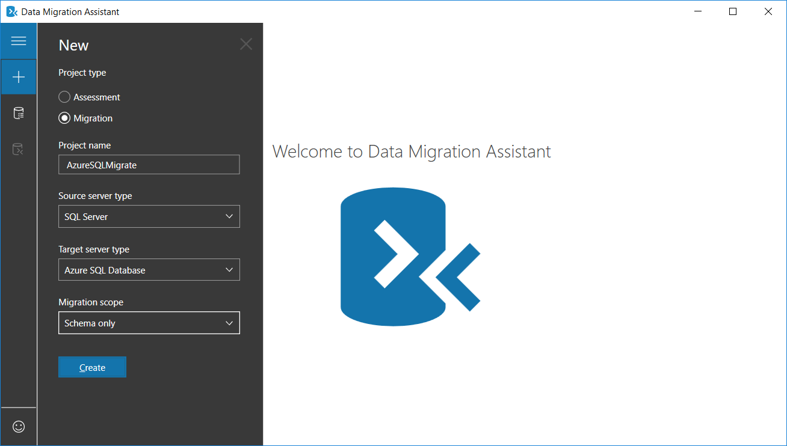

4. Select **Create** to create the project.
5. In DMA, specify the source connection details for your SQL Server, select **Connect**, and then select the **AdventureWorks2012** database.

    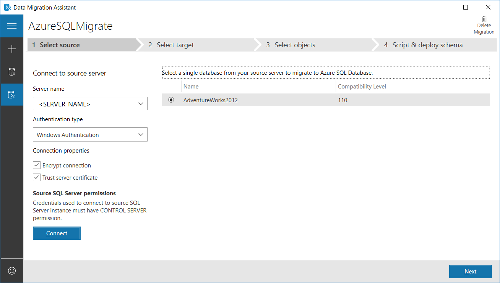

6. Select **Next**, under **Connect to target server**, specify the target connection details for the Azure SQL database, select **Connect**, and then select the **AdventureWorksAzure** database you pre-provisioned in Azure SQL Database.

    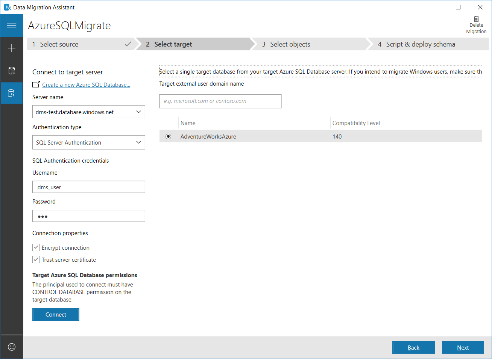

7. Select **Next** to advance to the **Select objects** screen, on which you can specify the schema objects in the **AdventureWorks2012** database that need to be deployed to Azure SQL Database.

    By default, all objects are selected.

    

8. Select **Generate SQL script** to create the SQL scripts, and then review the scripts for any errors.

    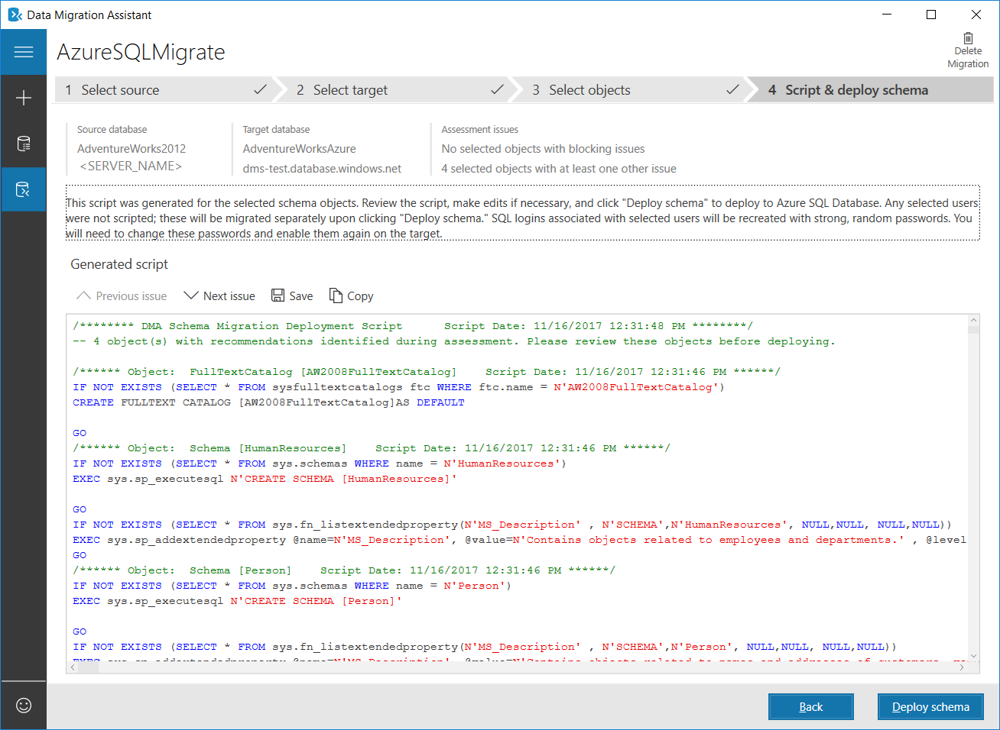

9. Select **Deploy schema** to deploy the schema to Azure SQL Database, and then after the schema is deployed, check the target server for any anomalies.

    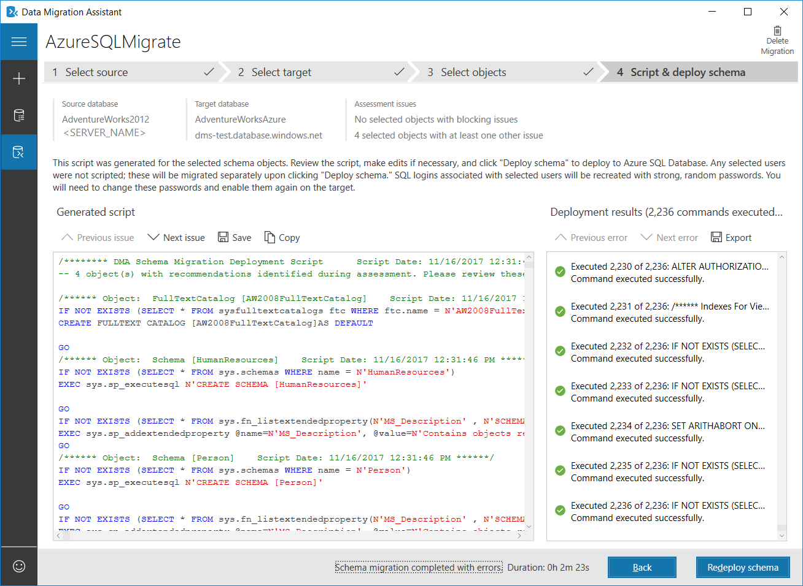

## Register the Microsoft.DataMigration resource provider

1. Sign in to the Azure portal, select **All services**, and then select **Subscriptions**.

   

2. Select the subscription in which you want to create the instance of the Azure Database Migration Service, and then select **Resource providers**.

    

3. Search for migration, and then to the right of **Microsoft.DataMigration**, select **Register**.

        

## Create an instance

1. In the Azure portal, select + **Create a resource**, search for Azure Database Migration Service, and then select **Azure Database Migration Service** from the drop-down list.

    

2. On the **Azure Database Migration Service** screen, select **Create**.

    
  
3. On the **Create Migration Service** screen, specify a name for the service, the subscription, and a new or existing resource group.

4. Select the location in which you want to create the instance of the Azure Database Migration Service. 

5. Select an existing VNet or create a new one.

    The VNet provides the Azure Database Migration Service with access to the source SQL Server and the target Azure SQL Database instance.

    For more information about how to create a VNet in the Azure portal, see the article [Create a virtual network using the Azure portal](https://aka.ms/DMSVnet).

6. Select a pricing tier; for this online migration, be sure to select the Premium pricing tier.

    For more information on costs and pricing tiers, see the [pricing page](https://aka.ms/dms-pricing).

     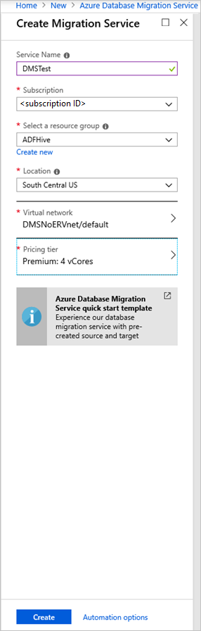

7. Select **Create** to create the service.

## Create a migration project

After the service is created, locate it within the Azure portal, open it, and then create a new migration project.

1. In the Azure portal, select **All services**, search for Azure Database Migration Service, and then select **Azure Database Migration Services**.

      

2. On the **Azure Database Migration Services** screen, search for the name of the Azure Database Migration Service instance that you created, and then select the instance.

     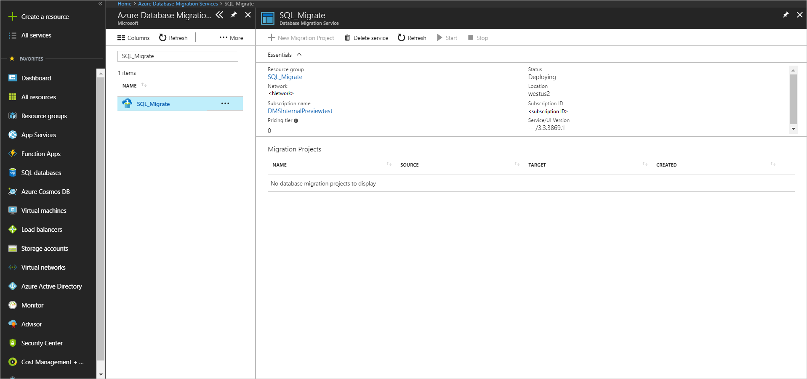

3. Select + **New Migration Project**.
4. On the **New migration project** screen, specify a name for the project, in the **Source server type** text box, select **AWS RDS for SQL Server**, in the **Target server type** text box, select **Azure SQL Database**.

    > [!NOTE]
    > For Target server type, select **Azure SQL Database** for migrating to both an Azure SQL Database singleton database and as well as to an Azure SQL Database managed instance.

5. In the **Choose type of activity** section, select **Online data migration**.

    > [!IMPORTANT]
    > Be sure to select **Online data migration**; offline migrations are not supported for this scenario.

    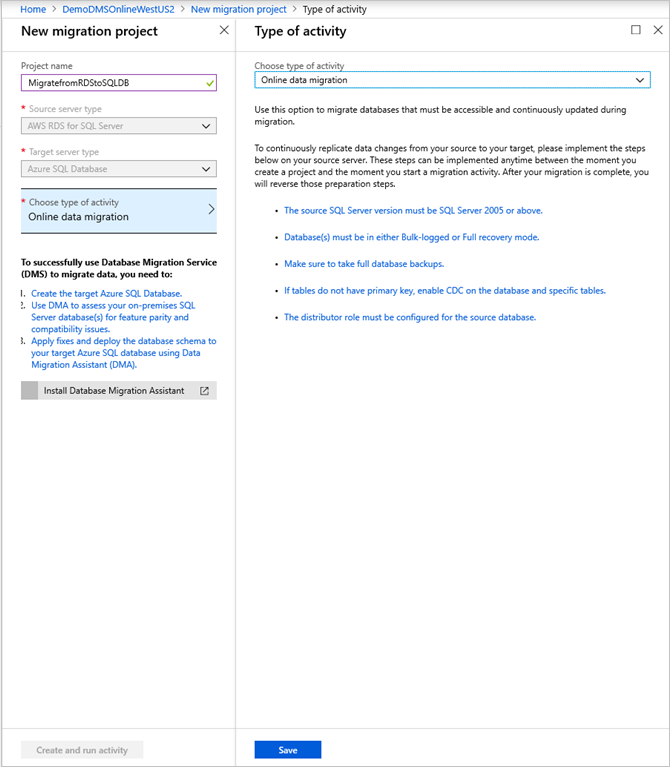

    > [!NOTE]
    > Alternately, you can choose **Create project only** to create the migration project now and execute the migration later.

6. Select **Save**.

7. Select **Create and run activity** to create the project and run the migration activity.

    

## Specify source details

1. On the **Migration source detail** screen, specify the connection details for the source SQL Server instance.

    Make sure to use a Fully Qualified Domain Name (FQDN) for the source SQL Server instance name.

2. If you haven't installed a trusted certificate on your source server, select the **Trust server certificate** check box.

    When a trusted certificate isn't installed, SQL Server generates a self-signed certificate when the instance is started. This certificate is used to encrypt the credentials for client connections.

    > [!CAUTION]
    > SSL connections that are encrypted using a self-signed certificate do not provide strong security. They are susceptible to man-in-the-middle attacks. You should not rely on SSL using self-signed certificates in a production environment or on servers that are connected to the internet.

   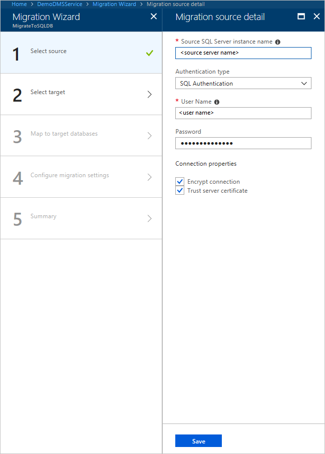

## Specify target details

1. Select **Save**, and then on the **Migration target details** screen, specify the connection details for the target Azure SQL Database server, which is the pre-provisioned Azure SQL Database to which the **AdventureWorks2012** schema was deployed by using the DMA.

    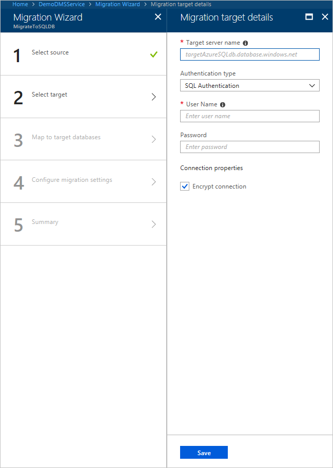

2. Select **Save**, and then on the **Map to target databases** screen, map the source and the target database for migration.

    If the target database contains the same database name as the source database, the Azure Database Migration Service selects the target database by default.

    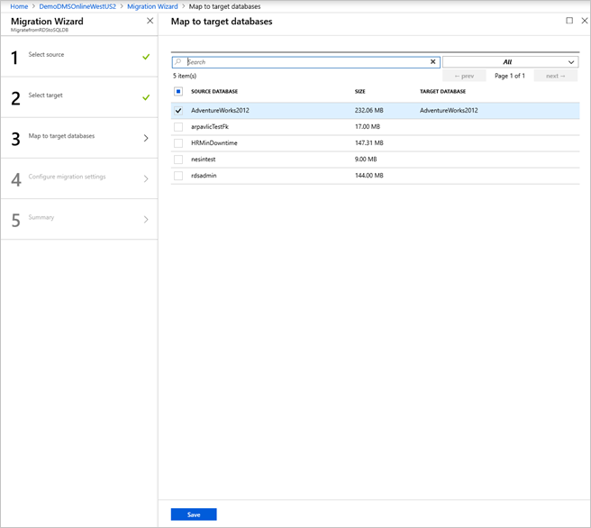

3. Select **Save**, on the **Select tables** screen, expand the table listing, and then review the list of affected fields.

    The Azure Database Migration Service auto selects all the empty source tables that exist on the target Azure SQL Database instance. If you want to remigrate tables that already include data, you need to explicitly select the tables on this screen.

    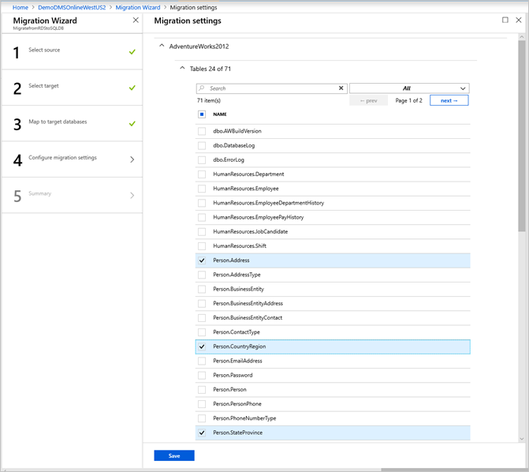

4. Select **Save**, after setting the following **Advanced online migration settings**.

    | Setting | Description |
    | ------------- | ------------- |
    | **Maximum number of tables to load in parallel** | Specifies the number of tables that DMS executes in parallel during the migration. The default value is 5, but it can be set to an optimal value to meet specific migration needs based on any POC migrations. |
    | **When source table is truncated** | Specifies whether DMS truncates the target table during migration. This setting can be helpful if one or more tables are truncated as part of the migration process. |
    | **Configure settings for large objects (LOB) data** | Specifies whether DMS migrates unlimited LOB data or limits the LOB data migrated to a specific size.  When there's a limit on the LOB data migrated, any LOB data beyond that limit is truncated. For production migrations, it's recommended to select **Allow unlimited LOB size** to prevent data loss. When specifying to allow unlimited LOB size, select the **Migrate LOB data in a single block when the LOB size is less than (KB) specified** check box to improve performance. |

    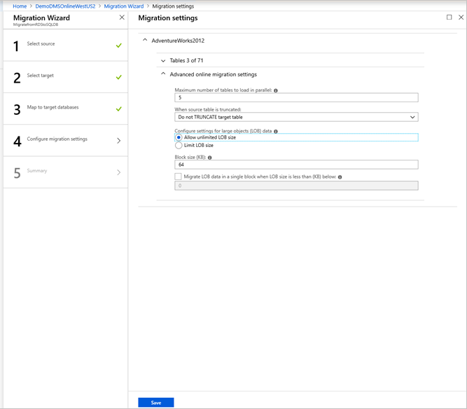

5. Select **Save**, on the **Migration summary** screen, in the **Activity name** text box, specify a name for the migration activity, and then review the summary to ensure that the source and target details match what you previously specified.

    

## Run the migration

* Select **Run migration**.

    The migration activity window appears, and the **Status** of the activity is **Initializing**.

    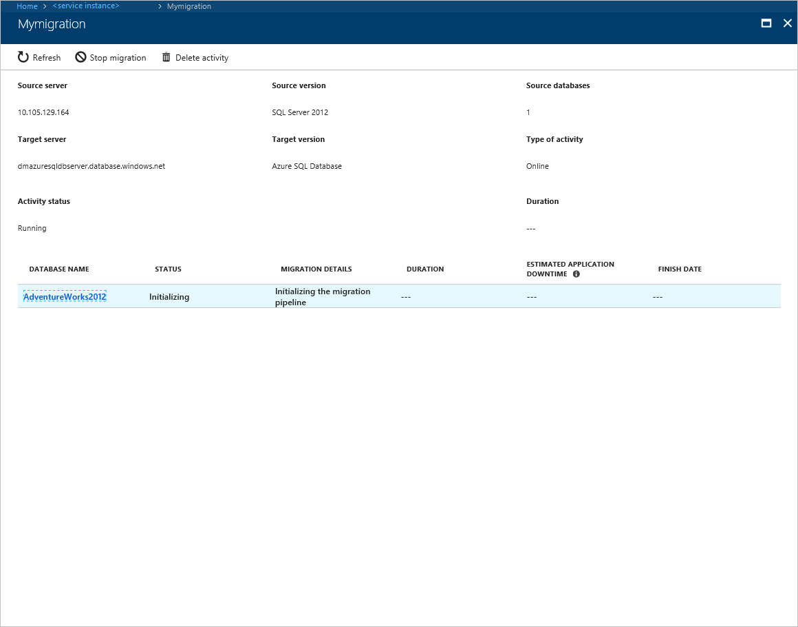

## Monitor the migration

1. On the migration activity screen, select **Refresh** to update the display until the **Status** of the migration shows as **Running**.

2. Click on a specific database to get to the migration status for **Full data load** and **Incremental data sync** operations.

    

## Perform migration cutover

After the initial Full load is completed, the databases are marked **Ready to cutover**.

1. When you're ready to complete the database migration, select **Start Cutover**.

    

2. Make sure to stop all the incoming transactions to the source database; wait until the **Pending changes** counter shows **0**.
3. Select **Confirm**, and the select **Apply**.
4. When the database migration status shows **Completed**, connect your applications to the new target Azure SQL Database.

    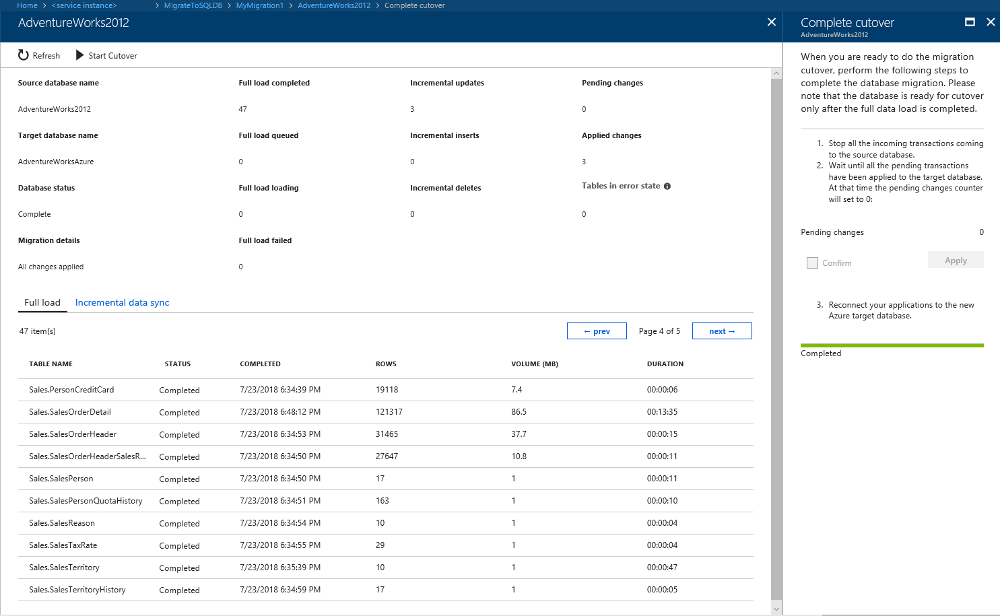

## Next steps

* For information about known issues and limitations when performing online migrations to Azure SQL DatabaseL, see the article [Known issues and workarounds with Azure SQL Database online migrations](known-issues-azure-sql-online.md).
* For information about the Azure Database Migration Service, see the article [What is the Azure Database Migration Service?](https://docs.microsoft.com/azure/dms/dms-overview).
* For information about Azure SQL Database, see the article [What is the Azure SQL Database service?](https://docs.microsoft.com/azure/sql-database/sql-database-technical-overview).
* For information about Azure SQL Database managed instances, see the page [Azure SQL Database Managed Instance](https://docs.microsoft.com/azure/sql-database/sql-database-managed-instance-index).
