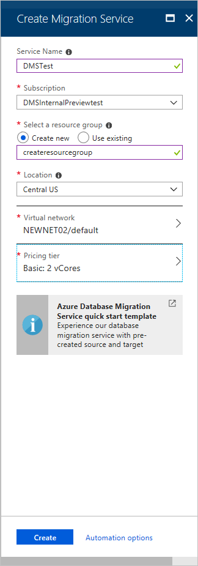
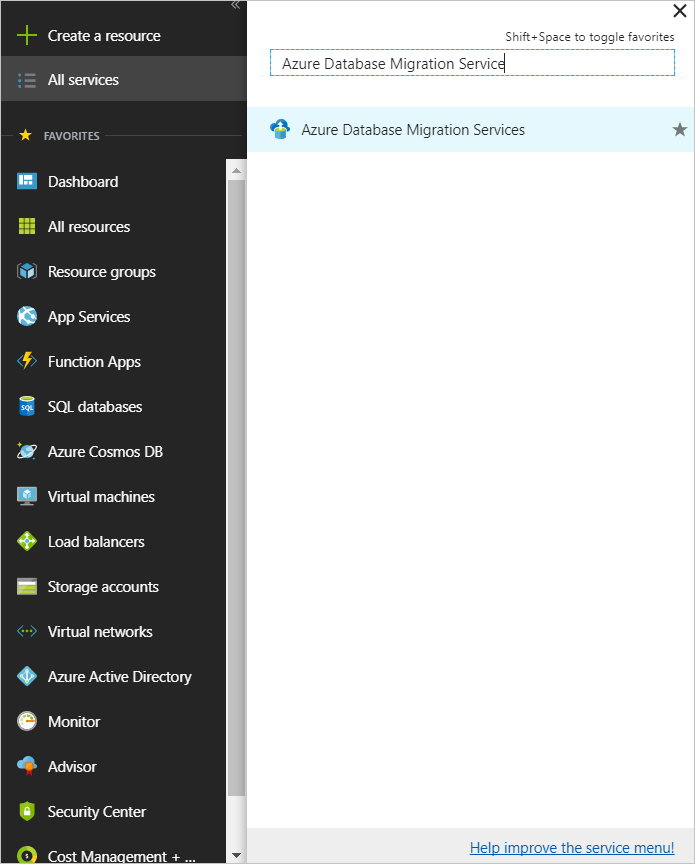
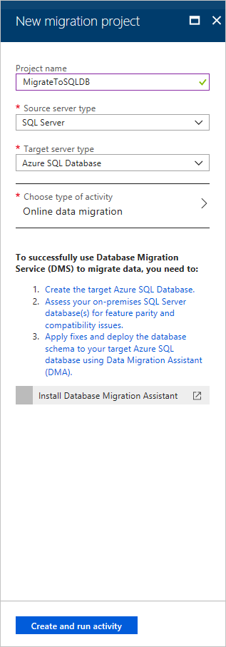
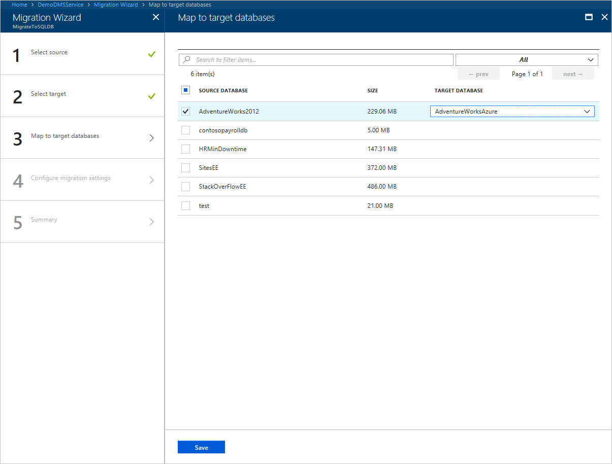
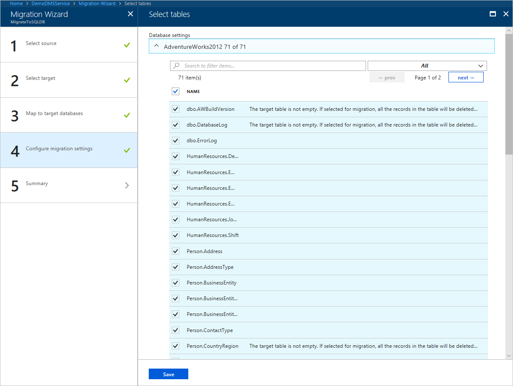
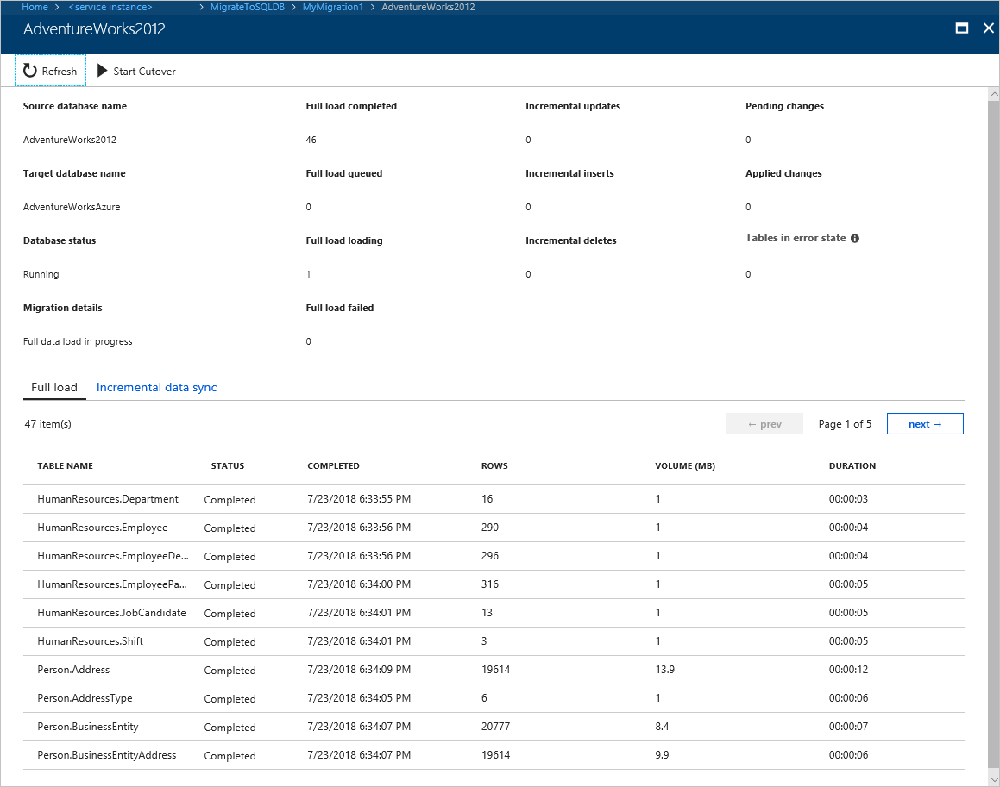
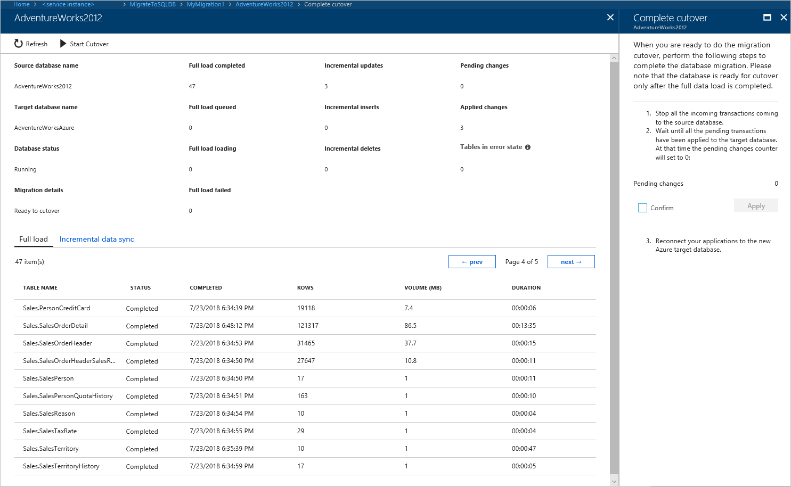

# Tutorial: Migrate SQL Server to a single database or pooled database in Azure SQL Database online using DMS

You can use the Azure Database Migration Service to migrate the databases from a SQL Server instance to [Azure SQL Database](https://docs.microsoft.com/azure/sql-database/) with minimal downtime. In this tutorial, you migrate the **Adventureworks2012** database restored to an on-premises instance of SQL Server 2016 (or later) to a single database or pooled database in Azure SQL Database by using the Azure Database Migration Service.

In this tutorial, you learn how to:
> [!div class="checklist"]
>
> - Assess your on-premises database by using the Data Migration Assistant.
> - Migrate the sample schema by using the Data Migration Assistant.
> - Create an instance of the Azure Database Migration Service.
> - Create a migration project by using the Azure Database Migration Service.
> - Run the migration.
> - Monitor the migration.
> - Download a migration report.

> [!NOTE]
> Using the Azure Database Migration Service to perform an online migration requires creating an instance based on the Premium pricing tier. For more information, see the Azure Database Migration Service [pricing](https://azure.microsoft.com/pricing/details/database-migration/) page.

> [!IMPORTANT]
> For an optimal migration experience, Microsoft recommends creating an instance of the Azure Database Migration Service in the same Azure region as the target database. Moving data across regions or geographies can slow down the migration process and introduce errors.

[!INCLUDE [online-offline](../../includes/database-migration-service-offline-online.md)]

This article describes an online migration from SQL Server to a single database or pooled database in Azure SQL Database. For an offline migration, see [Migrate SQL Server to Azure SQL Database offline using DMS](tutorial-sql-server-to-azure-sql.md).

## Prerequisites

To complete this tutorial, you need to:

- Download and install [SQL Server 2012 or later](https://www.microsoft.com/sql-server/sql-server-downloads).
- Enable the TCP/IP protocol, which is disabled by default during SQL Server Express installation, by following the instructions in the article [Enable or Disable a Server Network Protocol](https://docs.microsoft.com/sql/database-engine/configure-windows/enable-or-disable-a-server-network-protocol#SSMSProcedure).
- Create a single (or pooled) database in Azure SQL Database, which you do by following the detail in the article [Create a single database in Azure SQL Database using the Azure portal](https://docs.microsoft.com/azure/sql-database/sql-database-single-database-get-started).

    > [!NOTE]
    > If you use SQL Server Integration Services (SSIS) and want to migrate the catalog database for your SSIS projects/packages (SSISDB) from SQL Server to Azure SQL Database, the destination SSISDB will be created and managed automatically on your behalf when you provision SSIS in Azure Data Factory (ADF). For more information about migrating SSIS packages, see the article [Migrate SQL Server Integration Services packages to Azure](https://docs.microsoft.com/azure/dms/how-to-migrate-ssis-packages).

- Download and install the [Data Migration Assistant](https://www.microsoft.com/download/details.aspx?id=53595) (DMA) v3.3 or later.
- Create a Microsoft Azure Virtual Network for the Azure Database Migration Service by using the Azure Resource Manager deployment model, which provides site-to-site connectivity to your on-premises source servers by using either [ExpressRoute](https://docs.microsoft.com/azure/expressroute/expressroute-introduction) or [VPN](https://docs.microsoft.com/azure/vpn-gateway/vpn-gateway-about-vpngateways). For more information about creating a virtual network, see the [Virtual Network Documentation](https://docs.microsoft.com/azure/virtual-network/), and especially the quickstart articles with step-by-step details.

    > [!NOTE]
    > During virtual network setup, if you use ExpressRoute with network peering to Microsoft, add the following service [endpoints](https://docs.microsoft.com/azure/virtual-network/virtual-network-service-endpoints-overview) to the subnet in which the service will be provisioned:
    > - Target database endpoint (for example, SQL endpoint, Cosmos DB endpoint, and so on)
    > - Storage endpoint
    > - Service bus endpoint
    >
    > This configuration is necessary because the Azure Database Migration Service lacks internet connectivity.

- Ensure that your virtual network Network Security Group rules don't block the following inbound communication ports to Azure Database Migration Service: 443, 53, 9354, 445, 12000. For more detail on Azure Virtual Network NSG traffic filtering, see the article [Filter network traffic with network security groups](https://docs.microsoft.com/azure/virtual-network/virtual-networks-nsg).
- Configure your [Windows Firewall for database engine access](https://docs.microsoft.com/sql/database-engine/configure-windows/configure-a-windows-firewall-for-database-engine-access).
- Open your Windows firewall to allow the Azure Database Migration Service to access the source SQL Server, which by default is TCP port 1433.
- If you're running multiple named SQL Server instances using dynamic ports, you may wish to enable the SQL Browser Service and allow access to UDP port 1434 through your firewalls so that the Azure Database Migration Service can connect to a named instance on your source server.
- When using a firewall appliance in front of your source database(s), you may need to add firewall rules to allow the Azure Database Migration Service to access the source database(s) for migration.
- Create a server-level [firewall rule](https://docs.microsoft.com/azure/sql-database/sql-database-firewall-configure) for Azure SQL Database to allow the Azure Database Migration Service access to the target databases. Provide the subnet range of the virtual network used for the Azure Database Migration Service.
- Ensure that the credentials used to connect to source SQL Server instance have [CONTROL SERVER](https://docs.microsoft.com/sql/t-sql/statements/grant-server-permissions-transact-sql) permissions.
- Ensure that the credentials used to connect to the target Azure SQL Database instance have CONTROL DATABASE permission on the target Azure SQL Database instances.
- The source SQL Server version must be SQL Server 2005 and above. To determine the version that you SQL Server instance is running, see the article [How to determine the version, edition, and update level of SQL Server and its components](https://support.microsoft.com/help/321185/how-to-determine-the-version-edition-and-update-level-of-sql-server-an).
- Database(s) must be in either Bulk-logged or Full recovery mode. To determine the recovery model configured for your SQL Server instance, see the article [View or Change the Recovery Model of a Database (SQL Server)](https://docs.microsoft.com/sql/relational-databases/backup-restore/view-or-change-the-recovery-model-of-a-database-sql-server?view=sql-server-2017).
- Make sure to take the Full database backups for the databases. To create a Full database backup, see the article [How to: Create a Full Database Backup (Transact-SQL)](https://docs.microsoft.com/previous-versions/sql/sql-server-2008-r2/ms191304(v=sql.105)).
- If any of the tables don't have a primary key, enable Change Data Capture (CDC) on the database and specific table(s).
    > [!NOTE]
    > You can use the script below to find any tables that do not have primary keys.
    
    ```sql
    USE <DBName>;
    go
    SELECT is_tracked_by_cdc, name AS TableName
    FROM sys.tables WHERE type = 'U' and is_ms_shipped = 0 AND
    OBJECTPROPERTY(OBJECT_ID, 'TableHasPrimaryKey') = 0;
    ```

    If the results show one or more tables with 'is_tracked_by_cdc' as '0', enable change capture for the database and for the specific tables by using the process described in the article [Enable and Disable Change Data Capture (SQL Server)](https://docs.microsoft.com/sql/relational-databases/track-changes/enable-and-disable-change-data-capture-sql-server?view=sql-server-2017).

- Configure the distributor role for source SQL Server.

    >[!NOTE]
    > You can determine if replication components are installed by using the query below.

    ```sql
    USE master;
    DECLARE @installed int;
    EXEC @installed = sys.sp_MS_replication_installed;
    SELECT @installed as installed;
    ```

    If the result returns an error message suggesting to install replication components, install SQL Server replication components by using the process in the article [Install SQL Server replication](https://docs.microsoft.com/sql/database-engine/install-windows/install-sql-server-replication?view=sql-server-2017).

    If the replication is already installed, check if the distribution role is configured on the source SQL Server using the T-SQL command below.

    ```sql
    EXEC sp_get_distributor;
    ```

    If the distribution isn't set up, where the distribution server shows NULL for above command output, configure the distribution using the guidance provided in the article [Configure Distribution](https://docs.microsoft.com/sql/relational-databases/replication/configure-publishing-and-distribution?view=sql-server-2017).

- Disable database triggers on the target Azure SQL Database.
    >[!NOTE]
    > You can find the database triggers on the target Azure SQL Database by using the following query:

    ```sql
    Use <Database name>
    select * from sys.triggers
    DISABLE TRIGGER (Transact-SQL)
    ```

    For more information, see the article [DISABLE TRIGGER (Transact-SQL)](https://docs.microsoft.com/sql/t-sql/statements/disable-trigger-transact-sql?view=sql-server-2017). 

## Assess your on-premises database

Before you can migrate data from a SQL Server instance to Azure SQL Database, you need to assess the SQL Server database for any blocking issues that might prevent migration. Using the Data Migration Assistant v3.3 or later, follow the steps described in the article [Performing a SQL Server migration assessment](https://docs.microsoft.com/sql/dma/dma-assesssqlonprem) to complete the on-premises database assessment.

To assess an on-premises database, perform the following steps:

1. In DMA, select the New (+) icon, and then select the **Assessment**  project type.
2. Specify a project name, in the **Source server type** text box, select **SQL Server**, in the **Target server type** text box, select **Azure SQL Database**, and then select **Create** to create the project.

   When you're assessing the source SQL Server database migrating to a single database or pooled database in Azure SQL Database, you can choose one or both of the following assessment report types:

   - Check database compatibility
   - Check feature parity

   Both report types are selected by default.

3. In DMA, on the **Options** screen, select **Next**.
4. On the **Select sources** screen, in the **Connect to a server** dialog box, provide the connection details to your SQL Server, and then select **Connect**.
5. In the **Add sources** dialog box, select **AdventureWorks2012**, select **Add**, and then select **Start Assessment**.

    > [!NOTE]
    > If you use SSIS, DMA does not currently support the assessment of the source SSISDB. However, SSIS projects/packages will be assessed/validated as they are redeployed to the destination SSISDB hosted by Azure SQL Database. For more information about migrating SSIS packages, see the article [Migrate SQL Server Integration Services packages to Azure](https://docs.microsoft.com/azure/dms/how-to-migrate-ssis-packages).

    When the assessment is complete, the results display as shown in the following graphic:

    

    For single databases or pooled databases in Azure SQL Database, the assessments identify feature parity issues and migration blocking issues for deploying to a single database or pooled database.

    - The **SQL Server feature parity** category provides a comprehensive set of recommendations, alternative approaches available in Azure, and mitigating steps to help you plan the effort into your migration projects.
    - The **Compatibility issues** category identifies partially supported or unsupported features that reflect compatibility issues that might block migrating SQL Server database(s) to Azure SQL Database. Recommendations are also provided to help you address those issues.

6. Review the assessment results for migration blocking issues and feature parity issues by selecting the specific options.

## Migrate the sample schema

After you're comfortable with the assessment and satisfied that the selected database is a viable candidate for migration to a single database or pooled database in Azure SQL Database, use DMA to migrate the schema to Azure SQL Database.

> [!NOTE]
> Before you create a migration project in DMA, be sure that you have already provisioned a SQL database in Azure as mentioned in the prerequisites. For purposes of this tutorial, the name of the Azure SQL Database is assumed to be **AdventureWorksAzure**, but you can provide whatever name you wish.

> [!IMPORTANT]
> If you use SSIS, DMA does not currently support the migration of source SSISDB, but you can redeploy your SSIS projects/packages to the destination SSISDB hosted by Azure SQL Database. For more information about migrating SSIS packages, see the article [Migrate SQL Server Integration Services packages to Azure](https://docs.microsoft.com/azure/dms/how-to-migrate-ssis-packages).

To migrate the **AdventureWorks2012** schema to a single database or pooled database Azure SQL Database, perform the following steps:

1. In the Data Migration Assistant, select the New (+) icon, and then under **Project type**, select **Migration**.
2. Specify a project name, in the **Source server type** text box, select **SQL Server**, and then in the **Target server type** text box, select **Azure SQL Database**.
3. Under **Migration Scope**, select **Schema only**.

    After performing the previous steps, the DMA interface should appear as shown in the following graphic:

    

4. Select **Create** to create the project.
5. In DMA, specify the source connection details for your SQL Server, select **Connect**, and then select the **AdventureWorks2012** database.

    

6. Select **Next**, under **Connect to target server**, specify the target connection details for the Azure SQL database, select **Connect**, and then select the **AdventureWorksAzure** database you had pre-provisioned in Azure SQL Database.

    

7. Select **Next** to advance to the **Select objects** screen, on which you can specify the schema objects in the **AdventureWorks2012** database that need to be deployed to Azure SQL Database.

    By default, all objects are selected.

    

8. Select **Generate SQL script** to create the SQL scripts, and then review the scripts for any errors.

    

9. Select **Deploy schema** to deploy the schema to Azure SQL Database, and then after the schema is deployed, check the target server for any anomalies.

    

## Register the Microsoft.DataMigration resource provider

1. Sign in to the Azure portal, select **All services**, and then select **Subscriptions**.

   

2. Select the subscription in which you want to create the instance of the Azure Database Migration Service, and then select **Resource providers**.

    

3. Search for migration, and then to the right of **Microsoft.DataMigration**, select **Register**.

    

## Create an instance

1. In the Azure portal, select + **Create a resource**, search for Azure Database Migration Service, and then select **Azure Database Migration Service** from the drop-down list.

    

2. On the **Azure Database Migration Service** screen, select **Create**.

    
  
3. On the **Create Migration Service** screen, specify a name for the service, the subscription, and a new or existing resource group.

4. Select the location in which you want to create the instance of the Azure Database Migration Service. 

5. Select an existing virtual network or create a new one.

    The virtual network provides the Azure Database Migration Service with access to the source SQL Server and the target Azure SQL Database instance.

    For more information about how to create a virtual network in the Azure portal, see the article [Create a virtual network using the Azure portal](https://aka.ms/DMSVnet).

6. Select a pricing tier.

    For more information on costs and pricing tiers, see the [pricing page](https://aka.ms/dms-pricing).

    

7. Select **Create** to create the service.

## Create a migration project

After the service is created, locate it within the Azure portal, open it, and then create a new migration project.

1. In the Azure portal, select **All services**, search for Azure Database Migration Service, and then select **Azure Database Migration Services**.

    

2. On the **Azure Database Migration Services** screen, search for the name of the Azure Database Migration Service instance that you created, and then select the instance.

    

3. Select + **New Migration Project**.
4. On the **New migration project** screen, specify a name for the project, in the **Source server type** text box, select **SQL Server**, in the **Target server type** text box, select **Azure SQL Database**.
5. In the **Choose type of activity** section, select **Online data migration**.

    

    > [!NOTE]
    > Alternately, you can choose **Create project only** to create the migration project now and execute the migration later.

6. Select **Save**.

7. Select **Create and run activity** to create the project and run the migration activity.

    

## Specify source details

1. On the **Migration source detail** screen, specify the connection details for the source SQL Server instance.

    Make sure to use a Fully Qualified Domain Name (FQDN) for the source SQL Server instance name. You can also use the IP Address for situations in which DNS name resolution isn't possible.

2. If you haven't installed a trusted certificate on your source server, select the **Trust server certificate** check box.

    When a trusted certificate isn't installed, SQL Server generates a self-signed certificate when the instance is started. This certificate is used to encrypt the credentials for client connections.

    > [!CAUTION]
    > TLS connections that are encrypted using a self-signed certificate do not provide strong security. They are susceptible to man-in-the-middle attacks. You should not rely on TLS using self-signed certificates in a production environment or on servers that are connected to the internet.

   

    > [!IMPORTANT]
    > If you use SSIS, DMS does not currently support the migration of source SSISDB, but you can redeploy your SSIS projects/packages to the destination SSISDB hosted by Azure SQL Database. For more information about migrating SSIS packages, see the article [Migrate SQL Server Integration Services packages to Azure](https://docs.microsoft.com/azure/dms/how-to-migrate-ssis-packages).

## Specify target details

1. Select **Save**, and then on the **Migration target details** screen, specify the connection details for the target Azure SQL Database, which is the pre-provisioned Azure SQL Database to which the **AdventureWorks2012** schema was deployed by using the DMA.

    

2. Select **Save**, and then on the **Map to target databases** screen, map the source and the target database for migration.

    If the target database contains the same database name as the source database, the Azure Database Migration Service selects the target database by default.

    

3. Select **Save**, on the **Select tables** screen, expand the table listing, and then review the list of affected fields.

    The Azure Database Migration Service auto selects all the empty source tables that exist on the target Azure SQL Database instance. If you want to remigrate tables that already include data, you need to explicitly select the tables on this blade.

    

4. Select **Save**, on the **Migration summary** screen, in the **Activity name** text box, specify a name for the migration activity, and then review the summary to ensure that the source and target details match what you previously specified.

    

## Run the migration

- Select **Run migration**.

    The migration activity window appears, and the **Status** of the activity is **Initializing**.

    

## Monitor the migration

1. On the migration activity screen, select **Refresh** to update the display until the **Status** of the migration shows as **Running**.

2. Click on a specific database to get to the migration status for **Full data load** and **Incremental data sync** operations.

    

## Perform migration cutover

After the initial Full load is completed, the databases are marked **Ready to cutover**.

1. When you're ready to complete the database migration, select **Start Cutover**.

    

2. Make sure to stop all the incoming transactions to the source database; wait until the **Pending changes** counter shows **0**.
3. Select **Confirm**, and the select **Apply**.
4. When the database migration status shows **Completed**, connect your applications to the new target Azure SQL Database.

    

## Next steps

- For information about known issues and limitations when performing online migrations to Azure SQL Database, see the article [Known issues and workarounds with Azure SQL Database online migrations](known-issues-azure-sql-online.md).
- For information about the Azure Database Migration Service, see the article [What is the Azure Database Migration Service?](https://docs.microsoft.com/azure/dms/dms-overview).
- For information about Azure SQL Database, see the article [What is the Azure SQL Database service?](https://docs.microsoft.com/azure/sql-database/sql-database-technical-overview).
