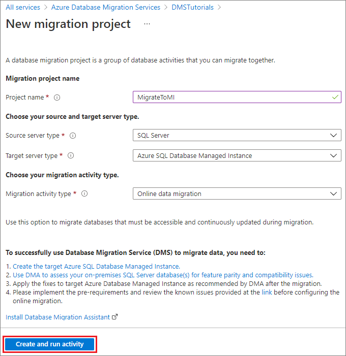
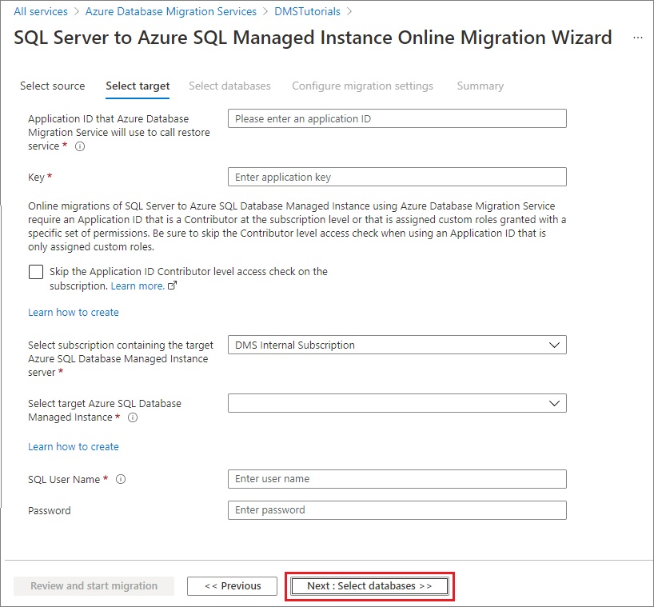
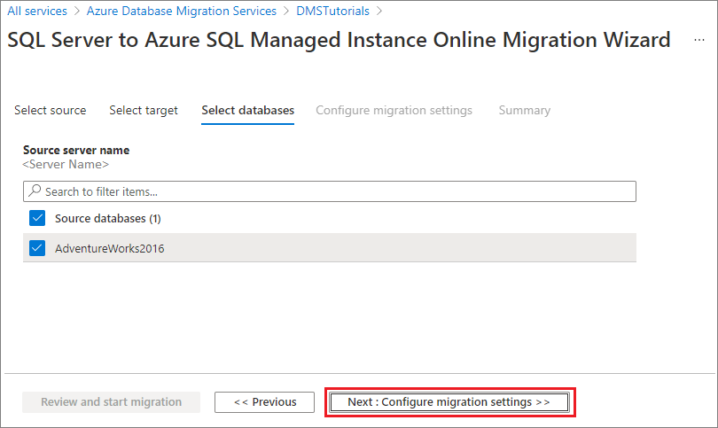
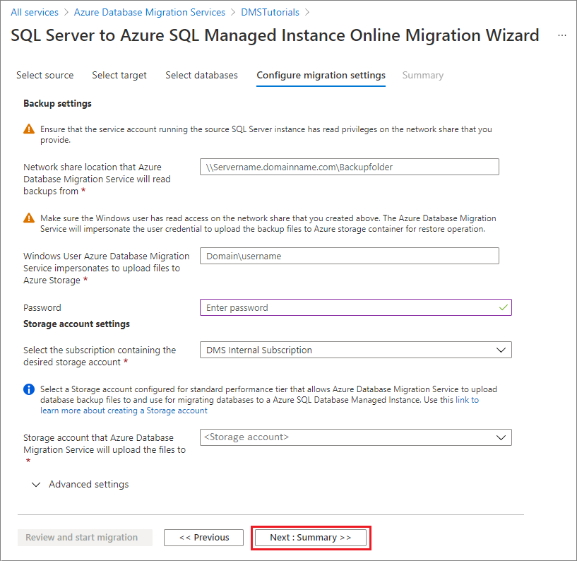
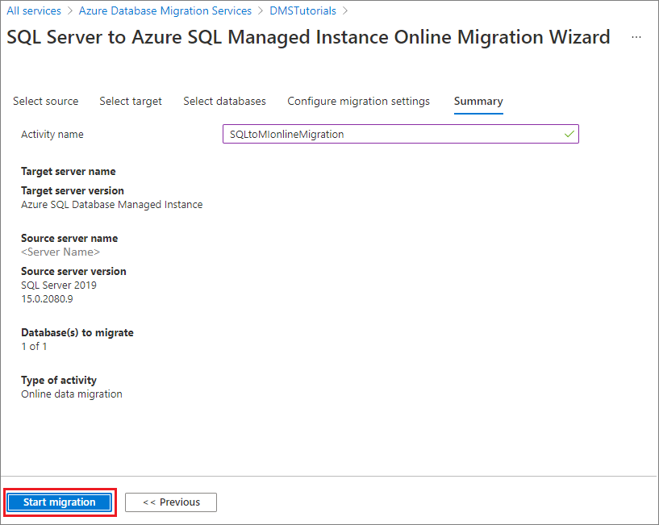
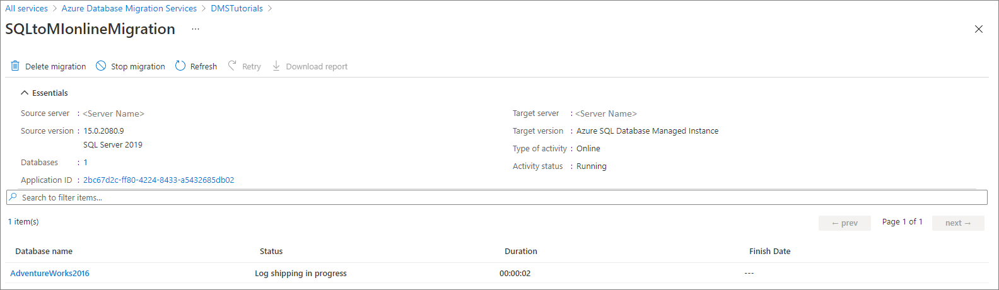
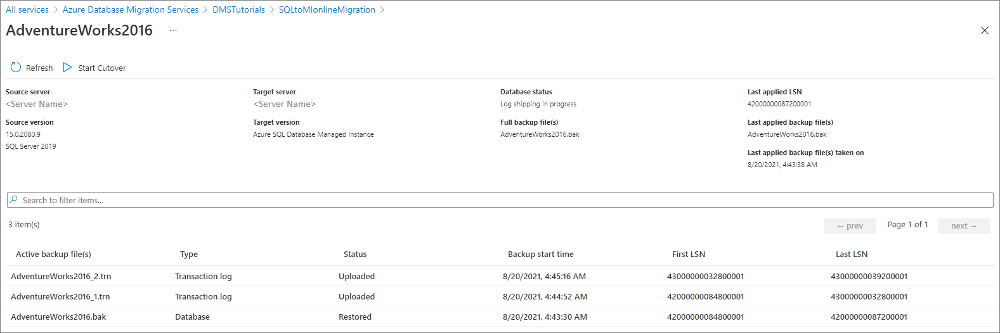
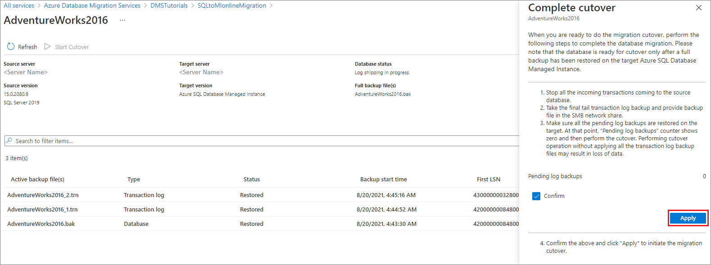
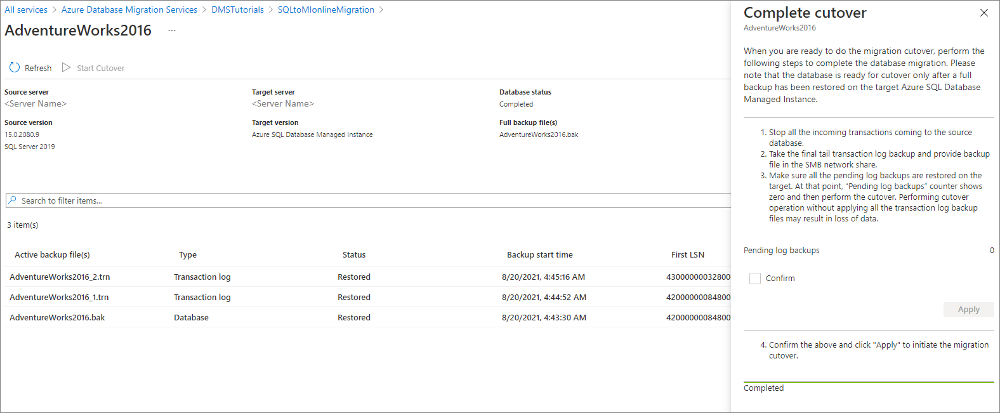

# Tutorial: Migrate SQL Server to an Azure SQL Managed Instance online using DMS (classic)

[!INCLUDE [Azure Database Migration Service (classic) - SQL scenarios retirement announcement](../../includes/deprecation-announcement-dms-classic-sql.md)]

> [!NOTE]
> This tutorial uses an older version of the Azure Database Migration Service. For improved functionality and supportability, consider migrating to Azure SQL Managed Instance by using the [Azure SQL migration extension for Azure Data Studio](tutorial-sql-server-managed-instance-online-ads.md).
>
> To compare features between versions, review [compare versions](dms-overview.md#compare-versions).

You can use Azure Database Migration Service to migrate the databases from a SQL Server instance to an [Azure SQL Managed Instance](/azure/azure-sql/managed-instance/sql-managed-instance-paas-overview) with minimal downtime. For extra methods that may require some manual effort, see the article [SQL Server instance migration to Azure SQL Managed Instance](/azure/azure-sql/migration-guides/managed-instance/sql-server-to-managed-instance-guide).

In this tutorial, you migrate the [AdventureWorks2016](/sql/samples/adventureworks-install-configure#download-backup-files) database from an on-premises instance of SQL Server to a SQL Managed Instance with minimal downtime by using Azure Database Migration Service.

You learn how to:
> [!div class="checklist"]
>
> * Register the Azure DataMigration resource provider.
> * Create an instance of Azure Database Migration Service.
> * Create a migration project and start online migration by using Azure Database Migration Service.
> * Monitor the migration.
> * Perform the migration cutover when you are ready.

> [!IMPORTANT]
> For online migrations from SQL Server to SQL Managed Instance using Azure Database Migration Service, you must provide the full database backup and subsequent log backups in the SMB network share that the service can use to migrate your databases. Azure Database Migration Service does not initiate any backups, and instead uses existing backups, which you may already have as part of your disaster recovery plan, for the migration.
> Each backup can be written to either a separate backup file or multiple backup files. However, appending multiple backups (that is, full and t-log) into a single backup media isn't supported. 
> Use compressed backups to reduce the likelihood of experiencing potential issues associated with migrating large backups.

> [!NOTE]
> Using Azure Database Migration Service to perform an online migration requires creating an instance based on the Premium pricing tier.

> [!IMPORTANT]
> For an optimal migration experience, Microsoft recommends creating an instance of  Azure Database Migration Service in the same Azure region as the target database. Moving data across regions or geographies can slow down the migration process and introduce errors.

> [!IMPORTANT]
> Reduce the duration of the online migration process as much as possible to minimize the risk of interruption caused by instance reconfiguration or planned maintenance. In case of such an event, migration process will start from the beginning. In case of planned maintenance, there is a grace period of 36 hours before migration process is restarted.

[!INCLUDE [online-offline](../../includes/database-migration-service-offline-online.md)]

This article describes an online migration from SQL Server to a SQL Managed Instance. For an offline migration, see [Migrate SQL Server to a SQL Managed Instance offline using DMS](tutorial-sql-server-to-managed-instance.md).

## Prerequisites

To complete this tutorial, you need to:

* Download and install [SQL Server 2016 or later](https://www.microsoft.com/sql-server/sql-server-downloads).
* Enable the TCP/IP protocol, which is disabled by default during SQL Server Express installation, by following the instructions in the article [Enable or Disable a Server Network Protocol](/sql/database-engine/configure-windows/enable-or-disable-a-server-network-protocol#SSMSProcedure).
* [Restore the AdventureWorks2016 database to the SQL Server instance.](/sql/samples/adventureworks-install-configure#restore-to-sql-server)
* Create a Microsoft Azure Virtual Network for Azure Database Migration Service by using the Azure Resource Manager deployment model, which provides site-to-site connectivity to your on-premises source servers by using either [ExpressRoute](../expressroute/expressroute-introduction.md) or [VPN](../vpn-gateway/vpn-gateway-about-vpngateways.md). [Learn network topologies for SQL Managed Instance migrations using Azure Database Migration Service](./resource-network-topologies.md). For more information about creating a virtual network, see the [Virtual Network Documentation](../virtual-network/index.yml), and especially the quickstart articles with step-by-step details.

    > [!NOTE]
    > During virtual network setup, if you use ExpressRoute with network peering to Microsoft, add the following service [endpoints](../virtual-network/virtual-network-service-endpoints-overview.md) to the subnet in which the service will be provisioned:
    >
    > * Target database endpoint (for example, SQL endpoint, Azure Cosmos DB endpoint, and so on)
    > * Storage endpoint
    > * Service bus endpoint
    >
    > This configuration is necessary because Azure Database Migration Service lacks internet connectivity.
    >
    >If you don’t have site-to-site connectivity between the on-premises network and Azure or if there is limited site-to-site connectivity bandwidth, consider using Azure Database Migration Service in hybrid mode (Preview). Hybrid mode leverages an on-premises migration worker together with an instance of Azure Database Migration Service running in the cloud. To create an instance of Azure Database Migration Service in hybrid mode, see the article [Create an instance of Azure Database Migration Service in hybrid mode using the Azure portal](./quickstart-create-data-migration-service-portal.md).

    > [!IMPORTANT]
    > Regarding the storage account used as part of the migration, you must either:
    > * Choose to allow all network to access the storage account.
    > * Turn on [subnet delegation](../virtual-network/manage-subnet-delegation.md) on MI subnet and update the Storage Account firewall rules to allow this subnet.
    > * You can't use an Azure Storage account that has a private endpoint with Azure Database Migration Service.

* Ensure that your virtual network Network Security Group rules don't block the outbound port 443 of ServiceTag for ServiceBus, Storage and AzureMonitor. For more detail on virtual network NSG traffic filtering, see the article [Filter network traffic with network security groups](../virtual-network/virtual-network-vnet-plan-design-arm.md).
* Configure your [Windows Firewall for source database engine access](/sql/database-engine/configure-windows/configure-a-windows-firewall-for-database-engine-access).
* Open your Windows Firewall to allow Azure Database Migration Service to access the source SQL Server, which by default is TCP port 1433. If your default instance is listening on some other port, add that to the firewall.
* If you're running multiple named SQL Server instances using dynamic ports, you may wish to enable the SQL Browser Service and allow access to UDP port 1434 through your firewalls so that Azure Database Migration Service can connect to a named instance on your source server.
* If you're using a firewall appliance in front of your source databases, you may need to add firewall rules to allow Azure Database Migration Service to access the source database(s) for migration, and files via SMB port 445.
* Create a SQL Managed Instance by following the detail in the article [Create a SQL Managed Instance in the Azure portal](/azure/azure-sql/managed-instance/instance-create-quickstart).
* Ensure that the logins used to connect the source SQL Server and the target SQL Managed Instance are members of the sysadmin server role.
* Provide an SMB network share that contains all your database full database backup files and subsequent transaction log backup files, which Azure Database Migration Service can use for database migration.
* Ensure that the service account running the source SQL Server instance has write privileges on the network share that you created and that the computer account for the source server has read/write access to the same share.
* Make a note of a Windows user (and password) that has full control privilege on the network share that you previously created. Azure Database Migration Service impersonates the user credential to upload the backup files to Azure Storage container for restore operation.
* Create a Microsoft Entra Application ID that generates the Application ID key that Azure Database Migration Service can use to connect to target Azure SQL Managed Instance and Azure Storage Container. For more information, see the article [Use portal to create a Microsoft Entra application and service principal that can access resources](../active-directory/develop/howto-create-service-principal-portal.md).

  > [!NOTE]
  > The Application ID used by the Azure Database Migration Service supports secret (password-based) authentication for service principals. It does not support certificate-based authentication.

  > [!NOTE]
  > Azure Database Migration Service requires the Contributor permission on the subscription for the specified Application ID. Alternatively, you can create custom roles that grant the specific permissions that Azure Database Migration Service requires. For step-by-step guidance about using custom roles, see the article [Custom roles for SQL Server to SQL Managed Instance online migrations](./resource-custom-roles-sql-db-managed-instance.md).

* Create or make a note of **Standard Performance tier**, Azure Storage Account, that allows DMS service to upload the database backup files to and use for migrating databases.  Make sure to create the Azure Storage Account in the same region as the Azure Database Migration Service instance is created.

  > [!NOTE]
  > When you migrate a database that's protected by [Transparent Data Encryption](/azure/azure-sql/database/transparent-data-encryption-tde-overview) to a managed instance by using online migration, the corresponding certificate from the on-premises or Azure VM SQL Server instance must be migrated before the database restore. For detailed steps, see [Migrate a TDE cert to a managed instance](/azure/azure-sql/database/transparent-data-encryption-tde-overview).

[!INCLUDE [resource-provider-register](../../includes/database-migration-service-resource-provider-register.md)]

[!INCLUDE [instance-create](../../includes/database-migration-service-instance-create.md)]

> [!NOTE] 
> For additional detail, see the article [Network topologies for Azure SQL Managed Instance migrations using Azure Database Migration Service](./resource-network-topologies.md).

## Create a migration project

After an instance of the service is created, locate it within the Azure portal, open it, and then create a new migration project.

1. In the Azure portal menu, select **All services**. Search for and select **Azure Database Migration Services**.

    

2. On the **Azure Database Migration Services** screen, select the Azure Database Migration Service instance that you created.

3. Select **New Migration Project**.

     

4. On the **New migration project** screen, specify a name for the project, in the **Source server type** text box, select **SQL Server**, in the **Target server type** text box, select **Azure SQL Database Managed Instance**, and then for **Choose type of activity**, select **Online data migration**.

   

5. Select **Create and run activity** to create the project and run the migration activity.

## Specify source details

1. On the **Select source** screen, specify the connection details for the source SQL Server instance.

    Make sure to use a Fully Qualified Domain Name (FQDN) for the source SQL Server instance name. You can also use the IP Address for situations in which DNS name resolution isn't possible.

2. If you haven't installed a trusted certificate on your server, select the **Trust server certificate** check box.

    When a trusted certificate isn't installed, SQL Server generates a self-signed certificate when the instance is started. This certificate is used to encrypt the credentials for client connections.

    > [!CAUTION]
    > TLS connections that are encrypted using a self-signed certificate does not provide strong security. They are susceptible to man-in-the-middle attacks. You should not rely on TLS using self-signed certificates in a production environment or on servers that are connected to the internet.

    

3. Select **Next: Select target**

## Specify target details

1. On the **Select target** screen, specify the **Application ID** and **Key** that the DMS instance can use to connect to the target instance of SQL Managed Instance and the Azure Storage Account.

    For more information, see the article [Use portal to create a Microsoft Entra application and service principal that can access resources](../active-directory/develop/howto-create-service-principal-portal.md).

2. Select the **Subscription** containing the target instance of SQL Managed Instance, and then choose the target SQL Managed instance.

    If you haven't already provisioned the SQL Managed Instance, select the [link](/azure/azure-sql/managed-instance/instance-create-quickstart) to help you provision the instance. When the SQL Managed Instance is ready, return to this specific project to execute the migration.

3. Provide **SQL User** and **Password** to connect to the SQL Managed Instance.

    

4. Select **Next: Select databases**.

## Specify source databases

1. On the **Select databases** screen, select the source databases that you want to migrate.

  

  > [!IMPORTANT]
  > If you use SQL Server Integration Services (SSIS), DMS does not currently support migrating the catalog database for your SSIS projects/packages (SSISDB) from SQL Server to SQL Managed Instance. However, you can provision SSIS in Azure Data Factory (ADF) and redeploy your SSIS projects/packages to the destination SSISDB hosted by SQL Managed Instance. For more information about migrating SSIS packages, see the article [Migrate SQL Server Integration Services packages to Azure](./how-to-migrate-ssis-packages.md).

2. Select **Next: Configure migration settings**.

## Configure migration settings

1. On the **Configure migration settings** screen, provide the following details:

    | Parameter | Description |
    |--------|---------|
    |**SMB Network location share** | The local SMB network share or Azure file share that contains the full database backup files and transaction log backup files that Azure Database Migration Service can use for migration. The service account running the source SQL Server instance must have read\write privileges on this network share. Provide an FQDN or IP addresses of the server in the network share, for example, '\\\servername.domainname.com\backupfolder' or '\\\IP address\backupfolder'. For improved performance, it's recommended to use separate folder for each database to be migrated. You can provide the database level file share path by using the **Advanced Settings** option. If you're running into issues connecting to the SMB share, see [SMB share](known-issues-azure-sql-db-managed-instance-online.md#smb-file-share-connectivity). |
    |**User name** | Make sure that the Windows user has full control privilege on the network share that you provided above. Azure Database Migration Service impersonates the user credential to upload the backup files to Azure Storage container for restore operation. If using Azure File share, use the storage account name prepended with AZURE\ as the username. |
    |**Password** | Password for the user. If using Azure file share, use a storage account key as the password. |
    |**Subscription of the Azure Storage Account** | Select the subscription that contains the Azure Storage Account. |
    |**Azure Storage Account** | Select the Azure Storage Account that DMS can upload the backup files from the SMB network share to and use for database migration.  We recommend selecting the Storage Account in the same region as the DMS service for optimal file upload performance. |

    

    > [!NOTE]
    > If Azure Database Migration Service shows error ‘System Error 53’ or ‘System Error 57’, the cause might result from an inability of Azure Database Migration Service to access Azure file share. If you encounter one of these errors, please grant access to the storage account from the virtual network using the instructions [here](../storage/common/storage-network-security.md?toc=%2fazure%2fvirtual-network%2ftoc.json#grant-access-from-a-virtual-network).

    > [!IMPORTANT]
    > If loopback check functionality is enabled and the source SQL Server and file share are on the same computer, then source won't be able to access the files hare using FQDN. To fix this issue, disable loopback check functionality using the instructions [here](https://support.microsoft.com/help/926642/error-message-when-you-try-to-access-a-server-locally-by-using-its-fqd).

2. Select **Next: Summary**.

## Review the migration summary

1. On the **Summary** screen, in the **Activity name** text box, specify a name for the migration activity.

2. Review and verify the details associated with the migration project.

    

## Run and monitor the migration

1. Select **Start migration**.

2. The migration activity window appears to display the current databases migration status. Select **Refresh** to update the display.

   

    You can further expand the databases and logins categories to monitor the migration status of the respective server objects.

   

## Performing migration cutover

After the full database backup is restored on the target instance of SQL Managed Instance, the database is available for performing a migration cutover.

1. When you're ready to complete the online database migration, select **Start Cutover**.

2. Stop all the incoming traffic to source databases.

3. Take the [tail-log backup], make the backup file available in the SMB network share, and then wait until this final transaction log backup is restored.

    At that point, you see **Pending changes** set to 0.

4. Select **Confirm**, and then select **Apply**.

    

    > [!IMPORTANT]
    > After the cutover, availability of SQL Managed Instance with Business Critical service tier only can take significantly longer than General Purpose as three secondary replicas have to be seeded for Always On High Availability group. This operation duration depends on the size of data, for more information, see [Management operations duration](/azure/azure-sql/managed-instance/management-operations-overview#duration).

5. When the database migration status shows **Completed**, connect your applications to the new target instance of SQL Managed Instance.

    

## Additional resources

* For a tutorial showing you how to migrate a database to SQL Managed Instance using the T-SQL RESTORE command, see [Restore a backup to SQL Managed Instance using the restore command](/azure/azure-sql/managed-instance/restore-sample-database-quickstart).
* For information about SQL Managed Instance, see [What is SQL Managed Instance](/azure/azure-sql/managed-instance/sql-managed-instance-paas-overview).
* For information about connecting apps to SQL Managed Instance, see [Connect applications](/azure/azure-sql/managed-instance/connect-application-instance).
